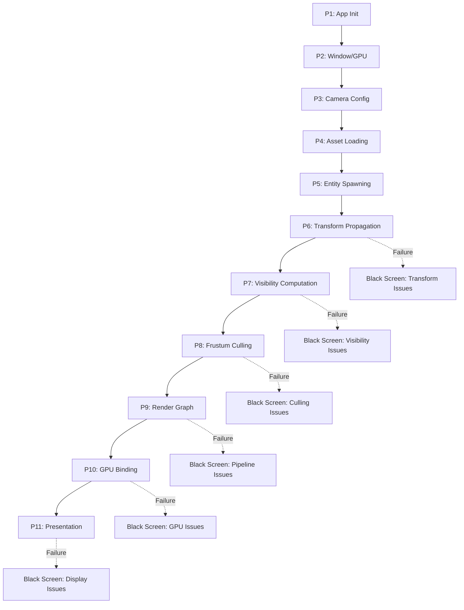
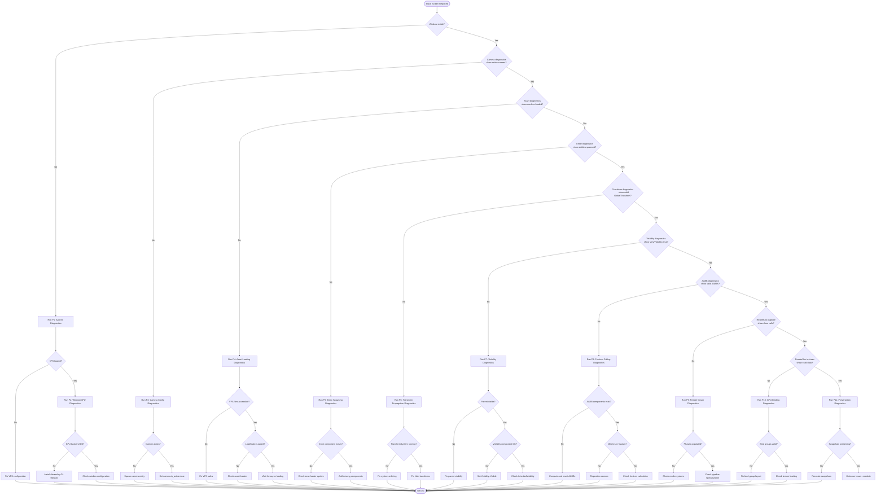

# Black Screen Rendering Failure Diagnostic Protocol

> **Version**: 1.0 | **Bevy Version**: 0.13.2 | **Project**: Rose Online Client  
> **Purpose**: Comprehensive step-by-step diagnostic framework for diagnosing and resolving black screen rendering failures

---

## 1. Executive Summary

This diagnostic protocol provides an exhaustive, systematic approach to diagnosing black screen rendering failures in the Rose Online game client built with Bevy 0.13.2. The protocol is designed to isolate failure domains across the entire rendering pipeline, from application initialization through final presentation.

### Diagnostic Philosophy

The protocol follows a **phased isolation approach**:

1. **Triage Phase**: Rapidly identify the failure domain using automated diagnostics
2. **Component Phase**: Validate individual ECS components and resources
3. **System Phase**: Verify system execution ordering and timing
4. **Pipeline Phase**: Inspect render graph and GPU resource binding
5. **Platform Phase**: Validate backend-specific rendering behavior

### Key Bevy 0.13.2 Considerations

- **Visibility System**: Bevy 0.13.2 uses a three-tier visibility system: `Visibility` (user-controlled), `InheritedVisibility` (parent-propagated), and `ViewVisibility` (frustum-culled)
- **Frustum Culling**: Requires valid [`Aabb`](src/components/zone.rs:1) components on mesh entities; missing AABBs cause all meshes to be culled
- **Transform Propagation**: Must occur before visibility computation via [`TransformSystem::TransformPropagate`](src/lib.rs:16)
- **Render App**: Extraction, preparation, and queue systems run in a separate render world

---

## 2. Diagnostic Phases Overview

| Phase | Name | Key Systems Validated | Expected Success Indicators | Failure Mode Symptoms | Tools/Checks |
|-------|------|----------------------|----------------------------|----------------------|--------------|
| **P1** | Application Initialization | VFS, AssetServer, Plugin initialization | VFS files accessible, no panics on startup | Panic during plugin init, VFS mount failures | `VfsAssetReaderPlugin`, startup logs |
| **P2** | Window & Graphics Context | `WindowPlugin`, `RenderPlugin`, WGPU surface | Window visible, GPU backend selected | No window, DXGI/Vulkan init errors | WGPU logs, `Window` resource query |
| **P3** | ECS Camera Configuration | `Camera3d`, `Projection`, `GlobalTransform` | Exactly 1 active camera with valid transform | `camera.is_active=false`, NaN transforms | `active_camera_diagnostics` system |
| **P4** | Asset Loading | `Assets<Mesh>`, `Assets<Image>`, custom materials | Asset counts >0, LoadState::Loaded | `LoadState::Failed`, missing handles | `asset_loading_validation_system` |
| **P5** | Entity Spawning | `ZoneLoader`, mesh entity components | Entities have Mesh + Material + Visibility | Missing components, zero entity count | `zone_render_validation_system` |
| **P6** | Transform Propagation | `TransformSystem::TransformPropagate` | `GlobalTransform` matches `Transform` | Identity GlobalTransform, NaN values | `transform_propagation_diagnostics` |
| **P7** | Visibility Computation | `VisibilitySystems::CheckVisibility` | `ViewVisibility=true` for in-frustum meshes | All `ViewVisibility=false` | `visibility_state_diagnostics` |
| **P8** | Frustum Culling | `Aabb` components, frustum planes | Meshes within frustum marked visible | All meshes culled despite visibility | `frustum_culling_diagnostics` |
| **P9** | Render Graph Execution | `RenderSet::Queue`, `RenderSet::PhaseSort` | Render phases populated with items | Empty render phases, no draw calls | RenderDoc capture, trace logs |
| **P10** | GPU Resource Binding | Bind groups, pipelines, uniforms | Valid GPU descriptors, no validation errors | WGPU validation errors, missing bindings | WGPU validation layers |
| **P11** | Presentation & Display | Swapchain, surface presentation | Backbuffer presents correctly, no tearing | Black surface, DXGI_ERROR_DEVICE_REMOVED | Present mode validation, vsync check |

### Phase Dependency Graph



---

## 3. Common Black Screen Root Causes Reference

### 3.1 Application Initialization Failures

| Cause | Symptoms | Diagnostic Check | Resolution |
|-------|----------|------------------|------------|
| VFS Mount Failure | `create_virtual_filesystem()` returns None, "No filesystem devices configured" | Check `config.filesystem.devices` length | Verify data.idx paths, add FilesystemDeviceConfig |
| Asset Reader Registration Failure | "Failed to get default asset source" | Query `AssetServer` sources in startup system | Ensure `VfsAssetReaderPlugin` added before `DefaultPlugins` |
| Plugin Panic | Thread panic in `RoseRenderPlugin::build` | Backtrace to plugin init code | Check shader compilation, resource initialization |
| Missing Required Features | `PbrPlugin` fails, missing render features | `Cargo.toml` bevy feature flags | Enable `bevy_pbr`, `bevy_render`, `bevy_core_pipeline` |

### 3.2 Window/Graphics Context Failures

| Cause | Symptoms | Diagnostic Check | Resolution |
|-------|----------|------------------|------------|
| WGPU Backend Unavailable | "No suitable GPU adapters found" | `WgpuSettings::backends` configuration | Install Vulkan/DX12 drivers, try `Backends::GL` fallback |
| Surface Creation Failure | `CreateSurfaceError`, window shows but black | Surface capability validation | Check window handle validity |
| VSync/Present Mode Mismatch | `PresentMode::Fifo` unsupported | Query surface capabilities | Use `PresentMode::Immediate` for debugging |
| Multi-Monitor Issues | Window on disabled monitor, wrong DPI | Monitor enumeration logs | Force windowed mode, specify monitor |

### 3.3 ECS/Camera Configuration Failures

| Cause | Symptoms | Diagnostic Check | Resolution |
|-------|----------|------------------|------------|
| No Active Camera | `visible_meshes=0`, "No cameras found" | `active_camera_diagnostics` | Ensure `camera.is_active=true`, exactly 1 active |
| Multiple Active Cameras | Z-fighting, ambiguous rendering | Count `camera.is_active` entities | Disable all but primary camera |
| NaN Camera Position | All meshes culled, erratic behavior | Position component validation | Reset camera transform to known-good values |
| Incorrect Projection Matrix | Extreme FOV, near/far plane issues | `PerspectiveProjection` values | Validate `fov`, `near=0.1`, `far=50000.0` |
| Camera Not Looking at Scene | Meshes behind camera | `cam_transform.forward()` dot product | Use `looking_at` to point at zone center |

### 3.4 Asset Loading Failures

| Cause | Symptoms | Diagnostic Check | Resolution |
|-------|----------|------------------|------------|
| Zone Asset Not Loading | "Zone entities found: 0" | `zone_component_lifecycle_diagnostics` | Check VFS path, verify ZON file exists |
| Mesh Asset Failed | `LoadState::Failed` for ZMS files | `asset_loading_validation_system` | Verify ZMS loader registration, file format |
| Texture Loading Stalled | `images.len()=0` after load | Async asset load state polling | Check DDS/TGA loader, VFS file access |
| Material Asset Missing | Entities have mesh but no material | `material_validation_system` | Register material plugins: `ObjectMaterialPlugin` |
| Shader Compilation Failure | Panic in pipeline specialization | WGPU shader validation logs | Check WGSL syntax, binding alignment |

### 3.5 Render Graph/Pipeline Failures

| Cause | Symptoms | Diagnostic Check | Resolution |
|-------|----------|------------------|------------|
| Missing Pipeline Specialization | `SpecializedMeshPipelineError` | Pipeline cache logs | Implement `specialize()` for all pipeline keys |
| Shader Definition Mismatch | Vertex output != fragment input | WGSL struct comparison | Ensure consistent `@location` bindings |
| Missing Bind Group Layout | `SetZoneLightingBindGroup` panic | Layout descriptor validation | Include all bind groups in `descriptor.layout` |
| Incorrect Bind Group Index | Shader `@group(3)` vs Rust `SetBindGroup<2>` | Cross-reference shader/Rust code | Match generic parameter to shader `@group` |
| Storage Buffer Misalignment | GPU validation error, corrupted rendering | `encase` alignment checks | Use `ShaderType` derive, check WGSL alignment |

### 3.6 GPU Resource Binding Failures

| Cause | Symptoms | Diagnostic Check | Resolution |
|-------|----------|------------------|------------|
| Texture Array Unsupported | `TEXTURE_BINDING_ARRAY` not enabled | WGPU feature detection | Check `features` bitmask, use fallback |
| Bind Group Exhaustion | `CreateBindGroupError::TooMany` | Bind group allocation tracking | Reuse bind groups, use bindless where possible |
| Uniform Buffer Overflow | Exceeds `max_uniform_buffer_binding_size` | WGPU limits query | Split into multiple buffers, use storage buffers |
| Missing Push Constant Range | Push constants silently fail | Range validation in specialize | Add `PushConstantRange` to descriptor |
| Sampler Limit Exceeded | `CreateSamplerError` | Sampler allocation count | Reuse samplers, use `SamplerDescriptor` caching |

### 3.7 Presentation/Display Failures

| Cause | Symptoms | Diagnostic Check | Resolution |
|-------|----------|------------------|------------|
| DXGI Device Removed | `DXGI_ERROR_DEVICE_REMOVED` | Windows event logs | Check for TDR, reduce GPU workload |
| Swapchain Out of Date | `Outdated` present result | Surface resize handling | Recreate swapchain on resize |
| VSync Tearing | Visual tearing, stuttering | Present mode verification | Enable `PresentMode::Fifo` |
| HDR Output Mismatch | Colors washed out or clipped | `Camera::hdr` setting | Match HDR to display capability |

---

## 4. Tooling Prerequisites

### 4.1 WGPU Validation Layers Configuration

Enable WGPU validation for detailed error reporting:

```rust
// In src/lib.rs, RenderPlugin configuration
.add_plugins(bevy::prelude::DefaultPlugins
    .set(bevy::render::RenderPlugin {
        render_creation: RenderCreation::Automatic(WgpuSettings {
            backends: Some(Backends::all()),
            // Enable validation layers
            features: WgpuFeatures::default(),
            // Force validation on all builds (not just debug)
            ..Default::default()
        }),
        synchronous_pipeline_compilation: false,
    })
)
```

Environment variables for WGPU tracing:

```bash
# Windows PowerShell
$env:WGPU_BACKEND="vulkan"  # Force specific backend
$env:WGPU_POWER_PREF="high"  # Use discrete GPU
$env:RUST_LOG="wgpu=debug,bevy_render=debug"

# Enable WGPU tracing to file
$env:WGPU_TRACE="trace.wgsl"
```

### 4.2 RenderDoc Capture Setup

RenderDoc provides frame capture and replay for GPU debugging:

1. **Install RenderDoc**: Download from https://renderdoc.org/
2. **Launch Application**: Use RenderDoc's "Launch Application" dialog
3. **Capture Frame**: Press F12 or click "Capture Frame(s) Immediately"
4. **Inspect Pipeline**: Check Event Browser for draw calls, Texture Viewer for bound resources

Key inspection points:
- **Mesh Output**: Verify vertex positions are valid (not NaN, in NDC range)
- **Texture Bindings**: Confirm diffuse textures are loaded and bound
- **Rasterizer State**: Check viewport, scissor, cull mode
- **Fragment Shader**: Verify UV coordinates, texture sampling

### 4.3 Bevy Diagnostics Plugins

Enable built-in diagnostics:

```rust
// In src/lib.rs
app.add_plugins((
    bevy::diagnostic::EntityCountDiagnosticsPlugin,
    bevy::diagnostic::FrameTimeDiagnosticsPlugin,
    // Optional: LogDiagnosticsPlugin for console output
    bevy::diagnostic::LogDiagnosticsPlugin::default(),
));
```

Custom diagnostic resources:

```rust
// Zone debug diagnostics (already in codebase)
app.init_resource::<ZoneDebugDiagnostics>();
```

### 4.4 Trace Logging Configuration

Configure detailed trace logging in `Cargo.toml`:

```toml
[dependencies.bevy]
version = "=0.13.2"
default-features = false
features = [
    # ... other features ...
    "trace_tracy",        # Tracy profiler integration
    "trace_tracy_memory", # Memory allocation tracking
]
```

Runtime log filtering in `src/lib.rs`:

```rust
.set(bevy::log::LogPlugin {
    level: Level::DEBUG,
    filter: "wgpu=error,bevy_render=info,rose_offline_client=debug,naga=warn".into(),
    update_subscriber: None,
})
```

### 4.5 Platform-Specific Tools

#### Windows (DirectX 12)

- **PIX**: GPU debugging and profiling (included with Windows SDK)
- **Nsight Graphics**: NVIDIA GPU debugging
- **Radeon GPU Profiler**: AMD GPU profiling

#### Linux (Vulkan)

```bash
# Vulkan validation layers
sudo apt install vulkan-validationlayers

# Enable validation
export VK_INSTANCE_LAYERS=VK_LAYER_KHRONOS_validation

# Vulkan info
vulkaninfo | grep -A 5 "GPU0"
```

#### macOS (Metal)

- **Xcode Metal Frame Capture**: Built into Xcode
- **Metal System Trace**: Performance profiling

---

## 5. Diagnostic Decision Tree



---

## 6. Quick Start Checklist

### Immediate Triage (First 2 Minutes)

- [ ] **1. Window Visibility**: Confirm game window appears and is not minimized
- [ ] **2. Console Errors**: Check for panics or errors in console output
- [ ] **3. Camera Presence**: Verify "Active camera(s): 1" in logs
- [ ] **4. Mesh Count**: Verify "Mesh entities: N" where N > 0
- [ ] **5. Visible Meshes**: Check "Visible mesh entities: N" - if 0, proceed to detailed diagnostics

### Asset Loading Validation (Minutes 2-5)

- [ ] **6. VFS Initialization**: Confirm "[VFS INIT] VFS created successfully!"
- [ ] **7. Asset Server**: Verify "[ASSET SERVER DIAGNOSTIC] Asset server initialized"
- [ ] **8. Mesh Assets**: Check "[RENDER DIAGNOSTICS] Mesh assets in storage: N" where N > 0
- [ ] **9. Texture Assets**: Check "[RENDER DIAGNOSTICS] Images: N" where N > 0
- [ ] **10. Zone Loading**: Verify "[ZONE COMPONENT] Entities with Zone component: 1"

### Component Validation (Minutes 5-10)

- [ ] **11. Entity Components**: Use `zone_render_validation_system` to check required components
- [ ] **12. Transform Validity**: Confirm no NaN values in `GlobalTransform`
- [ ] **13. Visibility State**: Check `Visibility::Visible` set on zone entities
- [ ] **14. AABB Presence**: Verify "Entities WITH AABB: N" equals mesh count
- [ ] **15. ViewVisibility**: Confirm "ViewVisibility (computed): true" for in-frustum meshes

### System Execution Verification

- [ ] **16. Transform Propagation**: Check "[SCHEDULE CHECK] TransformPropagate set is running"
- [ ] **17. Visibility Propagation**: Check "[SCHEDULE CHECK] VisibilityPropagate set is running"
- [ ] **18. Check Visibility**: Check "[SCHEDULE CHECK] CheckVisibility set is running"
- [ ] **19. System Ordering**: Verify no system ordering conflicts in logs
- [ ] **20. Frame Progression**: Confirm frame count incrementing in diagnostics

### Quick Fixes to Try

If the above checks reveal issues, try these in order:

1. **Add `NoFrustumCulling`** to all mesh entities (temporary bypass)
2. **Force `ViewVisibility::set()`** in a system to disable culling
3. **Increase camera far plane** to 50000.0 to ensure coverage
4. **Add AABB components** computed from mesh vertices
5. **Reparent entities** to ensure proper visibility inheritance

---

## Appendix A: Diagnostic System Reference

### Existing Diagnostic Systems in Codebase

| System | Module | Purpose | Run Frequency |
|--------|--------|---------|---------------|
| `render_diagnostics_system_lightweight` | `debug_rendering_system.rs` | Core render stats | Every 60 frames |
| `frustum_culling_diagnostics` | `debug_rendering_system.rs` | Camera-mesh relationship | Every 60 frames |
| `material_transparency_diagnostics` | `debug_rendering_system.rs` | Material validation | Every 60 frames |
| `transform_validation_diagnostics` | `debug_rendering_system.rs` | NaN detection | Every 60 frames |
| `visibility_state_diagnostics` | `debug_rendering_system.rs` | Visibility component check | Every 60 frames |
| `active_camera_diagnostics` | `debug_rendering_system.rs` | Camera state validation | Every 60 frames |
| `aabb_validation_diagnostics` | `debug_rendering_system.rs` | AABB component check | Every 60 frames |
| `render_pipeline_diagnostics` | `debug_rendering_system.rs` | Pipeline submission check | Every 60 frames |
| `zone_entity_visibility_diagnostics` | `debug_rendering_system.rs` | Zone root visibility | Every 60 frames |
| `parent_child_visibility_diagnostics` | `debug_rendering_system.rs` | Hierarchy visibility | Every 60 frames |
| `zone_component_lifecycle_diagnostics` | `debug_rendering_system.rs` | Zone component presence | Every 60 frames |
| `zone_render_validation_system` | `zone_render_validation_system.rs` | Comprehensive validation | Every 60 frames |
| `aabb_diagnostic_system` | `zone_render_validation_system.rs` | AABB-specific checks | Every 60 frames |
| `transform_propagation_diagnostics` | `transform_propagation_diagnostics.rs` | Transform system check | Every frame |

### Enabling All Diagnostics

```rust
// In src/lib.rs, add to run_client:
app.add_systems(Update, (
    render_diagnostics_system_lightweight,
    frustum_culling_diagnostics,
    material_transparency_diagnostics,
    transform_validation_diagnostics,
    visibility_state_diagnostics,
    active_camera_diagnostics,
    render_layer_diagnostics,
    aabb_validation_diagnostics,
    render_pipeline_diagnostics,
    render_stage_diagnostics,
    zone_entity_visibility_diagnostics,
    parent_child_visibility_diagnostics,
    zone_component_lifecycle_diagnostics,
    transform_propagation_diagnostics,
));
```

---

## Appendix B: Bevy 0.13.2 API Quick Reference

### Visibility System Components

```rust
// User-controlled visibility
Visibility::Visible    // Entity should be visible
Visibility::Hidden     // Entity should be hidden
Visibility::Inherited  // Inherit from parent

// Computed visibility after culling
ViewVisibility::get() -> bool  // True if visible to camera

// Parent-propagated visibility
InheritedVisibility::get() -> bool

// Disable frustum culling
NoFrustumCulling  // Component to skip culling
```

### Critical System Sets

```rust
// Transform propagation (must run before visibility)
TransformSystem::TransformPropagate

// Visibility computation sets
VisibilitySystems::VisibilityPropagate
VisibilitySystems::CalculateBounds
VisibilitySystems::CheckVisibility
```

### Render World Systems

```rust
// Extraction: Main world -> Render world
ExtractSchedule

// Render world pipeline
RenderSet::Extract
RenderSet::Prepare
RenderSet::Queue
RenderSet::PhaseSort
RenderSet::Render
RenderSet::Cleanup
```

---

*Document Version: 1.0*  
*Last Updated: Based on Rose Online Client codebase analysis*  
*Compatible with: Bevy 0.13.2, Rust 1.75+*