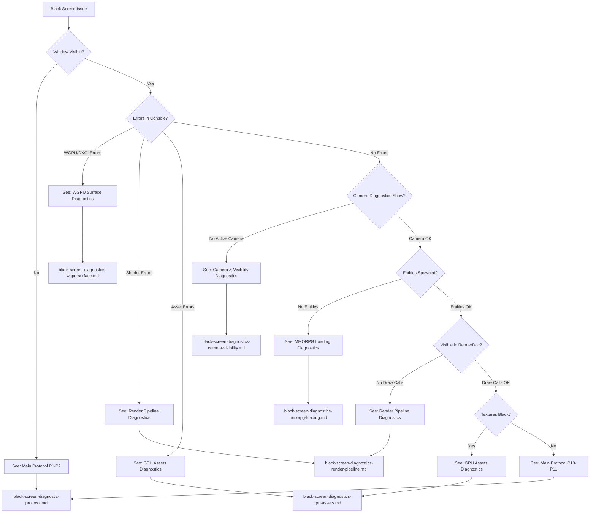
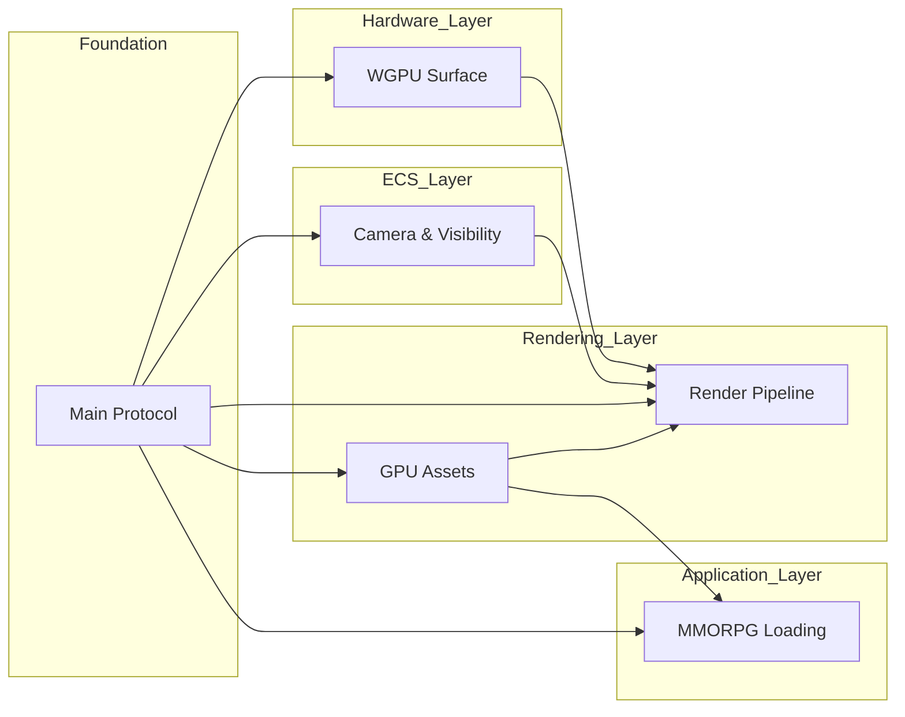
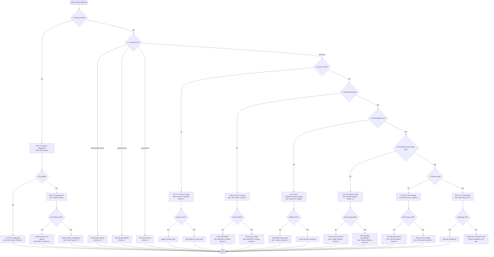

# Black Screen Diagnostics Master Index

> **Version**: 1.0 | **Bevy Version**: 0.13.2 | **Project**: Rose Online Client  
> **Purpose**: Central navigation and quick reference for the complete black screen diagnostic protocol

---

## Table of Contents

1. [Document Navigation Map](#1-document-navigation-map)
2. [Symptom-to-Document Matrix](#2-symptom-to-document-matrix)
3. [Quick Reference Cards](#3-quick-reference-cards)
4. [Environment Setup Checklist](#4-environment-setup-checklist)
5. [Diagnostic Workflow Diagram](#5-diagnostic-workflow-diagram)
6. [Document Cross-Reference Index](#6-document-cross-reference-index)
7. [Version and Compatibility Notes](#7-version-and-compatibility-notes)
8. [Getting Started Guide](#8-getting-started-guide)

---

## 1. Document Navigation Map

### 1.1 Complete Diagnostic Document Hierarchy

```mermaid
flowchart TB
    INDEX[Black Screen Diagnostics Index<br/>You Are Here] --> PROTOCOL[Main Diagnostic Protocol]
    INDEX --> WGPU[WGPU Surface Diagnostics]
    INDEX --> CAMERA[Camera & Visibility Diagnostics]
    INDEX --> RENDER[Render Pipeline Diagnostics]
    INDEX --> GPU[GPU Assets Diagnostics]
    INDEX --> MMORPG[MMORPG Loading Diagnostics]
    
    PROTOCOL --> P1[P1: App Init]
    PROTOCOL --> P2[P2: Window/GPU]
    PROTOCOL --> P3[P3: Camera Config]
    PROTOCOL --> P4[P4: Asset Loading]
    PROTOCOL --> P5[P5: Entity Spawning]
    PROTOCOL --> P6[P6: Transform]
    PROTOCOL --> P7[P7: Visibility]
    PROTOCOL --> P8[P8: Frustum Culling]
    PROTOCOL --> P9[P9: Render Graph]
    PROTOCOL --> P10[P10: GPU Binding]
    PROTOCOL --> P11[P11: Presentation]
    
    WGPU --> ADAPTER[Adapter Selection]
    WGPU --> DEVICE[Device Config]
    WGPU --> SURFACE[Surface Config]
    WGPU --> BACKEND[Backend Specific]
    
    CAMERA --> CAM_ENTITY[Camera Entity]
    CAMERA --> PROJECTION[Projection Matrix]
    CAMERA --> VISIBILITY[Visibility System]
    CAMERA --> FRUSTUM[Frustum Culling]
    CAMERA --> TRANSFORM[Transform Hierarchy]
    
    RENDER --> GRAPH[Render Graph]
    RENDER --> PHASE[Render Phases]
    RENDER --> PIPELINE[Pipeline Cache]
    RENDER --> SHADER[Shader Compilation]
    RENDER --> DRAW[Draw Calls]
    
    GPU --> MEMORY[GPU Memory]
    GPU --> ASSET_STATE[Asset Loading State]
    GPU --> TEXTURE[Texture Assets]
    GPU --> MESH[Mesh Assets]
    GPU --> VFS[VFS Streaming]
    
    MMORPG --> ZONE[Zone Loading]
    MMORPG --> CHAR[Character Models]
    MMORPG --> NPC[NPC/Monsters]
    MMORPG --> NETWORK[Network Sync]
    MMORPG --> STREAMING[Asset Streaming]
```



### 1.2 Document Selection Flowchart



### 1.3 Quick Links to Each Document

| Document | File Path | Primary Focus |
|----------|-----------|---------------|
| **Main Diagnostic Protocol** | [`black-screen-diagnostic-protocol.md`](black-screen-diagnostic-protocol.md) | Comprehensive 11-phase diagnostic framework |
| **WGPU Surface Diagnostics** | [`black-screen-diagnostics-wgpu-surface.md`](black-screen-diagnostics-wgpu-surface.md) | GPU initialization, adapter selection, surface configuration |
| **Camera & Visibility Diagnostics** | [`black-screen-diagnostics-camera-visibility.md`](black-screen-diagnostics-camera-visibility.md) | ECS camera, visibility system, frustum culling |
| **Render Pipeline Diagnostics** | [`black-screen-diagnostics-render-pipeline.md`](black-screen-diagnostics-render-pipeline.md) | Render graph, shaders, draw calls |
| **GPU Assets Diagnostics** | [`black-screen-diagnostics-gpu-assets.md`](black-screen-diagnostics-gpu-assets.md) | Asset loading, textures, meshes, VFS |
| **MMORPG Loading Diagnostics** | [`black-screen-diagnostics-mmorpg-loading.md`](black-screen-diagnostics-mmorpg-loading.md) | Zone loading, character models, network sync |

### 1.4 Document Dependencies



---

## 2. Symptom-to-Document Matrix

### 2.1 Primary Symptom Mapping

| Symptom | Primary Document | Secondary Document | Section Reference |
|---------|-----------------|-------------------|-------------------|
| **Window doesn't appear** | Main Protocol | WGPU Surface | P1-P2, Section 2 |
| **Window black immediately** | WGPU Surface | Main Protocol | Section 2-3 |
| **DXGI_ERROR_DEVICE_REMOVED** | WGPU Surface | Main Protocol | Section 3.4 |
| **No suitable GPU found** | WGPU Surface | Main Protocol | Section 2.1 |
| **Camera not found errors** | Camera & Visibility | Main Protocol | Section 1 |
| **All meshes culled** | Camera & Visibility | Main Protocol | Section 5, 7 |
| **Projection matrix errors** | Camera & Visibility | Main Protocol | Section 2 |
| **Visibility issues** | Camera & Visibility | Main Protocol | Section 4 |
| **Shader compilation errors** | Render Pipeline | Main Protocol | Section 4 |
| **Pipeline specialization errors** | Render Pipeline | Main Protocol | Section 3 |
| **No draw calls in RenderDoc** | Render Pipeline | Camera & Visibility | Section 2, 8 |
| **Render graph errors** | Render Pipeline | Main Protocol | Section 1 |
| **Assets not loading** | GPU Assets | MMORPG Loading | Section 2 |
| **Textures black/missing** | GPU Assets | Render Pipeline | Section 3 |
| **Meshes not appearing** | GPU Assets | MMORPG Loading | Section 4 |
| **VFS read errors** | GPU Assets | MMORPG Loading | Section 5 |
| **Zone never loads** | MMORPG Loading | GPU Assets | Section 2 |
| **Character invisible** | MMORPG Loading | Camera & Visibility | Section 3 |
| **NPCs not spawning** | MMORPG Loading | GPU Assets | Section 4 |
| **Equipment missing** | MMORPG Loading | GPU Assets | Section 3.3 |
| **Network desync** | MMORPG Loading | Main Protocol | Section 6 |

### 2.2 Error Message Quick Reference

| Error Message | Document | Section | Priority |
|--------------|----------|---------|----------|
| `No suitable GPU adapters found` | WGPU Surface | 2.1 | Critical |
| `DXGI_ERROR_DEVICE_REMOVED` | WGPU Surface | 3.4 | Critical |
| `CreateSurfaceError` | WGPU Surface | 2.2 | Critical |
| `No cameras found` | Camera & Visibility | 1 | Critical |
| `camera.is_active=false` | Camera & Visibility | 1.1 | High |
| `ViewVisibility=false` for all | Camera & Visibility | 4, 5 | High |
| `SpecializedMeshPipelineError` | Render Pipeline | 3.1 | Critical |
| `ShaderCompilationError` | Render Pipeline | 4.1 | Critical |
| `Pipeline not found in cache` | Render Pipeline | 3.3 | High |
| `Asset load failed` | GPU Assets | 2.2 | High |
| `VFS file not found` | GPU Assets | 5.2 | High |
| `LoadState::Failed` | GPU Assets | 2.5 | High |
| `Zone loading timeout` | MMORPG Loading | 2.6 | Critical |
| `Entities spawned: 0` | MMORPG Loading | 2.2 | Critical |
| `Skeleton loaded: false` | MMORPG Loading | 3.1 | High |

### 2.3 Diagnostic Priority Order

When investigating a black screen, follow this priority order:

```mermaid
flowchart TD
    P0[Priority 0: Critical] --> P0_1[Window/GPU Context<br/>WGPU Surface Document]
    P0 --> P0_2[Application Init<br/>Main Protocol P1]
    
    P1[Priority 1: High] --> P1_1[Camera Configuration<br/>Camera & Visibility]
    P1 --> P1_2[Asset Loading State<br/>GPU Assets]
    P1 --> P1_3[Zone Loading<br/>MMORPG Loading]
    
    P2[Priority 2: Medium] --> P2_1[Visibility System<br/>Camera & Visibility]
    P2 --> P2_2[Render Pipeline<br/>Render Pipeline Doc]
    P2 --> P2_3[Entity Spawning<br/>MMORPG Loading]
    
    P3[Priority 3: Low] --> P3_1[Shader Optimization<br/>Render Pipeline]
    P3 --> P3_2[Memory Management<br/>GPU Assets]
    P3 --> P3_3[Network Sync<br/>MMORPG Loading]
```



---

## 3. Quick Reference Cards

### 3.1 Immediate Triage Card (First 2 Minutes)

```
BLACK SCREEN IMMEDIATE TRIAGE
==============================

1. WINDOW CHECK
   [ ] Game window appears
   [ ] Window not minimized
   [ ] Window has focus
   
   FAIL → See: WGPU Surface Diagnostics, Section 2

2. CONSOLE ERRORS
   [ ] No panic messages
   [ ] No WGPU errors
   [ ] No shader errors
   
   FAIL → Note error, find in Error Message Reference

3. CAMERA CHECK (if diagnostics enabled)
   [ ] "Active camera(s): 1" in logs
   [ ] Camera position valid (no NaN)
   
   FAIL → See: Camera & Visibility Diagnostics, Section 1

4. MESH COUNT
   [ ] "Mesh entities: N" where N > 0
   [ ] "Visible mesh entities: N" where N > 0
   
   FAIL → See: MMORPG Loading Diagnostics, Section 2

5. ASSET LOADING
   [ ] "[VFS INIT] VFS created successfully!"
   [ ] "[ASSET SERVER] Asset server initialized"
   
   FAIL → See: GPU Assets Diagnostics, Section 5

QUICK FIXES TO TRY:
1. Add NoFrustumCulling to mesh entities
2. Force PresentMode::Immediate
3. Set WGPU_BACKEND=dx12 or vulkan
4. Check camera far plane >= 50000.0
```

### 3.2 Environment Variables Card

```
WGPU ENVIRONMENT VARIABLES
===========================

Windows (PowerShell):
    $env:WGPU_BACKEND="vulkan"     # Force backend
    $env:WGPU_BACKEND="dx12"       # Force DirectX 12
    $env:WGPU_BACKEND="gl"         # Force OpenGL fallback
    $env:WGPU_POWER_PREF="high"    # Use discrete GPU
    $env:WGPU_ADAPTER_NAME="NVIDIA" # Select by name
    $env:WGPU_TRACE="trace.json"   # Enable tracing
    $env:RUST_LOG="wgpu=debug,bevy_render=debug"

Windows (Command Prompt):
    set WGPU_BACKEND=vulkan
    set WGPU_POWER_PREF=high
    set RUST_LOG=wgpu=debug

Vulkan Validation:
    set VK_INSTANCE_LAYERS=VK_LAYER_KHRONOS_validation

DirectX Debug:
    set DXGI_DEBUG=1
    set D3D12_DEBUG=1
```

### 3.3 Diagnostic Code Snippets Card

```
ESSENTIAL DIAGNOSTIC SYSTEMS
=============================

1. ACTIVE CAMERA CHECK:
fn active_camera_diagnostics(
    cameras: Query<(Entity, &Camera, &GlobalTransform)>
) {
    for (entity, camera, transform) in cameras.iter() {
        info!("Camera {:?}: active={}, pos={:?}", 
            entity, camera.is_active, transform.translation());
    }
}

2. VISIBILITY CHECK:
fn visibility_diagnostics(
    query: Query<(Entity, &Visibility, &ViewVisibility)>
) {
    for (entity, vis, view) in query.iter() {
        info!("Entity {:?}: Visibility={:?}, ViewVisibility={}",
            entity, vis, view.get());
    }
}

3. ASSET LOADING CHECK:
fn asset_loading_diagnostics(
    asset_server: Res<AssetServer>,
    meshes: Res<Assets<Mesh>>
) {
    info!("Meshes loaded: {}", meshes.len());
    // Check specific handle state
    // asset_server.get_load_state(handle.id());
}

4. WGPU ADAPTER CHECK:
fn adapter_diagnostics(adapter: Res<RenderAdapter>) {
    let info = adapter.get_info();
    info!("GPU: {}, Backend: {:?}", info.name, info.backend);
    info!("Features: {:?}", adapter.features());
}
```

### 3.4 Bevy 0.13.2 API Quick Reference

```
CRITICAL BEVY 0.13.2 IMPORTS
=============================

// Camera
use bevy::render::camera::{Camera, Camera3d, Projection, PerspectiveProjection};
use bevy::render::view::{Visibility, InheritedVisibility, ViewVisibility, NoFrustumCulling};
use bevy::render::primitives::{Aabb, Frustum};

// Transform
use bevy::transform::components::{Transform, GlobalTransform};
use bevy::transform::TransformSystem;

// Visibility System
use bevy::render::view::VisibilitySystems;

// Render Pipeline
use bevy::render::render_resource::{RenderPipeline, PipelineCache};
use bevy::render::render_graph::{RenderGraph, RenderGraphApp};
use bevy::render::render_phase::{RenderPhase, DrawFunctions};
use bevy::render::renderer::{RenderAdapter, RenderDevice, RenderQueue};

// Assets
use bevy::asset::{AssetServer, LoadState, Assets, Handle};
use bevy::render::mesh::Mesh;
use bevy::render::texture::Image;
use bevy::render::render_asset::RenderAssets;

// WGPU
use wgpu::{Backends, PowerPreference, PresentMode, Features, Limits};

// Critical System Sets
TransformSystem::TransformPropagate
VisibilitySystems::VisibilityPropagate
VisibilitySystems::CheckVisibility
```

### 3.5 Common Issues and Quick Fixes

| Issue | Quick Fix | Reference |
|-------|-----------|-----------|
| **All meshes culled** | Add `NoFrustumCulling` component | Camera Doc, Section 5.3 |
| **Window black on startup** | Force `PresentMode::Immediate` | WGPU Doc, Section 4.2 |
| **No GPU found** | Set `WGPU_BACKEND=dx12` | WGPU Doc, Section 2.1 |
| **Camera not active** | Set `camera.is_active = true` | Camera Doc, Section 1.1 |
| **Assets not loading** | Check VFS initialization | GPU Assets Doc, Section 5.1 |
| **Textures black** | Check DDS format support | GPU Assets Doc, Section 3.2 |
| **Shader errors** | Check WGSL syntax (use `@` not `[[`) | Render Pipeline Doc, Section 4.1 |
| **Zone not loading** | Check `ZONE_LIST` initialized | MMORPG Doc, Section 2.1 |
| **Character invisible** | Check skeleton ZMD loaded | MMORPG Doc, Section 3.1 |
| **NPCs not spawning** | Check NPC ID in database | MMORPG Doc, Section 4.1 |

---

## 4. Environment Setup Checklist

### 4.1 Required Tools Installation

```
DEVELOPMENT TOOLS CHECKLIST
============================

[ ] Rust 1.75+ installed
    Verify: rustc --version
    
[ ] Bevy 0.13.2 dependencies
    Check Cargo.toml: bevy = "=0.13.2"
    
[ ] Git for Windows
    Verify: git --version
    
[ ] Visual Studio 2022 Build Tools (Windows)
    Required for shader compilation
    
[ ] GPU Drivers (latest)
    NVIDIA: 511.xx or newer recommended
    AMD: Latest Adrenalin
    Intel: Latest Arc/Iris drivers
    
[ ] RenderDoc (optional but recommended)
    Download: https://renderdoc.org/
    
[ ] PIX (Windows SDK)
    For DirectX 12 debugging
    
[ ] Vulkan SDK (optional)
    For Vulkan validation layers
```

### 4.2 Environment Variables for Debugging

```
ESSENTIAL ENVIRONMENT CONFIGURATION
====================================

DEBUG LOGGING:
    RUST_LOG=wgpu=debug,bevy_render=debug,rose_offline_client=debug

BACKEND SELECTION:
    WGPU_BACKEND=vulkan    # Force Vulkan
    WGPU_BACKEND=dx12      # Force DirectX 12
    WGPU_BACKEND=gl        # Force OpenGL fallback

GPU SELECTION:
    WGPU_POWER_PREF=high   # Discrete GPU
    WGPU_POWER_PREF=low    # Integrated GPU

VALIDATION LAYERS:
    VK_INSTANCE_LAYERS=VK_LAYER_KHRONOS_validation  # Vulkan
    DXGI_DEBUG=1                                      # DirectX
    D3D12_DEBUG=1

TRACING:
    WGPU_TRACE=trace.json  # Record WGPU commands
```

### 4.3 Build Configuration for Diagnostics

```toml
# Cargo.toml diagnostic configuration

[dependencies.bevy]
version = "=0.13.2"
default-features = false
features = [
    "bevy_asset",
    "bevy_render",
    "bevy_pbr",
    "bevy_core_pipeline",
    "bevy_winit",
    "bevy_window",
    "bevy_log",
    "bevy_diagnostic",
    "bevy_gizmos",
    # Debug features
    "trace_tracy",
    "trace_tracy_memory",
]

[profile.dev]
opt-level = 1          # Faster compilation, still debuggable
incremental = true     # Faster rebuilds

[profile.dev.package."*"]
opt-level = 3          # Optimize dependencies
```

### 4.4 Logging Configuration

```rust
// In src/lib.rs or main.rs

// Configure log levels
app.add_plugins(DefaultPlugins.set(LogPlugin {
    level: Level::DEBUG,
    filter: "wgpu=error,bevy_render=info,rose_offline_client=debug,naga=warn".into(),
    update_subscriber: None,
}))

// Add diagnostic plugins
app.add_plugins((
    EntityCountDiagnosticsPlugin,
    FrameTimeDiagnosticsPlugin,
    LogDiagnosticsPlugin::default(),
));
```

### 4.5 Platform-Specific Setup

#### Windows
```powershell
# Enable Windows debug layers
set DXGI_DEBUG=1
set D3D12_DEBUG=1
set D3D12_GPU_BASED_VALIDATION=1

# Check GPU driver
dxdiag /t dxdiag_output.txt
```

#### Linux
```bash
# Install Vulkan validation
sudo apt install vulkan-validationlayers

# Enable validation
export VK_INSTANCE_LAYERS=VK_LAYER_KHRONOS_validation

# Check GPU info
vulkaninfo | grep -A 5 "GPU0"
```

#### macOS
```bash
# Enable Metal validation
export METAL_DEVICE_WRAPPER_TYPE=1
export MTL_DEBUG_LAYER=1
export METAL_DEBUG_ERROR_MODE=3
```

---

## 5. Diagnostic Workflow Diagram

### 5.1 Complete Decision Tree



### 5.2 Integration of All Diagnostic Phases

```mermaid
flowchart LR
    subgraph Phase_1_App_Init
        P1A[VFS Init]
        P1B[Plugin Init]
        P1C[Asset Server]
    end
    
    subgraph Phase_2_GPU
        P2A[Adapter Select]
        P2B[Device Create]
        P2C[Surface Config]
    end
    
    subgraph Phase_3_Camera
        P3A[Camera Entity]
        P3B[Projection]
        P3C[Transform]
    end
    
    subgraph Phase_4_Assets
        P4A[Zone Loading]
        P4B[Mesh Loading]
        P4C[Texture Loading]
    end
    
    subgraph Phase_5_Entity
        P5A[Entity Spawn]
        P5B[Components]
        P5C[Hierarchy]
    end
    
    subgraph Phase_6_Transform
        P6A[Propagation]
        P6B[Validation]
    end
    
    subgraph Phase_7_Visibility
        P7A[Visibility Comp]
        P7B[Inheritance]
    end
    
    subgraph Phase_8_Culling
        P8A[AABB Check]
        P8B[Frustum Test]
    end
    
    subgraph Phase_9_Render
        P9A[Graph Execution]
        P9B[Phase Items]
    end
    
    subgraph Phase_10_GPU
        P10A[Bind Groups]
        P10B[Pipelines]
    end
    
    subgraph Phase_11_Present
        P11A[Swapchain]
        P11B[Display]
    end
    
    P1A --> P1B --> P1C --> P2A
    P2A --> P2B --> P2C --> P3A
    P3A --> P3B --> P3C --> P4A
    P4A --> P4B --> P4C --> P5A
    P5A --> P5B --> P5C --> P6A
    P6A --> P6B --> P7A --> P7B
    P7B --> P8A --> P8B --> P9A
    P9A --> P9B --> P10A --> P10B
    P10B --> P11A --> P11B
```



### 5.3 Escalation Paths

| Issue Type | Escalation Level | Action |
|------------|-----------------|--------|
| **Driver/GPU crashes** | Level 1 | Try different WGPU backend, update drivers |
| **Shader compilation fails** | Level 1 | Check WGSL syntax, verify bindings |
| **Asset loading fails** | Level 1 | Verify VFS paths, check file existence |
| **RenderDoc shows no draw calls** | Level 2 | Check render graph, phase submission |
| **RenderDoc shows black textures** | Level 2 | Check texture upload, bind groups |
| **RenderDoc shows NaN vertices** | Level 2 | Check mesh loading, coordinate conversion |
| **Unknown after all diagnostics** | Level 3 | Capture full RenderDoc trace, file bug report |
| **Consistent GPU hang** | Level 3 | Test on different hardware, check for overheating |
| **WGPU internal error** | Level 3 | Report to WGPU project with trace |

### 5.4 When to Use RenderDoc

**Use RenderDoc when:**
- Window is visible but black
- No obvious errors in console
- Camera diagnostics show valid camera
- Entities are spawned but not visible

**RenderDoc Capture Checklist:**
1. Launch application through RenderDoc
2. Press F12 to capture frame during black screen
3. Check Event Browser for draw calls
4. Inspect Mesh Output for valid vertex positions
5. Check Texture Viewer for bound textures
6. Verify Pipeline State for correct shaders

---

## 6. Document Cross-Reference Index

### 6.1 Alphabetical Topic Index

| Topic | Primary Document | Section |
|-------|-----------------|---------|
| AABB | Camera & Visibility | 5.2 |
| Adapter Selection | WGPU Surface | 2 |
| Animation Loading | MMORPG Loading | 3.2 |
| Asset Loading | GPU Assets | 2 |
| Asset Server | GPU Assets | 2.1 |
| Bind Groups | Render Pipeline | 6 |
| Buffer Allocation | GPU Assets | 1.2 |
| Camera | Camera & Visibility | 1 |
| Character Models | MMORPG Loading | 3 |
| Coordinate Conversion | MMORPG Loading | 9.1 |
| DDS Textures | GPU Assets | 3.1 |
| Device Loss | WGPU Surface | 3.4 |
| Draw Calls | Render Pipeline | 8 |
| Entity Spawning | MMORPG Loading | 2.2 |
| Frustum Culling | Camera & Visibility | 5 |
| GPU Features | WGPU Surface | 2.3 |
| GPU Limits | WGPU Surface | 2.4 |
| GPU Memory | GPU Assets | 1 |
| Handle Validity | GPU Assets | 2.3 |
| Hierarchy | Camera & Visibility | 7 |
| Lighting | Camera & Visibility | 6 |
| Load State | GPU Assets | 2.5 |
| Material | Render Pipeline | 3.2 |
| Mesh Loading | GPU Assets | 4 |
| Network Sync | MMORPG Loading | 6 |
| NPC Loading | MMORPG Loading | 4 |
| Pipeline Cache | Render Pipeline | 3 |
| Present Mode | WGPU Surface | 4.2 |
| Projection | Camera & Visibility | 2 |
| Render Graph | Render Pipeline | 1 |
| Render Phases | Render Pipeline | 2 |
| Shader Compilation | Render Pipeline | 4 |
| Surface | WGPU Surface | 4 |
| Texture Loading | GPU Assets | 3 |
| Transform | Camera & Visibility | 7 |
| VFS | GPU Assets | 5 |
| Visibility | Camera & Visibility | 4 |
| Window | WGPU Surface | 4 |
| WGPU Backend | WGPU Surface | 2.1 |
| ZMS Loading | GPU Assets | 4.1 |
| ZMO Animation | MMORPG Loading | 3.2 |
| Zone Loading | MMORPG Loading | 2 |
| ZSC Models | MMORPG Loading | 3.3 |

### 6.2 File Path Reference

| Source File | Document | Section |
|------------|----------|---------|
| `src/animation/zmo_asset_loader.rs` | MMORPG Loading | 3.2 |
| `src/dds_image_loader.rs` | GPU Assets | 3.1 |
| `src/model_loader.rs` | MMORPG Loading | 3, 4 |
| `src/render/*.rs` | Render Pipeline | Appendix B |
| `src/render/shaders/*.wgsl` | Render Pipeline | 4 |
| `src/vfs_asset_io.rs` | GPU Assets | 5 |
| `src/zms_asset_loader.rs` | GPU Assets | 4.1 |
| `src/zone_loader.rs` | MMORPG Loading | 2 |

### 6.3 Related Concepts Mapping

```
Coordinate System Conversion
├── Rose Online: Z-up, right-handed
├── Bevy: Y-up, right-handed
├── Conversion: (x, y, z) → (x, z, -y)
└── Documents: MMORPG Loading 9.1, GPU Assets 4.1

Visibility System
├── Visibility (user-controlled)
├── InheritedVisibility (parent-propagated)
├── ViewVisibility (frustum-culled)
└── Documents: Camera & Visibility 4, Main Protocol P7-P8

Asset Loading Pipeline
├── VFS (Virtual File System)
├── Asset Server
├── Asset Loaders (ZMS, DDS, ZMO)
└── Documents: GPU Assets 2, 4, 5; MMORPG Loading 2

Render Pipeline Flow
├── Render Graph (nodes)
├── Render Phases (Opaque → AlphaMask → Transparent)
├── Pipeline Specialization
└── Documents: Render Pipeline 1-3
```

---

## 7. Version and Compatibility Notes

### 7.1 Bevy 0.13.2 Specific Information

**Critical API Changes from 0.12:**
- Visibility system now uses three tiers: `Visibility`, `InheritedVisibility`, `ViewVisibility`
- `CameraOrder` component replaces priority field
- Render graph API changes for node registration
- Shader import system with `#define_import_path`

**Bevy 0.13.2 Feature Flags Used:**
- `bevy_asset`
- `bevy_render`
- `bevy_pbr`
- `bevy_core_pipeline`
- `bevy_winit`
- `bevy_window`

**Known Bevy 0.13.2 Issues:**
- Frustum culling requires valid `Aabb` components
- Transform propagation must occur before visibility computation
- Pipeline specialization requires careful key handling

### 7.2 WGPU Version Compatibility

**WGPU 0.19 (Used by Bevy 0.13.2):**
- Backend selection via `Backends` enum
- Power preference via `PowerPreference`
- Present mode configuration
- Feature flags for texture arrays, push constants

**Required GPU Features:**
- `TEXTURE_BINDING_ARRAY` - for zone texture arrays
- `PUSH_CONSTANTS` - for shader performance (optional)
- `SAMPLER_ANISOTROPY` - for texture quality (optional)

**Minimum GPU Requirements:**
- DirectX 12 Feature Level 11_0
- Vulkan 1.1
- Metal (macOS 10.13+)
- OpenGL 3.3 Core (fallback)

### 7.3 Platform-Specific Considerations

#### Windows
- **DirectX 12**: Primary recommended backend
- **Vulkan**: Alternative, better for debugging
- **OpenGL**: Fallback for older hardware
- **Tools**: RenderDoc, PIX, Nsight Graphics

#### Linux
- **Vulkan**: Primary backend
- **OpenGL**: Fallback
- **Validation**: Vulkan validation layers
- **Tools**: RenderDoc, Radeon GPU Profiler

#### macOS
- **Metal**: Only supported backend
- **Validation**: Metal validation layers
- **Tools**: Xcode GPU frame capture

### 7.4 Known Issues and Workarounds

| Issue | Affected Platforms | Workaround |
|-------|-------------------|------------|
| Intel GPU driver crashes | Windows, Linux | Use `WGPU_BACKEND=gl` fallback |
| Texture array limits | Some Intel iGPUs | Reduce texture array size |
| DXGI device removed | Windows | Reduce GPU workload, update drivers |
| Surface lost on resize | All | Handle resize events properly |
| Shader compilation slow | All | Enable pipeline cache |
| High memory usage | All | Implement LOD, culling |

### 7.5 Dependency Versions

```toml
# Confirmed working versions
bevy = "=0.13.2"
wgpu = "0.19"  # Via Bevy
naga = "0.19"  # Shader compilation
encase = "0.8" # Uniform buffer encoding
rose_file_readers = "0.7"  # Rose Online formats
```

---

## 8. Getting Started Guide

### 8.1 First Steps for New Developers

**Welcome to Rose Online Client diagnostics!** Follow these steps to get oriented:

1. **Read the Main Protocol First**
   - Start with [`black-screen-diagnostic-protocol.md`](black-screen-diagnostic-protocol.md)
   - Understand the 11-phase diagnostic approach
   - Review the Quick Start Checklist (Section 6)

2. **Understand Your Issue**
   - Use the [Symptom-to-Document Matrix](#2-symptom-to-document-matrix)
   - Follow the [Document Selection Flowchart](#12-document-selection-flowchart)

3. **Set Up Your Environment**
   - Complete the [Environment Setup Checklist](#4-environment-setup-checklist)
   - Configure logging and debugging tools

4. **Run Initial Diagnostics**
   - Enable diagnostic systems
   - Check console output
   - Verify basic functionality

### 8.2 How to Approach a Black Screen Bug Report

**Step 1: Gather Information**
- [ ] Operating system and version
- [ ] GPU model and driver version
- [ ] Game version/commit hash
- [ ] Steps to reproduce
- [ ] Console output/log files

**Step 2: Initial Classification**
- [ ] Does the window appear? (Yes/No)
- [ ] Are there error messages? (Yes/No)
- [ ] Does it happen consistently? (Yes/No)
- [ ] What changed recently? (Updates, new hardware, etc.)

**Step 3: Run Diagnostics**
- [ ] Enable WGPU logging
- [ ] Run triage checklist
- [ ] Capture RenderDoc frame
- [ ] Check asset loading state

**Step 4: Document Findings**
- [ ] Note which diagnostic phase fails
- [ ] Record any error messages
- [ ] Save RenderDoc capture
- [ ] Document attempted fixes

### 8.3 Information to Collect

**Essential Information:**
```
System Information:
- OS: Windows 11 / Ubuntu 22.04 / macOS 14
- GPU: NVIDIA RTX 3060 / AMD RX 6700 XT / Intel Arc A770
- Driver: 551.23 / 24.2.1 / 31.0.101.5186
- Backend: Vulkan / DirectX 12 / Metal

Game Information:
- Version: 0.1.0 (commit abc123)
- Build: debug / release
- VFS: data.idx mounted

Issue Details:
- Frequency: Always / Sometimes / Once
- Trigger: Startup / Zone change / Character spawn
- Symptoms: Black screen / Invisible entities / Crash
```

**Diagnostic Output:**
```
Console Logs:
- WGPU adapter info
- Asset loading status
- Entity spawn counts
- Any error messages

RenderDoc Capture:
- Frame with issue
- Event browser screenshot
- Texture viewer screenshot
- Mesh output screenshot
```

### 8.4 Communication Templates

#### Bug Report Template

```markdown
## Black Screen Bug Report

### Environment
- **OS**: [Windows 11 / Ubuntu 22.04 / macOS 14]
- **GPU**: [NVIDIA RTX 3060 / AMD RX 6700 XT / Intel Arc A770]
- **Driver**: [version]
- **Game Version**: [commit hash]

### Issue Description
[Clear description of the black screen issue]

### Reproduction Steps
1. [Step 1]
2. [Step 2]
3. [Step 3]

### Expected Behavior
[What should happen]

### Actual Behavior
[What actually happens]

### Diagnostic Results
**Triage Checklist:**
- [ ] Window visible: Yes/No
- [ ] Console errors: Yes/No
- [ ] Active camera: Yes/No
- [ ] Entities spawned: Yes/No

**Error Messages:**
```
[Paste relevant console output]
```

**Attachments:**
- [ ] RenderDoc capture
- [ ] Full console log
- [ ] Screenshot
```

#### Diagnostic Results Template

```markdown
## Diagnostic Results for [Issue #123]

### Phase Results
| Phase | Status | Notes |
|-------|--------|-------|
| P1: App Init | Pass/Fail | |
| P2: Window/GPU | Pass/Fail | |
| P3: Camera | Pass/Fail | |
| P4: Asset Loading | Pass/Fail | |
| P5: Entity Spawning | Pass/Fail | |

### Findings
[Document what was discovered]

### Resolution
[How the issue was fixed, or next steps]
```

---

## Appendix A: Document Change Log

| Version | Date | Changes |
|---------|------|---------|
| 1.0 | Initial | Master index created with all navigation components |

## Appendix B: Related Documentation

- [`rose-online-asset-documentation.md`](rose-online-asset-documentation.md) - Asset format documentation
- [`render-pipelines-materials.md`](render-pipelines-materials.md) - Render pipeline overview
- [`black-screen-resolution-plan.md`](../plans/black-screen-resolution-plan.md) - Implementation plan
- [`render-simplification-resolution-plan.md`](../plans/render-simplification-resolution-plan.md) - Simplification plan

---

*Document Version: 1.0*  
*Bevy Version: 0.13.2*  
*Compatible with: Rose Online Client codebase*  
*Last Updated: Based on Rose Online Client diagnostic suite*
