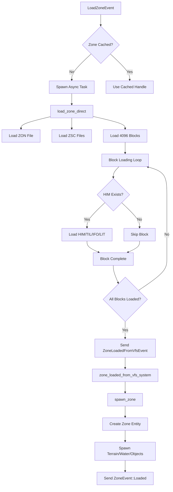
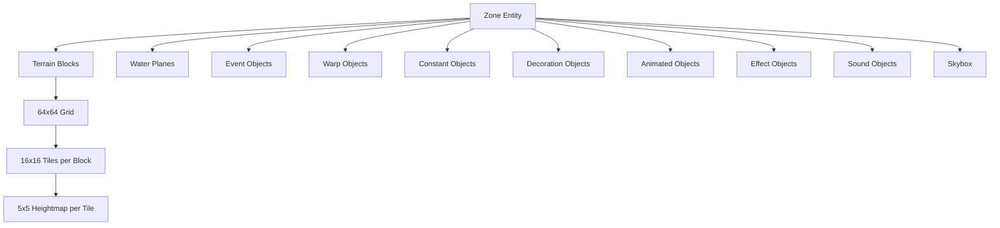
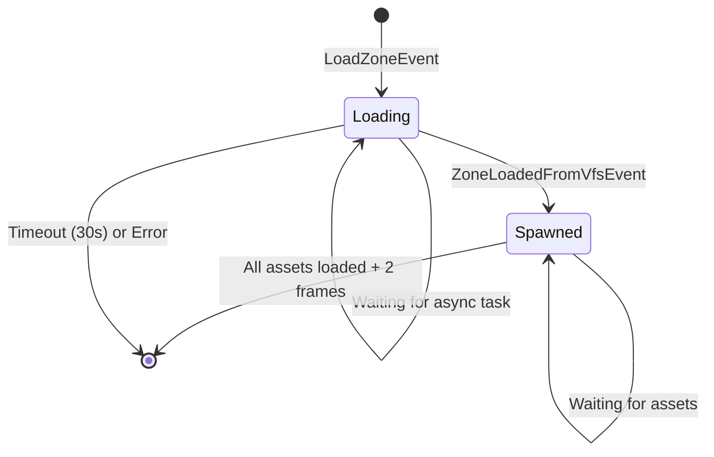
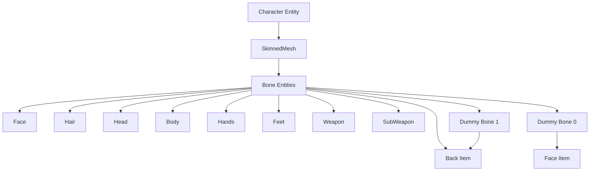
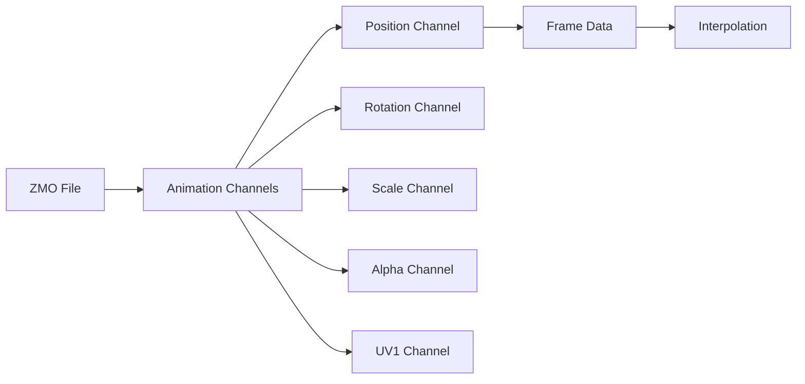
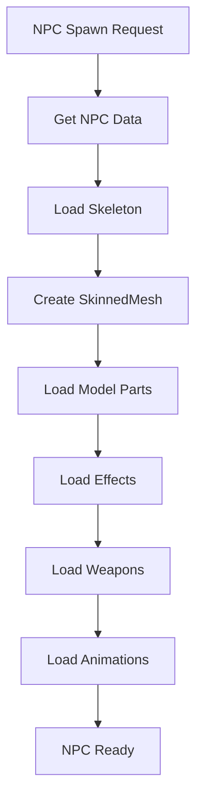
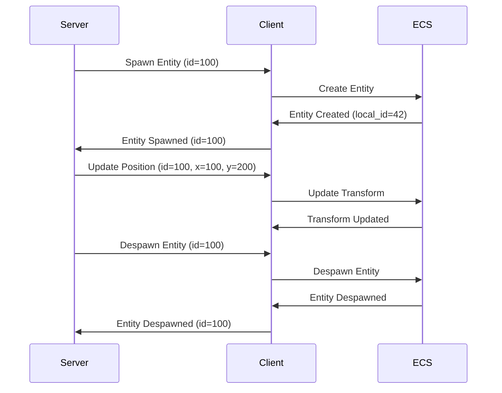
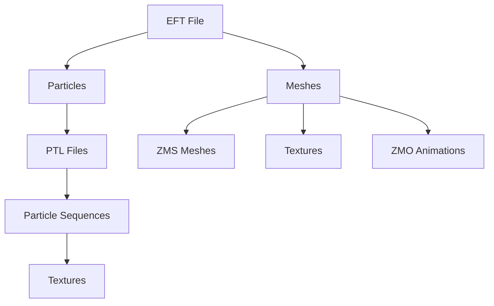

# MMORPG-Specific Async Loading Diagnostics for Rose Online

> **Version**: 1.0 | **Bevy Version**: 0.13.2 | **Project**: Rose Online Client  
> **Purpose**: MMORPG-specific diagnostic framework for async asset loading, zone transitions, and entity spawning in a multiplayer game context

---

## 1. Executive Summary

This diagnostic document extends the general black screen protocol with MMORPG-specific concerns for the Rose Online game client. MMORPGs present unique loading challenges including:

- **Asynchronous zone loading** with network coordination
- **Entity lifecycle management** across server/client boundaries
- **Streaming asset systems** from VFS archives
- **Character model complexity** with equipment variations
- **Effect system integration** with game state
- **Memory pressure** from persistent entity pools

The diagnostic approach focuses on:
1. **Loading pipeline visibility** - tracking asset loading progress
2. **Entity spawn validation** - ensuring entities appear correctly
3. **Network synchronization** - coordinating server/client state
4. **Memory leak detection** - preventing resource exhaustion
5. **Rose Online format specifics** - coordinate systems and asset formats

---

## 2. Zone Loading Diagnostics

### 2.1 Zone File Loading State

**Location**: [`src/zone_loader.rs`](src/zone_loader.rs:1)

#### Loading Pipeline Overview



#### Diagnostic Checks

| Check | Location | Expected Result | Failure Symptom | Fix |
|--------|-----------|------------------|-----|
| Zone list initialized | [`ZoneLoader::init_zone_list`](src/zone_loader.rs:285) | `ZONE_LIST` contains valid zones | Panic on zone load | Call `init_zone_list` before loading |
| ZON file readable | [`load_zone_direct:474`](src/zone_loader.rs:474) | ZON file parsed successfully | Zone load fails | Check VFS path, verify ZON file exists |
| Block loading progress | [`load_zone_direct:506-528`](src/zone_loader.rs:506) | Blocks loaded incrementally | All blocks skipped | Check HIM file existence in zone directory |
| ZoneLoadedFromVfsEvent sent | [`zone_loader_system:907`](src/zone_loader.rs:907) | Event sent after async load | Zone never spawns | Check channel receiver, verify async task pool |

#### Key Diagnostic Log Messages

```rust
// Successful zone load
"[ZONE LOADER DIRECT TASK] Zone loaded successfully: {zone_id}"
"[ZONE LOADED FROM VFS] Zone {zone_id} spawned successfully!"

// Block loading progress (every 100 blocks)
"[ZONE LOADER DIAGNOSTIC] Block loading progress: {loaded} loaded, {failed} failed"

// Block skipped (optional)
"[LOAD BLOCK DIRECT] Block {block_x}_{block_y} skipped: {error}"

// Zone entity created
"[SPAWN ZONE DIAGNOSTIC] ✓ Zone entity SUCCESSFULLY SPAWNED: entity={:?}, zone_id={zone_id}"
```

### 2.2 Zone Entity Spawning Progress

**Location**: [`spawn_zone`](src/zone_loader.rs:1526)

#### Spawn Process Tracking

The zone spawn process creates multiple entity types:



#### Diagnostic Metrics

| Metric | Location | Expected Range | Warning Threshold |
|---------|-----------|----------------|------------------|
| Terrain blocks spawned | [`spawn_zone:1640-1663`](src/zone_loader.rs:1640) | 0-4096 | < 1000 (sparse zone) |
| Water planes spawned | [`spawn_zone:1670-1682`](src/zone_loader.rs:1670) | 0-50 | N/A |
| Object entities spawned | [`spawn_zone:1684-1826`](src/zone_loader.rs:1684) | 0-5000 | N/A |
| Total entities spawned | [`spawn_zone:1844`](src/zone_loader.rs:1844) | 100-10000 | < 50 (empty zone) |

#### Validation Checkpoints

```rust
// After zone entity spawned
log::info!("[SPAWN ZONE] Zone entity spawned: {:?}", zone_entity);

// After terrain spawned
log::info!("[SPAWN ZONE] Terrain entities: {}", terrain_count);

// After all objects spawned
log::info!("[SPAWN ZONE] Total entities spawned: {}", total_entities);

// Memory tracking
log::info!("[MEMORY] Zone loading assets: {}", zone_loading_assets.len());
```

### 2.3 Terrain Mesh Generation

**Location**: [`spawn_terrain`](src/zone_loader.rs:1905)

#### Terrain Generation Pipeline

1. **Heightmap Processing** ([`zone_loader.rs:1995-2005`](src/zone_loader.rs:1995))
   - Load HIM file (heightmap data)
   - Convert Rose coordinates to Bevy coordinates
   - Calculate vertex normals from height differences

2. **Tile Mapping** ([`zone_loader.rs:1946-1969`](src/zone_loader.rs:1946))
   - Load TIL file (tile indices)
   - Map tile IDs to texture indices
   - Apply tile rotation flags

3. **Mesh Construction** ([`zone_loader.rs:2038-2036`](src/zone_loader.rs:2038))
   - Generate 5x5 vertices per tile (25 vertices)
   - Create triangle indices (6 triangles per tile)
   - Apply lightmap UV coordinates

#### Diagnostic Checks

| Issue | Symptom | Diagnostic | Fix |
|-------|----------|-------------|-----|
| Terrain appears flat | All vertices at y=0 | Heightmap not loaded | Check HIM file path in VFS |
| Textures missing | Black terrain tiles | Tile texture handles invalid | Verify ZON tile_texture paths |
| Lighting incorrect | Terrain too dark/bright | Lightmap UVs wrong | Check lightmap DDS file paths |
| Gaps between tiles | Visible seams | Tile alignment off | Verify grid_size and grid_per_patch |

#### Coordinate System Conversion

**Critical**: Rose Online uses a different coordinate system than Bevy:

```rust
// Rose coordinates (from files)
let rose_x = object_instance.position.x;
let rose_y = object_instance.position.y;
let rose_z = object_instance.position.z;

// Bevy coordinates (for rendering)
let bevy_x = rose_x / 100.0;
let bevy_y = rose_z / 100.0;
let bevy_z = -rose_y / 100.0;  // Note: Y and Z swapped, Z inverted
```

### 2.4 Zone Object Placement Validation

**Location**: [`spawn_object`](src/zone_loader.rs:2202)

#### Object Spawn Validation

| Validation | Location | Check |
|------------|-----------|-------|
| Mesh ID bounds | [`zone_loader.rs:2287`](src/zone_loader.rs:2287) | `mesh_id < zsc.meshes.len()` |
| Material ID bounds | [`zone_loader.rs:2295`](src/zone_loader.rs:2295) | `material_id < zsc.materials.len()` |
| Bone index valid | [`zone_loader.rs:2242`](src/zone_loader.rs:2242) | `bone_index < skeleton.bones.len()` |
| Transform valid | [`zone_loader.rs:2222-2240`](src/zone_loader.rs:2222) | No NaN in position/rotation/scale |

#### Common Object Placement Issues

| Issue | Cause | Diagnostic | Fix |
|-------|--------|-------------|-----|
| Objects underground | Position.y incorrect | Check IFO position values | Verify coordinate conversion |
| Objects rotated wrong | Quaternion conversion error | Check rotation component mapping | Ensure XYZW order correct |
| Objects invisible | Material handle weak | Material not loaded | Check material lifecycle |
| Objects floating | Heightmap not applied | Missing terrain collision | Verify terrain spawn order |

### 2.5 Zone Lighting Configuration

**Location**: [`spawn_terrain`](src/zone_loader.rs:1905)

#### Lightmap Loading

```rust
// Lightmap texture loaded per block
let lightmap_texture = asset_server.load(format!(
    "{}/{1:}_{2:}/{1:}_{2:}_PLANELIGHTINGMAP.DDS",
    zone_data.zone_path.to_str().unwrap(),
    block_x, block_y
));
```

#### Diagnostic Checks

| Check | Expected | Failure Symptom |
|--------|-----------|-----------------|
| Lightmap DDS exists | File loads successfully | Black terrain lighting |
| Lightmap UVs correct | UVs in [0,1] range | Incorrect lighting pattern |
| Lightmap size matches | 64x64 per block | Mismatched lightmap |
| Lightmap applied | Material uses lightmap | Terrain unlit |

### 2.6 Zone Switch Transition State

**Location**: [`zone_loader_system`](src/zone_loader.rs:853)

#### Transition States

```rust
pub enum LoadingZoneState {
    Loading,      // Zone data being loaded from VFS
    Spawned,      // Zone entity created, assets loading
}
```

#### Transition Timeline



#### Diagnostic Metrics

| Metric | Location | Expected | Warning |
|---------|-----------|-----------|----------|
| Loading timeout | [`zone_loader_system:1113`](src/zone_loader.rs:1113) | < 30s | Zone load stalled |
| Ready frames | [`zone_loader_system:1317`](src/zone_loader.rs:1317) | 2 frames | Physics not initialized |
| Asset load count | [`LoadingZone::zone_assets`](src/zone_loader.rs:802) | 0-1000 | Excessive assets |

#### Transition Failure Diagnostics

```rust
// Timeout detection
if loading_zone.loading_start_time.elapsed() > Duration::from_secs(30) {
    log::error!("[ZONE LOADER SYSTEM] Zone {} loading timeout after 30s", zone_path);
    loading_zone.clear_asset_handles();
    loading_zones.remove(index);
}

// Asset load failure
if matches!(load_state, LoadState::Failed) {
    log::warn!("[ZONE LOADER SYSTEM] Zone {} failed to load", zone_path);
    loading_zone.clear_asset_handles();
    loading_zones.remove(index);
}
```

---

## 3. Character Model Loading

### 3.1 Character Model Spawn Pipeline

**Location**: [`spawn_character_model`](src/model_loader.rs:664)

#### Character Model Architecture



#### Spawn Process

1. **Skeleton Loading** ([`model_loader.rs:674-681`](src/model_loader.rs:674))
   - Load ZMD skeleton file (MALE.ZMD or FEMALE.ZMD)
   - Create bone entities for hierarchy
   - Compute inverse bind poses for skinning

2. **Model Part Loading** ([`model_loader.rs:684-715`](src/model_loader.rs:684))
   - Load ZSC model lists for each part type
   - Spawn mesh entities for each part
   - Attach to appropriate bones

3. **Animation Loading** ([`model_loader.rs:428-482`](src/model_loader.rs:428))
   - Load ZMO animation files for all actions
   - Store handles in `action_motions` EnumMap

#### Diagnostic Checks

| Check | Location | Expected | Failure Symptom |
|--------|-----------|-----------|-----------------|
| Skeleton loaded | [`ModelLoader::new:106`](src/model_loader.rs:106) | ZMD file parsed | Character invisible |
| Bone count valid | [`spawn_skeleton:1116`](src/model_loader.rs:1116) | Bones > 0 | No skinning |
| Model parts loaded | [`spawn_character_model_part`](src/model_loader.rs:732) | Parts spawned | Missing equipment |
| Animations loaded | [`load_character_action_motions`](src/model_loader.rs:428) | All actions have handles | Animation not playing |

### 3.2 ZMS/ZMO Animation Loading

**Location**: [`src/zms_asset_loader.rs`](src/zms_asset_loader.rs:1), [`src/animation/zmo_asset_loader.rs`](src/animation/zmo_asset_loader.rs:1)

#### ZMS Mesh Loading

**ZMS File Format**: Rose Online mesh format

```rust
// Key attributes loaded from ZMS
mesh.insert_attribute(Mesh::ATTRIBUTE_POSITION, zms.position);
mesh.insert_attribute(Mesh::ATTRIBUTE_NORMAL, zms.normal);
mesh.insert_attribute(Mesh::ATTRIBUTE_UV_0, zms.uv1);
mesh.insert_attribute(Mesh::ATTRIBUTE_JOINT_WEIGHT, zms.bone_weights);
mesh.insert_attribute(Mesh::ATTRIBUTE_JOINT_INDEX, zms.bone_indices);
```

**Coordinate Conversion** ([`zms_asset_loader.rs:76-82`](src/zms_asset_loader.rs:76)):

```rust
// Convert Rose coordinates to Bevy
for vert in zms.position.iter_mut() {
    let y = vert[1];
    vert[1] = vert[2];  // Y becomes Z
    vert[2] = -y;       // Z becomes -Y
}
```

#### ZMO Animation Loading

**ZMO File Format**: Rose Online animation format



**Animation Texture Generation** ([`zmo_asset_loader.rs:251-350`](src/animation/zmo_asset_loader.rs:251)):

```rust
// Generate texture for GPU-based animation
let mut image_data = vec![0; num_vertices * stride * 16];
// RGBA 32F: x=frame, y=vertex, xyz=position/normal/uv
```

#### Diagnostic Checks

| Issue | Symptom | Diagnostic | Fix |
|-------|----------|-------------|-----|
| Mesh appears distorted | Vertices in wrong order | Check coordinate conversion | Verify Y/Z swap |
| Animation not playing | ZMO not loaded | Check animation path | Verify ZMO file in VFS |
| Animation texture black | Texture generation failed | Check texture format | Verify Rgba32Float support |
| Skinning not working | Bone weights zero | Check bone indices | Verify ZMS bone data |

### 3.3 Equipment Model Attachment

**Location**: [`spawn_character_model_part`](src/model_loader.rs:732)

#### Equipment Attachment Points

| Equipment Type | Bone Index | Default Bone | Dummy Bone Offset |
|----------------|-------------|---------------|-------------------|
| Face | N/A | Bone 4 | - |
| Hair | N/A | Bone 4 | - |
| Head | N/A | - | Dummy + 6 |
| Face Item | N/A | - | Dummy + 4 |
| Back | N/A | - | Dummy + 3 |
| Weapon | N/A | Dummy + 0 | Dummy + 0 |
| SubWeapon | N/A | Dummy + 1 | Dummy + 1 |

#### Attachment Validation

```rust
// Check bone attachment
if let Some(bone_index) = object_part.bone_index {
    skinned_mesh.joints.get(bone_index as usize).cloned()
} else if let Some(dummy_index) = object_part.dummy_index {
    skinned_mesh.joints.get(dummy_index as usize + dummy_bone_offset).cloned()
} else if let Some(default_bone_index) = default_bone_index {
    skinned_mesh.joints.get(default_bone_index).cloned()
}
```

#### Diagnostic Issues

| Issue | Cause | Symptom | Fix |
|-------|--------|-----------|-----|
| Equipment floating | Wrong bone index | Equipment not attached | Check dummy bone offset |
| Equipment invisible | Material not loaded | Black equipment | Verify texture paths |
| Equipment wrong position | Bone offset incorrect | Misplaced equipment | Check attachment bone |

### 3.4 Texture Loading for Equipment

**Location**: [`spawn_model`](src/model_loader.rs:1179)

#### Texture Loading Pipeline

```rust
// Load texture from ZSC material
let texture_handle = asset_server.load(zsc_material.path.path().to_string_lossy().into_owned());

// Create StandardMaterial
let material = standard_materials.add(bevy::pbr::StandardMaterial {
    base_color_texture: Some(texture_handle),
    unlit: false,
    double_sided: zsc_material.two_sided,
    ..Default::default()
});
```

#### Diagnostic Checks

| Check | Expected | Failure Symptom |
|--------|-----------|-----------------|
| Texture path valid | DDS file exists | Black equipment |
| Texture loaded | LoadState::Loaded | Equipment invisible |
| Material strong | Material not weak | Equipment not rendering |
| Two-sided flag | Correct culling | Backface culling wrong |

### 3.5 Model Visibility State

**Location**: [`spawn_zone`](src/zone_loader.rs:1526)

#### Visibility Components

```rust
// Zone entity visibility
commands.spawn((
    Zone { id: zone_data.zone_id },
    SpatialBundle {
        visibility: Visibility::Visible,
        transform: Transform::from_xyz(5200.0, 0.0, -5200.0),
        ..Default::default()
    },
    NoFrustumCulling,  // Disable culling for large zone
    Aabb::from_min_max(Vec3::splat(-100000.0), Vec3::splat(100000.0)),
))
```

#### Visibility Diagnostic

| Component | Purpose | Check |
|-----------|---------|-------|
| Visibility | User-controlled visibility | Must be `Visible` |
| InheritedVisibility | Parent propagation | Must be set |
| ViewVisibility | Frustum culling result | Should be true for visible entities |
| NoFrustumCulling | Disable culling | Present on zone entities |
| Aabb | Bounding box | Valid and large enough |

#### Common Visibility Issues

| Issue | Cause | Diagnostic | Fix |
|-------|--------|-------------|-----|
| All entities invisible | Zone not visible | Check zone Visibility | Set `Visibility::Visible` |
| Entities culled | AABB too small | Check Aabb values | Use large AABB for zone |
| Child entities invisible | InheritedVisibility not set | Check parent visibility | Add `InheritedVisibility::default()` |

---

## 4. NPC and Monster Loading

### 4.1 NPC Model Loading from STB Data

**Location**: [`spawn_npc_model`](src/model_loader.rs:198)

#### NPC Data Sources

```rust
// NPC data from STB files
pub struct ModelLoader {
    npc_chr: ChrFile,        // NPC skeleton and model references
    npc_zsc: ZscFile,        // NPC part definitions
    npc_database: Arc<NpcDatabase>,  // NPC metadata
}
```

#### NPC Loading Pipeline



#### Diagnostic Checks

| Check | Location | Expected | Failure Symptom |
|--------|-----------|-----------|-----------------|
| NPC ID valid | [`spawn_npc_model:210`](src/model_loader.rs:210) | NPC exists in database | NPC not spawned |
| Skeleton loaded | [`spawn_npc_model:211-237`](src/model_loader.rs:211) | ZMD file loaded | Invisible NPC |
| Model parts loaded | [`spawn_npc_model:239-255`](src/model_loader.rs:239) | Parts spawned | NPC has no mesh |
| Animations loaded | [`spawn_npc_model:317-325`](src/model_loader.rs:317) | All actions have handles | NPC not animated |

### 4.2 Monster Model Variation Loading

**Location**: [`npc_chr.npcs`](src/model_loader.rs:210)

#### Monster Variations

```rust
// NPC data structure
pub struct NpcModelData {
    pub skeleton_index: u16,        // Which skeleton to use
    pub model_ids: Vec<u16>,        // Model parts to load
    pub effect_ids: Vec<(u16, u16)>, // Effect attachments
}
```

#### Variation Loading

| Variation Type | Source | Example |
|---------------|---------|---------|
| Skeleton | `npc_chr.skeleton_files` | Different bone structures |
| Model parts | `npc_chr.model_ids` | Different meshes |
| Effects | `npc_chr.effect_files` | Particle effects |
| Weapons | `npc_database.right_hand_part_index` | Equipment |

#### Diagnostic Issues

| Issue | Cause | Symptom | Fix |
|-------|--------|-----------|-----|
| Wrong skeleton | Invalid skeleton_index | NPC distorted | Check skeleton_index bounds |
| Missing parts | model_ids empty | Invisible NPC | Verify model data |
| Effects not playing | Effect IDs invalid | No effects | Check effect file paths |

### 4.3 Animation State Machine Initialization

**Location**: [`NpcModel::action_motions`](src/components/npc_model.rs:12)

#### NPC Animation Actions

```rust
pub enum NpcMotionAction {
    Idle,
    Walk,
    Run,
    Attack,
    Die,
    // ... more actions
}

// Animation handles for all actions
pub struct NpcModel {
    pub action_motions: EnumMap<NpcMotionAction, Handle<ZmoAsset>>,
    // ...
}
```

#### Animation Loading

```rust
// Load animations from database
enum_map! {
    action => {
        if let Some(motion_data) = self.npc_database.get_npc_action_motion(npc_id, action) {
            asset_server.load(motion_data.path.path().to_string_lossy().into_owned())
        } else {
            Handle::default()
        }
    }
}
```

#### Diagnostic Checks

| Check | Expected | Failure Symptom |
|--------|-----------|-----------------|
| All actions loaded | No default handles | NPC animated |
| Animation paths valid | ZMO files exist | Animation not playing |
| Motion database accessible | NPC in database | Animation loading failed |

### 4.4 Spawn Position Validation

**Location**: [`spawn_npc_model`](src/model_loader.rs:198)

#### Position Calculation

```rust
// Root bone position from skeleton
let root_bone_position = if let Some(root_bone) = skeleton.bones.first() {
    Vec3::new(
        root_bone.position.x,
        root_bone.position.z,  // Y/Z swap
        -root_bone.position.y, // Z inverted
    ) / 100.0  // Scale to Bevy units
} else {
    Vec3::ZERO
};
```

#### Position Validation

| Check | Expected | Failure Symptom |
|--------|-----------|-----------------|
| Root bone exists | skeleton.bones.len() > 0 | NPC at origin |
| Position valid | No NaN values | NPC invisible |
| Scale correct | Position / 100.0 | Wrong size |

#### Common Position Issues

| Issue | Cause | Symptom | Fix |
|-------|--------|-----------|-----|
| NPC underground | Y coordinate negative | Check skeleton Y | Verify coordinate conversion |
| NPC floating | Y coordinate too high | Above terrain | Check spawn position |
| NPC wrong location | Position not set | At origin | Verify spawn data |

---

## 5. VFS Archive Streaming

### 5.1 Archive Mount State

**Location**: [`src/vfs_asset_io.rs`](src/vfs_asset_io.rs:1)

#### VFS Initialization

```rust
// VFS asset reader plugin
pub struct VfsAssetReaderPlugin {
    vfs: Arc<VirtualFilesystem>,
}

// Register VFS as default asset source
app.register_asset_source(
    AssetSourceId::Default,
    AssetSource::build().with_reader(move || {
        Box::new(VfsAssetIo::new(vfs_clone))
    }),
);
```

#### Diagnostic Checks

| Check | Location | Expected | Failure Symptom |
|--------|-----------|-----------|-----------------|
| VFS created | [`VfsAssetIo::new:115`](src/vfs_asset_io.rs:115) | VFS initialized | No assets loadable |
| Asset source registered | [`VfsAssetReaderPlugin:271`](src/vfs_asset_io.rs:271) | Source available | Asset load fails |
| Reader type correct | [`VfsAssetReaderPlugin:303`](src/vfs_asset_io.rs:303) | VfsAssetIo | Wrong reader type |

### 5.2 File Seek/Read Performance

**Location**: [`CursorWrapper`](src/vfs_asset_io.rs:16)

#### Read Operations

```rust
impl AsyncRead for CursorWrapper {
    fn poll_read(
        mut self: Pin<&mut Self>,
        _cx: &mut Context<'_>,
        buf: &mut [u8],
    ) -> Poll<std::io::Result<usize>> {
        let pos = self.position as usize;
        let available = self.data.len().saturating_sub(pos);
        let to_read = std::cmp::min(buf.len(), available);
        
        if to_read > 0 {
            buf[..to_read].copy_from_slice(&self.data[pos..pos + to_read]);
            self.position += to_read as u64;
        }
        
        Poll::Ready(Ok(to_read))
    }
}
```

#### Diagnostic Metrics

| Metric | Expected | Warning Threshold |
|---------|-----------|------------------|
| Read latency | < 10ms per file | > 100ms |
| Seek operations | Minimal per file | Excessive seeking |
| Buffer size | Appropriate for file | Too small/large |

#### Performance Issues

| Issue | Cause | Symptom | Fix |
|-------|--------|-----------|-----|
| Slow loading | Many small reads | Stuttering | Increase buffer size |
| High memory | Entire file loaded | Memory pressure | Stream in chunks |
| Seek thrashing | Random access | Slow loading | Optimize access pattern |

### 5.3 Streaming Buffer Management

**Location**: [`VfsFile`](src/vfs_asset_io.rs:14)

#### Buffer Types

```rust
pub enum VfsFile {
    Buffer(Vec<u8>),      // Entire file in memory
    View(Arc<[u8]>),    // Shared view of larger buffer
}
```

#### Buffer Strategy

| Use Case | Buffer Type | Advantage |
|-----------|-------------|------------|
| Small files | Buffer | Fast access |
| Large archives | View | Memory efficient |
| Streaming | Chunked reads | Low memory |

#### Diagnostic Checks

| Check | Expected | Failure Symptom |
|--------|-----------|-----------------|
| Buffer valid | Non-empty | File not loaded |
| View reference count | Correct | Premature free |
| Memory usage | Within budget | Out of memory |

### 5.4 Archive Corruption Detection

**Location**: [`VfsAssetIo::read`](src/vfs_asset_io.rs:122)

#### Error Handling

```rust
match self.vfs.open_file(path_str) {
    Ok(file) => {
        match file {
            VfsFile::Buffer(buffer) => {
                Ok(Box::new(CursorWrapper::new(buffer)))
            }
            VfsFile::View(view) => {
                Ok(Box::new(CursorWrapper::new(view.into())))
            }
        }
    }
    Err(e) => {
        // Fallback to local filesystem
        if let Ok(data) = std::fs::read(path) {
            return Ok(Box::new(CursorWrapper::new(data)));
        }
        
        log::warn!("[VFS DIAGNOSTIC] VFS file not found for path: {}", path_str);
        Err(AssetReaderError::NotFound(path.into()))
    }
}
```

#### Corruption Detection

| Check | Expected | Failure Symptom |
|--------|-----------|-----------------|
| File header valid | Correct magic bytes | Parse error |
| File size reasonable | > 0 and < max size | Truncated file |
| Checksum valid | Matches expected | Corrupted data |

### 5.5 Partial File Loading

**Location**: [`load_block_files_direct`](src/zone_loader.rs:662)

#### Partial Loading Strategy

```rust
// Optional files - skip if missing
let til = match vfs.read_file(&til_path) {
    Ok(data) => Some(data),
    Err(e) => {
        log::trace!("[LOAD BLOCK DIRECT] TIL file not found: {:?}. This is optional.", e);
        None
    }
};

let ifo = match vfs.read_file(&ifo_path) {
    Ok(data) => Some(data),
    Err(e) => {
        log::trace!("[LOAD BLOCK DIRECT] IFO file not found: {:?}. This is optional.", e);
        None
    }
};
```

#### Partial Loading Diagnostics

| File Type | Optional | Impact if Missing |
|------------|-----------|------------------|
| HIM | No | Block cannot load |
| TIL | Yes | No tile textures (default texture) |
| IFO | Yes | No objects (empty block) |
| LIT | Yes | No lightmap (unlit) |

#### Fallback Strategy

```rust
// Use default values for missing optional data
let base_texture = tile_textures.first().cloned();
let material_handle = standard_materials.add(bevy::pbr::StandardMaterial {
    base_color_texture: if material_path.is_empty() || material_path == "" {
        log::warn!("[SPAWN OBJECT DEBUG] Empty texture path, using fallback");
        Some(asset_server.load("ETC/SPECULAR_SPHEREMAP.DDS"))
    } else {
        Some(base_texture_handle.clone())
    },
    ..Default::default()
});
```

---

## 6. Network-Asset Synchronization

### 6.1 Server Entity vs Local Entity Reconciliation

**Location**: [`src/resources/client_entity_list.rs`](src/resources/client_entity_list.rs:1)

#### Entity Mapping

```rust
pub struct ClientEntityList {
    pub client_entities: Vec<Option<Entity>>,  // Server ID -> Bevy Entity
    pub player_entity: Option<Entity>,         // Local player entity
    pub player_entity_id: Option<ClientEntityId>,
    pub zone_id: Option<ZoneId>,
}
```

#### Reconciliation Process



#### Diagnostic Checks

| Check | Expected | Failure Symptom |
|--------|-----------|-----------------|
| Entity mapping valid | `client_entities[id]` exists | Entity not found |
| Player entity set | `player_entity` not None | Local player invisible |
| Zone ID matches | `zone_id` equals current zone | Wrong zone entities |

### 6.2 Asset Loading Coordination with Network Packets

**Location**: Network event handlers (not shown, referenced)

#### Loading Coordination

```rust
// Typical network spawn flow
fn handle_entity_spawn_packet(
    packet: EntitySpawnPacket,
    commands: &mut Commands,
    asset_server: &AssetServer,
    model_loader: &ModelLoader,
) {
    // 1. Create entity
    let entity = commands.spawn_empty().id();
    
    // 2. Load assets asynchronously
    let mesh_handle = asset_server.load(&packet.mesh_path);
    let texture_handle = asset_server.load(&packet.texture_path);
    
    // 3. Add components
    commands.entity(entity).insert((
        Transform::from_xyz(packet.x, packet.y, packet.z),
        mesh_handle,
        texture_handle,
        // ... more components
    ));
    
    // 4. Wait for assets to load before making visible
    // (handled by asset loading system)
}
```

#### Coordination Issues

| Issue | Cause | Symptom | Fix |
|-------|--------|-----------|-----|
| Entity appears late | Assets not loaded | Invisible then visible | Wait for LoadState::Loaded |
| Entity flickers | Asset reload | Disappearing entities | Cache assets |
| Wrong model | Asset path error | Wrong appearance | Verify paths |
| Missing animation | Animation not loaded | T-pose | Load animations |

### 6.3 Entity Spawn Timing Validation

**Location**: [`zone_loaded_from_vfs_system`](src/zone_loader.rs:1342)

#### Spawn Timing

```rust
// Zone loaded event
pub fn zone_loaded_from_vfs_system(
    mut events: EventReader<ZoneLoadedFromVfsEvent>,
    mut zone_events: EventWriter<ZoneEvent>,
    // ...
) {
    for event in events.read() {
        // Spawn zone
        match spawn_zone(&mut spawn_zone_params, &event.zone_asset) {
            Ok((entity, _zone_assets)) => {
                // Send loaded event
                zone_events.send(ZoneEvent::Loaded(event.zone_id));
            }
            Err(e) => {
                log::error!("[ZONE LOADED FROM VFS] Failed to spawn zone: {:?}", e);
            }
        }
    }
}
```

#### Timing Validation

| Check | Expected | Failure Symptom |
|--------|-----------|-----------------|
| Zone spawns immediately | < 1 second after load request | Zone never appears |
| Assets load within timeout | < 30 seconds | Loading stuck |
| Physics initializes | 2 frames after spawn | Collision not working |

### 6.4 Position/Rotation Synchronization

**Location**: Network position updates (not shown)

#### Synchronization Pipeline

```rust
// Network position update
fn handle_position_update(
    packet: PositionUpdatePacket,
    mut query: Query<&mut Transform>,
    client_entities: &ClientEntityList,
) {
    if let Some(entity) = client_entities.get(packet.entity_id) {
        if let Ok(mut transform) = query.get_mut(entity) {
            // Interpolate for smooth movement
            transform.translation.x = packet.x;
            transform.translation.y = packet.y;
            transform.translation.z = packet.z;
        }
    }
}
```

#### Synchronization Issues

| Issue | Cause | Symptom | Fix |
|-------|--------|-----------|-----|
| Entity teleporting | No interpolation | Jumpy movement | Add interpolation |
| Wrong rotation | Quaternion order error | Spinning entity | Fix rotation conversion |
| Position drift | Precision loss | Accumulating error | Use fixed-point or delta updates |

---

## 7. Memory Management for MMORPG

### 7.1 Zone Memory Budgets

**Location**: [`MemoryTrackingResource`](src/zone_loader.rs:111)

#### Memory Tracking

```rust
pub struct MemoryTrackingResource {
    pub mesh_handles_created: usize,
    pub material_handles_created: usize,
    pub texture_handles_created: usize,
    pub unique_asset_paths: HashSet<String>,
    pub duplicate_asset_requests: usize,
    pub entities_spawned: usize,
    pub entities_despawned: usize,
    // ...
}
```

#### Memory Budget Estimates

| Asset Type | Average Size | Per Zone Budget | Warning Threshold |
|-------------|---------------|-----------------|------------------|
| Mesh | 2 MB | 100 MB | > 150 MB |
| Texture | 5 MB | 500 MB | > 750 MB |
| Material | 0.1 MB | 50 MB | > 75 MB |
| Entity | 0.5 KB | 10 MB | > 20 MB |

#### Diagnostic Checks

```rust
// Check for memory leaks
if entities_spawned > 0 && entities_despawned == 0 {
    warn!("[MEMORY TRACKING] WARNING: {} entities spawned but 0 despawned - potential leak!", 
        entities_spawned);
}

// Check for duplicate requests
if duplicate_asset_requests > 100 {
    warn!("[MEMORY TRACKING] WARNING: {} duplicate asset requests detected", 
        duplicate_asset_requests);
}
```

### 7.2 Entity Culling Based on Distance

**Location**: Not implemented (future enhancement)

#### Distance Culling Strategy

```rust
// Pseudo-code for distance culling
fn distance_culling_system(
    mut query: Query<(Entity, &mut Visibility, &GlobalTransform)>,
    camera: Query<&GlobalTransform, With<Camera>>,
) {
    let camera_transform = camera.single();
    
    for (entity, mut visibility, transform) in query.iter_mut() {
        let distance = transform.translation.distance(camera_transform.translation);
        
        if distance > CULLING_DISTANCE {
            *visibility = Visibility::Hidden;
        } else if distance < CULLING_DISTANCE * 0.9 {
            *visibility = Visibility::Visible;
        }
    }
}
```

#### Culling Diagnostics

| Metric | Expected | Warning |
|---------|-----------|----------|
| Visible entities | < 1000 | Too many visible |
| Culled entities | > 0 | Culling not working |
| Culling distance | 100-500 units | Wrong distance |

### 7.3 Texture LOD Streaming

**Location**: Not implemented (future enhancement)

#### LOD Strategy

```rust
// Pseudo-code for texture LOD
fn texture_lod_system(
    mut query: Query<(&mut Handle<Image>, &GlobalTransform)>,
    camera: Query<&GlobalTransform, With<Camera>>,
    assets: Res<Assets<Image>>,
) {
    let camera_transform = camera.single();
    
    for (mut texture_handle, transform) in query.iter_mut() {
        let distance = transform.translation.distance(camera_transform.translation);
        
        if distance < LOD_HIGH_DISTANCE {
            *texture_handle = load_texture_high_res();
        } else if distance < LOD_MEDIUM_DISTANCE {
            *texture_handle = load_texture_medium_res();
        } else {
            *texture_handle = load_texture_low_res();
        }
    }
}
```

#### LOD Diagnostics

| Check | Expected | Failure Symptom |
|--------|-----------|-----------------|
| LOD switches | Smooth transitions | Popping textures |
| Memory reduced | Lower LOD uses less memory | No memory savings |
| Quality acceptable | No visible degradation | Too blurry |

### 7.4 Model LOD Switching

**Location**: Not implemented (future enhancement)

#### Model LOD Strategy

```rust
// Pseudo-code for model LOD
pub struct ModelLod {
    high: Handle<Mesh>,
    medium: Handle<Mesh>,
    low: Handle<Mesh>,
}

fn model_lod_system(
    mut query: Query<(&mut Handle<Mesh>, &GlobalTransform)>,
    camera: Query<&GlobalTransform, With<Camera>>,
) {
    let camera_transform = camera.single();
    
    for (mut mesh_handle, transform) in query.iter_mut() {
        let distance = transform.translation.distance(camera_transform.translation);
        
        if distance < LOD_HIGH_DISTANCE {
            *mesh_handle = model_lod.high.clone();
        } else if distance < LOD_MEDIUM_DISTANCE {
            *mesh_handle = model_lod.medium.clone();
        } else {
            *mesh_handle = model_lod.low.clone();
        }
    }
}
```

#### LOD Diagnostics

| Check | Expected | Failure Symptom |
|--------|-----------|-----------------|
| LOD transitions | Smooth | Popping models |
| Performance improved | Higher FPS at distance | No improvement |
| Quality acceptable | No visible degradation | Too blocky |

### 7.5 Garbage Collection of Unused Assets

**Location**: [`LoadingZone::clear_asset_handles`](src/zone_loader.rs:814)

#### Asset Cleanup

```rust
impl LoadingZone {
    pub fn clear_asset_handles(&mut self) {
        if !self.assets_cleared {
            let count = self.zone_assets.len();
            if count > 0 {
                log::info!("[MEMORY FIX] Clearing {} zone asset handles", count);
                self.zone_assets.clear();
                self.zone_assets.shrink_to_fit();
                self.assets_cleared = true;
            }
        }
    }
}
```

#### Cleanup Diagnostics

| Check | Expected | Failure Symptom |
|--------|-----------|-----------------|
| Assets cleared | After zone loaded | Memory leak |
| Handles released | Reference count 0 | Asset not freed |
| Memory freed | Reduced memory usage | No memory reduction |

---

## 8. Loading Screen Diagnostics

### 8.1 Loading Progress Tracking

**Location**: [`ZoneDebugDiagnostics`](src/resources/zone_debug_diagnostics.rs:12)

#### Progress Metrics

```rust
pub struct ZoneDebugDiagnostics {
    pub total_entities_spawned: usize,
    pub total_entities_despawned: usize,
    pub active_entity_count: usize,
    pub entities_spawned_this_frame: usize,
    pub frames_since_last_spawn: usize,
    // ...
}
```

#### Progress Tracking

| Phase | Metric | Expected Range |
|--------|---------|---------------|
| Zone data loading | Blocks loaded | 0-4096 |
| Asset loading | Assets loaded | 0-10000 |
| Entity spawning | Entities spawned | 100-10000 |
| Physics initialization | Ready frames | 0-2 |

### 8.2 Timeout Detection

**Location**: [`zone_loader_system:1113`](src/zone_loader.rs:1113)

#### Timeout Handling

```rust
// Check for timeout (30 seconds)
if loading_zone.loading_start_time.elapsed() > Duration::from_secs(30) {
    log::error!("[ZONE LOADER SYSTEM] Zone {} loading timeout after 30s", zone_path);
    
    // Clear asset handles to prevent leak
    loading_zone.clear_asset_handles();
    
    // Remove from loading queue
    loading_zones.remove(index);
}
```

#### Timeout Diagnostics

| Check | Timeout | Action |
|--------|---------|--------|
| Zone data load | 30 seconds | Log error, remove zone |
| Asset load | 60 seconds | Log error, clear handles |
| Physics init | 5 seconds | Log warning, continue |

### 8.3 Fallback Content Loading

**Location**: [`spawn_object`](src/zone_loader.rs:2202)

#### Fallback Strategy

```rust
// Use fallback texture if path empty
let base_texture = if material_path.is_empty() || material_path == "" {
    log::warn!("[SPAWN OBJECT DEBUG] Empty texture path for mesh_id {}, using fallback", mesh_id);
    Some(asset_server.load("ETC/SPECULAR_SPHEREMAP.DDS"))
} else {
    Some(base_texture_handle.clone())
};
```

#### Fallback Diagnostics

| Asset Type | Fallback | Expected Behavior |
|-------------|-----------|------------------|
| Texture | SPECULAR_SPHEREMAP.DDS | White/grey material |
| Mesh | Cube/Plane | Placeholder geometry |
| Animation | Idle animation | Default pose |

### 8.4 Error Recovery Strategies

**Location**: [`zone_loader_system:1143-1151`](src/zone_loader.rs:1143)

#### Error Recovery

```rust
Some(LoadState::Failed) => {
    log::warn!("[ZONE LOADER SYSTEM] Zone {} failed to load", zone_path);
    
    // Clear asset handles to prevent leak
    loading_zone.clear_asset_handles();
    
    // Remove from loading queue
    loading_zones.remove(index);
}
```

#### Recovery Strategies

| Error Type | Recovery | User Impact |
|------------|-----------|--------------|
| Zone not found | Log error, don't spawn | Black screen |
| Asset load failed | Log error, use fallback | Missing textures |
| Timeout | Log error, retry | Stuck on loading |
| Out of memory | Log error, reduce quality | Crash |

---

## 9. Rose Online Specific Concerns

### 9.1 Coordinate System Conversion

**Location**: Throughout codebase

#### Rose to Bevy Coordinate Conversion

```rust
// Rose Online coordinate system
// X: East/West
// Y: Up/Down (height)
// Z: North/South

// Bevy coordinate system
// X: Right/Left
// Y: Up/Down (height)
// Z: Forward/Backward

// Conversion function
fn rose_to_bevy_position(rose: Vec3) -> Vec3 {
    Vec3::new(
        rose.x / 100.0,      // X stays X
        rose.z / 100.0,      // Rose Z becomes Bevy Y
        -rose.y / 100.0,     // Rose Y becomes -Bevy Z
    )
}
```

#### Rotation Conversion

```rust
// Rose quaternion (X, Z, -Y, W)
fn rose_to_bevy_rotation(rose: Quat) -> Quat {
    Quat::from_xyzw(
        rose.x,
        rose.z,
        -rose.y,
        rose.w,
    )
}
```

#### Diagnostic Issues

| Issue | Cause | Symptom | Fix |
|-------|--------|-----------|-----|
| Objects underground | Y/Z not swapped | Below terrain |
| Objects backwards | Z not inverted | Wrong direction |
| Rotation wrong | Quaternion order | Spinning objects |

### 9.2 Bone Attachment System Validation

**Location**: [`spawn_skeleton`](src/model_loader.rs:1106)

#### Bone Hierarchy

```rust
// Skeleton structure
pub struct ZmdFile {
    pub bones: Vec<ZmdBone>,
    pub dummy_bones: Vec<ZmdBone>,
}

pub struct ZmdBone {
    pub parent: i32,        // Parent bone index
    pub position: Vec3,     // Local position
    pub rotation: Quat,      // Local rotation
}
```

#### Bone Attachment Validation

| Check | Expected | Failure Symptom |
|--------|-----------|-----------------|
| Parent valid | `parent < bone_index` | Detached bones |
| Hierarchy acyclic | No cycles | Infinite loop |
| Bind pose valid | Invertible | Skinning broken |

### 9.3 Effect System (ZMO) Loading

**Location**: [`spawn_effect`](src/effect_loader.rs:26)

#### Effect Loading Pipeline



#### Effect Diagnostics

| Check | Expected | Failure Symptom |
|--------|-----------|-----------------|
| EFT file loaded | File parsed | No effect |
| Particles spawned | Particle entities | Invisible effect |
| Meshes spawned | Mesh entities | Missing geometry |
| Animations loaded | ZMO handles | Static effect |

### 9.4 Item Model Loading

**Location**: [`spawn_item_drop_model`](src/model_loader.rs:378)

#### Item Model Loading

```rust
pub fn spawn_item_drop_model(
    &self,
    commands: &mut Commands,
    asset_server: &AssetServer,
    standard_materials: &mut Assets<bevy::pbr::StandardMaterial>,
    model_entity: Entity,
    dropped_item: Option<&DroppedItem>,
) -> (ItemDropModel, Handle<ZmoAsset>)
```

#### Item Diagnostics

| Check | Expected | Failure Symptom |
|--------|-----------|-----------------|
| Item ID valid | Item exists in database | Default item model |
| Model loaded | Mesh handle valid | Invisible item |
| Animation loaded | ZMO handle valid | Static item |

### 9.5 Skill Effect Preloading

**Location**: Not implemented (future enhancement)

#### Preloading Strategy

```rust
// Pseudo-code for skill effect preloading
fn preload_skill_effects(
    skill_database: &SkillDatabase,
    asset_server: &AssetServer,
) {
    for skill in skill_database.all_skills() {
        for effect_id in skill.effect_ids {
            if let Some(effect_path) = effect_database.get_effect_file(effect_id) {
                // Preload effect
                asset_server.load(effect_path);
            }
        }
    }
}
```

#### Preloading Diagnostics

| Check | Expected | Failure Symptom |
|--------|-----------|-----------------|
| Effects loaded | All skill effects cached | Lag on skill use |
| Memory acceptable | Within budget | Out of memory |
| Load time | Fast enough | Delayed skill activation |

---

## 10. Troubleshooting Common Loading Failures

### 10.1 Zone Loading Failures

| Failure | Diagnostic | Resolution |
|---------|-------------|------------|
| Zone never spawns | Check LoadZoneEvent sent | Verify event system running |
| Zone appears black | Check visibility components | Ensure Visibility::Visible |
| Zone partially loads | Check block loading logs | Verify VFS file paths |
| Zone loads slowly | Check block count | Optimize block loading |

### 10.2 Character Model Failures

| Failure | Diagnostic | Resolution |
|---------|-------------|------------|
| Character invisible | Check skeleton loaded | Verify ZMD file path |
| Equipment missing | Check model part loading | Verify equipment IDs |
| Animation not playing | Check ZMO handles | Verify animation paths |
| Character distorted | Check coordinate conversion | Verify Y/Z swap |

### 10.3 NPC/Monster Failures

| Failure | Diagnostic | Resolution |
|---------|-------------|------------|
| NPC not spawning | Check NPC ID valid | Verify database entry |
| NPC invisible | Check model loaded | Verify ZSC file path |
| NPC wrong model | Check model IDs | Verify variation selection |
| NPC not animated | Check animations | Verify motion database |

### 10.4 VFS Failures

| Failure | Diagnostic | Resolution |
|---------|-------------|------------|
| Assets not loading | Check VFS mounted | Verify VFS initialization |
| File not found | Check path format | Verify forward slashes |
| Slow loading | Check buffer size | Optimize read strategy |

### 10.5 Memory Issues

| Failure | Diagnostic | Resolution |
|---------|-------------|------------|
| Out of memory | Check asset counts | Implement LOD/culling |
| Memory leak | Check entity despawn | Verify cleanup logic |
| High memory usage | Check texture sizes | Compress textures |
| Memory not freed | Check handle clearing | Force garbage collection |

---

## 11. Diagnostic Tools and Commands

### 11.1 Enable Diagnostic Logging

```rust
// In lib.rs, add diagnostic plugin
app.add_plugins(ZoneDebugDiagnosticsPlugin);

// Enable visibility diagnostics
std::env::set_var("RUN_VISIBILITY_DIAGNOSTIC", "1");
```

### 11.2 Monitor Memory Usage

```rust
// Check memory samples
diagnostics.add_memory_sample(
    total_entities,
    meshes.len(),
    0,
    images.len(),
);

// Log summary periodically
if diagnostics.total_entities_spawned > 0 && diagnostics.total_entities_spawned % 100 == 0 {
    diagnostics.log_summary();
}
```

### 11.3 Track Asset Loading

```rust
// Monitor asset load states
for handle in loading_zone.zone_assets.iter() {
    match asset_server.get_load_state(handle) {
        Some(LoadState::Loaded) => { /* OK */ }
        Some(LoadState::Loading) => { /* Still loading */ }
        Some(LoadState::Failed) => { /* Error */ }
        None => { /* Not found */ }
    }
}
```

### 11.4 Validate Entity Visibility

```rust
// Check visibility components
for (entity, visibility, inherited_visibility, view_visibility) in query.iter() {
    log::info!("Entity {:?}: Visibility={:?}, Inherited={:?}, View={:?}",
        entity, visibility, inherited_visibility, view_visibility);
}
```

---

## 12. Quick Reference

### 12.1 Key File Locations

| File | Purpose | Key Functions |
|------|---------|---------------|
| [`src/zone_loader.rs`](src/zone_loader.rs:1) | Zone loading | `load_zone_direct`, `spawn_zone`, `spawn_terrain` |
| [`src/model_loader.rs`](src/model_loader.rs:1) | Model loading | `spawn_character_model`, `spawn_npc_model` |
| [`src/vfs_asset_io.rs`](src/vfs_asset_io.rs:1) | VFS I/O | `VfsAssetIo::read` |
| [`src/zms_asset_loader.rs`](src/zms_asset_loader.rs:1) | Mesh loading | `ZmsAssetLoader::load` |
| [`src/animation/zmo_asset_loader.rs`](src/animation/zmo_asset_loader.rs:1) | Animation loading | `ZmoAssetLoader::load` |
| [`src/effect_loader.rs`](src/effect_loader.rs:1) | Effect loading | `spawn_effect` |

### 12.2 Key Data Structures

| Structure | Purpose | Key Fields |
|-----------|---------|------------|
| [`ZoneLoaderAsset`](src/zone_loader.rs:91) | Zone data | `zon`, `zsc_cnst`, `zsc_deco`, `blocks` |
| [`CharacterModel`](src/components/character_model.rs:31) | Character model | `gender`, `model_parts`, `action_motions` |
| [`NpcModel`](src/components/npc_model.rs:9) | NPC model | `npc_id`, `model_parts`, `action_motions` |
| [`ClientEntityList`](src/resources/client_entity_list.rs:7) | Entity mapping | `client_entities`, `player_entity` |
| [`ZoneDebugDiagnostics`](src/resources/zone_debug_diagnostics.rs:12) | Diagnostics | `total_entities_spawned`, `memory_samples` |

### 12.3 Common Log Patterns

| Log Pattern | Meaning |
|-------------|---------|
| `[ZONE LOADER DIAGNOSTIC]` | Zone loading progress |
| `[SPAWN ZONE DIAGNOSTIC]` | Zone spawn validation |
| `[MEMORY TRACKING]` | Memory usage tracking |
| `[VFS DIAGNOSTIC]` | VFS file access |
| `[ASSET LIFECYCLE]` | Asset loading state |

---

## Appendix A: Rose Online File Formats

### A.1 ZON File Format

- Zone definition file
- Contains tile textures, grid settings
- 64x64 block structure

### A.2 ZSC File Format

- Zone object collection
- Contains meshes, materials, parts
- Used for zone objects and NPCs

### A.3 ZMS File Format

- Mesh data
- Vertices, normals, UVs, bone weights
- Triangle indices

### A.4 ZMO File Format

- Animation data
- Per-bone position/rotation/scale
- Per-frame interpolation data

### A.5 HIM File Format

- Heightmap data
- 17x17 height values per block
- Used for terrain generation

### A.6 TIL File Format

- Tile index map
- 16x16 tile indices per block
- Maps to ZON tile textures

### A.7 IFO File Format

- Instance data
- Object positions, rotations, scales
- NPC spawns, water planes

---

*Document Version: 1.0*  
*Last Updated: Based on Rose Online Client codebase analysis*  
*Compatible with: Bevy 0.13.2, Rust 1.75+*
