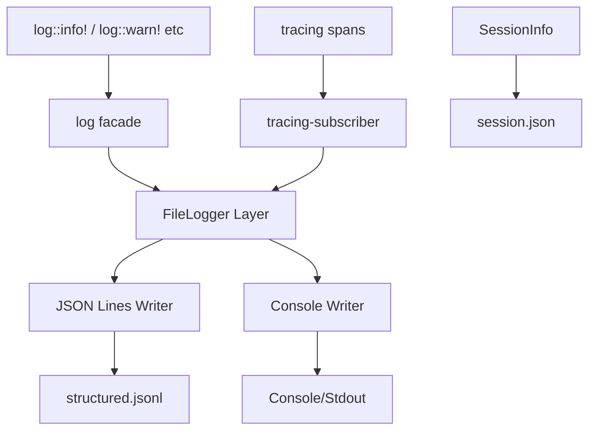

# Logging System Architecture

## Overview

This document describes the architecture for a queryable file-based logging system for the Rose Online game client. The system is designed to capture all game logs in a structured format that is easy for LLMs to search and analyze.

## Current State Analysis

### Existing Logging Infrastructure

The codebase currently uses:

- **`log` crate (0.4.14)**: The standard Rust logging facade
- **`tracing-subscriber` (0.3)**: Already in dependencies with `fmt` feature
- **Bevy 0.16.1 `bevy_log` feature**: Provides integration with the logging system

### Current Logging Patterns

The codebase uses consistent tagging patterns:

```rust
log::info!("[ZONE LOADER] Loading zone {}...", zone_id);
log::warn!("[VFS] File not found: {}", path);
log::error!("[MEMORY] Failed to allocate: {}", error);
```

Common tag prefixes include:
- `[ZONE LOADER]` - Zone loading operations
- `[VFS]` - Virtual filesystem operations
- `[MEMORY]` - Memory tracking
- `[SPAWN ZONE]` - Zone spawning
- `[BIRD]`, `[FISH]` - Entity systems
- `[UI LOGIN]` - UI systems

## Proposed Architecture

### Design Goals

1. **Timestamped Sessions**: Each client run creates a uniquely named log folder
2. **Structured Format**: JSON Lines format for easy parsing and querying
3. **Dual Output**: Both console and file output simultaneously
4. **LLM-Friendly**: Structured metadata that LLMs can easily search
5. **Performance**: Minimal impact on game performance
6. **Backward Compatible**: Works with existing `log::info!` macros

### File/Folder Structure

```
logs/
├── 2026-03-02_11-24-10/          # Session folder (client start time)
│   ├── session.json              # Session metadata
│   ├── game.log                  # Human-readable log (optional)
│   └── structured.jsonl          # JSON Lines format (primary)
├── 2026-03-02_14-30-45/
│   ├── session.json
│   ├── game.log
│   └── structured.jsonl
└── latest -> 2026-03-02_14-30-45/  # Symlink to latest session (optional)
```

### Folder Naming Convention

- **Format**: `YYYY-MM-DD_HH-MM-SS`
- **Timezone**: Local time (user's timezone)
- **Example**: `2026-03-02_11-24-10`

### Session Metadata File

`session.json`:
```json
{
  "session_id": "2026-03-02_11-24-10",
  "start_time_utc": "2026-03-02T17:24:10.980Z",
  "start_time_local": "2026-03-02T11:24:10.980-06:00",
  "hostname": "GAMING-PC",
  "command_line": "rose-offline-client.exe --zone 1",
  "mode": "ZoneViewer",
  "bevy_version": "0.16.1",
  "rust_version": "1.76.0",
  "os": "Windows 11",
  "config": {
    "zone_id": 1,
    "data_version": "irose"
  }
}
```

### Log Format Specification

#### JSON Lines Format (Primary)

`structured.jsonl` - Each line is a valid JSON object:

```json
{"ts":"2026-03-02T11:24:11.123456-06:00","level":"INFO","target":"rose_offline_client::zone_loader","tag":"ZONE LOADER","msg":"Loading zone 1...","span":null,"kvs":{"zone_id":1}}
{"ts":"2026-03-02T11:24:11.456789-06:00","level":"WARN","target":"rose_offline_client::vfs","tag":"VFS","msg":"File not found: 3DDATA/MODELS/TEST.ZMS","span":null,"kvs":{"path":"3DDATA/MODELS/TEST.ZMS"}}
{"ts":"2026-03-02T11:24:12.001234-06:00","level":"ERROR","target":"rose_offline_client::memory","tag":"MEMORY","msg":"Failed to allocate buffer","span":{"name":"spawn_zone","zone_id":1},"kvs":{"size":1048576}}
```

#### Field Definitions

| Field | Type | Description | Example |
|-------|------|-------------|---------|
| `ts` | string | ISO 8601 timestamp with timezone | `2026-03-02T11:24:11.123456-06:00` |
| `level` | string | Log level | `TRACE`, `DEBUG`, `INFO`, `WARN`, `ERROR` |
| `target` | string | Rust module path | `rose_offline_client::zone_loader` |
| `tag` | string|null | Extracted tag from message | `ZONE LOADER` |
| `msg` | string | Human-readable message | `Loading zone 1...` |
| `span` | object|null | Tracing span info | `{"name":"spawn_zone","zone_id":1}` |
| `kvs` | object | Additional key-value pairs | `{"zone_id":1,"duration_ms":150}` |

#### Human-Readable Format (Optional)

`game.log` - Traditional text format for quick viewing:

```
2026-03-02 11:24:11.123 INFO [ZONE LOADER] Loading zone 1...
2026-03-02 11:24:11.456 WARN [VFS] File not found: 3DDATA/MODELS/TEST.ZMS
2026-03-02 11:24:12.001 ERROR [MEMORY] Failed to allocate buffer (size=1048576)
```

### Implementation Components



### Integration with Bevy 0.16.1

Bevy 0.16.1 uses the `bevy_log` feature which integrates with `tracing`. The implementation should:

1. **Initialize Early**: Set up logging before Bevy's DefaultPlugins
2. **Use tracing-subscriber**: Leverage existing dependency
3. **Layered Architecture**: Stack multiple formatters

```rust
// Pseudo-code for initialization
fn init_logging(config: &LoggingConfig) -> Result<PathBuf, anyhow::Error> {
    let session_dir = create_session_directory()?;
    write_session_metadata(&session_dir, config)?;
    
    let file = OpenOptions::new()
        .create(true)
        .append(true)
        .open(session_dir.join("structured.jsonl"))?;
    
    let json_layer = tracing_subscriber::fmt::layer()
        .json()
        .with_writer(file)
        .with_current_span(true);
    
    let console_layer = tracing_subscriber::fmt::layer()
        .with_target(true)
        .with_thread_ids(false);
    
    tracing_subscriber::registry()
        .with(json_layer)
        .with(console_layer)
        .init();
    
    Ok(session_dir)
}
```

### Tag Extraction

The system should automatically extract tags from log messages:

```rust
fn extract_tag(message: &str) -> Option<&str> {
    // Pattern: [TAG NAME] rest of message
    if message.starts_with('[') {
        let end = message.find(']')?;
        Some(&message[1..end])
    } else {
        None
    }
}
```

### Log Levels

| Level | Usage | Retained by Default |
|-------|-------|---------------------|
| TRACE | Detailed execution flow | No (performance impact) |
| DEBUG | Diagnostic information | Yes |
| INFO | General operational info | Yes |
| WARN | Potential issues | Yes |
| ERROR | Failures requiring attention | Yes |

### Configuration

Add to `config.toml`:

```toml
[logging]
# Enable file-based logging
enabled = true

# Directory to store log folders
log_directory = "logs"

# Retain console output alongside file logging
console_output = true

# Minimum level to log
level = "debug"

# Also write human-readable log file
write_human_readable = false

# Maximum log file size before rotation (MB)
max_file_size_mb = 100

# Number of old sessions to retain
max_sessions = 10
```

### Rust Dependencies

Add to `Cargo.toml`:

```toml
[dependencies]
# Already present
tracing-subscriber = { version = "0.3", features = ["fmt", "json"] }

# Additional features needed
tracing = "0.1"
tracing-appender = "0.2"  # For non-blocking file writes
serde_json = "1.0"         # For JSON formatting
```

## Querying Logs

### Command Line Queries

Using `jq` (JSON query tool):

```bash
# All errors in the latest session
jq 'select(.level == "ERROR")' logs/latest/structured.jsonl

# All zone loader messages
jq 'select(.tag == "ZONE LOADER")' logs/latest/structured.jsonl

# Messages containing specific text
jq 'select(.msg | contains("zone 1"))' logs/latest/structured.jsonl

# Count messages by level
jq -r '.level' logs/latest/structured.jsonl | sort | uniq -c

# Extract all unique tags
jq -r '.tag' logs/latest/structured.jsonl | sort | uniq
```

### PowerShell Queries

```powershell
# All errors
Get-Content logs\latest\structured.jsonl | ConvertFrom-Json | Where-Object { $_.level -eq "ERROR" }

# All zone loader messages
Get-Content logs\latest\structured.jsonl | ConvertFrom-Json | Where-Object { $_.tag -eq "ZONE LOADER" }

# Search for text in messages
Get-Content logs\latest\structured.jsonl | ConvertFrom-Json | Where-Object { $_.msg -like "*zone 1*" }
```

### LLM-Friendly Queries

For LLM analysis, the JSON Lines format is ideal because:

1. **Line-delimited**: Each line is a complete JSON object
2. **Structured fields**: Easy to filter by level, tag, timestamp
3. **Preserved context**: Spans and key-value pairs maintained
4. **Concatenatable**: Multiple files can be combined for analysis

Example prompt for LLM:

```
Analyze the following log file and identify:
1. All ERROR level messages and their causes
2. The sequence of zone loading operations
3. Any performance warnings or memory issues

[Contents of structured.jsonl]
```

## Implementation Plan

### Phase 1: Core Infrastructure

1. Create `src/logging/` module
2. Implement session directory creation
3. Implement JSON Lines writer layer
4. Integrate with Bevy initialization

### Phase 2: Configuration

1. Add logging config to `Config` struct
2. Implement config file parsing
3. Add command-line overrides

### Phase 3: Refinement

1. Implement log rotation
2. Add session cleanup (old session removal)
3. Add human-readable format option
4. Performance testing

### Phase 4: Query Tools (Optional)

1. Create `filter_logs.ps1` enhancements
2. Add log analysis utilities
3. Create log summary generation

## File Structure After Implementation

```
src/
├── logging/
│   ├── mod.rs              # Module exports
│   ├── session.rs          # Session directory management
│   ├── json_formatter.rs   # JSON Lines formatter
│   ├── config.rs           # Logging configuration
│   └── cleanup.rs          # Old session cleanup
├── main.rs                 # Logging initialization
└── lib.rs                  # Existing code (no changes needed)
```

## Performance Considerations

### Non-Blocking Writes

Use `tracing-appender` for non-blocking file writes:

```rust
let (non_blocking, _guard) = tracing_appender::non_blocking(file);
```

### Buffering

The `tracing-subscriber` handles buffering internally. For high-volume logging:

- Consider `json` format without pretty-printing
- Use `with_ansi(false)` to disable color codes in files
- Consider `with_thread_ids(false)` to reduce output size

### Memory Impact

- JSON Lines format is streamed, not buffered in memory
- Each log entry is written immediately
- Maximum memory impact: ~1KB per active span

## Migration Path

### No Code Changes Required

Existing logging statements continue to work:

```rust
// These continue to work unchanged
log::info!("[ZONE LOADER] Loading zone {}", zone_id);
log::warn!("[VFS] File not found: {}", path);
```

### Optional Enhancements

For more structured logging, use tracing macros:

```rust
use tracing::{info_span, info};

let _span = info_span!("spawn_zone", zone_id = zone_id.get()).entered();
info!("Zone spawning started");
// ... zone spawning code ...
info!("Zone spawning completed");
```

## Summary

This logging system architecture provides:

1. **Timestamped sessions** for easy identification
2. **JSON Lines format** for LLM-friendly querying
3. **Zero code changes** for existing log statements
4. **Minimal performance impact** through non-blocking writes
5. **Flexible configuration** via config.toml
6. **Backward compatibility** with existing `log` crate usage

The implementation integrates seamlessly with Bevy 0.16.1's `bevy_log` feature and leverages the existing `tracing-subscriber` dependency.
