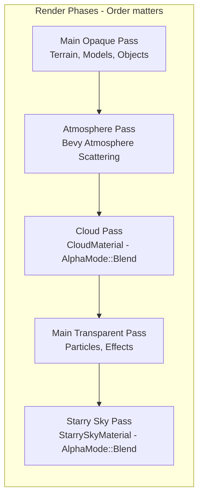

# Procedural Cloud System Architecture

## Overview

This document describes the architecture for a procedural cloud system that integrates with the existing sky rendering infrastructure in the ROSE Offline Client. The system will render realistic, animated clouds using noise-based shaders that respond to time-of-day lighting.

## Design Goals

1. **Procedural Generation**: Use Perlin/Simplex noise for natural-looking cloud patterns
2. **Live Settings**: All cloud parameters adjustable in real-time via settings UI
3. **Time Integration**: Clouds respond to time-of-day for realistic lighting
4. **Performance**: Efficient shader-based rendering with configurable quality
5. **Compatibility**: Works alongside existing starry sky and atmosphere systems

---

## File Structure

```
src/
├── render/
│   ├── cloud_material.rs          # Cloud material definition and plugin
│   ├── shaders/
│   │   └── cloud.wgsl             # Cloud shader with noise functions
│   └── mod.rs                     # Updated to export cloud module
│
├── components/
│   └── cloud.rs                   # Cloud component marker (optional)
│
├── resources/
│   └── cloud_settings.rs          # CloudSettings resource (optional separate file)
│
└── ui/
    └── ui_settings_system.rs      # Updated with Clouds settings tab
```

---

## Component Architecture

### CloudSettings Resource

```rust
// In src/render/cloud_material.rs or src/resources/cloud_settings.rs

/// Resource for cloud settings that can be modified at runtime.
/// These control the appearance and behavior of procedural clouds.
#[derive(Resource, Clone, Debug)]
pub struct CloudSettings {
    // === Enable/Disable ===
    /// Master toggle for cloud rendering
    pub enabled: bool,
    
    // === Cloud Coverage ===
    /// Cloud density/coverage (0.0 = clear sky, 1.0 = overcast)
    /// Controls the threshold for cloud formation in noise function
    pub density: f32,
    
    /// Cloud coverage multiplier (affects horizontal extent)
    /// Higher values create more widespread cloud layers
    pub coverage: f32,
    
    // === Animation ===
    /// Wind speed - controls how fast clouds move (units per second)
    pub speed: f32,
    
    /// Wind direction in radians (0 = +X, PI/2 = +Z)
    pub wind_direction: f32,
    
    /// Vertical wind speed for cloud development/anvil formation
    pub vertical_speed: f32,
    
    // === Appearance ===
    /// Cloud brightness multiplier (0.0 = dark, 1.0 = normal, 2.0 = bright)
    pub brightness: f32,
    
    /// Cloud opacity/alpha (0.0 = invisible, 1.0 = solid)
    pub opacity: f32,
    
    /// Cloud softness/feathering at edges (0.0 = hard, 1.0 = soft)
    pub softness: f32,
    
    // === Geometry ===
    /// Cloud layer altitude (world units from ground)
    pub altitude: f32,
    
    /// Cloud layer thickness (vertical extent)
    pub thickness: f32,
    
    /// Cloud plane radius (horizontal extent from camera)
    pub radius: f32,
    
    // === Quality ===
    /// Number of noise octaves (1-6, higher = more detail but slower)
    pub noise_octaves: u32,
    
    /// Noise scale multiplier (higher = smaller cloud features)
    pub noise_scale: f32,
    
    // === Time-of-Day Response ===
    /// How much clouds respond to time-of-day lighting (0.0 = static, 1.0 = full response)
    pub tod_response: f32,
}

impl Default for CloudSettings {
    fn default() -> Self {
        Self {
            // Master toggle
            enabled: true,
            
            // Coverage - moderate clouds by default
            density: 0.5,
            coverage: 0.6,
            
            // Animation - gentle wind
            speed: 5.0,
            wind_direction: 0.0,  // +X direction
            vertical_speed: 0.5,
            
            // Appearance - natural look
            brightness: 1.0,
            opacity: 0.8,
            softness: 0.3,
            
            // Geometry - high cloud layer
            altitude: 400.0,
            thickness: 100.0,
            radius: 50000.0,  // Match starry sky sphere radius
            
            // Quality - balanced
            noise_octaves: 4,
            noise_scale: 1.0,
            
            // Time-of-day
            tod_response: 1.0,
        }
    }
}
```

### CloudMaterial Definition

```rust
// In src/render/cloud_material.rs

use bevy::{
    asset::{load_internal_asset, weak_handle, Handle},
    math::Vec3,
    pbr::{Material, MaterialPlugin, MaterialPipeline, MaterialPipelineKey, MeshPipelineKey},
    prelude::*,
    reflect::TypePath,
    render::{
        alpha::AlphaMode,
        mesh::MeshVertexBufferLayoutRef,
        render_resource::*,
    },
};

/// Shader handle for the cloud shader
pub const CLOUD_SHADER_HANDLE: Handle<Shader> =
    weak_handle!("a1b2c3d4-e5f6-7890-abcd-ef1234567890");

/// Plugin that registers the cloud material
pub struct CloudMaterialPlugin;

impl Plugin for CloudMaterialPlugin {
    fn build(&self, app: &mut App) {
        log::info!("[CLOUD PLUGIN] Registering CloudMaterial");
        
        load_internal_asset!(
            app,
            CLOUD_SHADER_HANDLE,
            "shaders/cloud.wgsl",
            Shader::from_wgsl
        );
        
        app.add_plugins(MaterialPlugin::<CloudMaterial> {
            prepass_enabled: false,
            shadows_enabled: false,
            ..Default::default()
        });
        
        app.init_resource::<CloudSettings>();
        
        // Add cloud update systems
        app.add_systems(Update, (
            update_cloud_material_system,
            update_cloud_lighting_system,
        ).chain());
        
        log::info!("[CLOUD PLUGIN] CloudMaterial registered");
    }
}

/// Custom material for procedural cloud rendering
#[derive(Asset, TypePath, AsBindGroup, Clone, Debug)]
pub struct CloudMaterial {
    // === Time and Animation ===
    #[uniform(0)]
    pub time: f32,
    
    #[uniform(1)]
    pub speed: f32,
    
    #[uniform(2)]
    pub wind_direction: Vec3,  // Normalized wind direction
    
    // === Cloud Shape ===
    #[uniform(3)]
    pub density: f32,
    
    #[uniform(4)]
    pub coverage: f32,
    
    #[uniform(5)]
    pub noise_scale: f32,
    
    #[uniform(6)]
    pub noise_octaves: f32,  // Passed as f32 for shader compatibility
    
    // === Appearance ===
    #[uniform(7)]
    pub brightness: f32,
    
    #[uniform(8)]
    pub opacity: f32,
    
    #[uniform(9)]
    pub softness: f32,
    
    // === Lighting ===
    #[uniform(10)]
    pub sun_direction: Vec3,
    
    #[uniform(11)]
    pub sun_color: Vec3,
    
    #[uniform(12)]
    pub ambient_color: Vec3,
    
    #[uniform(13)]
    pub tod_factor: f32,  // Time-of-day factor (0=night, 1=day)
}

impl Default for CloudMaterial {
    fn default() -> Self {
        Self {
            time: 0.0,
            speed: 5.0,
            wind_direction: Vec3::X,
            density: 0.5,
            coverage: 0.6,
            noise_scale: 1.0,
            noise_octaves: 4.0,
            brightness: 1.0,
            opacity: 0.8,
            softness: 0.3,
            sun_direction: Vec3::new(0.5, 0.8, 0.3).normalize(),
            sun_color: Vec3::new(1.0, 0.95, 0.9),
            ambient_color: Vec3::new(0.4, 0.45, 0.5),
            tod_factor: 1.0,
        }
    }
}

impl Material for CloudMaterial {
    fn vertex_shader() -> ShaderRef {
        CLOUD_SHADER_HANDLE.into()
    }

    fn fragment_shader() -> ShaderRef {
        CLOUD_SHADER_HANDLE.into()
    }

    fn alpha_mode(&self) -> AlphaMode {
        AlphaMode::Blend  // Standard alpha blending for clouds
    }

    fn depth_bias(&self) -> f32 {
        0.5  // Slight bias to render behind close objects but in front of sky
    }

    fn specialize(
        _pipeline: &MaterialPipeline<Self>,
        descriptor: &mut RenderPipelineDescriptor,
        layout: &MeshVertexBufferLayoutRef,
        _key: MaterialPipelineKey<Self>,
    ) -> Result<(), SpecializedMeshPipelineError> {
        // Set up vertex buffer layout
        let vertex_layout = layout.0.get_layout(&[
            Mesh::ATTRIBUTE_POSITION.at_shader_location(0),
        ])?;
        descriptor.vertex.buffers = vec![vertex_layout];

        // Disable backface culling - camera can be under or above cloud layer
        descriptor.primitive.cull_mode = None;

        // Configure alpha blending for soft clouds
        if let Some(fragment) = descriptor.fragment.as_mut() {
            for color_target_state in fragment.targets.iter_mut().filter_map(|x| x.as_mut()) {
                color_target_state.blend = Some(BlendState {
                    color: BlendComponent {
                        src_factor: BlendFactor::SrcAlpha,
                        dst_factor: BlendFactor::OneMinusSrcAlpha,
                        operation: BlendOperation::Add,
                    },
                    alpha: BlendComponent {
                        src_factor: BlendFactor::One,
                        dst_factor: BlendFactor::OneMinusSrcAlpha,
                        operation: BlendOperation::Add,
                    },
                });
            }
        }

        // Depth settings - render clouds where no opaque objects block
        if let Some(depth_stencil) = descriptor.depth_stencil.as_mut() {
            depth_stencil.depth_write_enabled = false;
            depth_stencil.depth_compare = CompareFunction::GreaterEqual;
        }

        Ok(())
    }
}

/// Component marker for the cloud plane entity
#[derive(Component, Default)]
pub struct CloudLayer;

/// System to update cloud material from settings
fn update_cloud_material_system(
    time: Res<Time>,
    cloud_settings: Res<CloudSettings>,
    mut materials: ResMut<Assets<CloudMaterial>>,
    query: Query<&MeshMaterial3d<CloudMaterial>, With<CloudLayer>>,
) {
    if !cloud_settings.enabled {
        return;
    }
    
    for material_handle in query.iter() {
        if let Some(material) = materials.get_mut(&material_handle.0) {
            // Update time
            material.time = time.elapsed_secs();
            
            // Update from settings
            material.speed = cloud_settings.speed;
            material.density = cloud_settings.density;
            material.coverage = cloud_settings.coverage;
            material.noise_scale = cloud_settings.noise_scale;
            material.noise_octaves = cloud_settings.noise_octaves as f32;
            material.brightness = cloud_settings.brightness;
            material.opacity = cloud_settings.opacity;
            material.softness = cloud_settings.softness;
            
            // Calculate wind direction vector
            let wind_rad = cloud_settings.wind_direction;
            material.wind_direction = Vec3::new(
                wind_rad.cos(),
                cloud_settings.vertical_speed / cloud_settings.speed.max(0.1),
                wind_rad.sin(),
            ).normalize();
        }
    }
}

/// System to update cloud lighting based on time of day
fn update_cloud_lighting_system(
    zone_time: Option<Res<crate::resources::ZoneTime>>,
    zone_lighting: Res<crate::render::ZoneLighting>,
    cloud_settings: Res<CloudSettings>,
    mut materials: ResMut<Assets<CloudMaterial>>,
    query: Query<&MeshMaterial3d<CloudMaterial>, With<CloudLayer>>,
) {
    let Some(zone_time) = zone_time else {
        return;
    };
    
    if !cloud_settings.enabled || cloud_settings.tod_response <= 0.0 {
        return;
    }
    
    // Calculate sun direction and color based on time of day
    let (sun_direction, sun_color, ambient_color, tod_factor) = 
        calculate_cloud_lighting(&zone_time, &zone_lighting);
    
    for material_handle in query.iter() {
        if let Some(material) = materials.get_mut(&material_handle.0) {
            material.sun_direction = sun_direction;
            material.sun_color = sun_color * cloud_settings.tod_response;
            material.ambient_color = ambient_color;
            material.tod_factor = tod_factor;
        }
    }
}

/// Calculate cloud lighting parameters based on time of day
fn calculate_cloud_lighting(
    zone_time: &crate::resources::ZoneTime,
    zone_lighting: &crate::render::ZoneLighting,
) -> (Vec3, Vec3, Vec3, f32) {
    use crate::resources::ZoneTimeState;
    
    // Sun direction varies with time of day
    // Morning: East (low angle), Noon: Up, Evening: West (low angle), Night: Below horizon
    let time_of_day = match zone_time.state {
        ZoneTimeState::Morning => {
            // Sun rises in the east, moves upward
            let t = zone_time.state_percent_complete;
            0.0 + t * 0.5  // 0.0 to 0.5 (sunrise to noon approach)
        }
        ZoneTimeState::Day => {
            // Sun at highest point, slowly descending
            let t = zone_time.state_percent_complete;
            0.5 + t * 0.25  // 0.5 to 0.75 (noon to afternoon)
        }
        ZoneTimeState::Evening => {
            // Sun sets in the west
            let t = zone_time.state_percent_complete;
            0.75 + t * 0.25  // 0.75 to 1.0 (sunset)
        }
        ZoneTimeState::Night => {
            // Sun below horizon
            0.0
        }
    };
    
    // Calculate sun direction from time
    let sun_angle = time_of_day * std::f32::consts::PI;
    let sun_direction = Vec3::new(
        -sun_angle.cos(),  // X: east-west
        sun_angle.sin(),   // Y: up-down
        0.3,               // Z: slight northward tilt
    ).normalize();
    
    // Sun color varies with time of day
    let sun_color = match zone_time.state {
        ZoneTimeState::Morning => {
            // Warm orange/pink sunrise
            let t = zone_time.state_percent_complete;
            Vec3::new(1.0, 0.7 + t * 0.2, 0.5 + t * 0.4)  // Orange -> whiter
        }
        ZoneTimeState::Day => {
            // Bright white/yellow daylight
            Vec3::new(1.0, 0.98, 0.95)
        }
        ZoneTimeState::Evening => {
            // Warm orange/red sunset
            let t = zone_time.state_percent_complete;
            Vec3::new(1.0, 0.9 - t * 0.4, 0.8 - t * 0.5)  // White -> orange/red
        }
        ZoneTimeState::Night => {
            // Dim moonlight
            Vec3::new(0.2, 0.25, 0.4)
        }
    };
    
    // Ambient color from zone lighting
    let ambient_color = zone_lighting.map_ambient_color;
    
    // Time-of-day factor for cloud visibility
    let tod_factor = match zone_time.state {
        ZoneTimeState::Morning => 0.5 + zone_time.state_percent_complete * 0.5,
        ZoneTimeState::Day => 1.0,
        ZoneTimeState::Evening => 1.0 - zone_time.state_percent_complete * 0.5,
        ZoneTimeState::Night => 0.3,  // Clouds still slightly visible at night
    };
    
    (sun_direction, sun_color, ambient_color, tod_factor)
}

/// Create a cloud plane mesh
pub fn create_cloud_plane_mesh(meshes: &mut ResMut<Assets<Mesh>>) -> Handle<Mesh> {
    // Create a large flat plane for the cloud layer
    // Using a subdivided plane for better vertex distribution
    use bevy::math::primitives::Plane3d;
    
    let plane = Plane3d::new(Vec3::Y, Vec2::splat(50000.0));
    let mesh = Mesh::from(plane);
    
    meshes.add(mesh)
}
```

---

## Shader Architecture

### cloud.wgsl Shader

```wgsl
// In src/render/shaders/cloud.wgsl

//! Procedural Cloud Shader for Bevy 0.16
//!
//! Renders realistic clouds using:
//! - Fractional Brownian Motion (fBm) noise
//! - Multiple noise octaves for detail
//! - Time-based animation
//! - Time-of-day lighting integration

#import bevy_pbr::mesh_functions::{get_world_from_local, mesh_position_local_to_world, mesh_position_local_to_clip}
#import bevy_pbr::mesh_view_bindings view

// === Uniforms ===
// Time and Animation
@group(2) @binding(0) var<uniform> time: f32;
@group(2) @binding(1) var<uniform> speed: f32;
@group(2) @binding(2) var<uniform> wind_direction: vec3<f32>;

// Cloud Shape
@group(2) @binding(3) var<uniform> density: f32;
@group(2) @binding(4) var<uniform> coverage: f32;
@group(2) @binding(5) var<uniform> noise_scale: f32;
@group(2) @binding(6) var<uniform> noise_octaves: f32;

// Appearance
@group(2) @binding(7) var<uniform> brightness: f32;
@group(2) @binding(8) var<uniform> opacity: f32;
@group(2) @binding(9) var<uniform> softness: f32;

// Lighting
@group(2) @binding(10) var<uniform> sun_direction: vec3<f32>;
@group(2) @binding(11) var<uniform> sun_color: vec3<f32>;
@group(2) @binding(12) var<uniform> ambient_color: vec3<f32>;
@group(2) @binding(13) var<uniform> tod_factor: f32;

struct Vertex {
    @builtin(instance_index) instance_index: u32,
    @location(0) position: vec3<f32>,
}

struct VertexOutput {
    @builtin(position) clip_position: vec4<f32>,
    @location(0) world_position: vec3<f32>,
    @location(1) view_direction: vec3<f32>,
}

// === Noise Functions ===

/// Hash function for procedural noise
fn hash(p: vec3<f32>) -> f32 {
    var p3 = fract(p * 0.1031);
    p3 += dot(p3, p3.zyx + 31.32);
    return fract((p3.x + p3.y) * p3.z);
}

/// 3D hash returning vec3
fn hash3(p: vec3<f32>) -> vec3<f32> {
    return vec3<f32>(
        hash(p),
        hash(p + vec3<f32>(31.123, 17.456, 23.789)),
        hash(p + vec3<f32>(47.321, 13.654, 29.987)),
    );
}

/// Smooth interpolation (quintic)
fn quintic(t: f32) -> f32 {
    return t * t * t * (t * (t * 6.0 - 15.0) + 10.0);
}

/// Perlin-like gradient noise
fn gradient_noise(p: vec3<f32>) -> f32 {
    let i = floor(p);
    let f = fract(p);
    let u = quintic(f);
    
    // Sample gradients at cube corners
    let g000 = normalize(hash3(i + vec3<f32>(0.0, 0.0, 0.0)) * 2.0 - 1.0);
    let g100 = normalize(hash3(i + vec3<f32>(1.0, 0.0, 0.0)) * 2.0 - 1.0);
    let g010 = normalize(hash3(i + vec3<f32>(0.0, 1.0, 0.0)) * 2.0 - 1.0);
    let g110 = normalize(hash3(i + vec3<f32>(1.0, 1.0, 0.0)) * 2.0 - 1.0);
    let g001 = normalize(hash3(i + vec3<f32>(0.0, 0.0, 1.0)) * 2.0 - 1.0);
    let g101 = normalize(hash3(i + vec3<f32>(1.0, 0.0, 1.0)) * 2.0 - 1.0);
    let g011 = normalize(hash3(i + vec3<f32>(0.0, 1.0, 1.0)) * 2.0 - 1.0);
    let g111 = normalize(hash3(i + vec3<f32>(1.0, 1.0, 1.0)) * 2.0 - 1.0);
    
    // Calculate dot products
    let d000 = dot(g000, f - vec3<f32>(0.0, 0.0, 0.0));
    let d100 = dot(g100, f - vec3<f32>(1.0, 0.0, 0.0));
    let d010 = dot(g010, f - vec3<f32>(0.0, 1.0, 0.0));
    let d110 = dot(g110, f - vec3<f32>(1.0, 1.0, 0.0));
    let d001 = dot(g001, f - vec3<f32>(0.0, 0.0, 1.0));
    let d101 = dot(g101, f - vec3<f32>(1.0, 0.0, 1.0));
    let d011 = dot(g011, f - vec3<f32>(0.0, 1.0, 1.0));
    let d111 = dot(g111, f - vec3<f32>(1.0, 1.0, 1.0));
    
    // Trilinear interpolation
    return mix(
        mix(mix(d000, d100, u.x), mix(d010, d110, u.x), u.y),
        mix(mix(d001, d101, u.x), mix(d011, d111, u.x), u.y),
        u.z
    );
}

/// Fractional Brownian Motion (fBm) for cloud detail
/// Combines multiple octaves of noise at different frequencies
fn fbm(p: vec3<f32>, octaves: f32) -> f32 {
    var value = 0.0;
    var amplitude = 0.5;
    var frequency = 1.0;
    var max_value = 0.0;
    
    let octave_count = i32(octaves + 0.5);
    
    for (var i = 0; i < octave_count; i++) {
        value += amplitude * gradient_noise(p * frequency);
        max_value += amplitude;
        frequency *= 2.0;
        amplitude *= 0.5;
    }
    
    return value / max_value;
}

/// Cloud density function
/// Returns density value (0-1) at a given position
fn cloud_density(p: vec3<f32>) -> f32 {
    // Animate position with wind
    let animated_p = p + wind_direction * time * speed;
    
    // Scale for cloud features
    let scaled_p = animated_p * noise_scale * 0.001;
    
    // Base cloud shape with fBm
    let base = fbm(scaled_p, noise_octaves);
    
    // Add larger-scale coverage variation
    let coverage_noise = fbm(scaled_p * 0.3, 2.0);
    
    // Combine for final density
    let raw_density = base * 0.6 + coverage_noise * 0.4;
    
    // Apply coverage threshold
    // coverage = 0.0 means clear sky, 1.0 means overcast
    let threshold = 1.0 - coverage;
    let cloud_value = smoothstep(threshold - 0.2, threshold + 0.2, raw_density);
    
    // Apply density multiplier
    return cloud_value * density;
}

/// Calculate cloud lighting
/// Returns (lit_color, shadow_factor)
fn cloud_lighting(
    world_pos: vec3<f32>,
    view_dir: vec3<f32>,
    cloud_dens: f32,
) -> vec3<f32> {
    // Sun lighting with directional component
    let sun_dot = max(0.0, dot(vec3<f32>(0.0, 1.0, 0.0), sun_direction));
    
    // Direct sun lighting (brighter on sun-facing side)
    let direct_light = sun_color * sun_dot * 1.5;
    
    // Ambient lighting (sky color)
    let ambient_light = ambient_color * 0.5;
    
    // Edge lighting effect (clouds glow at edges when backlit)
    let edge_factor = 1.0 - cloud_dens;
    let rim_light = sun_color * pow(edge_factor, 2.0) * max(0.0, -dot(view_dir, sun_direction)) * 0.5;
    
    // Combine lighting
    let total_light = direct_light + ambient_light + rim_light;
    
    // Apply brightness multiplier
    return total_light * brightness;
}

// === Vertex Shader ===
@vertex
fn vertex(vertex: Vertex) -> VertexOutput {
    var out: VertexOutput;
    
    let world_from_local = get_world_from_local(vertex.instance_index);
    let world_position = mesh_position_local_to_world(world_from_local, vec4<f32>(vertex.position, 1.0));
    
    out.clip_position = mesh_position_local_to_clip(world_from_local, vec4<f32>(vertex.position, 1.0));
    out.world_position = world_position.xyz;
    
    // View direction from camera
    let camera_pos = view.world_from_camera[3].xyz;
    out.view_direction = normalize(world_position.xyz - camera_pos);
    
    return out;
}

// === Fragment Shader ===
@fragment
fn fragment(in: VertexOutput) -> @location(0) vec4<f32> {
    // Get cloud density at this position
    let cloud_dens = cloud_density(in.world_position);
    
    // Discard if no cloud
    if (cloud_dens < 0.01) {
        return vec4<f32>(0.0, 0.0, 0.0, 0.0);
    }
    
    // Apply softness (feathering at edges)
    let soft_dens = cloud_dens * (1.0 - softness * 0.5);
    
    // Calculate lighting
    let cloud_color = cloud_lighting(in.world_position, in.view_direction, cloud_dens);
    
    // Apply time-of-day factor
    let final_color = cloud_color * tod_factor;
    
    // Final alpha with opacity multiplier
    let alpha = soft_dens * opacity * tod_factor;
    
    return vec4<f32>(final_color, alpha);
}
```

---

## Integration Points

### 1. Module Registration (src/render/mod.rs)

```rust
// Add to existing mod.rs

// Procedural cloud material
pub mod cloud_material;
pub use cloud_material::{
    CloudMaterial, CloudMaterialPlugin, CloudSettings, CloudLayer,
    create_cloud_plane_mesh,
};
```

### 2. Plugin Registration (src/lib.rs)

```rust
// In the main plugin setup, add CloudMaterialPlugin

app.add_plugins(CloudMaterialPlugin);
```

### 3. Cloud Spawning System

```rust
// System to spawn cloud layer when entering a zone

pub fn spawn_cloud_layer(
    mut commands: Commands,
    mut meshes: ResMut<Assets<Mesh>>,
    mut materials: ResMut<Assets<CloudMaterial>>,
    cloud_settings: Res<CloudSettings>,
    existing_clouds: Query<Entity, With<CloudLayer>>,
) {
    // Despawn existing cloud layer
    for entity in existing_clouds.iter() {
        commands.entity(entity).despawn();
    }
    
    if !cloud_settings.enabled {
        return;
    }
    
    // Create cloud material
    let cloud_material = CloudMaterial::default();
    let material_handle = materials.add(cloud_material);
    
    // Create cloud plane mesh
    let mesh_handle = create_cloud_plane_mesh(&mut meshes);
    
    // Spawn cloud layer entity
    commands.spawn((
        Mesh3d(mesh_handle),
        MeshMaterial3d(material_handle),
        Transform::from_xyz(0.0, cloud_settings.altitude, 0.0),
        CloudLayer,
        Name::new("CloudLayer"),
    ));
    
    log::info!("[CLOUD] Spawned cloud layer at altitude {}", cloud_settings.altitude);
}
```

### 4. Time-of-Day Integration

The cloud system integrates with the existing time system through:

1. **ZoneTime Resource**: Clouds read the current time state (Morning/Day/Evening/Night)
2. **ZoneLighting Resource**: Clouds use ambient colors from zone lighting
3. **update_cloud_lighting_system**: Automatically adjusts sun direction and color

### 5. Atmosphere Integration

Clouds should render:
- **After** atmosphere (which draws between opaque and transparent passes)
- **Before** starry sky (which uses AlphaMode::Add)
- With **depth testing** to not render where opaque objects exist

---

## UI Settings Integration

### Settings Page Addition (src/ui/ui_settings_system.rs)

```rust
// Add to SettingsPage enum
enum SettingsPage {
    // ... existing pages ...
    Clouds,  // Add new page
}

// Add to SettingsSystemParams
pub struct SettingsSystemParams<'w, 's> {
    // ... existing params ...
    pub cloud_settings: ResMut<'w, CloudSettings>,  // Add
}

// Add to tab selection UI
ui.selectable_value(
    &mut ui_state_settings.page,
    SettingsPage::Clouds,
    "Clouds",
);

// Add settings panel
SettingsPage::Clouds => {
    egui::Grid::new("cloud_settings")
        .num_columns(2)
        .show(ui, |ui| {
            // Enable/Disable
            ui.label("Clouds:");
            ui.checkbox(&mut cloud_settings.enabled, "Enabled");
            ui.end_row();
            
            ui.separator();
            ui.end_row();
            
            // Coverage
            ui.label("Density:");
            ui.add(
                egui::Slider::new(&mut cloud_settings.density, 0.0..=1.0)
                    .show_value(true),
            );
            ui.end_row();
            
            ui.label("Coverage:");
            ui.add(
                egui::Slider::new(&mut cloud_settings.coverage, 0.0..=1.0)
                    .show_value(true),
            );
            ui.end_row();
            
            ui.separator();
            ui.end_row();
            
            // Animation
            ui.label("Wind Speed:");
            ui.add(
                egui::Slider::new(&mut cloud_settings.speed, 0.0..=50.0)
                    .text("units/s")
                    .show_value(true),
            );
            ui.end_row();
            
            ui.label("Wind Direction:");
            ui.add(
                egui::Slider::new(&mut cloud_settings.wind_direction, 0.0..=6.28318)
                    .text("rad")
                    .show_value(true),
            );
            ui.end_row();
            
            ui.separator();
            ui.end_row();
            
            // Appearance
            ui.label("Brightness:");
            ui.add(
                egui::Slider::new(&mut cloud_settings.brightness, 0.0..=2.0)
                    .show_value(true),
            );
            ui.end_row();
            
            ui.label("Opacity:");
            ui.add(
                egui::Slider::new(&mut cloud_settings.opacity, 0.0..=1.0)
                    .show_value(true),
            );
            ui.end_row();
            
            ui.label("Softness:");
            ui.add(
                egui::Slider::new(&mut cloud_settings.softness, 0.0..=1.0)
                    .show_value(true),
            );
            ui.end_row();
            
            ui.separator();
            ui.end_row();
            
            // Geometry
            ui.label("Altitude:");
            ui.add(
                egui::Slider::new(&mut cloud_settings.altitude, 100.0..=2000.0)
                    .text("m")
                    .show_value(true),
            );
            ui.end_row();
            
            ui.label("Thickness:");
            ui.add(
                egui::Slider::new(&mut cloud_settings.thickness, 10.0..=500.0)
                    .text("m")
                    .show_value(true),
            );
            ui.end_row();
            
            ui.separator();
            ui.end_row();
            
            // Quality
            ui.label("Noise Octaves:");
            ui.add(
                egui::Slider::new(&mut cloud_settings.noise_octaves, 1..=6)
                    .show_value(true),
            );
            ui.end_row();
            
            ui.label("Noise Scale:");
            ui.add(
                egui::Slider::new(&mut cloud_settings.noise_scale, 0.1..=3.0)
                    .show_value(true),
            );
            ui.end_row();
            
            ui.separator();
            ui.end_row();
            
            // Time-of-Day
            ui.label("TOD Response:");
            ui.add(
                egui::Slider::new(&mut cloud_settings.tod_response, 0.0..=1.0)
                    .show_value(true),
            );
            ui.end_row();
        });
    
    ui.separator();
    ui.label("Tip: Lower density = scattered clouds, higher = overcast.");
    ui.label("Wind direction: 0 = East, 1.57 = North, 3.14 = West, 4.71 = South.");
}
```

---

## Render Order Diagram



---

## Performance Considerations

### Quality vs Performance Trade-offs

| Setting | Low Quality | Medium Quality | High Quality |
|---------|-------------|----------------|--------------|
| `noise_octaves` | 2 | 4 | 6 |
| `noise_scale` | 0.5 | 1.0 | 2.0 |
| `coverage` | 0.3 | 0.6 | 0.8 |

### Optimization Strategies

1. **Early Exit**: Shader discards pixels with no cloud density
2. **LOD Potential**: Could reduce octaves for distant clouds
3. **Culling**: Cloud plane uses frustum culling
4. **Resolution**: Cloud plane can have lower subdivision

---

## Implementation Checklist

### Phase 1: Core Material
- [ ] Create `src/render/cloud_material.rs` with CloudMaterial and CloudSettings
- [ ] Create `src/render/shaders/cloud.wgsl` with noise functions
- [ ] Register CloudMaterialPlugin in render module

### Phase 2: Integration
- [ ] Add cloud spawning system
- [ ] Integrate with ZoneTime for lighting
- [ ] Test render order with atmosphere and stars

### Phase 3: UI
- [ ] Add Clouds tab to settings UI
- [ ] Add all cloud parameters to UI
- [ ] Test live parameter updates

### Phase 4: Polish
- [ ] Tune default values for visual quality
- [ ] Add performance presets (Low/Medium/High)
- [ ] Document cloud settings in UI tooltips

---

## Future Enhancements

1. **Volumetric Clouds**: True 3D raymarching through cloud volume
2. **Cloud Shadows**: Project shadows onto terrain
3. **Weather System**: Integration with season/weather for dynamic clouds
4. **Cloud Types**: Cumulus, stratus, cirrus with different noise patterns
5. **Precipitation**: Rain/snow from thick cloud layers
