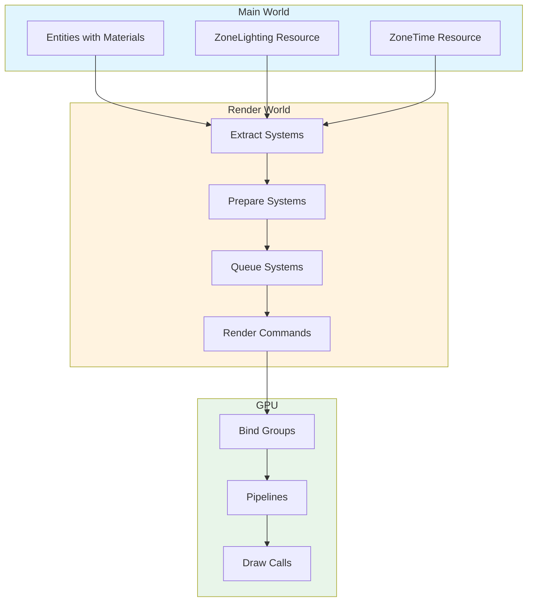

# Custom Render Pipelines and Materials Documentation

> **Version**: Bevy 0.13.2 | **Project**: Rose Online Client  
> **Purpose**: Expert-level guide for developers working with the custom render system

---

## Table of Contents

1. [Introduction and Overview](#1-introduction-and-overview)
2. [Core Architecture Concepts](#2-core-architecture-concepts)
3. [Detailed Material Documentation](#3-detailed-material-documentation)
4. [Pipeline Infrastructure](#4-pipeline-infrastructure)
5. [Specialized Systems](#5-specialized-systems)
6. [Shader Guide](#6-shader-guide)
7. [Adding New Materials](#7-adding-new-materials)
8. [Performance Considerations](#8-performance-considerations)

---

## 1. Introduction and Overview

### What the Render System Does

The Rose Online client's render system is a sophisticated custom rendering layer built on top of Bevy 0.13.2's rendering infrastructure. It provides:

- **Zone-aware rendering** with dynamic lighting and fog
- **Custom material pipelines** for game-specific visual requirements
- **GPU-driven particle systems** for high-performance effects
- **Time-of-day blending** for immersive environments
- **Texture array support** for efficient terrain and water rendering

### Why Custom Pipelines Are Needed

Bevy 0.13's standard `MaterialPlugin` has limitations that necessitate custom implementations:

1. **Texture Array Limitations**: Bevy 0.13's `AsBindGroup` derive macro doesn't properly support binding arrays (texture arrays), which are essential for terrain tiles and animated water
2. **Push Constants**: Some materials need push constants for per-frame data (water animation, sky time-of-day)
3. **Custom Vertex Attributes**: Terrain uses a custom `TERRAIN_MESH_ATTRIBUTE_TILE_INFO` attribute for tile indexing
4. **Incremental Extraction**: The game requires efficient extraction patterns to handle large zone data
5. **Zone Lighting Integration**: All materials must share a unified lighting/fog system

### High-Level Architecture



---

## 2. Core Architecture Concepts

### 2.1 The Three-Tier Material Pattern System

The render module uses three distinct patterns based on material complexity:

#### Pattern A: Simple Bevy Material (SkyMaterial)

Uses Bevy's standard `MaterialPlugin` with the `AsBindGroup` derive macro.

**When to use**: Simple materials with standard textures, no texture arrays, minimal custom logic.

```rust
#[derive(Asset, Debug, Clone, TypePath, AsBindGroup)]
pub struct SkyMaterial {
    #[texture(0)]
    #[sampler(1)]
    pub texture_day: Option<Handle<Image>>,
    // ...
}

impl Material for SkyMaterial {
    fn vertex_shader() -> ShaderRef { /* ... */ }
    fn fragment_shader() -> ShaderRef { /* ... */ }
}
```

**Key characteristics**:
- Uses `MaterialPlugin<SkyMaterial>`
- Push constants for time-of-day blending
- Automatic bind group management by Bevy

#### Pattern B: Custom Mesh Materials with Manual Bind Groups

Used by: `ObjectMaterial`, `TerrainMaterial`, `WaterMaterial`, `EffectMeshMaterial`

**When to use**: Materials requiring texture arrays, custom bind group layouts, or complex pipeline specialization.

**Why manual bind groups**: Bevy 0.13's `AsBindGroup` trait doesn't support texture arrays (`binding_array<texture_2d<f32>>`) which are required for:
- Terrain tile textures (up to 100 different tiles)
- Animated water textures (25 frames)

```rust
// Manual bind group layout creation
fn init_material_bind_group_layout(
    mut layout: ResMut<MaterialBindGroupLayout>,
    render_device: Res<RenderDevice>,
) {
    let bind_group_layout = render_device.create_bind_group_layout(
        "material_bind_group_layout",
        &[
            BindGroupLayoutEntry {
                binding: 0,
                visibility: ShaderStages::FRAGMENT,
                ty: BindingType::Texture {
                    sample_type: TextureSampleType::Float { filterable: true },
                    view_dimension: TextureViewDimension::D2,
                    multisampled: false,
                },
                count: NonZeroU32::new(TERRAIN_MATERIAL_MAX_TEXTURES as u32), // TEXTURE ARRAY!
            },
            // ...
        ],
    );
}
```

#### Pattern C: GPU-Driven Particle Materials

Used by: `ParticleMaterial`, `DamageDigitMaterial`

**When to use**: Thousands of instances that need to be rendered efficiently without individual entity overhead.

**Key characteristics**:
- Uses storage buffers for per-instance data (position, color, size, UVs)
- Single draw call for thousands of particles
- Custom vertex shader generates quads from point data
- No mesh data needed - purely GPU-driven

```rust
// Storage buffer layout in shader
@group(1) @binding(0)
var<storage, read> positions: PositionBuffer;
@group(1) @binding(1)
var<storage, read> sizes: SizeBuffer;
// ...
```

### 2.2 Bind Group Conventions

The system follows a strict bind group numbering convention:

| Group | Purpose | Bevy Standard | Custom Materials |
|-------|---------|---------------|------------------|
| 0 | View (camera, projection) | Yes | Yes |
| 1 | Mesh (transforms, skinning) | Yes | Yes |
| 2 | Material-specific | Yes | Yes (or see below) |
| 3 | Zone Lighting | No | Yes |

**Special case for SkyMaterial**: Uses Group 2 for material, Group 3 is unused (SkyMaterial uses push constants instead of zone lighting)

**Zone Lighting Bind Group Layout**:

```rust
// Group 3, Binding 0
struct ZoneLighting {
    map_ambient_color: vec4<f32>,
    character_ambient_color: vec4<f32>,
    character_diffuse_color: vec4<f32>,
    light_direction: vec4<f32>,
    fog_color: vec4<f32>,
    fog_density: f32,
    fog_min_density: f32,
    fog_max_density: f32,
    // ... height fog, time of day
}
```

### 2.3 Pipeline Specialization System

The `CustomMeshPipelineKey` struct provides pipeline specialization for different mesh configurations:

```rust
#[derive(Clone, Copy, PartialEq, Eq, Hash, Debug)]
pub struct CustomMeshPipelineKey {
    pub skinned: bool,              // Requires joint/weight attributes
    pub vertex_uvs_lightmap: bool,  // Requires UV_1 attribute
    pub alpha_mode: HashableAlphaMode, // Opaque, Mask, Blend, etc.
    pub two_sided: bool,            // Face culling
}
```

**Why specialization matters**: Each combination creates a unique pipeline, ensuring optimal vertex attribute layout and shader compilation.

### 2.4 Incremental Extraction Pattern

All Pattern B materials use incremental extraction for performance:

```rust
fn extract_materials(
    mut render_materials: ResMut<RenderMaterials>,
    main_materials: Extract<Res<Assets<Material>>>,
    mut last_count: Local<usize>,
) {
    let current_count = main_materials.len();
    
    // Skip if nothing changed
    if current_count == *last_count && current_count > 0 {
        return;
    }
    
    *last_count = current_count;
    // ... update only changed materials
}
```

**Benefits**:
- Avoids cloning materials every frame
- Reduces CPU overhead in render world
- Only processes changes

### 2.5 Zone Lighting System

The `ZoneLighting` resource provides unified lighting and fog:

```rust
#[derive(Resource, Reflect)]
pub struct ZoneLighting {
    // Lighting
    pub map_ambient_color: Vec3,
    pub character_ambient_color: Vec3,
    pub character_diffuse_color: Vec3,
    pub light_direction: Vec3,
    
    // Fog
    pub color_fog_enabled: bool,
    pub fog_color: Vec3,
    pub fog_density: f32,
    pub fog_min_density: f32,
    pub fog_max_density: f32,
    
    // Height-based fog
    pub fog_min_height: f32,
    pub fog_max_height: f32,
    pub fog_height_density: f32,
    
    // Time of day
    pub time_of_day: f32,
    pub day_color: Vec3,
    pub night_color: Vec3,
}
```

**Shader usage**:

```wgsl
#import rose_client::zone_lighting apply_zone_lighting

@fragment
fn fragment(in: FragmentInput) -> @location(0) vec4<f32> {
    var color = textureSample(base_texture, base_sampler, in.uv);
    return apply_zone_lighting(in.world_position, in.world_normal, color, view_z);
}
```

---

## 3. Detailed Material Documentation

### 3.1 ObjectMaterial

**Purpose**: Renders static and skinned meshes (characters, NPCs, objects, items)

**Use Cases**:
- Character models (skinned)
- NPCs and monsters
- Item drops
- Static world objects

**Key Structures**:

```rust
pub struct ObjectMaterial {
    pub base_texture: Option<Handle<Image>>,
    pub lightmap_texture: Option<Handle<Image>>,
    pub specular_texture: Option<Handle<Image>>,
    pub alpha_mode: AlphaMode,
    pub alpha_cutoff: f32,
    pub alpha_value: Option<f32>,
    pub lightmap_uv_offset: Vec2,
    pub lightmap_uv_scale: f32,
    pub glow: Option<ObjectMaterialGlow>,
    pub blend: Option<ObjectMaterialBlend>,
    pub two_sided: bool,
    pub clip_face: Option<ObjectMaterialClipFace>,
}

pub enum ObjectMaterialGlow {
    Simple,
    LightmapColor { color: Vec3 },
    LightmapAlpha { value: f32 },
}

pub enum ObjectMaterialBlend {
    None,
    Add,
}
```

**Bind Group Layout (Group 2)**:

| Binding | Type | Purpose |
|---------|------|---------|
| 0 | Uniform | `StaticMeshMaterialData` (flags, alpha, lightmap UVs) |
| 1 | Texture 2D | Base color texture |
| 2 | Sampler | Base texture sampler |
| 3 | Texture 2D | Lightmap texture |
| 4 | Sampler | Lightmap sampler |
| 5 | Texture 2D | Specular texture |
| 6 | Sampler | Specular sampler |

**Shader**: [`object_material.wgsl`](src/render/shaders/object_material.wgsl)

**Key Techniques**:
- Skinning support via `SKINNED` shader def
- Lightmap UV animation for effects
- Specular highlights
- Alpha masking and blending

**Usage Example**:

```rust
// Create material
let material = ObjectMaterial {
    base_texture: Some(texture_handle),
    alpha_mode: AlphaMode::Blend,
    two_sided: true,
    ..Default::default()
};

let material_handle = asset_server.add(material);

// Spawn entity
commands.spawn((
    Mesh3d(mesh_handle),
    MeshMaterial3d(material_handle),
));
```

### 3.2 TerrainMaterial

**Purpose**: Renders zone terrain with tile-based texturing

**Use Cases**:
- Zone ground tiles
- Terrain with multiple texture types

**Key Structures**:

```rust
pub struct TerrainMaterial {
    pub tile_textures: Vec<Handle<Image>>,  // Up to 100 textures
    pub detail_texture: Option<Handle<Image>>,
}

pub const TERRAIN_MATERIAL_MAX_TEXTURES: usize = 100;

pub const TERRAIN_MESH_ATTRIBUTE_TILE_INFO: MeshVertexAttribute =
    MeshVertexAttribute::new("Vertex_TileInfo", 3855645392, VertexFormat::Uint32);
```

**Bind Group Layout (Group 2)**:

| Binding | Type | Purpose |
|---------|------|---------|
| 0 | Texture Array | Tile textures (binding_array) |
| 1 | Sampler | Shared sampler for tiles |
| 2 | Texture 2D | Detail texture |
| 3 | Sampler | Detail sampler |

**Shader**: [`terrain_material.wgsl`](src/render/shaders/terrain_material.wgsl)

**Key Techniques**:
- `binding_array<texture_2d<f32>>` for tile textures
- Tile index encoded in vertex attribute
- Alpha tile support (bit flag in tile_info)
- Detail texture overlay

**Vertex Attribute Usage**:

```wgsl
@location(4) tile_info: u32,

fn get_tile_index(tile_info: u32) -> u32 {
    return tile_info & 0xFFu;  // Lower 8 bits
}

fn is_alpha_tile(tile_info: u32) -> bool {
    return (tile_info & 0x80000000u) != 0u;  // Alpha flag
}
```

### 3.3 WaterMaterial

**Purpose**: Renders animated water surfaces

**Use Cases**:
- Lakes and rivers
- Ocean surfaces
- Animated water effects

**Key Structures**:

```rust
pub struct WaterMaterial {
    pub water_textures: Vec<Handle<Image>>,  // 25 frames
    pub animation_frame: f32,  // Current frame index
}

pub const WATER_MATERIAL_NUM_TEXTURES: usize = 25;

// Push constant data
pub struct WaterTextureIndex {
    pub current_index: i32,
    pub next_index: i32,
    pub next_weight: f32,
}
```

**Bind Group Layout (Group 2)**:

| Binding | Type | Purpose |
|---------|------|---------|
| 0 | Texture Array | Water animation frames |
| 1 | Sampler | Water sampler (repeat mode) |

**Push Constants**: Frame interpolation data

**Shader**: [`water_material.wgsl`](src/render/shaders/water_material.wgsl)

**Key Techniques**:
- Texture animation via push constants
- Frame interpolation for smooth animation
- Fresnel effect for water edges
- Specular highlights
- Depth-based color variation

**Push Constant Usage**:

```wgsl
struct WaterTextureIndex {
    current_index: i32,
    next_index: i32,
    next_weight: f32,
};
var<push_constant> water_texture_index: WaterTextureIndex;

// Sample and interpolate
let color1 = textureSample(water_array_texture[water_texture_index.current_index], ...);
let color2 = textureSample(water_array_texture[water_texture_index.next_index], ...);
var water_color = mix(color1, color2, water_texture_index.next_weight);
```

### 3.4 SkyMaterial

**Purpose**: Renders the skybox with day/night blending

**Pattern**: Pattern A (Simple Bevy Material)

**Key Structures**:

```rust
#[derive(Asset, Debug, Clone, TypePath, AsBindGroup)]
pub struct SkyMaterial {
    #[texture(0)]
    #[sampler(1)]
    pub texture_day: Option<Handle<Image>>,

    #[texture(2)]
    #[sampler(3)]
    pub texture_night: Option<Handle<Image>>,
}
```

**Push Constants**: `ZoneTimePushConstant` for day/night blend weight

**Shader**: [`sky_material.wgsl`](src/render/shaders/sky_material.wgsl)

**Key Techniques**:
- Skybox rendering with untranslated view matrix
- `clip_position = pos.xyww` for infinite depth
- Day/night texture blending via push constant

**Special Pipeline Configuration**:

```rust
fn specialize(...) -> Result<(), SpecializedMeshPipelineError> {
    // Sky always passes depth test, never writes depth
    descriptor.depth_stencil.as_mut().unwrap().depth_write_enabled = false;
    descriptor.depth_stencil.as_mut().unwrap().depth_compare = CompareFunction::Always;
    
    // Push constant for time of day
    descriptor.push_constant_ranges.push(PushConstantRange {
        stages: ShaderStages::FRAGMENT,
        range: 0..4,
    });
    
    Ok(())
}
```

### 3.5 EffectMeshMaterial

**Purpose**: Renders effect meshes with vertex animation support

**Use Cases**:
- Skill effects
- Spell animations
- Animated visual effects

**Key Structures**:

```rust
pub struct EffectMeshMaterial {
    pub base_texture: Option<Handle<Image>>,
    pub alpha_mode: AlphaMode,
    pub alpha_cutoff: f32,
    pub alpha_value: Option<f32>,
    pub lightmap_texture: Option<Handle<Image>>,
    pub lightmap_uv_offset: Vec2,
    pub lightmap_uv_scale: f32,
    pub two_sided: bool,
}

// Animation state passed via component
#[derive(Component)]
pub struct EffectMeshAnimationRenderState {
    pub flags: u32,           // Which attributes to animate
    pub current_next_frame: u32,  // Packed frame indices
    pub next_weight: f32,     // Interpolation weight
    pub alpha: f32,           // Per-instance alpha
}

bitflags! {
    pub struct EffectMeshAnimationFlags: u32 {
        const ANIMATE_POSITION = 1 << 0;
        const ANIMATE_NORMALS  = 1 << 1;
        const ANIMATE_UV       = 1 << 2;
        const ANIMATE_ALPHA    = 1 << 3;
    }
}
```

**Shader**: [`effect_mesh_material.wgsl`](src/render/shaders/effect_mesh_material.wgsl)

**Key Techniques**:
- Per-instance animation state
- Vertex attribute animation
- Alpha animation for fade effects

### 3.6 ParticleMaterial (GPU-Driven)

**Purpose**: High-performance particle rendering

**Pattern**: Pattern C (GPU-Driven)

**Key Structures**:

```rust
#[derive(Debug, Clone, TypePath, Asset)]
pub struct ParticleMaterial {
    pub texture: Handle<Image>,
}

pub struct GpuParticleMaterial {
    pub texture: Handle<Image>,
}
```

**Storage Buffers (Group 1)**:

| Binding | Buffer | Content |
|---------|--------|---------|
| 0 | Storage | Position (xyz) + Rotation (w) |
| 1 | Storage | Size (xy) |
| 2 | Storage | Color (rgba) |
| 3 | Storage | UV coordinates (x, y, z, w) |

**Shader**: [`particle.wgsl`](src/render/shaders/particle.wgsl)

**Key Techniques**:
- Billboard rendering (Y-axis or full)
- GPU vertex generation (6 vertices per particle)
- Rotation support
- Custom blend modes via pipeline key

**Pipeline Key Flags**:

```rust
bitflags! {
    pub struct ParticlePipelineKey: u32 {
        const HDR = 1 << 1;
        // Blend operation encoded in bits
        // Source blend factor encoded in bits
        // Destination blend factor encoded in bits
        // Billboard type encoded in bits
    }
}
```

**Billboard Types**:

```wgsl
#ifdef PARTICLE_BILLBOARD_Y_AXIS
  // Y-axis aligned billboards (face camera on Y plane)
  let camera_right = normalize(vec3<f32>(view.view_proj.x.x, 0.0, view.view_proj.z.x));
  let camera_up = vec3<f32>(0.0, 1.0, 0.0);
#else
#ifdef PARTICLE_BILLBOARD_FULL
  // Full billboards (always face camera)
  let camera_right = normalize(vec3<f32>(view.view_proj.x.x, view.view_proj.y.x, view.view_proj.z.x));
  let camera_up = normalize(vec3<f32>(view.view_proj.x.y, view.view_proj.y.y, view.view_proj.z.y));
#endif
#endif
```

### 3.7 DamageDigitMaterial (GPU-Driven)

**Purpose**: Renders floating damage numbers

**Pattern**: Pattern C (GPU-Driven)

**Key Structures**:

```rust
#[derive(Debug, Clone, TypePath, Asset)]
pub struct DamageDigitMaterial {
    pub texture: Handle<Image>,  // Digit atlas
}

pub struct GpuDamageDigitMaterial {
    pub texture: Handle<Image>,
}
```

**Storage Buffers (Group 1)**:

| Binding | Buffer | Content |
|---------|--------|---------|
| 0 | Storage | Position (xyzw) |
| 1 | Storage | Size (xy) |
| 2 | Storage | UV coordinates (atlas region) |

**Shader**: [`damage_digit.wgsl`](src/render/shaders/damage_digit.wgsl)

**Key Techniques**:
- Texture atlas for digits 0-9
- Per-digit UV mapping
- Billboard rendering

---

## 4. Pipeline Infrastructure

### 4.1 CustomMeshPipelineKey

Provides specialization for mesh materials:

```rust
#[derive(Clone, Copy, PartialEq, Eq, Hash, Debug)]
pub struct CustomMeshPipelineKey {
    pub skinned: bool,
    pub vertex_uvs_lightmap: bool,
    pub alpha_mode: HashableAlphaMode,
    pub two_sided: bool,
}

impl CustomMeshPipelineKey {
    pub fn new() -> Self { /* ... */ }
    pub fn with_skinned(self, skinned: bool) -> Self { /* ... */ }
    pub fn with_vertex_uvs_lightmap(self, has_lightmap: bool) -> Self { /* ... */ }
    pub fn with_alpha_mode(self, alpha_mode: AlphaMode) -> Self { /* ... */ }
    pub fn with_two_sided(self, two_sided: bool) -> Self { /* ... */ }
}
```

### 4.2 MeshVertexLayoutBuilder

Builds vertex layouts based on pipeline key:

```rust
pub struct MeshVertexLayoutBuilder;

impl MeshVertexLayoutBuilder {
    pub fn build_vertex_attributes(key: &CustomMeshPipelineKey) 
        -> Vec<(MeshVertexAttribute, u32)> { /* ... */ }
    
    pub fn get_layout(layout: &MeshVertexBufferLayout, attributes: &[(MeshVertexAttribute, u32)])
        -> Result<VertexBufferLayout, MissingVertexAttributeError> { /* ... */ }
}
```

**Attribute Layout**:

| Location | Attribute | Condition |
|----------|-----------|-----------|
| 0 | Position | Always |
| 1 | Normal | Always |
| 2 | UV_0 | Always |
| 3 | UV_1 (lightmap) | `vertex_uvs_lightmap` |
| 4 | Joint Indices | `skinned` |
| 5 | Joint Weights | `skinned` |

### 4.3 PipelineDescriptorBuilder

Helper for standard pipeline configurations:

```rust
pub struct PipelineDescriptorBuilder;

impl PipelineDescriptorBuilder {
    // Depth/stencil states
    pub fn opaque_depth_stencil() -> DepthStencilState { /* ... */ }
    pub fn depth_stencil(depth_write: bool, compare: CompareFunction) -> DepthStencilState { /* ... */ }
    
    // Blend states
    pub fn alpha_blend_state() -> BlendState { /* ... */ }
    pub fn blend_state_from_alpha_mode(alpha_mode: AlphaMode) -> Option<BlendState> { /* ... */ }
    
    // Primitive states
    pub fn primitive_state(two_sided: bool) -> PrimitiveState { /* ... */ }
}
```

### 4.4 HashableAlphaMode

Wrapper for Bevy's `AlphaMode` to enable Hash:

```rust
#[derive(Clone, Copy, PartialEq, Eq, Debug)]
pub struct HashableAlphaMode(pub AlphaMode);

impl Hash for HashableAlphaMode {
    fn hash<H: Hasher>(&self, state: &mut H) {
        match self.0 {
            AlphaMode::Opaque => 0u8.hash(state),
            AlphaMode::Mask(cutoff) => { 1u8.hash(state); cutoff.to_bits().hash(state); }
            AlphaMode::Blend => 2u8.hash(state),
            // ...
        }
    }
}
```

---

## 5. Specialized Systems

### 5.1 Trail Effect Rendering

**Purpose**: Renders weapon trails and motion trails

**Component**: `TrailEffect`

```rust
#[derive(Component)]
pub struct TrailEffect {
    pub colour: Color,
    pub duration: f32,           // How long trails persist
    pub start_offset: Vec3,      // Offset from entity center
    pub end_offset: Vec3,
    pub trail_texture: Handle<Image>,
    pub distance_per_point: f32, // Sampling density
}
```

**Algorithm**:
1. Sample positions each frame
2. Build Catmull-Rom spline from history
3. Generate ribbon geometry (quads between start/end points)
4. Fade based on age

**Shader**: [`trail_effect.wgsl`](src/render/shaders/trail_effect.wgsl)

### 5.2 World UI Rendering

**Purpose**: Renders UI elements in world space (name tags, markers)

**Component**: `WorldUiRect`

```rust
#[derive(Component, Clone)]
pub struct WorldUiRect {
    pub image: Handle<Image>,
    pub screen_offset: Vec2,  // Offset from world position in screen space
    pub screen_size: Vec2,
    pub uv_min: Vec2,
    pub uv_max: Vec2,
    pub color: Color,
    pub order: u8,  // Sorting order
}
```

**Key Features**:
- Screen-space sizing (always same size regardless of distance)
- World-space positioning
- Sorting by `order` field

**Shader**: [`world_ui.wgsl`](src/render/shaders/world_ui.wgsl)

### 5.3 Post-Processing

**Status**: Currently disabled (`// mod post_processing;`)

**Module**: `post_processing.rs`

**Purpose** (when enabled): Full-screen effects like bloom, color grading

**Shader**: [`post_processing.wgsl`](src/render/shaders/post_processing.wgsl)

---

## 6. Shader Guide

### 6.1 Common Patterns Across Shaders

#### Vertex Shader Structure

```wgsl
struct Vertex {
    @location(0) position: vec3<f32>,
    @location(1) normal: vec3<f32>,
    @location(2) uv: vec2<f32>,
    @builtin(instance_index) instance_index: u32,
};

struct VertexOutput {
    @builtin(position) clip_position: vec4<f32>,
    @location(0) world_position: vec4<f32>,
    @location(1) world_normal: vec3<f32>,
    @location(2) uv: vec2<f32>,
};

@vertex
fn vertex(vertex: Vertex) -> VertexOutput {
    var out: VertexOutput;
    let model = get_model_matrix(vertex.instance_index);
    out.world_position = mesh_position_local_to_world(model, vec4<f32>(vertex.position, 1.0));
    out.clip_position = view.view_proj * out.world_position;
    out.world_normal = mesh_normal_local_to_world(vertex.normal, vertex.instance_index);
    out.uv = vertex.uv;
    return out;
}
```

#### Fragment Shader Structure

```wgsl
struct FragmentInput {
    @builtin(position) frag_coord: vec4<f32>,
    @location(0) world_position: vec4<f32>,
    @location(1) world_normal: vec3<f32>,
    @location(2) uv: vec2<f32>,
};

@fragment
fn fragment(in: FragmentInput) -> @location(0) vec4<f32> {
    // Calculate view depth for fog
    let view_z = dot(vec4<f32>(
        view.inverse_view[0].z,
        view.inverse_view[1].z,
        view.inverse_view[2].z,
        view.inverse_view[3].z
    ), in.world_position);
    
    // Sample texture
    var color = textureSample(base_texture, base_sampler, in.uv);
    
    // Apply lighting/fog
    return apply_zone_lighting(in.world_position, in.world_normal, color, view_z);
}
```

### 6.2 Uniform Passing Methods

#### Method 1: Standard Uniform Buffer (Group 2)

Used by: ObjectMaterial, EffectMeshMaterial

```wgsl
@group(2) @binding(0)
var<uniform> material: MaterialUniform;

struct MaterialUniform {
    flags: u32,
    alpha_cutoff: f32,
    // ...
};
```

**Rust side**:

```rust
#[derive(ShaderType)]
struct MaterialUniform {
    flags: u32,
    alpha_cutoff: f32,
    // ...
}

// Create uniform buffer
let uniform_buffer = render_device.create_buffer_with_data(&BufferInitDescriptor {
    label: Some("material_uniform"),
    contents: &bytemuck::cast_slice(&[uniform]),
    usage: BufferUsages::UNIFORM | BufferUsages::COPY_DST,
});
```

#### Method 2: Push Constants

Used by: SkyMaterial, WaterMaterial

```wgsl
struct PushConstantData {
    value: f32,
};
var<push_constant> push_constants: PushConstantData;
```

**Rust side**:

```rust
// In pipeline specialization
descriptor.push_constant_ranges.push(PushConstantRange {
    stages: ShaderStages::FRAGMENT,
    range: 0..4,  // Size in bytes
});

// In render command
pass.set_push_constants(ShaderStages::FRAGMENT, offset, &data.to_le_bytes());
```

**Advantages**: Very fast, no buffer management  
**Limitations**: Small size (128 bytes typical), no persistent storage

#### Method 3: Storage Buffers

Used by: ParticleMaterial, DamageDigitMaterial

```wgsl
@group(1) @binding(0)
var<storage, read> positions: PositionBuffer;

struct PositionBuffer {
    data: array<vec4<f32>>,
};
```

**Rust side**:

```rust
let buffer = render_device.create_buffer_with_data(&BufferInitDescriptor {
    label: Some("particle_positions"),
    contents: bytemuck::cast_slice(&positions),
    usage: BufferUsages::STORAGE | BufferUsages::COPY_DST,
});
```

**Advantages**: Large capacity, per-instance data  
**Use case**: GPU-driven rendering

#### Method 4: Bindless Texture Arrays

Used by: TerrainMaterial, WaterMaterial

```wgsl
@group(2) @binding(0)
var tile_array_texture: binding_array<texture_2d<f32>>;

// Index dynamically
let color = textureSample(tile_array_texture[tile_index], sampler, uv);
```

**Requirements**:
- GPU must support `TEXTURE_BINDING_ARRAY` feature
- Bind group layout must use `count: NonZeroU32::new(N)`

### 6.3 Lighting Models

#### Zone Lighting (Map Objects)

```wgsl
fn apply_zone_lighting(world_pos: vec4<f32>, world_normal: vec3<f32>, 
                       color: vec4<f32>, view_z: f32) -> vec4<f32> {
    // Simple ambient lighting
    let lit_color = vec4<f32>(color.rgb * zone_lighting.map_ambient_color.rgb, color.a);
    return apply_zone_lighting_fog(world_pos, lit_color, view_z);
}
```

#### Character Lighting

```wgsl
#ifdef ZONE_LIGHTING_CHARACTER
    let N = normalize(world_normal);
    let L = normalize(zone_lighting.light_direction.xyz);
    let V = normalize(-world_position.xyz);
    
    // Diffuse
    let diffuse = clamp(dot(N, L), 0.0, 1.0);
    
    // Rim lighting
    let rim = pow(1.0 - saturate(dot(N, V)), 2.0) * 0.2;
    
    let light = saturate(
        zone_lighting.character_ambient_color.rgb +
        zone_lighting.character_diffuse_color.rgb * diffuse +
        zone_lighting.character_diffuse_color.rgb * rim * 0.5
    );
    let lit_color = vec4<f32>(color.rgb * light, color.a);
#endif
```

#### Unlit

For materials that don't need lighting (UI, particles):

```wgsl
// Just return the color directly
return color;
```

### 6.4 Texture Sampling Patterns

#### Standard Sample

```wgsl
let color = textureSample(base_texture, base_sampler, uv);
```

#### Array Sample

```wgsl
let color = textureSample(tile_array_texture[index], sampler, uv);
```

#### Multi-Texture Blend

```wgsl
let color1 = textureSample(texture_array[index1], sampler, uv);
let color2 = textureSample(texture_array[index2], sampler, uv);
let blended = mix(color1, color2, blend_weight);
```

---

## 7. Adding New Materials

### Step-by-Step Guide

#### Step 1: Choose Your Pattern

| Pattern | Use When |
|---------|----------|
| A (Simple) | Standard textures, no arrays, simple logic |
| B (Custom Mesh) | Texture arrays, complex vertex attributes, custom bind groups |
| C (GPU-Driven) | Thousands of instances, particle-like behavior |

#### Step 2: Create the Material Structure

```rust
// Pattern B example
#[derive(Asset, TypePath, Clone)]
pub struct MyCustomMaterial {
    pub base_texture: Option<Handle<Image>>,
    pub custom_data: Vec4,
    pub alpha_mode: AlphaMode,
}

impl Default for MyCustomMaterial {
    fn default() -> Self {
        Self {
            base_texture: None,
            custom_data: Vec4::ONE,
            alpha_mode: AlphaMode::Opaque,
        }
    }
}
```

#### Step 3: Create the Plugin

```rust
pub struct MyCustomMaterialPlugin {
    pub prepass_enabled: bool,
}

impl Plugin for MyCustomMaterialPlugin {
    fn build(&self, app: &mut App) {
        // Load shader
        load_internal_asset!(
            app,
            MY_SHADER_HANDLE.typed::<Shader>(),
            "shaders/my_material.wgsl",
            Shader::from_wgsl
        );

        // Register asset
        app.init_asset::<MyCustomMaterial>();

        // Setup render world
        if let Ok(render_app) = app.get_sub_app_mut(RenderApp) {
            render_app
                .init_resource::<RenderMyCustomMaterials>()
                .init_resource::<GpuMyCustomMaterials>()
                .init_resource::<ExtractedMyCustomMeshes>()
                .init_resource::<MyCustomMaterialPipeline>()
                .init_resource::<SpecializedMeshPipelines<MyCustomMaterialPipeline>>()
                .add_render_command::<Opaque3d, DrawMyCustomMaterial>()
                .add_systems(ExtractSchedule, extract_my_custom_materials)
                .add_systems(Render, prepare_my_custom_material_bind_groups)
                .add_systems(Render, queue_my_custom_materials.in_set(RenderSet::Queue));
        }
    }
}
```

#### Step 4: Implement Extract Systems

```rust
#[derive(Resource, Default)]
pub struct RenderMyCustomMaterials {
    pub materials: HashMap<AssetId<MyCustomMaterial>, MyCustomMaterial>,
}

fn extract_my_custom_materials(
    mut render_materials: ResMut<RenderMyCustomMaterials>,
    main_materials: Extract<Res<Assets<MyCustomMaterial>>>,
    mut last_count: Local<usize>,
) {
    let current_count = main_materials.len();
    
    if current_count == *last_count && current_count > 0 {
        return;
    }
    *last_count = current_count;

    let mut active_ids = HashSet::default();
    for (id, material) in main_materials.iter() {
        active_ids.insert(id);
        let should_update = match render_materials.materials.get(&id) {
            Some(existing) => existing != material,
            None => true,
        };
        if should_update {
            render_materials.materials.insert(id, material.clone());
        }
    }
    render_materials.materials.retain(|id, _| active_ids.contains(id));
}
```

#### Step 5: Implement Pipeline

```rust
#[derive(Resource)]
pub struct MyCustomMaterialPipeline {
    pub mesh_pipeline: MeshPipeline,
    pub material_layout: BindGroupLayout,
    pub vertex_shader: Handle<Shader>,
    pub fragment_shader: Handle<Shader>,
}

impl FromWorld for MyCustomMaterialPipeline {
    fn from_world(world: &mut World) -> Self {
        let mesh_pipeline = world.resource::<MeshPipeline>().clone();
        let render_device = world.resource::<RenderDevice>();
        
        let material_layout = render_device.create_bind_group_layout(
            "my_custom_material_layout",
            &[
                // Define your bindings here
                BindGroupLayoutEntry {
                    binding: 0,
                    visibility: ShaderStages::FRAGMENT,
                    ty: BindingType::Texture { /* ... */ },
                    count: None,
                },
                // ...
            ],
        );
        
        Self {
            mesh_pipeline,
            material_layout,
            vertex_shader: MY_SHADER_HANDLE.typed::<Shader>(),
            fragment_shader: MY_SHADER_HANDLE.typed::<Shader>(),
        }
    }
}

impl SpecializedMeshPipeline for MyCustomMaterialPipeline {
    type Key = CustomMeshPipelineKey;

    fn specialize(&self, key: Self::Key, layout: &MeshVertexBufferLayout) 
        -> Result<RenderPipelineDescriptor, SpecializedMeshPipelineError> {
        // Build vertex layout
        let attributes = MeshVertexLayoutBuilder::build_vertex_attributes(&key);
        let vertex_layout = MeshVertexLayoutBuilder::get_layout(layout, &attributes)?;
        
        // Create descriptor
        let mut descriptor = self.mesh_pipeline.specialize(key.mesh_key, layout)?;
        descriptor.vertex.shader = self.vertex_shader.clone();
        descriptor.vertex.buffers = vec![vertex_layout];
        descriptor.fragment.as_mut().unwrap().shader = self.fragment_shader.clone();
        
        // Set up bind groups
        descriptor.layout = vec![
            self.mesh_pipeline.get_view_layout(key.mesh_key.into()).clone(),
            self.mesh_pipeline.mesh_layout.clone(),
            self.material_layout.clone(),
            // Zone lighting layout (if needed)
            world.resource::<ZoneLightingUniformMeta>().bind_group_layout.clone(),
        ];
        
        Ok(descriptor)
    }
}
```

#### Step 6: Create Shader

```wgsl
#import bevy_pbr::mesh_view_bindings view
#import bevy_pbr::mesh_bindings mesh
#import bevy_pbr::mesh_functions get_model_matrix, mesh_position_local_to_world
#import rose_client::zone_lighting apply_zone_lighting

@group(2) @binding(0)
var base_texture: texture_2d<f32>;
@group(2) @binding(1)
var base_sampler: sampler;

// ... vertex and fragment shaders
```

#### Step 7: Register in mod.rs

```rust
// In src/render/mod.rs
mod my_custom_material;

pub use my_custom_material::MyCustomMaterial;
use my_custom_material::MyCustomMaterialPlugin;

// In RoseRenderPlugin::build
app.add_plugins((
    // ... other plugins
    MyCustomMaterialPlugin { prepass_enabled: false },
));
```

### Required Implementations Checklist

- [ ] Material struct with `Asset` derive
- [ ] Plugin struct implementing `Plugin`
- [ ] Shader handle constant
- [ ] Render resource for extracted materials
- [ ] Render resource for GPU bind groups
- [ ] Extract system (incremental)
- [ ] Prepare system for bind groups
- [ ] Pipeline struct with `FromWorld`
- [ ] `SpecializedMeshPipeline` implementation
- [ ] Queue system
- [ ] Render command type alias
- [ ] WGSL shader file
- [ ] Registration in `mod.rs`

---

## 8. Performance Considerations

### 8.1 Incremental Extraction Benefits

**Without incremental extraction**:
- Clone all materials every frame: O(n) per frame
- Significant CPU overhead for large zones

**With incremental extraction**:
- Only clone changed materials: O(changes) per frame
- HashMap provides O(1) lookups
- Count check avoids iteration entirely when stable

```rust
// Fast path - no work needed
if current_count == *last_count && current_count > 0 {
    return;
}
```

### 8.2 GPU-Driven Rendering Advantages

**Traditional approach**:
- One entity per particle
- CPU overhead for transform updates
- Draw call per particle (or small batches)

**GPU-driven approach**:
- Storage buffers for instance data
- Single draw call for thousands of instances
- Vertex shader generates geometry
- CPU only updates buffer data

**Performance comparison** (typical):

| Approach | Entities | Draw Calls | CPU Overhead |
|----------|----------|------------|--------------|
| Traditional | 1000 | 1000 | High |
| GPU-Driven | 1 | 1 | Minimal |

### 8.3 Pipeline Specialization Trade-offs

**Specialization benefits**:
- Optimal vertex attribute layout (no wasted bandwidth)
- Shader compiled for exact use case
- Correct blend/depth state

**Specialization costs**:
- Pipeline cache memory
- First-frame stutter from shader compilation
- More pipeline variants to manage

**Best practices**:
- Limit alpha mode combinations
- Group meshes by pipeline key
- Consider prepass trade-offs

### 8.4 Texture Array Performance

**Benefits**:
- Single draw call for varied terrain
- No texture atlas bleeding issues
- Efficient memory usage

**Requirements**:
- GPU must support `TEXTURE_BINDING_ARRAY`
- All textures must have same format/size (or use mipmapping carefully)

### 8.5 Zone Lighting Uniform

**Single uniform vs per-material**:
- One buffer update per frame
- Shared across all materials
- Consistent lighting everywhere

**Memory layout considerations**:
- Use `ShaderType` derive for proper alignment
- Bevy's `encase` handles WGSL alignment rules

---

## Appendix A: Shader File Reference

| Shader File | Purpose | Material |
|-------------|---------|----------|
| `object_material.wgsl` | Static/skinned meshes | ObjectMaterial |
| `terrain_material.wgsl` | Zone terrain | TerrainMaterial |
| `water_material.wgsl` | Animated water | WaterMaterial |
| `sky_material.wgsl` | Skybox | SkyMaterial |
| `effect_mesh_material.wgsl` | Effect animations | EffectMeshMaterial |
| `particle.wgsl` | Particle effects | ParticleMaterial |
| `damage_digit.wgsl` | Damage numbers | DamageDigitMaterial |
| `trail_effect.wgsl` | Weapon trails | TrailEffect |
| `world_ui.wgsl` | World-space UI | WorldUiRect |
| `zone_lighting.wgsl` | Lighting/fog library | Shared |
| `post_processing.wgsl` | Full-screen effects | (Disabled) |

## Appendix B: Common Pitfalls

### Pitfall 1: Shader Definition Mismatch

**Problem**: Vertex output doesn't match fragment input

**Solution**: Use consistent struct definitions, conditionally compile both:

```wgsl
#ifdef VERTEX_UVS_LIGHTMAP
    @location(3) lightmap_uv: vec2<f32>,
#endif
```

### Pitfall 2: Missing Bind Group

**Problem**: `SetZoneLightingBindGroup<3>` called but layout not included

**Solution**: Always include zone lighting layout in pipeline descriptor:

```rust
descriptor.layout = vec![
    view_layout,
    mesh_layout,
    material_layout,
    zone_lighting_layout,  // Don't forget!
];
```

### Pitfall 3: Wrong Bind Group Index

**Problem**: Using `@group(2)` when Bevy expects `@group(3)` for zone lighting

**Solution**: Check the `SetZoneLightingBindGroup<N>` generic parameter matches shader

### Pitfall 4: Pipeline Key Hash Collision

**Problem**: Different configurations hash to same value

**Solution**: Ensure all fields in `CustomMeshPipelineKey` contribute to hash

### Pitfall 5: Storage Buffer Alignment

**Problem**: Storage buffer data misaligned in shader

**Solution**: Use `bytemuck` for POD types, check WGSL alignment rules (16-byte for vec3)

---

*Documentation version: 1.0 | Last updated: Based on codebase analysis*