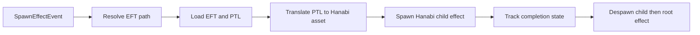

# Bevy Hanabi Effect System Integration Plan

## Document Purpose

This document defines a detailed, implementation-ready plan for migrating the **effect-system particle backend** from the current custom CPU plus storage-buffer pipeline to `bevy_hanabi` in the Bevy 0.18.1 client.

This is a **focused backend swap** for effect particles only. The rest of the game should continue operating exactly as it does now.

---

## 1. Objectives

### Primary objective
Integrate Hanabi and replace effect-system particle rendering and simulation currently driven by EFT and PTL data.

### Secondary objectives
- Preserve all current effect spawn entry paths and attach semantics.
- Preserve manual despawn behavior.
- Preserve legacy implementation in commented form at replacement points to allow quick rollback.
- Avoid behavior changes in unrelated systems.

### Explicit non-objectives for this phase
- No dirt dash migration.
- No wind flight migration.
- No blood effect migration.
- No large refactor of mesh effect rendering.
- No generalized rendering architecture rewrite.

---

## 2. Scope Definition

## In scope
1. Effect pipeline from `SpawnEffectEvent` to child particle entity creation.
2. PTL sequence interpretation for effect particles.
3. Effect lifecycle completion parity for automatic despawn.
4. Hanabi plugin and runtime wiring.
5. Safe fallback strategy using commented legacy code.

## Out of scope
1. `DirtDashPlugin` systems and components.
2. `WindEffectPlugin` systems and components.
3. Blood related plugins and systems.
4. Any non-effect rendering path such as terrain, water, sky, UI.
5. Gameplay rules, movement, combat, networking.

## Scope guardrails
- If a required change touches out-of-scope systems, stop and split the work into follow-up phases.
- Keep each migration change traceable to effect-system-only requirements.

---

## 3. Current State Deep Dive

## 3.1 Event and spawn flow
Current effect spawn flow is:
1. `SpawnEffectEvent` is emitted.
2. `spawn_effect_system` resolves file IDs or paths.
3. `spawn_effect` loads EFT and creates children:
   - Mesh children via `spawn_mesh`.
   - Particle children via `spawn_particle`.
4. Parent root receives `Effect` component.

## 3.2 Legacy effect particle backend
The current particle backend includes:
- `ParticleSequence` data model from PTL sequences.
- Per-frame CPU simulation in `particle_sequence_system`.
- GPU storage buffer syncing in `particle_storage_buffer_update_system`.
- Custom material and shader path through `ParticleMaterial`.

## 3.3 Lifecycle cleanup model
`effect_system` despawns effect roots once all relevant children complete and `manual_despawn` is false.

## 3.4 Constraints discovered
1. Existing feasibility notes mention older Bevy versions and must not be used as version authority.
2. Bevy version in this repo is 0.18 and Hanabi must match.
3. Existing path has mixed direct callers beyond event-driven paths and all need parity.

---

## 4. Target Architecture

## 4.1 High-level target
- Retain existing effect spawn API and event contracts.
- Replace particle child generation with Hanabi effect instances.
- Keep mesh effect path untouched.

## 4.2 Flow diagram

## 4.3 Runtime ownership model
- Root `Effect` entity remains authoritative.
- Hanabi particle instances become child entities under the same effect root or linked entity path as today.
- Lifecycle metadata is attached to child entities to allow deterministic cleanup.

---

## 5. Detailed Migration Phases

## Phase 0: Preflight and safety setup
1. Confirm dependency compatibility and plugin ordering requirements.
2. Add explicit migration comments in code sections that will be replaced.
3. Define a comment convention used throughout migration:
   - `LEGACY_PARTICLE_BACKEND_BEGIN`
   - `LEGACY_PARTICLE_BACKEND_END`
   - `HANABI_PARTICLE_BACKEND_BEGIN`
   - `HANABI_PARTICLE_BACKEND_END`
4. Define log prefixes for migration diagnostics:
   - `[HANABI-INTEGRATION]`
   - `[HANABI-PTL-TRANSLATOR]`
   - `[HANABI-LIFECYCLE]`

## Exit criteria
- Preflight checklist completed.
- Comment and logging conventions agreed and documented in code.

---

## Phase 1: Dependency and app wiring
1. Add `bevy_hanabi` dependency matching Bevy 0.18.
2. Register `HanabiPlugin` in app startup.
3. Keep legacy plugin types and modules in source.
4. Comment out legacy effect particle runtime systems where Hanabi supersedes them for effect particles.
5. Preserve old lines in-place as comments at exact replacement points.

## Important detail
Do not remove legacy `ParticleMaterial` and related modules yet. They remain in source for rollback and for out-of-scope systems if any still depend on them.

## Exit criteria
- App compiles with Hanabi dependency and plugin wired.
- Startup path uses Hanabi plugin without removing legacy source.

---

## Phase 2: PTL to Hanabi bridge design and implementation
1. Add a dedicated bridge module under `src` for:
   - PTL sequence translation.
   - Hanabi `EffectAsset` creation.
   - Effect asset cache keyed by PTL path plus sequence index plus relevant variation keys.
2. Add clear API entry points:
   - Build or fetch Hanabi effect asset for a PTL sequence.
   - Spawn an effect child entity using a prepared effect handle.
3. Keep translation deterministic where source data is deterministic.
4. Emit one-time warnings for unsupported PTL constructs.

## Translator design principles
- Prefer behavioral parity over visual redesign.
- Preserve random range behavior where feasible.
- Keep coordinate conversion consistent with current ROSE to Bevy mapping.
- Keep translation side-effect free and testable by pure input-output checks where possible.

## Exit criteria
- Bridge returns usable Hanabi effect handles for PTL sequences.
- Cache prevents repeated rebuilds for same PTL sequence.

---

## Phase 3: Replace effect particle spawn path
1. Keep `spawn_mesh` path unchanged.
2. Replace internals of effect particle spawn routine to use Hanabi child entity spawn.
3. Retain legacy particle spawn block in commented form directly below or above replacement path.
4. Preserve all existing spawn entry behavior:
   - InEntity path.
   - AtEntity path.
   - OnEntity with optional dummy bone link.
   - WithTransform path.

## Behavioral parity requirements
- Parent-child relationships should remain consistent.
- Transform application order should remain consistent.
- Sound and mesh effect behavior should remain unchanged.

## Exit criteria
- All effect spawn paths produce Hanabi-backed effect particles.
- Mesh effects still render as before.

---

## Phase 4: Lifecycle and despawn parity
1. Introduce Hanabi child lifecycle metadata component for deterministic completion tracking.
2. Extend `effect_system` completion checks to include Hanabi child completion.
3. Preserve existing `manual_despawn` semantics exactly.
4. Ensure non-looping effects complete and clean up root effect when expected.
5. Ensure looping or manual effects do not despawn unexpectedly.

## Completion strategy options
- Preferred: derive completion from spawner state plus known max particle lifetime buffer.
- Alternate: explicit timeout from translated PTL sequence bounds.

## Exit criteria
- Automatic and manual despawn behavior matches existing functional expectations.

---

## Phase 5: Stabilization, diagnostics, and rollback hardening
1. Add targeted logs for translation failures and fallback behavior.
2. Add concise counters for spawned Hanabi effect children.
3. Keep all replaced legacy logic present and commented.
4. Validate out-of-scope systems show no regression.
5. Add clear rollback instructions near runtime wiring changes.

## Exit criteria
- Migration path is diagnosable.
- Rollback can be done by uncommenting known blocks.

---

## 6. File-by-File Detailed Change Plan

## 6.1 `Cargo.toml`
Changes:
1. Add Hanabi dependency aligned with Bevy 0.18.
2. Keep dependency placement near other Bevy ecosystem crates for maintainability.

Validation:
- Dependency resolution succeeds.

---

## 6.2 `src/lib.rs`
Changes:
1. Register `HanabiPlugin` with app plugins.
2. Identify effect-particle specific legacy runtime wiring and comment it at the point of replacement.
3. Keep replacement comments explicit and searchable.
4. Preserve unrelated plugin ordering and system set ordering.

Validation:
- App startup remains stable.
- No unrelated plugin side effects.

---

## 6.3 `src/effect_loader.rs`
Changes:
1. Keep EFT loading and caching behavior.
2. Keep mesh spawning path unchanged.
3. Replace PTL particle child creation with bridge-driven Hanabi spawn.
4. Add migration comments around old particle path and keep it commented.
5. Attach lifecycle metadata to spawned Hanabi children.

Validation:
- Same EFT files trigger visible particle effects.
- Mesh and sound parts of effects remain functional.

---

## 6.4 `src/systems/spawn_effect_system.rs`
Changes:
1. Pass new resources required by Hanabi bridge and effect spawning.
2. Keep event handling structure unchanged.
3. Keep all event variants supported.

Validation:
- All spawn variants continue to instantiate effects.

---

## 6.5 `src/systems/effect_system.rs`
Changes:
1. Extend completion detection to account for Hanabi children.
2. Keep old checks for mesh animation completion.
3. Preserve manual despawn bypass behavior.

Validation:
- Effect root cleanup behavior is correct across one-shot and repeating cases.

---

## 6.6 `src/zone_loader.rs`, `src/model_loader.rs`, `src/systems/move_destination_effect_system.rs`
Changes:
1. Ensure direct spawn call paths provide required resources and still call the unified spawn backend.
2. Do not fork behavior by caller.

Validation:
- Effects spawned from map objects, model events, and destination effects still render.

---

## 6.7 New bridge module under `src`
Proposed responsibilities:
1. Translation API from PTL sequence to Hanabi `EffectAsset`.
2. Cache API for effect handles.
3. Lifecycle metadata calculation for cleanup support.

Validation:
- Unit-like validation for translation outputs where practical.

---

## 7. PTL to Hanabi Mapping Matrix

| PTL concept | Current backend behavior | Hanabi target | Notes |
|---|---|---|---|
| Emit rate | CPU emit counter | Spawner settings rate | Keep random range behavior where possible |
| Num loops | Sequence loop limit | Spawner cycle control | Must preserve finite vs infinite semantics |
| Particle life | Per particle life range | Lifetime attribute | Required for deterministic cleanup |
| Emit radius xyz | Random spawn in volume | Init position modifiers | Match coordinate conversion |
| Velocity xyz | Keyframed velocity and step | Init velocity plus update modifiers | Approximate step behavior with over-lifetime where needed |
| Color rgba | Keyframe fade and steps | Color over lifetime | Maintain alpha behavior |
| Size xy | Keyframe fade and steps | Size over lifetime | Preserve scale feeling |
| Rotation | Keyframe rotation step | Rotation and orient modifiers | Keep billboard intent in mind |
| Texture atlas index | Keyframe texture frame value | Hanabi atlas support | Fallback and log if sequence behavior exceeds support |
| Update coords world local | Mixed transform behavior | Simulation space and transform strategy | Validate attachments carefully |

## Mapping implementation rules
1. Prefer direct mappings first.
2. For unsupported behavior, choose safe visual fallback and emit one-time warning.
3. Document every fallback path in code comments.

---

## 8. Lifecycle and Completion Model

## Required behavior parity
1. Effects with finite particle emission should complete and despawn root when non-manual.
2. Manual effects should remain active until explicit cleanup.
3. Child completion must not race with parent transform attachment logic.

## Proposed metadata
Attach a lightweight component to Hanabi child entities with:
- `expected_end_time` or equivalent computed completion bound.
- `is_manual` copy for safety.
- `source_effect_id` for diagnostics.

## Cleanup logic additions
1. Extend existing child iteration in effect cleanup system.
2. Count Hanabi children as running until completion metadata says done.
3. Despawn root only when all eligible children are complete.

---

## 9. Validation and Verification Plan

## 9.1 Functional verification matrix
1. Spawn event variants:
   - InEntity.
   - AtEntity.
   - OnEntity.
   - WithTransform.
2. Attach semantics:
   - Root-attached.
   - Bone-attached.
3. Despawn semantics:
   - Manual false and finite effects.
   - Manual true effects.
4. Multi-source entry:
   - Zone loader effect object spawn.
   - Model-driven effect spawn.
   - Move destination effect spawn.

## 9.2 Visual parity checks
1. Position and orientation parity compared to pre-migration behavior.
2. Lifetime and fade behavior parity for representative effects.
3. Texture atlas behavior parity for animated PTL sequences.

## 9.3 Regression checks outside scope
1. Dirt dash still active and unchanged.
2. Wind flight effect still active and unchanged.
3. Blood effects unchanged.
4. UI and gameplay unaffected during effect-heavy scenes.

## 9.4 Diagnostic checks
1. Confirm translator cache hit rate increases after first spawn.
2. Confirm one-time warning behavior for unsupported PTL patterns.
3. Confirm no runaway entity growth from completed effects.

---

## 10. Risk Assessment and Mitigation

| Risk | Impact | Mitigation |
|---|---|---|
| PTL feature mismatch | Effects differ visually | Fallback mappings and one-time warnings plus mapping docs |
| Lifecycle mismatch | Effects leak or vanish early | Explicit completion metadata and cleanup tests |
| Attachment mismatch | Effects appear detached from entities | Validate transform chain in each spawn variant |
| Runtime ordering regression | Intermittent spawn failures | Keep system ordering stable and add targeted logs |
| Hidden dependency on legacy material path | Missing visuals in edge cases | Keep legacy code commented for rapid fallback |

---

## 11. Rollback Strategy

## Fast rollback switches
1. App wiring in startup where Hanabi and legacy runtime lines are adjacent.
2. Effect loader particle spawn path where Hanabi block replaces legacy block.
3. Cleanup logic extension points where Hanabi completion logic is added.

## Rollback procedure
1. Re-enable commented legacy runtime lines.
2. Re-enable legacy particle spawn block and disable Hanabi block.
3. Disable Hanabi-specific cleanup additions if needed.
4. Keep all rollback comments in place for future attempts.

---

## 12. Detailed Implementation Checklist for Code Mode

## Pre-implementation
- [ ] Confirm dependency line and plugin registration location.
- [ ] Add migration comment markers.

## Foundation
- [ ] Add `bevy_hanabi` dependency.
- [ ] Register `HanabiPlugin`.
- [ ] Comment old effect-particle runtime lines where replaced.

## Bridge
- [ ] Create translator module.
- [ ] Create cache resource.
- [ ] Implement PTL sequence mapping.
- [ ] Add warning paths for unsupported PTL features.

## Spawn path
- [ ] Replace effect particle child spawn logic with Hanabi path.
- [ ] Keep legacy block commented inline.
- [ ] Preserve mesh path unchanged.

## Lifecycle
- [ ] Add Hanabi child lifecycle metadata.
- [ ] Extend effect cleanup checks.
- [ ] Verify manual despawn parity.

## Validation
- [ ] Verify each spawn event variant.
- [ ] Verify direct spawn call sites.
- [ ] Verify out-of-scope systems unchanged.
- [ ] Verify rollback comments and switches are accurate.

---

## 13. Definition of Done

Migration is complete for this phase when all conditions are true:
1. Effect particles spawn via Hanabi across all effect-system entry points.
2. Mesh effects continue to work unchanged.
3. Effect lifecycle semantics match current expected behavior.
4. Out-of-scope systems remain unchanged.
5. Legacy backend remains available in commented form at replacement points.
6. Logs and comments make future tuning and rollback straightforward.

---

## 14. Notes for Future Phases

Not part of this implementation phase, but prepared for follow-up:
1. Migrate dirt dash to Hanabi.
2. Migrate wind flight particles to Hanabi.
3. Evaluate blood effects for Hanabi usage.
4. Remove legacy backend only after full migration and stable validation across all particle systems.
