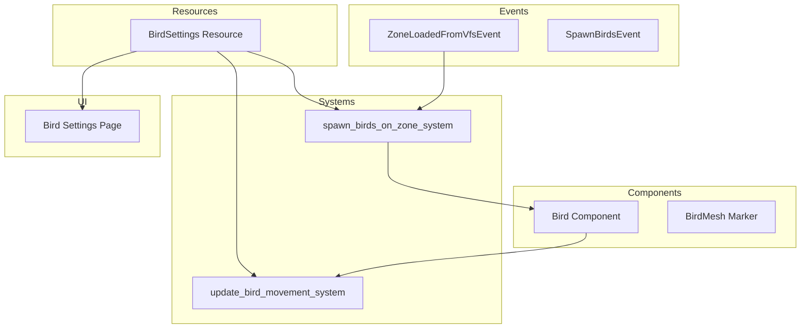

# Bird System Architecture Design

## Overview

This document describes the architecture for a bird system that adds non-interactable birds flying around the game world. The design follows existing patterns from the fish system and integrates with the existing settings UI.

## Design Goals

1. **Non-interactable**: Birds are purely visual ambiance, no collision or interaction
2. **Configurable**: UI settings panel for bird count, speed, and behavior
3. **Zone-scoped**: Birds spawn per zone and despawn when zone unloads
4. **Performance-conscious**: Simple mesh, limited count, efficient movement AI

## Architecture Diagram



## Components

### Bird Component

Location: `src/components/bird.rs`

```rust
/// Component attached to bird entities for flying behavior
#[derive(Component, Reflect, Debug, Clone)]
#[reflect(Component)]
pub struct Bird {
    /// Flying speed in units per second
    pub speed: f32,
    /// How fast the bird can turn - radians per second
    pub turn_speed: f32,
    /// Target position the bird is flying towards
    pub target_position: Vec3,
    /// Current altitude - Y position relative to spawn point
    pub altitude: f32,
    /// Minimum altitude for this bird
    pub min_altitude: f32,
    /// Maximum altitude for this bird
    pub max_altitude: f32,
    /// Center of the flying area
    pub roam_center: Vec3,
    /// Horizontal radius of flying area
    pub roam_radius: f32,
    /// Time accumulator for wing flap animation
    pub flap_time: f32,
    /// Wing flap speed multiplier
    pub flap_speed: f32,
    /// Bird variant for color - 0, 1, or 2
    pub variant: u32,
}

/// Marker component for bird mesh entities - children of bird entities
#[derive(Component, Debug, Clone, Copy)]
pub struct BirdMesh;
```

### BirdSettings Resource

Location: `src/components/bird.rs` - same file as Bird component, following fish pattern

```rust
/// Resource for bird spawning and behavior settings
#[derive(Resource, Reflect, Debug, Clone)]
#[reflect(Resource)]
pub struct BirdSettings {
    /// Number of birds to spawn per zone
    pub bird_count_per_zone: usize,
    /// Minimum altitude above ground
    pub min_altitude: f32,
    /// Maximum altitude above ground
    pub max_altitude: f32,
    /// Minimum flying speed
    pub min_speed: f32,
    /// Maximum flying speed
    pub max_speed: f32,
    /// Horizontal distance from zone center birds can roam
    pub roam_radius: f32,
    /// Distance at which bird picks new target
    pub target_reach_distance: f32,
    /// Enable/disable birds entirely
    pub enabled: bool,
}

impl Default for BirdSettings {
    fn default() -> Self {
        Self {
            bird_count_per_zone: 10,
            min_altitude: 20.0,
            max_altitude: 80.0,
            min_speed: 3.0,
            max_speed: 8.0,
            roam_radius: 100.0,
            target_reach_distance: 5.0,
            enabled: true,
        }
    }
}
```

## Systems

### BirdPlugin

Location: `src/systems/bird_system.rs`

```rust
pub struct BirdPlugin;

impl Plugin for BirdPlugin {
    fn build(&self, app: &mut App) {
        app
            // Register types for reflection
            .register_type::<Bird>()
            .register_type::<BirdSettings>()
            // Add resources
            .init_resource::<BirdSettings>()
            // Add systems
            .add_systems(Update, (
                spawn_birds_on_zone_system,
                update_bird_movement_system,
            ).chain());
    }
}
```

### spawn_birds_on_zone_system

Triggers when a zone is loaded. Spawns bird entities within the zone bounds.

**Responsibilities:**
- Listen for `ZoneLoadedFromVfsEvent` or zone spawn completion
- Get zone center and bounds from zone data
- Spawn `BirdSettings.bird_count_per_zone` birds
- Create procedural bird mesh - simple V-shape like fish
- Apply random materials for color variation - brown, gray, black
- Parent birds to zone entity for automatic cleanup

**Spawn Logic:**
1. Get zone center position
2. For each bird:
   - Random position within roam_radius of zone center
   - Random altitude between min_altitude and max_altitude
   - Random speed between min_speed and max_speed
   - Random variant for color selection
   - Random initial target position
   - Random initial rotation

### update_bird_movement_system

Updates bird positions each frame with smooth flying behavior.

**Responsibilities:**
- Move birds toward target positions
- Smooth rotation toward movement direction
- Add gentle bobbing motion for realism
- Pick new random targets when reaching current target
- Keep birds within roam bounds
- Animate wing flap via scale oscillation or mesh deformation

**Movement Logic:**
1. Calculate direction to target
2. Smoothly rotate to face target direction
3. Move forward at bird.speed
4. Add vertical bobbing - sin wave
5. Add horizontal wobble - subtle side-to-side
6. Check if target reached - pick new target
7. Clamp position to roam bounds

### create_bird_mesh Function

Creates a simple V-shaped bird mesh similar to the fish mesh approach.

**Mesh Design:**
- Simple V-shape representing wings
- Small body in center
- Optional tail extension
- Low vertex count for performance

## UI Settings Panel

### Integration into Settings Window

Location: `src/ui/ui_settings_system.rs`

Add `Bird` variant to `SettingsPage` enum:

```rust
#[derive(Copy, Clone, PartialEq, Debug)]
enum SettingsPage {
    Sound,
    DepthOfField,
    VolumetricFog,
    Water,
    Fish,
    Birds,  // NEW
}
```

### Bird Settings UI

Add tab button and settings panel:

```rust
// In tab horizontal layout
ui.selectable_value(
    &mut ui_state_settings.page,
    SettingsPage::Birds,
    "Birds",
);

// In match statement for page content
SettingsPage::Birds => {
    egui::Grid::new("bird_settings")
        .num_columns(2)
        .show(ui, |ui| {
            ui.label("Enabled:");
            ui.checkbox(&mut bird_settings.enabled, "Enable Birds");
            ui.end_row();

            ui.label("Birds per Zone:");
            ui.add(
                egui::Slider::new(&mut bird_settings.bird_count_per_zone, 0..=30)
                    .show_value(true),
            );
            ui.end_row();

            ui.label("Min Altitude:");
            ui.add(
                egui::Slider::new(&mut bird_settings.min_altitude, 5.0..=50.0)
                    .text("m")
                    .show_value(true),
            );
            ui.end_row();

            ui.label("Max Altitude:");
            ui.add(
                egui::Slider::new(&mut bird_settings.max_altitude, 20.0..=150.0)
                    .text("m")
                    .show_value(true),
            );
            ui.end_row();

            ui.label("Min Speed:");
            ui.add(
                egui::Slider::new(&mut bird_settings.min_speed, 1.0..=10.0)
                    .show_value(true),
            );
            ui.end_row();

            ui.label("Max Speed:");
            ui.add(
                egui::Slider::new(&mut bird_settings.max_speed, 5.0..=20.0)
                    .show_value(true),
            );
            ui.end_row();

            ui.label("Roam Radius:");
            ui.add(
                egui::Slider::new(&mut bird_settings.roam_radius, 50.0..=200.0)
                    .text("m")
                    .show_value(true),
            );
            ui.end_row();
        });

    ui.separator();
    ui.label("Tip: Bird settings apply when entering a new zone. Set count to 0 to disable.");
}
```

## File Changes Summary

### New Files to Create

| File | Description |
|------|-------------|
| `src/components/bird.rs` | Bird component, BirdSettings resource, BirdMesh marker |
| `src/systems/bird_system.rs` | BirdPlugin, spawn_birds_on_zone_system, update_bird_movement_system, create_bird_mesh |

### Files to Modify

| File | Changes |
|------|---------|
| `src/components/mod.rs` | Add `mod bird;` and `pub use bird::{Bird, BirdSettings, BirdMesh};` |
| `src/systems/mod.rs` | Add `mod bird_system;` and `pub use bird_system::{BirdPlugin, spawn_birds_on_zone_system, update_bird_movement_system};` |
| `src/ui/ui_settings_system.rs` | Add `Birds` to SettingsPage enum, add bird settings UI panel, add `BirdSettings` to function parameters |
| `src/lib.rs` | Add `.add_plugins(BirdPlugin)` to app builder |

## Implementation Order

1. **Create `src/components/bird.rs`**
   - Define Bird component with all fields
   - Define BirdSettings resource with defaults
   - Define BirdMesh marker component

2. **Update `src/components/mod.rs`**
   - Add module declaration and exports

3. **Create `src/systems/bird_system.rs`**
   - Implement create_bird_mesh function
   - Implement spawn_birds_on_zone_system
   - Implement update_bird_movement_system
   - Implement BirdPlugin

4. **Update `src/systems/mod.rs`**
   - Add module declaration and exports

5. **Update `src/ui/ui_settings_system.rs`**
   - Add Birds variant to SettingsPage
   - Add bird settings UI panel
   - Import BirdSettings

6. **Update `src/lib.rs`**
   - Add BirdPlugin to app

## Technical Considerations

### Zone Integration

Birds should spawn when a zone loads. Two options:

1. **Listen to ZoneLoadedFromVfsEvent** - Requires access to zone center/bounds
2. **Add spawn trigger in spawn_zone function** - More direct access to zone data

Recommended: Listen to `ZoneLoadedFromVfsEvent` and get zone bounds from `ZoneLoaderAsset` data, similar to how fish use `WaterSpawnedEvent`.

### Performance

- Keep bird mesh simple - under 20 vertices
- Limit max birds per zone to 30
- Use simple AI - random target selection
- No collision detection needed
- Consider disabling beyond draw distance

### Visual Polish

- Color variants: brown sparrow, gray pigeon, black crow
- Subtle wing flap animation via scale oscillation
- Gentle bobbing motion in flight
- Smooth turning with slerp

### Future Enhancements

- Flocking behavior using boids algorithm
- Perching on terrain features
- Day/night cycle integration - birds sleep at night
- Weather response - birds hide during storms

## Differences from Fish System

| Aspect | Fish | Birds |
|--------|------|-------|
| Spawn Trigger | WaterSpawnedEvent | ZoneLoadedFromVfsEvent |
| Parent Entity | Zone entity | Zone entity |
| Bounds | Water half-extents | Roam radius from zone center |
| Depth/Altitude | Below water surface | Above ground |
| Movement | 2D in water plane | 3D with altitude changes |
| Animation | Tail wobble | Wing flap + bobbing |

## Questions for User

Before implementation, consider:

1. **Spawn Location**: Should birds spawn across the entire zone or centered on the player?
2. **Altitude Reference**: Should altitude be absolute or relative to terrain height at bird position?
3. **Despawn Behavior**: Should birds fade out or just disappear when zone unloads?
4. **Color Variants**: Any specific bird colors wanted beyond brown/gray/black?
