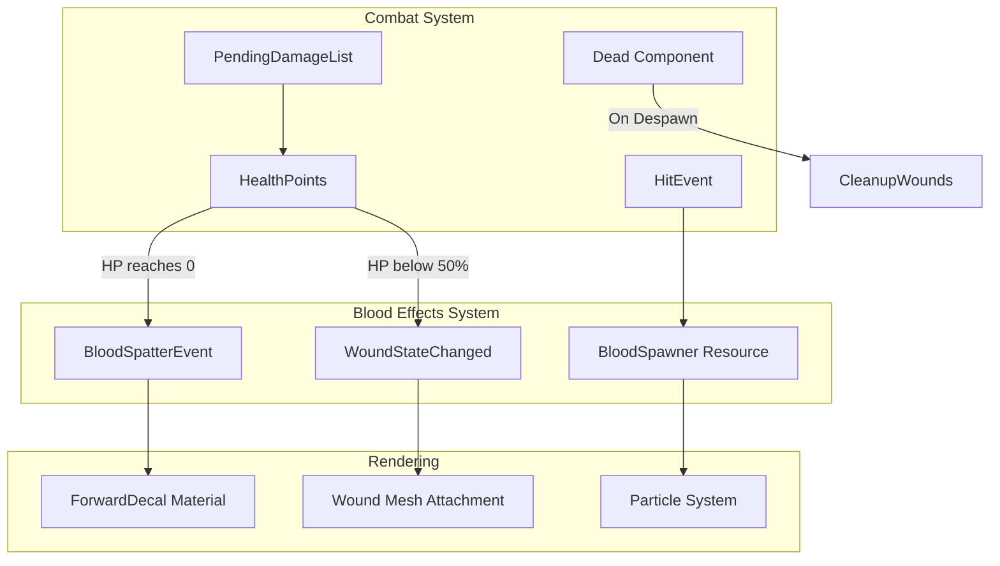

# Blood Effects System Design

## Overview

This document outlines the architecture for implementing a blood effects system in the Rose Online client using Bevy 0.16.1. The system provides:
- **Blood Spatter**: Decals spawned on terrain when monsters are killed
- **Gash Wounds**: Visual wounds appearing on monsters when HP drops below 50%
- **Persistent Wounds**: Wounds remain visible on killed monsters until they despawn

## Architecture Analysis

### Existing Systems Integration Points



### Key Integration Points

| System | File | Integration |
|--------|------|-------------|
| Damage Events | [`hit_event.rs`](src/events/hit_event.rs) | Read `HitEvent` for damage timing |
| HP Tracking | [`ability_values.rs`](src/bundles/ability_values.rs) | Monitor `HealthPoints` component |
| Death Tracking | [`dead.rs`](src/components/dead.rs) | `Dead` component triggers blood spatter |
| Effect Spawning | [`spawn_effect_event.rs`](src/events/spawn_effect_event.rs) | Pattern for effect events |
| Particle Rendering | [`particle_material.rs`](src/render/particle_material.rs) | Storage buffer approach for particles |

## Bevy 0.16.1 Decal Support

Bevy 0.16.1 provides two decal implementations:

### Forward Decals (Recommended for Blood Spatter)

```rust
// From bevy_pbr::decal
commands.spawn((
    Name::new("BloodDecal"),
    ForwardDecal,
    MeshMaterial3d(decal_materials.add(ForwardDecalMaterial {
        base: StandardMaterial {
            base_color_texture: Some(blood_texture.clone()),
            alpha_mode: AlphaMode::Blend,
            ..default()
        },
        extension: ForwardDecalMaterialExt {
            depth_fade_factor: 1.0,
        },
    })),
    Transform::from_xyz(x, y + 0.1, z)
        .looking_at(Vec3::ZERO, Vec3::Y)
        .with_scale(Vec3::new(size, size, 0.1)),
));

// Camera requirement
commands.spawn((
    Camera3d::default(),
    DepthPrepass, // Required for forward decals
    ..default()
));
```

**Advantages:**
- Works on all platforms (no bindless requirement)
- Simple material extension
- Good for flat terrain surfaces

**Limitations:**
- Requires `DepthPrepass` on camera
- Can distort at steep angles

### Clustered Decals (Alternative)

Clustered decals are higher quality but require bindless textures (not available on macOS/iOS/WebGL2). Not recommended for this use case due to platform limitations.

## Component Design

### Blood Spatter Components

```rust
// src/components/blood_effect.rs

/// Marker for blood spatter decal entities
#[derive(Component, Reflect)]
#[reflect(Component)]
pub struct BloodSpatter {
    /// Time until this spatter fades out
    pub lifetime: f32,
    /// Current alpha value
    pub alpha: f32,
    /// Size of the decal
    pub size: f32,
}

/// Configuration for blood spatter appearance
#[derive(Component, Reflect)]
#[reflect(Component)]
pub struct BloodSpatterConfig {
    /// Minimum spatter size
    pub min_size: f32,
    /// Maximum spatter size  
    pub max_size: f32,
    /// Number of spatter decals to spawn on death
    pub spatter_count: usize,
    /// How long spatters persist before fading
    pub spatter_lifetime: f32,
    /// Maximum distance from death position for spatters
    pub spatter_radius: f32,
}

impl Default for BloodSpatterConfig {
    fn default() -> Self {
        Self {
            min_size: 0.3,
            max_size: 1.5,
            spatter_count: 5,
            spatter_lifetime: 30.0,
            spatter_radius: 2.0,
        }
    }
}
```

### Gash Wound Components

```rust
// src/components/blood_effect.rs (continued)

/// Tracks wound state for an entity
#[derive(Component, Reflect)]
#[reflect(Component)]
pub struct GashWounds {
    /// Currently active wound visuals
    pub wounds: Vec<GashWound>,
    /// Whether the entity is below 50% HP threshold
    pub wounds_visible: bool,
    /// Entity that owns the wounds (for cleanup)
    pub owner_entity: Entity,
}

/// Individual wound visual
#[derive(Clone, Reflect)]
pub struct GashWound {
    /// Position on the mesh (local space)
    pub local_position: Vec3,
    /// Rotation of the wound decal
    pub rotation: f32,
    /// Size of the wound
    pub size: f32,
    /// Which bone this wound is attached to (for skinned meshes)
    pub bone_index: Option<usize>,
}

/// Marker component for wound visual entities
#[derive(Component)]
pub struct WoundVisual {
    /// The parent entity this wound is attached to
    pub parent: Entity,
}
```

## Event Design

```rust
// src/events/blood_effect_event.rs

/// Event triggered when blood effects should spawn
#[derive(Event)]
pub enum BloodEffectEvent {
    /// Spawn blood spatter on terrain at position
    SpawnSpatter {
        position: Vec3,
        normal: Vec3,
        damage_amount: u32,
        is_kill: bool,
    },
    /// Show gash wound on entity
    ShowWound {
        entity: Entity,
        wound_position: Vec3,
        wound_normal: Vec3,
    },
    /// Update wound visibility based on HP
    UpdateWoundVisibility {
        entity: Entity,
        health_percent: f32,
    },
    /// Clean up all wounds for an entity
    CleanupWounds {
        entity: Entity,
    },
}
```

## Resource Design

```rust
// src/resources/blood_effect_manager.rs

/// Manages blood effect spawning and pooling
#[derive(Resource)]
pub struct BloodEffectManager {
    /// Pool of reusable spatter entities
    spatter_pool: Vec<Entity>,
    /// Pool of reusable wound visual entities
    wound_pool: Vec<Entity>,
    /// Maximum number of active blood spatters
    max_spatters: usize,
    /// Current active spatter count
    active_spatters: usize,
    /// Blood texture handles
    blood_textures: Vec<Handle<Image>>,
    /// Wound texture handles
    wound_textures: Vec<Handle<Image>>,
}

impl BloodEffectManager {
    pub fn get_or_create_spatter(&mut self, commands: &mut Commands) -> Entity {
        if let Some(entity) = self.spatter_pool.pop() {
            return entity;
        }
        // Create new spatter entity
        commands.spawn((
            BloodSpatter::default(),
            Visibility::Hidden,
            Transform::default(),
        )).id()
    }
    
    pub fn return_spatter(&mut self, entity: Entity) {
        if self.spatter_pool.len() < self.max_spatters {
            self.spatter_pool.push(entity);
        }
    }
}
```

## System Design

### Blood Spatter Spawning System

```rust
// src/systems/blood_spatter_system.rs

/// System that listens for death events and spawns blood spatter
pub fn blood_spatter_on_death_system(
    mut commands: Commands,
    mut blood_events: EventWriter<BloodEffectEvent>,
    query_dead: Query<(Entity, &GlobalTransform, &ModelHeight), (Added<Dead>, With<Npc>)>,
    query_terrain: Query<&GlobalTransform, With<TerrainMarker>>,
) {
    for (entity, transform, model_height) in query_dead.iter() {
        let position = transform.translation();
        
        // Spawn blood spatter at feet position
        blood_events.write(BloodEffectEvent::SpawnSpatter {
            position: Vec3::new(position.x, position.y, position.z),
            normal: Vec3::Y,
            damage_amount: 0, // Final blow
            is_kill: true,
        });
    }
}

/// System that processes blood effect events
pub fn process_blood_effects_system(
    mut commands: Commands,
    mut blood_events: EventReader<BloodEffectEvent>,
    mut blood_manager: ResMut<BloodEffectManager>,
    mut decal_materials: ResMut<Assets<ForwardDecalMaterial<StandardMaterial>>>,
    mut mesh_materials: ResMut<Assets<MeshMaterial3d<ForwardDecalMaterial<StandardMaterial>>>>,
) {
    for event in blood_events.read() {
        match event {
            BloodEffectEvent::SpawnSpatter { position, normal, damage_amount, is_kill } => {
                spawn_blood_spatter(
                    &mut commands,
                    &mut blood_manager,
                    &mut decal_materials,
                    position,
                    normal,
                    *damage_amount,
                    *is_kill,
                );
            }
            // ... other event handlers
        }
    }
}

fn spawn_blood_spatter(
    commands: &mut Commands,
    blood_manager: &mut BloodEffectManager,
    decal_materials: &mut Assets<ForwardDecalMaterial<StandardMaterial>>,
    position: &Vec3,
    normal: &Vec3,
    damage_amount: u32,
    is_kill: bool,
) {
    let config = BloodSpatterConfig::default();
    let spatter_count = if is_kill { config.spatter_count } else { 1 };
    
    for _ in 0..spatter_count {
        let offset = Vec3::new(
            (rand::random::<f32>() - 0.5) * config.spatter_radius,
            0.0,
            (rand::random::<f32>() - 0.5) * config.spatter_radius,
        );
        
        let spatter_pos = *position + offset;
        let size = config.min_size + rand::random::<f32>() * (config.max_size - config.min_size);
        
        // Select random blood texture
        let texture = blood_manager.blood_textures
            .choose(&mut rand::thread_rng())
            .cloned()
            .unwrap_or_default();
        
        let material = ForwardDecalMaterial {
            base: StandardMaterial {
                base_color_texture: Some(texture),
                base_color: Color::srgba(0.6, 0.0, 0.0, 0.8),
                alpha_mode: AlphaMode::Blend,
                cull_mode: None,
                ..default()
            },
            extension: ForwardDecalMaterialExt {
                depth_fade_factor: 0.5,
            },
        };
        
        commands.spawn((
            Name::new("BloodSpatter"),
            ForwardDecal,
            MeshMaterial3d(decal_materials.add(material)),
            BloodSpatter {
                lifetime: config.spatter_lifetime,
                alpha: 0.8,
                size,
            },
            Transform::from_translation(spatter_pos + Vec3::Y * 0.05)
                .looking_to(Vec3::NEG_Y, *normal)
                .with_scale(Vec3::new(size, size, 0.01)),
        ));
    }
}
```

### Wound Visibility System

```rust
// src/systems/wound_visibility_system.rs

/// System that monitors HP and shows/hides wounds
pub fn wound_visibility_system(
    mut commands: Commands,
    mut query: Query<(Entity, &HealthPoints, &AbilityValues, Option<&mut GashWounds>), Without<Dead>>,
    mut blood_events: EventWriter<BloodEffectEvent>,
) {
    for (entity, hp, ability_values, wounds) in query.iter_mut() {
        let max_hp = ability_values.get_max_health();
        let health_percent = hp.hp as f32 / max_hp as f32;
        
        // Show wounds when below 50% HP
        let should_show_wounds = health_percent < 0.5;
        
        if let Some(mut wounds) = wounds {
            if wounds.wounds_visible != should_show_wounds {
                wounds.wounds_visible = should_show_wounds;
                
                if should_show_wounds {
                    // Add new wound visual
                    blood_events.write(BloodEffectEvent::ShowWound {
                        entity,
                        wound_position: Vec3::ZERO, // Will be calculated
                        wound_normal: Vec3::Z,
                    });
                }
            }
        } else if should_show_wounds {
            // First time showing wounds - create component
            commands.entity(entity).insert(GashWounds {
                wounds: vec![],
                wounds_visible: true,
                owner_entity: entity,
            });
            
            blood_events.write(BloodEffectEvent::ShowWound {
                entity,
                wound_position: Vec3::ZERO,
                wound_normal: Vec3::Z,
            });
        }
    }
}
```

### Blood Spatter Fade System

```rust
// src/systems/blood_spatter_system.rs (continued)

/// System that fades out and despawns blood spatters over time
pub fn blood_spatter_fade_system(
    mut commands: Commands,
    mut query: Query<(Entity, &mut BloodSpatter, &mut MeshMaterial3d<ForwardDecalMaterial<StandardMaterial>>)>,
    time: Res<Time>,
    decal_materials: Res<Assets<ForwardDecalMaterial<StandardMaterial>>>,
) {
    let delta = time.delta_secs();
    
    for (entity, mut spatter, mut material_handle) in query.iter_mut() {
        spatter.lifetime -= delta;
        
        if spatter.lifetime <= 0.0 {
            commands.entity(entity).despawn();
            continue;
        }
        
        // Fade out over last 5 seconds
        if spatter.lifetime < 5.0 {
            spatter.alpha = (spatter.lifetime / 5.0).clamp(0.0, 1.0);
            
            if let Some(material) = decal_materials.get_mut(&material_handle.0) {
                material.base.base_color.set_alpha(spatter.alpha);
            }
        }
    }
}
```

### Wound Cleanup System

```rust
// src/systems/wound_cleanup_system.rs

/// System that cleans up wounds when entities despawn
pub fn wound_cleanup_system(
    mut commands: Commands,
    query_wound_visuals: Query<(Entity, &WoundVisual)>,
    query_parents: Query<(), Without<Dead>>,
) {
    for (wound_entity, wound_visual) in query_wound_visuals.iter() {
        // If parent entity no longer exists or is dead and despawning
        if query_parents.get(wound_visual.parent).is_err() {
            commands.entity(wound_entity).despawn();
        }
    }
}
```

## Shader Approach

### Blood Decal Shader Extension

The `ForwardDecalMaterial` uses Bevy's `StandardMaterial` as a base, so we can leverage existing PBR rendering. For custom blood effects, we can extend:

```wgsl
// assets/shaders/blood_decal.wgsl

#import bevy_pbr::{
    pbr_fragment::pbr_input_from_standard_material,
    pbr_bindings::mesh,
}

#import bevy_pbr::decal::forward::get_forward_decal_info

@group(2) @binding(0)
var<uniform> blood_config: BloodConfig;

struct BloodConfig {
    blood_color: vec4<f32>,
    fade_distance: f32,
    puddle_factor: f32,
}

@fragment
fn fragment(
    in: VertexOutput,
    @builtin(front_facing) is_front: bool,
) -> @location(0) vec4<f32> {
    // Get decal info (depth fade, etc.)
    let decal_info = get_forward_decal_info(in);
    
    // Sample blood texture
    let blood_sample = textureSample(base_color_texture, base_color_sampler, in.uv);
    
    // Apply depth fade for smooth edges
    let alpha = blood_sample.a * decal_info.opacity;
    
    // Darker blood color towards center
    let final_color = mix(
        vec4<f32>(0.4, 0.0, 0.0, alpha),
        vec4<f32>(0.8, 0.1, 0.1, alpha),
        length(in.uv - 0.5) * 2.0
    );
    
    return final_color;
}
```

## File Structure

```
src/
├── components/
│   ├── blood_effect.rs          # BloodSpatter, GashWounds components
│   └── mod.rs                   # Add pub mod blood_effect
├── events/
│   ├── blood_effect_event.rs    # BloodEffectEvent
│   └── mod.rs                   # Add pub mod blood_effect_event
├── resources/
│   ├── blood_effect_manager.rs  # BloodEffectManager resource
│   └── mod.rs                   # Add pub mod blood_effect_manager
├── systems/
│   ├── blood_spatter_system.rs  # Spawning and fading systems
│   ├── wound_visibility_system.rs # HP monitoring and wound display
│   ├── wound_cleanup_system.rs  # Cleanup on entity despawn
│   └── mod.rs                   # Add pub mod for each
├── render/
│   ├── blood_decal_material.rs  # Custom material if needed
│   └── shaders/
│       └── blood_decal.wgsl     # Custom shader
└── lib.rs                       # Register plugins and systems
```

## Implementation Phases

### Phase 1: Core Infrastructure
1. Create component definitions (`blood_effect.rs`)
2. Create event definitions (`blood_effect_event.rs`)
3. Create resource manager (`blood_effect_manager.rs`)
4. Register types in `lib.rs`

### Phase 2: Blood Spatter System
1. Implement `blood_spatter_on_death_system`
2. Implement `process_blood_effects_system`
3. Implement `blood_spatter_fade_system`
4. Add blood textures to assets
5. Test with monster kills

### Phase 3: Gash Wounds System
1. Implement `wound_visibility_system`
2. Create wound mesh attachment logic
3. Implement wound positioning on skinned meshes
4. Test with damage below 50% HP

### Phase 4: Polish and Optimization
1. Implement object pooling for spatters
2. Add configuration options (enable/disable, intensity)
3. Performance testing with many entities
4. Add wound texture variations
5. Implement wound cleanup on despawn

## Performance Considerations

### Object Pooling
- Pool spatter entities to avoid spawn/despawn overhead
- Maximum limit on active spatters (e.g., 100)
- LRU eviction when limit reached

### Level of Detail
- Reduce spatter count for distant entities
- Skip wounds for entities beyond render distance
- Fade spatters faster in high-activity areas

### Memory Management
- Share blood textures across all spatters
- Use texture atlas for wound variations
- Limit wound visuals per entity (max 3)

## Configuration

```rust
// src/resources/blood_effect_config.rs

#[derive(Resource, Reflect)]
pub struct BloodEffectConfig {
    /// Enable/disable blood effects entirely
    pub enabled: bool,
    /// Blood intensity multiplier (0.0 - 1.0)
    pub intensity: f32,
    /// Maximum blood spatters in scene
    pub max_spatters: usize,
    /// Show wounds on damaged monsters
    pub show_wounds: bool,
    /// Blood color tint
    pub blood_color: Color,
    /// Spatter lifetime in seconds
    pub spatter_lifetime: f32,
}

impl Default for BloodEffectConfig {
    fn default() -> Self {
        Self {
            enabled: true,
            intensity: 0.7,
            max_spatters: 100,
            show_wounds: true,
            blood_color: Color::srgb(0.6, 0.0, 0.0),
            spatter_lifetime: 30.0,
        }
    }
}
```

## Integration with Existing Systems

### Hit Event Integration

```rust
// Modify src/systems/hit_event_system.rs

fn apply_damage(
    // ... existing parameters
    blood_events: &mut EventWriter<BloodEffectEvent>,
) {
    // ... existing damage logic
    
    // Spawn blood effect on hit
    if damage.amount > 0 {
        blood_events.write(BloodEffectEvent::SpawnSpatter {
            position: defender.global_transform.translation(),
            normal: Vec3::Y,
            damage_amount: damage.amount,
            is_kill,
        });
    }
}
```

### Death Tracking Integration

```rust
// The Dead component is added in hit_event_system.rs
// Blood spatter should trigger on Added<Dead>

// In blood_spatter_system.rs
pub fn blood_spatter_on_death_system(
    mut blood_events: EventWriter<BloodEffectEvent>,
    query: Query<(Entity, &GlobalTransform, &ModelHeight), Added<Dead>>,
) {
    for (entity, transform, model_height) in query.iter() {
        // Spawn blood spatter
    }
}
```

## Testing Plan

1. **Unit Tests**
   - Test HP threshold detection
   - Test wound visibility state changes
   - Test spatter position calculation

2. **Integration Tests**
   - Test blood spawn on monster kill
   - Test wound appearance at 50% HP
   - Test wound persistence until despawn

3. **Performance Tests**
   - Spawn 100 monsters, kill all, verify spatter limit
   - Monitor frame time with many blood effects
   - Test memory usage with object pooling

## Summary

This design provides a complete blood effects system that:
- Integrates with existing combat/damage systems
- Uses Bevy 0.16.1's Forward Decal feature for terrain blood
- Attaches wound visuals to monster meshes
- Maintains performance through pooling and limits
- Allows configuration for different preferences
