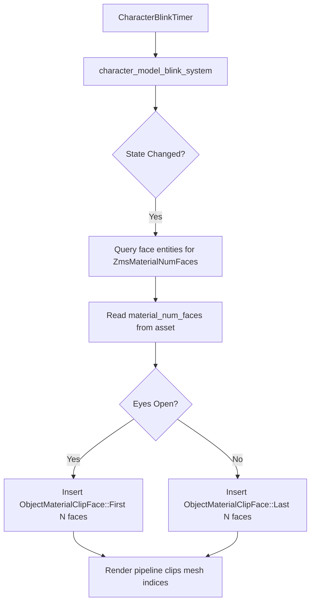
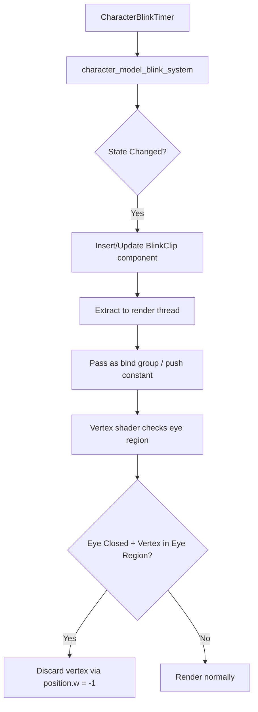
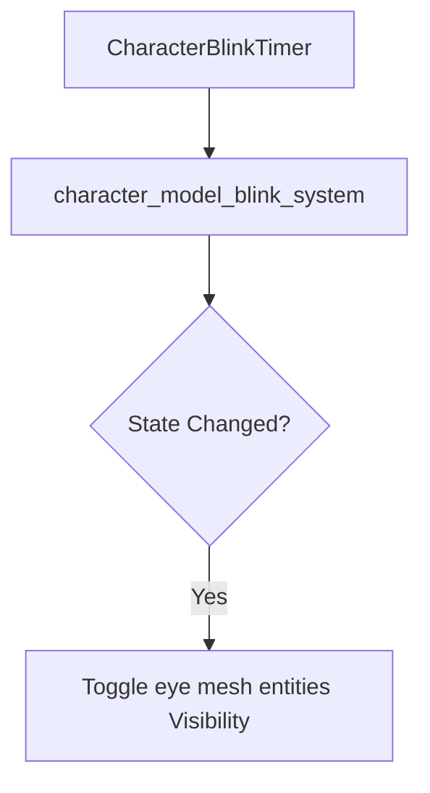

# Character Face Blink Reimplementation Architecture

## Executive Summary

The character blinking feature was removed during migration from Bevy 0.11's custom `ObjectMaterial` to Bevy 0.16+'s modern `ExtendedMaterial` system. This document outlines the architecture for reimpllementing blinking using Bevy-native approaches.

---

## Table of Contents

1. [Current State Analysis](#current-state-analysis)
2. [Reference Implementation (Old Bevy 0.11)](#reference-implementation-old-bevy-011)
3. [Why The Old Approach Doesn't Work](#why-the-old-approach-doesnt-work)
4. [Proposed Architecture](#proposed-architecture)
5. [Implementation Details](#implementation-details)
6. [Files to Modify/Create](#files-to-modifycreate)
7. [Example Code](#example-code)
8. [Testing Plan](#testing-plan)

---

## Current State Analysis

### Components That Exist But Are Incomplete

| Component | Status | Notes |
|-----------|--------|-------|
| [`CharacterBlinkTimer`](src/components/character_model_blink_timer.rs) | **Complete** | Timer logic works, proper RNG ranges |
| [`ZmsMaterialNumFaces`](src/zms_asset_loader.rs:25) asset | **Loaded but unused** | Contains face counts per material index |
| `load_clip_faces` flag | **Set correctly** | True for CharacterFace in model_loader.rs:828 |

### The Missing Piece

The blink system detects state changes (eyes open/close) at [`character_model_blink_system.rs`](src/systems/character_model_blink_system.rs:45-50) but has no rendering integration:

```rust
if changed {
    // TODO: Character face blinking removed with old material system
    // This functionality needs to be reimplemented with new ExtendedMaterial pattern
    // The ObjectMaterialClipFace component was used to control which faces to render
    // for blinking eyes (First or Last faces)
}
```

---

## Reference Implementation (Old Bevy 0.11)

### How Blinking Worked Before

**Architecture Overview:**



### Key Components (Old)

#### 1. ObjectMaterialClipFace Component

```rust
// Old implementation from exjam-rose-offline-client/src/render/object_material.rs
#[derive(Copy, Clone, Component, Reflect)]
pub enum ObjectMaterialClipFace {
    First(u32),  // Render only first N faces (eyes OPEN)
    Last(u32),   // Render only last N faces (eyes CLOSED - skips eye mesh)
}
```

#### 2. Custom Draw Command Integration

```rust
// Old draw command applied face clipping during rendering
impl<P: PhaseItem> RenderCommand<P> for DrawObjectMesh {
    // ...
    fn render(/* params */) -> RenderCommandResult {
        let (start_index_offset, end_index_offset) = if let Some(clip_face) = clip_face {
            match clip_face {
                ObjectMaterialClipFace::First(num_faces) => (*num_faces * 3, 0),
                ObjectMaterialClipFace::Last(num_faces)  => (0, *num_faces * 3),
            }
        } else {
            (0, 0)
        };

        // Apply clipping in draw call:
pass.draw_indexed(start_index..end_index, /* ... */);
    }
}
```

#### 3. Blink System Applied Components Dynamically

```rust
// Old blink system applied clip face component on state change
if changed {
    for face_model_entity in character_model.model_parts[CharacterModelPart::CharacterFace].1.iter() {
        if let Ok(face_mesh_handle) = query_material.get(*face_model_entity) {
            if let Some(face_mesh) = material_assets.get(face_mesh_handle) {
                if let Some(num_clip_faces) = face_mesh.material_num_faces.last() {
                    if blink_timer.is_open {
                        commands.entity(*face_model_entity).insert(ObjectMaterialClipFace::First(*num_clip_faces as u32));
                    } else {
                        commands.entity(*face_model_entity).insert(ObjectMaterialClipFace::Last(*num_clip_faces as u32));
                    }
                }
            }
        }
    }
}
```

---

## Why The Old Approach Doesn't Work

### 1. ExtendedMaterial Uses Standard Rendering Pipeline

Current [`RoseObjectExtension`](src/render/object_material_extension.rs:22) extends `StandardMaterial` using Bevy's modern approach:

```rust
pub type RoseObjectMaterial = ExtendedMaterial<StandardMaterial, RoseObjectExtension>;
```

This uses **Bevy's standard PBR pipeline** which does NOT support custom draw commands with face clipping.

### 2. No Custom RenderCommand Hook

The old `ObjectMaterial` had a custom material plugin:

```rust
// OLD - Had full control over rendering
type DrawObjectMaterial = (
    SetItemPipeline,
    SetMeshViewBindGroup<0>,
    SetMaterialBindGroup<ObjectMaterial, 1>,
    SetMeshBindGroup<2>,
    SetZoneLightingBindGroup<3>,
    DrawObjectMesh,  // <-- Custom draw with face clipping
);
```

The new approach uses:

```rust
// NEW - Standard Bevy rendering only
app.add_plugins(MaterialPlugin::<RoseObjectMaterial>::default());
```

### 3. Face Clip Component Has Nowhere to Hook Into

Even if we recreate `ObjectMaterialClipFace`, there's no custom render pipeline reading it.

---

## Proposed Architecture

### High-Level Design

We have **three viable approaches**:

| Approach | Pros | Cons | Recommendation |
|----------|------|------|----------------|
| **1. Vertex Shader Clip** | Fast, no custom material needed | Complex shader math per vertex | ⭐ **RECOMMENDED** |
| 2. Separate Eye Meshes | Clean separation, uses visibility | Requires mesh modification | Secondary option |
| 3. Custom Material Fork | Maximum control | Heavy maintenance burden | Last resort |

### Approach 1: Vertex Shader Clip (Recommended)

#### Concept

Add a `BlinkClip` component that the vertex shader reads to discard eye vertices when closed.



#### Advantages

- **Minimal code changes**: Just a component + shader extension update
- **Performance**: Single material, no extra draw calls  
- **Clean separation**: Doesn't require forking Bevy's MaterialPlugin

#### Disadvantage

Requires knowing which vertex indices belong to eye regions (may need mesh analysis)

### Approach 2: Separate Eye Mesh Entities

#### Concept

Split face mesh into "base" and "eyes" submeshes, toggle eyes visibility.



#### Advantages

- **Simple**: Uses Bevy's built-in `Visibility` component
- **No shader changes**

#### Disadvantages

- **Requires asset modification**: Split face meshes into separate entities
- **Extra draw calls**: Additional mesh entities per character

### Approach 3: Custom Material With Clip Support

Recreate old-style material with custom render pipeline.

---

## Implementation Details (Approach 1 - Recommended)

### Phase 1: Component Design

#### BlinkClip Component

```rust
#[derive(Component, Reflect, Default, Clone, Copy, Debug)]
pub enum BlinkClip {
    #[default]
    EyesOpen,   // Render full face including eyes
    EyesClosed, // Clip eye vertices (hide eyes)
}
```

### Phase 2: Update Blink System

```rust
pub fn character_model_blink_system(
    mut commands: Commands,
    mut query_characters: Query<(&CharacterModel, &mut CharacterBlinkTimer, Option<&Dead>)>,
    time: Res<Time>,
) {
    for (character_model, mut blink_timer, dead) in query_characters.iter_mut() {
        let mut changed = false;

        // Existing timer logic...
        if dead.is_none() {
            blink_timer.timer += time.delta().as_secs_f32();
            // ... state machine ...
        } else {
            // Death handling...
        }

        if changed {
            // NEW: Apply clip to face mesh entities
            for &face_entity in character_model.model_parts[CharacterModelPart::CharacterFace].1.iter() {
                let blink_clip = if blink_timer.is_open { 
                    BlinkClip::EyesOpen 
                } else { 
                    BlinkClip::EyesClosed 
                };
                commands.entity(face_entity).insert(blink_clip);
            }
        }
    }
}
```

### Phase 3: Shader Extension Modification

#### Step 3a: Create Uniform Buffer Object

```rust
#[derive(ShaderType, Debug, Clone, Copy)]
pub struct BlinkUniform {
    pub state: u32, // 0 = open, 1 = closed
}
```

#### Step 3b: Extend RoseObjectExtension

```rust
use bevy::render::render_resource::{ShaderStorageBuffer, ShaderType};

#[derive(Asset, AsBindGroup, Reflect, Debug, Clone)]
pub struct RoseObjectExtension {
    // Existing fields...
    
    // NEW: Blink state per entity (extracted from component)
    #[uniform(105)]  // New uniform block
    pub blink_state: u32, // 0 = eyes open, 1 = eyes closed
}
```

#### Step 3c: Add ExtractComponent Plugin

```rust
#[derive(Component, Clone, Copy, Debug)]
pub struct BlinkClipState(pub u32);

impl ExtractComponent for BlinkClipState {
    type Query = Read<Self>;
    type Filter = With<Mesh3d<Handle<RoseObjectMaterial>>>;
    type Out = Self;

    fn extract_component(item: QueryItem<Self::Query>) -> Option<Self> { Some(*item) }
}

// In render plugin setup:
app.add_plugins(ExtractComponentPlugin::<BlinkClipState>::extract_visible());
```

#### Step 3d: Update Vertex Shader

```wgsl
// rose_object_extension.wgsl vertex shader

@group(0) @binding(105)
var<uniform> blink_state: u32;

// Eye region bounds - determined per character model
// These would ideally be computed once at load time
tconst EYE_MIN_X: f32 = 0.3;
tconst EYE_MAX_X: f32 = 0.7;
tconst EYE_MIN_Y: f32 = 0.4;
tconst EYE_MAX_Y: f32 = 0.6;

fn clip_eyes_if_closed(position: vec3<f32>) -> vec4<f32> {
    if blink_state == 1u { // Eyes closed
        // Check if vertex is in eye region (model space coordinates)
        let in_eye_x = position.x > EYE_MIN_X && position.x < EYE_MAX_X;
        let in_eye_y = position.y > EYE_MIN_Y && position.y < EYE_MAX_Y;
        
        if in_eye_x && in_eye_y {
            // Discard by setting w to negative
            return vec4<f32>(position, -1.0);
        }
    }
    return vec4<f32>(position, 1.0);
}
```

### Phase 4: Alternative Without Vertex Shader Changes

If vertex shader approach is too complex, use **component-based culling**:

```rust
// Store face mesh visibility state in resource
type FaceMeshBlinkMap = HashMap<Entity, BlinkClip>;

// System runs before render extraction
fn update_blink_components(
    mut commands: Commands,
    blink_map: Res<FaceMeshBlinkMap>,
) {
    for (entity, clip) in blink_map.iter() {
        match clip {
            BlinkClip::EyesOpen => commands.entity(*entity).remove::<Visibility>(),
            BlinkClip::EyesClosed => commands.entity(*entity).insert(Visibility::Hidden),
        }
    }
}
```

---

## Files to Modify/Create

### Create New Files

| File | Purpose |
|------|---------|
| `src/components/blink_clip.rs` | `BlinkClip` component enum and helper types |
| `src/render/blinking_plugin.rs` (optional) | Dedicated blinking render plugin if needed |

### Modify Existing Files

| File | Changes |
|------|--------|
| [`src/components/mod.rs`](src/components/mod.rs) | Export `BlinkClip` component |
| [`src/systems/character_model_blink_system.rs`](src/systems/character_model_blink_system.rs:45-50) | Fill in the TODO - apply blink clip to face entities |
| [`src/render/object_material_extension.rs`](src/render/object_material_extension.rs) | Add blink state uniform if using shader approach |
| `shaders/rose_object_extension.wgsl` | Add eye clipping vertex logic (if using shader approach) |

---

## Example Code

### 1. Component Definition

```rust
// src/components/blink_clip.rs
use bevy::prelude::{Component, Reflect};

/// Controls whether character face eyes are rendered or clipped
#[derive(Component, Reflect, Default, Clone, Copy, Debug)]
pub enum BlinkClip {
    #[default]
    EyesOpen,   // Render full face including eye mesh
    EyesClosed, // Clip eye vertices to hide eyes (blink)
}

impl BlinkClip {
    pub fn as_u32(&self) -> u32 {
        match self {
            BlinkClip::EyesOpen => 0,
            BlinkClip::EyesClosed => 1,
        }
    }
}
```

### 2. Updated Blink System

```rust
// src/systems/character_model_blink_system.rs (modified)
use bevy::prelude::{Commands, Query, Res, Time};
use rand::Rng;

use crate::{
    components::{CharacterBlinkTimer, CharacterModel, CharacterModelPart, Dead, BlinkClip},
};

pub fn character_model_blink_system(
    mut commands: Commands,
    mut query_characters: Query<(&CharacterModel, &mut CharacterBlinkTimer, Option<&Dead>)>,
    time: Res<Time>,
) {
    for (character_model, mut blink_timer, dead) in query_characters.iter_mut() {
        let mut changed = false;

        if dead.is_none() {
            blink_timer.timer += time.delta().as_secs_f32();

            if blink_timer.is_open {
                if blink_timer.timer >= blink_timer.open_duration {
                    blink_timer.is_open = false;
                    blink_timer.timer -= blink_timer.open_duration;
                    blink_timer.closed_duration = rand::thread_rng().gen_range(CharacterBlinkTimer::BLINK_CLOSED_DURATION);
                    changed = true;
                }
            } else if blink_timer.timer >= blink_timer.closed_duration {
                blink_timer.is_open = true;
                blink_timer.timer -= blink_timer.closed_duration;
                blink_timer.open_duration = rand::thread_rng().gen_range(CharacterBlinkTimer::BLINK_OPEN_DURATION);
                changed = true;
            }
        } else {
            if blink_timer.is_open {
                blink_timer.is_open = false;
                blink_timer.closed_duration = 0.0;
                blink_timer.timer = 0.0;
            }
            changed = true;
        }

        if changed {
            // Apply blink clip to face mesh entities
            let blink_clip = if blink_timer.is_open { 
                BlinkClip::EyesOpen 
            } else { 
                BlinkClip::EyesClosed 
            };
            
            for &face_entity in character_model.model_parts[CharacterModelPart::CharacterFace].1.iter() {
                commands.entity(face_entity).insert(blink_clip);
            }
        }
    }
}
```

---

## Testing Plan

### 1. Unit Tests

```rust
#[cfg(test)]
mod tests {
    use super::*;

    #[test]
    fn blink_timer_cycles_open_close() {
        // Test timer transitions properly
    }

    #[test] 
    fn blink_durations_in_range() {
        assert!(CharacterBlinkTimer::BLINK_CLOSED_DURATION.contains(&0.05));
        assert!(!CharacterBlinkTimer::BLINK_CLOSED_DURATION.contains(&0.2));
    }
}
```

### 2. Integration Tests

1. Spawn character, verify face mesh renders initially with eyes open
2. Wait for blink timer to trigger close state
3. Verify eye region is clipped (eyes not visible)
4. Verify reopen after closed duration

### 3. Visual Verification Checklist

- [ ] Character spawns with eyes open
- [ ] Eyes blink randomly within configured durations
- [ ] Blink looks natural (no flickering or partial frames)
- [ ] Dead characters have permanently closed eyes
- [ ] Resurrection opens eyes immediately
- [ ] No visual artifacts around eye region

---

## Appendix: Mesh Face Data Structure

### Understanding `material_num_faces`

The face mesh stores vertex data for both **face-with-eyes** and **face-without-eyes**:

```
Total vertices per material = V_total
Vertices in eye region = V_eyes (stored as last entry of material_num_faces)

Eyes OPEN:  Render faces [0, V_eyes]       <- first N faces only
Eyes CLOSED: Render faces [V_eyes, V_total] <- last N-V_eyes faces only
```

This dual-storage approach means:
- No vertex animation needed - static mesh has both states
- Slight memory overhead but fast state switching
- Eye geometry is duplicated (once in "open" portion, once in "closed" portion)

---

## References

### Source Files Analyzed

1. **Current implementation**:
   - [`src/components/character_model_blink_timer.rs`](src/components/character_model_blink_timer.rs:1-32)
   - [`src/systems/character_model_blink_system.rs`](src/systems/character_model_blink_system.rs:1-52)
   - [`src/model_loader.rs`](src/model_loader.rs:1403-1409) (face loading with clip data)

2. **Old working implementation** (exjam-rose-offline-client):
   - `src/render/object_material.rs` lines 79-141 (ObjectMaterialClipFace + DrawObjectMesh)
   - `src/systems/character_model_blink_system.rs` lines 50-72 (active blink logic)

3. **Related systems**:
   - [`src/zms_asset_loader.rs`](src/zms_asset_loader.rs:25-31) (ZmsMaterialNumFaces asset)
   - [`src/render/object_material_extension.rs`](src/render/object_material_extension.rs:1-68) (current material approach)

### External Resources

- Bevy Material Extension docs: https://docs.rs/bevy/latest/bevy/pbr/trait.MaterialExtension.html
- ExtractComponent pattern: https://docs.rs/bevy/latest/bevy/render/extract_component/trait.ExtractComponent.html
