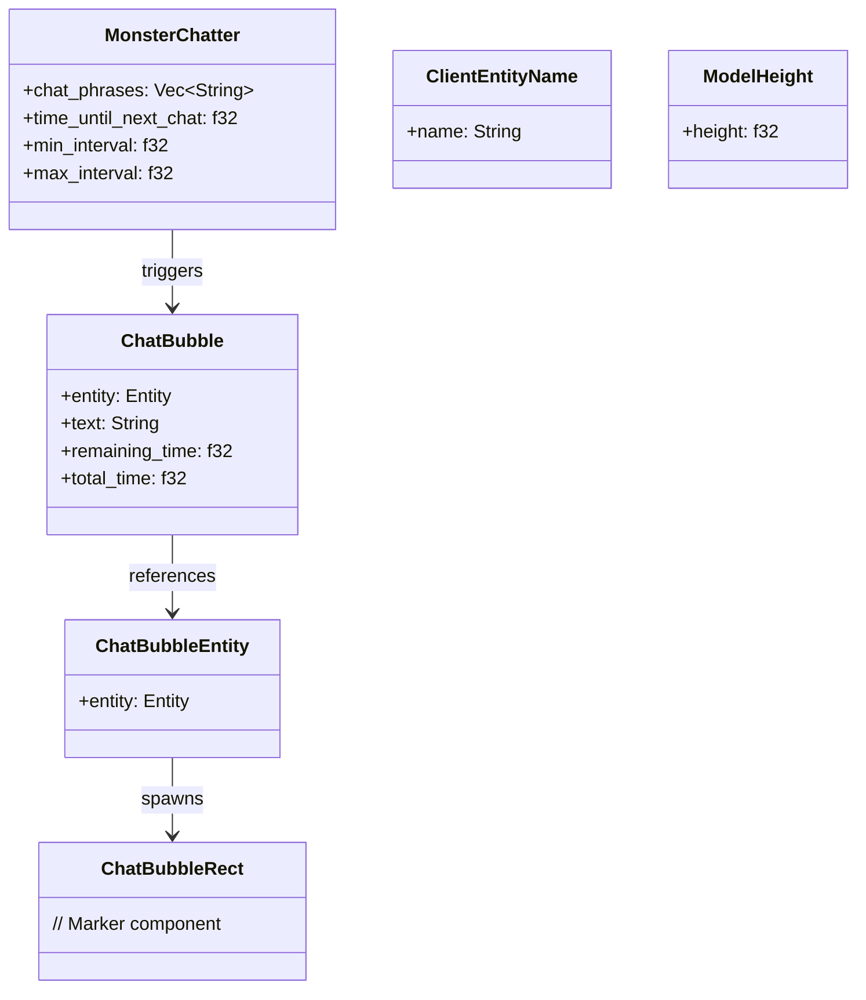
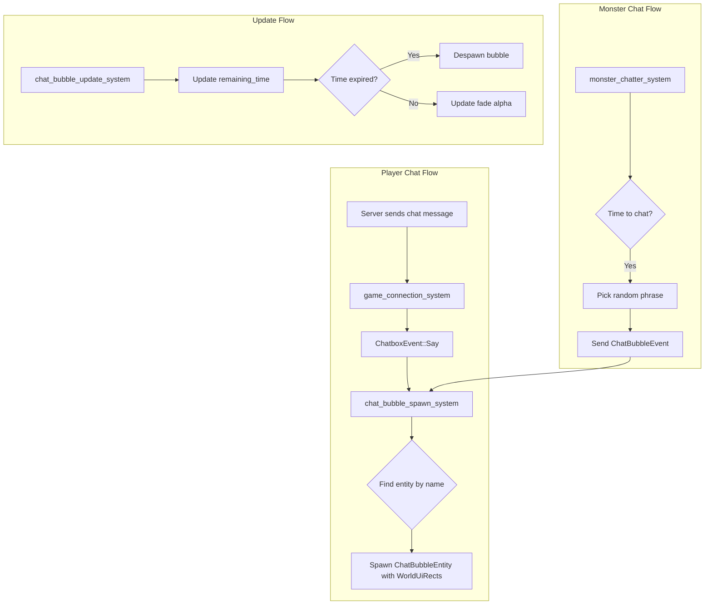

# Chat Bubble System Architecture

## Overview

This document describes the architecture for implementing chat bubbles in the Rose Online client. Chat bubbles will display player chat messages above their characters and random phrases above monsters.

## Existing System Analysis

### ChatboxEvent System
The existing chat system uses [`ChatboxEvent`](src/events/chatbox_event.rs:4) with variants:
- `Say(String, String)` - name and text for normal chat
- `Shout(String, String)` - shouted messages
- `Whisper(String, String)` - private messages
- `Announce(Option<String>, String)` - server announcements
- `System(String)` - system messages
- `Quest(String)` - quest-related messages

### World Space UI Rendering
The [`WorldUiRect`](src/render/world_ui.rs:86) component renders billboard UI elements in world space:
```rust
pub struct WorldUiRect {
    pub image: Handle<Image>,
    pub screen_offset: Vec2,
    pub screen_size: Vec2,
    pub uv_min: Vec2,
    pub uv_max: Vec2,
    pub color: Color,
    pub order: u8,
}
```

### Name Tag Pattern
The [`name_tag_system`](src/systems/name_tag_system.rs:386) demonstrates the pattern for:
1. Using egui to layout text with custom fonts/colors
2. Copying font textures to create Image assets
3. Spawning WorldUiRect entities as children of characters
4. Caching textures for reuse

---

## Architecture Design

### Component Diagram



### System Flow



---

## New Components

### 1. ChatBubble Component
**File:** `src/components/chat_bubble.rs`

```rust
use bevy::prelude::{Component, Entity};
use bevy::reflect::Reflect;

/// Component attached to a chat bubble entity to track its lifetime
#[derive(Component, Reflect)]
pub struct ChatBubble {
    /// The entity this bubble is attached to
    pub target_entity: Entity,
    /// The text being displayed
    pub text: String,
    /// Time remaining before fade-out starts
    pub remaining_time: f32,
    /// Total display time for calculating fade
    pub total_time: f32,
    /// Time when fade-out begins as fraction of total_time
    pub fade_start_fraction: f32,
}

/// Marker component for the parent entity containing chat bubble parts
#[derive(Component)]
pub struct ChatBubbleEntity {
    pub target_entity: Entity,
}

/// Marker component for chat bubble text rects
#[derive(Component)]
pub struct ChatBubbleText;

/// Marker component for chat bubble background rects
#[derive(Component)]
pub struct ChatBubbleBackground;
```

### 2. MonsterChatter Component
**File:** `src/components/monster_chatter.rs`

```rust
use bevy::prelude::{Component, Reflect};
use bevy::platform::collections::HashMap;
use rose_data::NpcId;

/// Component that enables monsters to display random chat phrases
#[derive(Component, Reflect)]
pub struct MonsterChatter {
    /// Time until next chat message
    pub time_until_next_chat: f32,
    /// Minimum time between chats in seconds
    pub min_interval: f32,
    /// Maximum time between chats in seconds
    pub max_interval: f32,
    /// Specific phrases for this monster, overrides default
    pub custom_phrases: Vec<String>,
}

/// Resource defining chat phrases for different monster types
#[derive(Resource, Reflect, Default)]
pub struct MonsterChatterPhrases {
    /// Default phrases for all monsters
    pub default_phrases: Vec<String>,
    /// Phrases specific to NPC types
    pub phrases_by_npc_id: HashMap<NpcId, Vec<String>>,
}
```

---

## New Events

### ChatBubbleEvent
**File:** `src/events/chat_bubble_event.rs`

```rust
use bevy::prelude::Event;
use bevy::ecs::entity::Entity;

/// Event to trigger spawning a chat bubble
#[derive(Event)]
pub struct ChatBubbleEvent {
    /// Entity to attach the bubble to, if known
    pub target_entity: Option<Entity>,
    /// Name of the entity, used for lookup if entity not provided
    pub entity_name: String,
    /// The text to display
    pub text: String,
    /// How long to display the bubble in seconds
    pub duration: f32,
    /// Color of the text
    pub color: Color,
    /// Type of bubble for styling
    pub bubble_type: ChatBubbleType,
}

#[derive(Clone, Copy, Debug, Default)]
pub enum ChatBubbleType {
    #[default]
    Normal,
    Shout,
    Whisper,
    Monster,
    Emote,
}
```

---

## New Systems

### 1. chat_bubble_spawn_system
**File:** `src/systems/chat_bubble_spawn_system.rs`

**Purpose:** Listen for ChatBubbleEvents and spawn chat bubble entities.

**Logic:**
1. Read `ChatBubbleEvent` events
2. Find target entity by name if `target_entity` is None
3. Check if entity already has a chat bubble, despawn old one
4. Create egui text layout with appropriate styling
5. Generate texture using font texture copying pattern from name_tag_system
6. Spawn ChatBubbleEntity with:
   - `ChatBubble` component for lifetime tracking
   - Child entities with `WorldUiRect` for text and background
   - Transform positioned above model height

**Dependencies:**
- `EguiContexts` for text layout
- `Assets<Image>` for texture creation
- Query for `ClientEntityName` to find entities by name
- Query for `ModelHeight` for positioning

### 2. chat_bubble_update_system
**File:** `src/systems/chat_bubble_update_system.rs`

**Purpose:** Update chat bubble lifetimes and handle fade-out.

**Logic:**
1. Query all entities with `ChatBubble` component
2. Decrease `remaining_time` by delta time
3. When `remaining_time <= 0`, despawn the bubble
4. Calculate fade alpha based on remaining time
5. Update `WorldUiRect.color` alpha for fade effect

**Scheduling:** Run in `Update` schedule every frame.

### 3. monster_chatter_system
**File:** `src/systems/monster_chatter_system.rs`

**Purpose:** Make monsters occasionally say random phrases.

**Logic:**
1. Query entities with both `Npc` (monster) and `MonsterChatter` components
2. Decrease `time_until_next_chat` by delta time
3. When timer expires:
   - Pick random phrase from `MonsterChatterPhrases` resource
   - Send `ChatBubbleEvent` with the phrase
   - Reset timer to random value between min/max interval
4. Only trigger if monster is alive and visible

**Configuration:**
- Default interval: 30-120 seconds
- Only active monsters within view distance should chat

### 4. chat_bubble_cleanup_system
**File:** `src/systems/chat_bubble_cleanup_system.rs`

**Purpose:** Clean up chat bubbles when entities are despawned.

**Logic:**
1. Use `RemovedComponents<ClientEntityName>` to detect despawned entities
2. Find and despawn any `ChatBubbleEntity` targeting those entities

---

## Integration Points

### 1. Chat Event Integration
In [`game_connection_system.rs`](src/systems/game_connection_system.rs), when receiving chat messages:

```rust
// After sending ChatboxEvent::Say
Ok(ServerMessage::SayChat { name, text }) => {
    let _ = chatbox_events.write(ChatboxEvent::Say(name.clone(), text.clone()));
    
    // NEW: Also send ChatBubbleEvent
    let _ = chat_bubble_events.write(ChatBubbleEvent {
        target_entity: None, // Will be looked up by name
        entity_name: name,
        text,
        duration: 5.0,
        color: Color::WHITE,
        bubble_type: ChatBubbleType::Normal,
    });
}
```

### 2. Entity Name Registration
The [`ClientEntityName`](src/components/client_entity_name.rs) component is already present on all chat-capable entities. The chat bubble system will query by this name.

### 3. Positioning
Use the existing [`ModelHeight`](src/components/model_height.rs) component to position bubbles above characters:
```rust
let bubble_height = model_height.height + CHAT_BUBBLE_OFFSET; // e.g., +20.0
```

### 4. Rendering
Follow the exact pattern from [`name_tag_system.rs`](src/systems/name_tag_system.rs):
1. Use egui to layout text
2. Copy font texture to new Image
3. Spawn WorldUiRect with the image
4. Add as child of the target entity

---

## Monster Chat Phrases

### Default Phrases (30+ phrases)

**Combat/Aggressive:**
1. "I'll get you!"
2. "You can't hide from me!"
3. "Fresh meat!"
4. "Prepare to die!"
5. "You'll make a fine snack!"
6. "No escape!"
7. "I've been waiting for you..."
8. "Your equipment will be mine!"
9. "Weakling!"
10. "You dare challenge me?"

**Defensive/Scared:**
11. "Please don't hurt me!"
12. "I'm just minding my own business..."
13. "Why me?"
14. "Help! Someone help!"
15. "I surrender!"
16. "Take my items, just let me live!"
17. "I have a family!"
18. "Not the face!"

**Bored/Idle:**
19. "So bored..."
20. "Anyone there?"
21. "I should have stayed in bed..."
22. "Is it lunch time yet?"
23. "My feet hurt..."
24. "When does my shift end?"
25. "I miss the sunshine..."
26. "La la la..."

**Hungry:**
27. "I'm so hungry..."
28. "That player looks tasty..."
29. "When's dinner?"
30. "Got any snacks?"

**Confident/Taunting:**
31. "Is that all you've got?"
32. "Pathetic!"
33. "Come closer..."
34. "You call that a weapon?"
35. "I've seen scarier squirrels!"

**Random/Funny:**
36. "Did you hear that?"
37. "I think I left the oven on..."
38. "Nice weather we're having"
39. "I need a vacation..."
40. "This isn't my real job, you know"
41. "My mom says I'm special"
42. "I'm not paid enough for this"
43. "Have you seen my pet?"
44. "I dropped my wallet somewhere..."
45. "These rocks are uncomfortable"

**Rose Online Themed:**
46. "The Seven Hearts shall rise again!"
47. "Have you visited Junon lately?"
48. "I heard there's treasure in the caves..."
49. "Watch out for the Dragon King!"
50. "The Akram Kingdom will fall!"

### Phrases by Monster Type

**Slimes/Jellies:**
- "Squish squish!"
- "I'm so jiggly!"
- "Don't pop me!"

**Beasts/Animals:**
- "Grrrr..."
- "Rawr!"
- "*growls menacingly*"

**Undead:**
- "Join us..."
- "So cold..."
- "Braaaains... just kidding!"

**Demons:**
- "Your soul will be delicious!"
- "Darkness awaits!"
- "The abyss hungers!"

---

## Implementation Steps

### Phase 1: Core Infrastructure
1. [ ] Create `src/components/chat_bubble.rs` with `ChatBubble`, `ChatBubbleEntity`, `ChatBubbleText`, `ChatBubbleBackground`
2. [ ] Create `src/components/monster_chatter.rs` with `MonsterChatter` and `MonsterChatterPhrases`
3. [ ] Add new components to `src/components/mod.rs`
4. [ ] Create `src/events/chat_bubble_event.rs` with `ChatBubbleEvent` and `ChatBubbleType`
5. [ ] Add new event to `src/events/mod.rs`
6. [ ] Register components and events in `src/lib.rs`

### Phase 2: Spawn System
7. [ ] Create `src/systems/chat_bubble_spawn_system.rs`
8. [ ] Implement text layout using egui (copy pattern from name_tag_system)
9. [ ] Implement bubble background generation
10. [ ] Implement texture creation for text
11. [ ] Spawn WorldUiRect entities as children
12. [ ] Add system to `src/systems/mod.rs` and schedule in `src/lib.rs`

### Phase 3: Update and Cleanup
13. [ ] Create `src/systems/chat_bubble_update_system.rs`
14. [ ] Implement lifetime countdown
15. [ ] Implement fade-out effect
16. [ ] Implement despawn when expired
17. [ ] Create `src/systems/chat_bubble_cleanup_system.rs`
18. [ ] Handle parent entity despawn

### Phase 4: Monster Chatter
19. [ ] Create `src/systems/monster_chatter_system.rs`
20. [ ] Implement timer-based random chat
21. [ ] Add `MonsterChatterPhrases` resource with all phrases
22. [ ] Add `MonsterChatter` component to monster spawning code
23. [ ] Configure reasonable intervals (30-120 seconds)

### Phase 5: Chat Integration
24. [ ] Modify `game_connection_system.rs` to send `ChatBubbleEvent` on chat messages
25. [ ] Add entity name lookup for chat bubbles
26. [ ] Test with player chat (Say, Shout)

### Phase 6: Polish
27. [ ] Add chat bubble background image/sprite
28. [ ] Implement bubble tail/pointer toward character
29. [ ] Add settings for enabling/disabling chat bubbles
30. [ ] Add settings for monster chatter frequency
31. [ ] Performance optimization (pooling, caching)

---

## Configuration

### ChatBubbleSettings Resource
```rust
#[derive(Resource)]
pub struct ChatBubbleSettings {
    /// Enable/disable player chat bubbles
    pub enable_player_bubbles: bool,
    /// Enable/disable monster chatter
    pub enable_monster_chatter: bool,
    /// Default display duration in seconds
    pub default_duration: f32,
    /// Maximum text width before wrapping
    pub max_text_width: f32,
    /// Font size for chat bubbles
    pub font_size: f32,
    /// Vertical offset above model height
    pub vertical_offset: f32,
    /// Fade-out duration as fraction of total time
    pub fade_fraction: f32,
}

impl Default for ChatBubbleSettings {
    fn default() -> Self {
        Self {
            enable_player_bubbles: true,
            enable_monster_chatter: true,
            default_duration: 5.0,
            max_text_width: 200.0,
            font_size: 14.0,
            vertical_offset: 20.0,
            fade_fraction: 0.2, // Last 20% of display time
        }
    }
}
```

---

## Technical Considerations

### Performance
- Cache bubble textures by text content (similar to name_tag_cache)
- Limit maximum bubbles visible at once
- Only spawn monster chatter for visible entities
- Use object pooling for bubble entities

### Text Rendering
- Follow the exact pattern from [`name_tag_system.rs`](src/systems/name_tag_system.rs:193) for texture generation
- Use egui for text layout with word wrapping
- Apply outline/shadow for readability

### Positioning
- Position above model height + offset
- Stack multiple bubbles if needed
- Keep bubbles within screen bounds

### Networking
- Chat bubbles are client-side only
- Monster chatter is client-side only (no server sync needed)
- Player chat bubbles triggered by existing chat events

---

## File Structure Summary

```
src/
├── components/
│   ├── mod.rs                    # Add exports
│   ├── chat_bubble.rs            # NEW
│   └── monster_chatter.rs        # NEW
├── events/
│   ├── mod.rs                    # Add exports
│   └── chat_bubble_event.rs      # NEW
├── systems/
│   ├── mod.rs                    # Add exports
│   ├── chat_bubble_spawn_system.rs    # NEW
│   ├── chat_bubble_update_system.rs   # NEW
│   ├── chat_bubble_cleanup_system.rs  # NEW
│   └── monster_chatter_system.rs      # NEW
├── resources/
│   ├── mod.rs                    # Add exports
│   └── chat_bubble_settings.rs   # NEW
└── lib.rs                        # Register all new components/events/systems
```

---

## Dependencies

No new crate dependencies required. The implementation uses:
- `bevy` - Existing
- `bevy_egui` - Existing (for text layout)
- `rose_game_common` - Existing (for NpcId, etc.)
- `egui` - Existing (for text layout)

---

## Testing Checklist

- [ ] Player chat bubble appears when sending Say message
- [ ] Player chat bubble appears when receiving Say message from others
- [ ] Shout messages have different styling
- [ ] Chat bubble fades out after duration
- [ ] Chat bubble despawns when parent entity is removed
- [ ] Monster chatter triggers at random intervals
- [ ] Monster chatter uses appropriate phrases
- [ ] Multiple bubbles stack properly
- [ ] Performance is acceptable with many entities
- [ ] Bubbles are readable against various backgrounds
