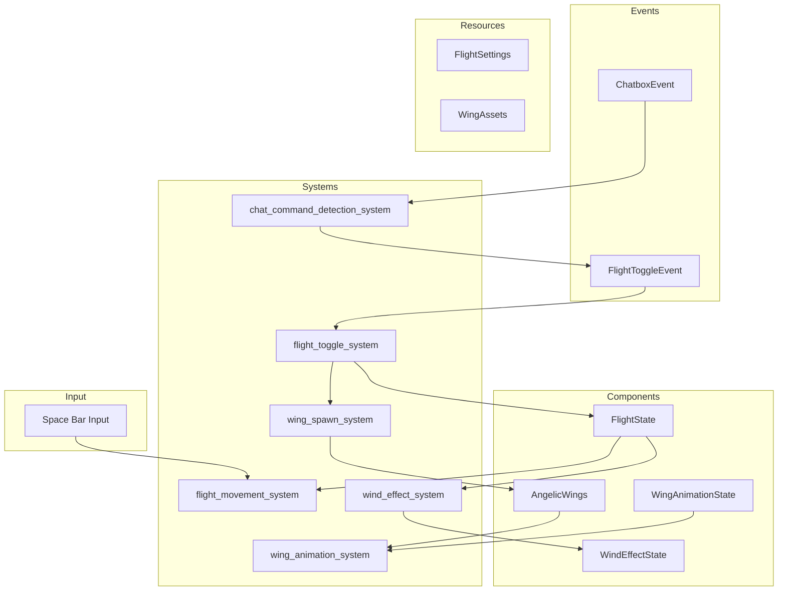

# Flying System Architecture Design

## Overview

This document describes the architecture for a player flying system triggered by the `/fly` chat command. When activated, the player gains angelic wings and can fly forward in the direction they are facing by pressing the Space bar.

## Design Goals

1. **Chat Command Trigger**: Flying is initiated by typing `/fly` in the chat
2. **Flight Controls**: Space bar makes the character fly forward in the direction they are facing
3. **Angelic Wings**: Big, high-quality angelic wings appear when flight is initiated
4. **Wing Animation**: Wings should animate/move while flying
5. **Wind Effects**: Particle-based wind effects while flying

## Architecture Diagram



## Components

### FlightState Component

Location: `src/components/flight_state.rs`

```rust
/// Represents the current flight state of a character
#[derive(Component, Debug, Clone, Reflect)]
#[reflect(Component)]
pub struct FlightState {
    /// Whether the character is currently in flying mode
    pub is_flying: bool,
    /// Whether the character is actively moving forward in flight
    pub is_thrusting: bool,
    /// Current flight speed multiplier
    pub speed_multiplier: f32,
    /// Time accumulator for flight effects
    pub flight_time: f32,
    /// Entity ID of the attached wings
    pub wings_entity: Option<Entity>,
    /// Entity ID of the wind effect emitter
    pub wind_emitter: Option<Entity>,
}

impl Default for FlightState {
    fn default() -> Self {
        Self {
            is_flying: false,
            is_thrusting: false,
            speed_multiplier: 1.0,
            flight_time: 0.0,
            wings_entity: None,
            wind_emitter: None,
        }
    }
}
```

### AngelicWings Component

Location: `src/components/angelic_wings.rs`

```rust
/// Component attached to wing entities for rendering and animation
#[derive(Component, Debug, Clone, Reflect)]
#[reflect(Component)]
pub struct AngelicWings {
    /// Reference to the parent character entity
    pub owner_entity: Entity,
    /// Current flap animation phase - 0 to 2*PI
    pub flap_phase: f32,
    /// Speed of wing flapping animation
    pub flap_speed: f32,
    /// Wing spread amount - 0.0 = folded, 1.0 = fully spread
    pub spread_amount: f32,
    /// Target spread amount for smooth transitions
    pub target_spread: f32,
    /// Glow intensity for the ethereal effect
    pub glow_intensity: f32,
    /// Wing color tint
    pub color_tint: Color,
}

/// Marker component for individual wing parts - left and right
#[derive(Component, Debug, Clone, Copy, Reflect)]
pub struct WingPart {
    /// Which side this wing is on
    pub side: WingSide,
}

#[derive(Debug, Clone, Copy, PartialEq, Eq, Reflect)]
pub enum WingSide {
    Left,
    Right,
}
```

### WindEffectParticle Component

Location: `src/components/wind_effect.rs`

```rust
/// Component for individual wind particles during flight
#[derive(Component, Debug, Clone, Reflect)]
#[reflect(Component)]
pub struct WindEffectParticle {
    /// Current age of the particle in seconds
    pub age: f32,
    /// Total lifetime of the particle in seconds
    pub lifetime: f32,
    /// Current velocity of the particle
    pub velocity: Vec3,
    /// Initial size of the particle
    pub initial_size: f32,
    /// Current alpha value for fading
    pub current_alpha: f32,
    /// Stretch factor based on velocity
    pub stretch: f32,
}

/// Component for the wind effect emitter attached to flying characters
#[derive(Component, Debug, Clone, Reflect)]
#[reflect(Component)]
pub struct WindEffectEmitter {
    /// Time accumulator for particle spawning
    pub spawn_timer: f32,
    /// Interval between particle spawns
    pub spawn_interval: f32,
    /// Number of particles to spawn per burst
    pub particles_per_burst: usize,
}
```

## Resources

### FlightSettings Resource

Location: `src/resources/flight_settings.rs`

```rust
/// Resource holding global flight system settings
#[derive(Resource, Debug, Clone, Reflect)]
#[reflect(Resource)]
pub struct FlightSettings {
    /// Base flight speed in units per second
    pub base_flight_speed: f32,
    /// Maximum flight speed
    pub max_flight_speed: f32,
    /// Acceleration when starting to fly
    pub acceleration: f32,
    /// Deceleration when stopping
    pub deceleration: f32,
    /// Vertical lift when pressing space
    pub vertical_lift: f32,
    /// Enable/disable flight system
    pub enabled: bool,
    /// Wing flap speed when idle
    pub wing_flap_speed_idle: f32,
    /// Wing flap speed when flying
    pub wing_flap_speed_flying: f32,
    /// Wind particle spawn rate
    pub wind_particle_rate: f32,
    /// Maximum wind particles per flyer
    pub max_wind_particles: usize,
}

impl Default for FlightSettings {
    fn default() -> Self {
        Self {
            base_flight_speed: 400.0,
            max_flight_speed: 800.0,
            acceleration: 200.0,
            deceleration: 150.0,
            vertical_lift: 100.0,
            enabled: true,
            wing_flap_speed_idle: 2.0,
            wing_flap_speed_flying: 6.0,
            wind_particle_rate: 0.02,
            max_wind_particles: 100,
        }
    }
}
```

### WingAssets Resource

Location: `src/resources/wing_assets.rs`

```rust
/// Resource holding shared wing mesh and material assets
#[derive(Resource, Debug, Clone)]
pub struct WingAssets {
    /// Procedurally generated wing mesh
    pub wing_mesh: Handle<Mesh>,
    /// Primary wing material with glow effect
    pub wing_material: Handle<StandardMaterial>,
    /// Wing feather texture
    pub feather_texture: Handle<Image>,
    /// Wing glow texture for additive blending
    pub glow_texture: Handle<Image>,
}
```

## Events

### FlightToggleEvent

Location: `src/events/flight_toggle_event.rs`

```rust
/// Event sent when flight mode should be toggled for an entity
#[derive(Event, Debug, Clone)]
pub struct FlightToggleEvent {
    /// The entity to toggle flight for
    pub entity: Entity,
    /// Force enable - if Some, sets to this state regardless of current
    pub force_state: Option<bool>,
}
```

## Systems

### 1. Chat Command Detection System

Location: `src/systems/flight_system.rs`

**Purpose**: Intercepts chat messages and detects `/fly` command

**Implementation Approach**:
- The existing chat system in [`ui_chatbox_system.rs`](src/ui/ui_chatbox_system.rs:78) sends chat via `ClientMessage::Chat`
- We need to intercept messages BEFORE they are sent to check for `/fly`
- This requires modifying the chatbox system or adding a pre-send hook

**Two Options for Implementation**:

**Option A**: Modify `ui_chatbox_system.rs` to check for `/fly` before sending:
```rust
// In ui_chatbox_system.rs, before sending ClientMessage::Chat
if ui_state_chatbox.textbox_text == "/fly" {
    flight_toggle_events.write(FlightToggleEvent {
        entity: player_entity,
        force_state: None,
    });
    ui_state_chatbox.textbox_text.clear();
    // Don't send to server - it's a local command
} else {
    // Existing code to send chat message
    game_connection.client_message_tx.send(ClientMessage::Chat { ... });
}
```

**Option B**: Add a new system that reads outgoing chat messages (requires architecture change)

**Recommended**: Option A is simpler and follows existing patterns.

**System Signature**:
```rust
pub fn chat_command_detection_system(
    mut chatbox_events: EventReader<ChatboxEvent>,  // May need custom event
    mut flight_toggle_events: EventWriter<FlightToggleEvent>,
    player_query: Query<Entity, With<PlayerCharacter>>,
)
```

### 2. Flight Toggle System

Location: `src/systems/flight_system.rs`

**Purpose**: Handles toggling flight mode on/off

**Responsibilities**:
- Listen for `FlightToggleEvent`
- Toggle `FlightState::is_flying` 
- Spawn/despawn wing entities
- Spawn/despawn wind effect emitter
- Send feedback to chat

```rust
pub fn flight_toggle_system(
    mut commands: Commands,
    mut flight_toggle_events: EventReader<FlightToggleEvent>,
    mut flight_state_query: Query<&mut FlightState>,
    mut chatbox_events: EventWriter<ChatboxEvent>,
    wing_assets: Res<WingAssets>,
    settings: Res<FlightSettings>,
)
```

### 3. Flight Movement System

Location: `src/systems/flight_system.rs`

**Purpose**: Handles movement while flying

**Responsibilities**:
- Check for Space bar input when `FlightState::is_flying` is true
- Move character forward in facing direction
- Apply acceleration/deceleration
- Update `FlightState::is_thrusting`
- Integrate with existing `Command` and `Position` systems

**Key Integration Points**:
- Read [`FacingDirection`](src/components/facing_direction.rs:6) to determine forward direction
- Update [`Position`](src/components/position.rs) for movement
- May need to set [`Command::Move`](src/components/command.rs:62) or create flight-specific command

```rust
pub fn flight_movement_system(
    time: Res<Time>,
    keyboard_input: Res<ButtonInput<KeyCode>>,
    settings: Res<FlightSettings>,
    mut query: Query<(
        Entity,
        &mut FlightState,
        &FacingDirection,
        &mut Position,
        Option<&mut Command>,
    ), With<PlayerCharacter>>,
    egui_context: Option<Res<EguiContexts>>,
)
```

### 4. Wing Spawn System

Location: `src/systems/flight_system.rs`

**Purpose**: Spawns angelic wing entities attached to character

**Responsibilities**:
- Create wing mesh entities as children of character
- Position wings on character back
- Apply materials and textures
- Handle wing despawn when flight ends

**Wing Attachment Strategy**:
- Attach to the character model's back bone or root entity
- Use `commands.entity(character_entity).add_child(wing_entity)`
- Follow pattern from [`bird_system.rs`](src/systems/bird_system.rs:187) for child attachment

```rust
pub fn wing_spawn_system(
    mut commands: Commands,
    mut meshes: ResMut<Assets<Mesh>>,
    mut materials: ResMut<Assets<StandardMaterial>>,
    wing_assets: Res<WingAssets>,
    character_query: Query<(Entity, &Transform), With<FlightState>>,
)
```

### 5. Wing Animation System

Location: `src/systems/flight_system.rs`

**Purpose**: Animates wing flapping and spreading

**Responsibilities**:
- Update flap phase based on flight state
- Smoothly interpolate spread amount
- Apply rotation/scale transforms for flapping
- Adjust glow intensity based on speed

```rust
pub fn wing_animation_system(
    time: Res<Time>,
    settings: Res<FlightSettings>,
    flight_query: Query<&FlightState>,
    mut wing_query: Query<(&mut AngelicWings, &mut Transform), Without<FlightState>>,
)
```

### 6. Wind Effect System

Location: `src/systems/flight_system.rs`

**Purpose**: Spawns and updates wind particles during flight

**Responsibilities**:
- Spawn wind particles when flying forward
- Update particle positions and velocities
- Handle particle lifetime and fading
- Despawn expired particles

**Pattern Reference**: Follow [`dirt_dash_system.rs`](src/systems/dirt_dash_system.rs:65) for particle spawning approach

```rust
pub fn wind_effect_spawn_system(
    time: Res<Time>,
    settings: Res<FlightSettings>,
    mut commands: Commands,
    flight_query: Query<(&FlightState, &Position, &FacingDirection)>,
    mut emitter_query: Query<&mut WindEffectEmitter>,
    particle_count: Query<(), With<WindEffectParticle>>,
)

pub fn wind_effect_update_system(
    time: Res<Time>,
    mut commands: Commands,
    mut query: Query<(Entity, &mut WindEffectParticle, &mut Transform)>,
)
```

## Wing Mesh Generation

### Procedural Wing Mesh

Location: `src/systems/flight_system.rs` or separate `src/render/wing_mesh.rs`

**Approach**: Generate wing mesh procedurally similar to [`create_bird_mesh`](src/systems/bird_system.rs:206)

**Wing Design**:
- Large, feathered angel wings
- Multiple segments for animation
- High vertex count for quality (100-200 vertices per wing)
- Separate left and right wing meshes

**Mesh Structure**:
```rust
fn create_angel_wing_mesh(side: WingSide) -> Mesh {
    // Wing segments:
    // - Arm bone (upper wing)
    // - Forearm bone (lower wing)  
    // - Primary feathers (wing tips)
    // - Secondary feathers (mid-wing)
    // - Coverts (small feathers near body)
    
    // Vertex positions with UVs for feather texture
    // Normals for proper lighting
    // Bone weights for potential skeletal animation
}
```

**Material Approach**:
- Use `StandardMaterial` with:
  - Semi-transparency for ethereal look
  - Emissive color for glow effect
  - Double-sided rendering
  - Alpha blending

```rust
fn create_wing_material(texture: Handle<Image>) -> StandardMaterial {
    StandardMaterial {
        base_color: Color::srgba(1.0, 1.0, 1.0, 0.9),
        base_color_texture: Some(texture),
        emissive: Color::srgb(0.5, 0.7, 1.0),  // Soft blue glow
        emissive_texture: Some(glow_texture),
        alpha_mode: AlphaMode::Blend,
        cull_mode: None,  // Double-sided
        perceptual_roughness: 0.3,
        metallic: 0.1,
        ..default()
    }
}
```

## Integration Points

### Character Model Integration

The wings need to attach to the character model. Reference [`CharacterModel`](src/components/character_model.rs:30):

```rust
// CharacterModel has a Back part slot
pub enum CharacterModelPart {
    // ...
    Back,  // Existing slot for back equipment
    // ...
}
```

**Options**:
1. Use existing `Back` slot - may conflict with capes/back items
2. Create separate wing attachment point
3. Attach to character root entity

**Recommended**: Attach to character root entity as a separate child, avoiding equipment slot conflicts.

### Command System Integration

The flight movement should integrate with the existing [`Command`](src/components/command.rs:61) system:

**Options**:
1. Add new `Command::Fly` variant
2. Use `Command::Move` with special `MoveMode::Fly`
3. Flight bypasses Command system entirely

**Recommended**: Add `MoveMode::Fly` and use `Command::Move` with this mode. This integrates with existing movement systems.

```rust
// In rose_game_common::components::MoveMode (external crate)
// May need to extend or wrap

// Alternative: Create local FlightCommand
#[derive(Clone, Debug, PartialEq, Reflect)]
pub struct FlightCommand {
    pub direction: Vec3,
    pub speed: f32,
}
```

### Input System Integration

Check Space bar input following pattern from [`ui_hotbar_system.rs`](src/ui/ui_hotbar_system.rs:228):

```rust
// Check if egui wants keyboard input first
let allow_input = !egui_context.ctx_mut().wants_keyboard_input();

if allow_input && keyboard_input.pressed(KeyCode::Space) {
    // Trigger flight thrust
}
```

## File Structure

### New Files to Create

| File | Description |
|------|-------------|
| `src/components/flight_state.rs` | FlightState component |
| `src/components/angelic_wings.rs` | AngelicWings, WingPart components |
| `src/components/wind_effect.rs` | WindEffectParticle, WindEffectEmitter components |
| `src/resources/flight_settings.rs` | FlightSettings resource |
| `src/resources/wing_assets.rs` | WingAssets resource |
| `src/events/flight_toggle_event.rs` | FlightToggleEvent |
| `src/systems/flight_system.rs` | All flight-related systems |
| `src/render/wing_mesh.rs` | Procedural wing mesh generation |

### Files to Modify

| File | Changes |
|------|---------|
| `src/components/mod.rs` | Add module declarations and exports |
| `src/resources/mod.rs` | Add module declarations and exports |
| `src/events/mod.rs` | Add module declaration and export |
| `src/systems/mod.rs` | Add module declaration and export |
| `src/ui/ui_chatbox_system.rs` | Add `/fly` command detection |
| `src/lib.rs` | Register components, resources, events, and add FlightPlugin |

## Plugin Structure

```rust
// src/systems/flight_system.rs
pub struct FlightPlugin;

impl Plugin for FlightPlugin {
    fn build(&self, app: &mut App) {
        app
            // Register types for reflection
            .register_type::<FlightState>()
            .register_type::<AngelicWings>()
            .register_type::<WingPart>()
            .register_type::<WindEffectParticle>()
            .register_type::<WindEffectEmitter>()
            .register_type::<FlightSettings>()
            
            // Add resources
            .init_resource::<FlightSettings>()
            
            // Add events
            .add_event::<FlightToggleEvent>()
            
            // Add systems
            .add_systems(Startup, setup_wing_assets)
            .add_systems(Update, (
                chat_command_detection_system,
                flight_toggle_system,
                flight_movement_system,
                wing_animation_system,
                wind_effect_spawn_system,
                wind_effect_update_system,
            ).chain());
    }
}
```

## Performance Considerations

1. **Particle Limits**: Use `max_wind_particles` to limit particle count per flyer
2. **Wing LOD**: Consider simpler wing mesh for distant characters
3. **Effect Culling**: Disable wind effects when character is off-screen
4. **Asset Sharing**: All flyers share the same wing mesh and material assets

## Visual Effects

### Wing Glow Effect

- Emissive material with blue-white color
- Pulsing intensity based on flight speed
- Additive blending for ethereal look

### Wind Streak Particles

- White/transparent streak particles
- Stretch based on velocity
- Fade out over lifetime
- Spawn behind character when flying

### Optional Enhancements

- Dust/dirt particles when taking off from ground
- Trail effect similar to [`trail_effect.rs`](src/render/trail_effect.rs)
- Sound effects for wing flapping and wind

## Implementation Order

1. **Phase 1: Core Infrastructure**
   - Create `FlightState` component
   - Create `FlightToggleEvent`
   - Create `FlightSettings` resource
   - Implement `chat_command_detection_system`
   - Implement `flight_toggle_system`
   - Test: `/fly` command toggles flight state

2. **Phase 2: Movement**
   - Implement `flight_movement_system`
   - Integrate with `Position` and `FacingDirection`
   - Test: Space bar moves character forward when flying

3. **Phase 3: Wing Visuals**
   - Create procedural wing mesh
   - Create wing materials
   - Implement `wing_spawn_system`
   - Implement `wing_animation_system`
   - Test: Wings appear and animate when flying

4. **Phase 4: Wind Effects**
   - Create wind particle components
   - Implement `wind_effect_spawn_system`
   - Implement `wind_effect_update_system`
   - Test: Wind particles appear when flying forward

5. **Phase 5: Polish**
   - Add glow effects
   - Tune animation speeds
   - Add chat feedback messages
   - Performance optimization

## Questions for Clarification

1. **Flight Duration**: Should flight have a limited duration or be unlimited?
2. **Collision**: Should flying characters collide with terrain/objects?
3. **Multiplayer**: Should flight state sync with other clients?
4. **Animation Override**: Should flight override character animations?
5. **Wing Design**: Any specific wing design preferences beyond "angelic"?
