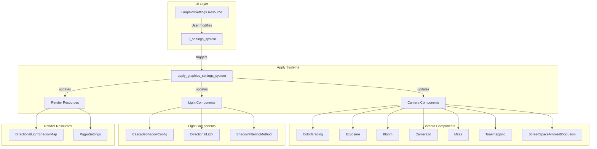

# Graphics Settings System Architecture

## Overview

This document describes the architecture for a new Graphics Settings system in the Rose Offline Client. The system provides runtime-configurable graphics options through a dedicated UI tab in the settings window.

## Table of Contents

1. [Resource Structures](#resource-structures)
2. [Enum Definitions](#enum-definitions)
3. [UI Layout Design](#ui-layout-design)
4. [Apply System Design](#apply-system-design)
5. [Integration Points](#integration-points)
6. [Implementation Checklist](#implementation-checklist)

---

## Resource Structures

### GraphicsSettings Resource

The main resource that stores all graphics configuration:

```rust
/// Resource for storing graphics settings that can be modified at runtime.
/// These settings control visual quality and performance tradeoffs.
#[derive(Resource, Debug, Clone, Reflect)]
#[reflect(Resource, Default, Debug, Clone)]
pub struct GraphicsSettings {
    // === Display Settings ===
    /// VSync mode: 0 = Off, 1 = On (FIFO), 2 = Mailbox
    pub vsync_mode: VsyncMode,
    
    /// MSAA sample count (1, 2, 4, 8)
    pub msaa_samples: MsaaSamples,
    
    // === Shadow Settings ===
    /// Shadow quality preset
    pub shadow_quality: ShadowQuality,
    
    /// Maximum shadow draw distance in world units
    pub shadow_max_distance: f32,
    
    /// Shadow filtering method
    pub shadow_filtering: ShadowFilteringMethod,
    
    // === Post-Processing Settings ===
    /// Brightness adjustment (0.0 - 2.0, default 1.0)
    /// Applied through color grading exposure
    pub brightness: f32,
    
    /// Contrast adjustment (0.0 - 2.0, default 1.0)
    /// Applied through color grading contrast
    pub contrast: f32,
    
    /// Saturation adjustment (0.0 - 2.0, default 1.0)
    /// Applied through color grading saturation
    pub saturation: f32,
    
    /// Gamma correction (0.5 - 2.5, default 1.0)
    /// Applied through color grading gamma
    pub gamma: f32,
    
    // === Quality Settings ===
    /// View distance / draw distance in meters
    pub view_distance: f32,
    
    /// Texture quality level
    pub texture_quality: TextureQuality,
    
    /// Bloom effect enabled
    pub bloom_enabled: bool,
    
    /// Bloom intensity (0.0 - 1.0)
    pub bloom_intensity: f32,
    
    /// Motion blur enabled
    pub motion_blur_enabled: bool,
    
    /// Motion blur intensity (0.0 - 1.0)
    pub motion_blur_intensity: f32,
    
    // === Advanced Settings ===
    /// Tonemapping algorithm
    pub tonemapping: TonemappingMode,
    
    /// SSAO enabled
    pub ssao_enabled: bool,
    
    /// SSAO quality level
    pub ssao_quality: SsaoQuality,
    
    /// Depth of field enabled
    pub dof_enabled: bool,
    
    /// FXAA enabled (fallback if MSAA disabled)
    pub fxaa_enabled: bool,
    
    /// SMAA quality level (alternative to FXAA)
    pub smaa_quality: SmaaQuality,
}

impl Default for GraphicsSettings {
    fn default() -> Self {
        Self {
            // Display - balanced defaults
            vsync_mode: VsyncMode::Enabled,
            msaa_samples: MsaaSamples::X4,
            
            // Shadows - medium quality
            shadow_quality: ShadowQuality::Medium,
            shadow_max_distance: 150.0,
            shadow_filtering: ShadowFilteringMethod::Gaussian,
            
            // Post-processing - neutral defaults
            brightness: 1.0,
            contrast: 1.0,
            saturation: 1.0,
            gamma: 1.0,
            
            // Quality - balanced
            view_distance: 500.0,
            texture_quality: TextureQuality::High,
            
            // Effects
            bloom_enabled: true,
            bloom_intensity: 0.15,
            motion_blur_enabled: false,
            motion_blur_intensity: 0.5,
            
            // Advanced
            tonemapping: TonemappingMode::TonyMcMapface,
            ssao_enabled: true,
            ssao_quality: SsaoQuality::Medium,
            dof_enabled: false,
            fxaa_enabled: false,
            smaa_quality: SmaaQuality::Disabled,
        }
    }
}
```

---

## Enum Definitions

### VsyncMode

```rust
/// VSync configuration options
#[derive(Debug, Clone, Copy, PartialEq, Eq, Default, Reflect)]
#[reflect(Debug, Clone, PartialEq)]
pub enum VsyncMode {
    /// VSync disabled - unlimited FPS, possible tearing
    Disabled,
    /// VSync enabled - caps to refresh rate, no tearing
    #[default]
    Enabled,
    /// Mailbox mode - triple buffering, lowest latency with no tearing
    Mailbox,
}
```

### MsaaSamples

```rust
/// MSAA anti-aliasing sample counts
#[derive(Debug, Clone, Copy, PartialEq, Eq, Default, Reflect)]
#[reflect(Debug, Clone, PartialEq)]
pub enum MsaaSamples {
    /// No MSAA (1 sample)
    #[default]
    X1,
    /// 2x MSAA
    X2,
    /// 4x MSAA
    X4,
    /// 8x MSAA
    X8,
}

impl MsaaSamples {
    pub fn sample_count(&self) -> u32 {
        match self {
            MsaaSamples::X1 => 1,
            MsaaSamples::X2 => 2,
            MsaaSamples::X4 => 4,
            MsaaSamples::X8 => 8,
        }
    }
}
```

### ShadowQuality

```rust
/// Shadow quality presets that configure cascade settings
#[derive(Debug, Clone, Copy, PartialEq, Eq, Default, Reflect)]
#[reflect(Debug, Clone, PartialEq)]
pub enum ShadowQuality {
    /// Shadows disabled
    Off,
    /// Low: 1 cascade, 1024 shadow map
    Low,
    /// Medium: 2 cascades, 2048 shadow map
    #[default]
    Medium,
    /// High: 4 cascades, 2048 shadow map
    High,
    /// Ultra: 4 cascades, 4096 shadow map
    Ultra,
}

impl ShadowQuality {
    /// Returns the cascade count for this quality level
    pub fn cascade_count(&self) -> usize {
        match self {
            ShadowQuality::Off => 0,
            ShadowQuality::Low => 1,
            ShadowQuality::Medium => 2,
            ShadowQuality::High | ShadowQuality::Ultra => 4,
        }
    }
    
    /// Returns the shadow map resolution for this quality level
    pub fn shadow_map_size(&self) -> u32 {
        match self {
            ShadowQuality::Off => 0,
            ShadowQuality::Low => 1024,
            ShadowQuality::Medium | ShadowQuality::High => 2048,
            ShadowQuality::Ultra => 4096,
        }
    }
    
    /// Returns the maximum shadow distance
    pub fn max_distance(&self) -> f32 {
        match self {
            ShadowQuality::Off => 0.0,
            ShadowQuality::Low => 50.0,
            ShadowQuality::Medium => 100.0,
            ShadowQuality::High => 200.0,
            ShadowQuality::Ultra => 400.0,
        }
    }
}
```

### TextureQuality

```rust
/// Texture quality levels affecting mip selection
#[derive(Debug, Clone, Copy, PartialEq, Eq, Default, Reflect)]
#[reflect(Debug, Clone, PartialEq)]
pub enum TextureQuality {
    /// Lowest quality, highest mip bias
    Low,
    /// Medium quality
    Medium,
    /// High quality (default)
    #[default]
    High,
    /// Maximum quality, no mip bias
    Ultra,
}

impl TextureQuality {
    /// Returns the mip bias for this quality level
    pub fn mip_bias(&self) -> f32 {
        match self {
            TextureQuality::Low => 2.0,
            TextureQuality::Medium => 1.0,
            TextureQuality::High => 0.0,
            TextureQuality::Ultra => -0.5,
        }
    }
}
```

### TonemappingMode

```rust
/// Tonemapping algorithm selection
#[derive(Debug, Clone, Copy, PartialEq, Eq, Default, Reflect)]
#[reflect(Debug, Clone, PartialEq)]
pub enum TonemappingMode {
    /// No tonemapping
    None,
    /// Reinhard simple
    Reinhard,
    /// Reinhard luminance
    ReinhardLuminance,
    /// ACES filmic
    AcesFitted,
    /// AgX (neutral, requires LUT)
    AgX,
    /// Somewhat boring display transform
    SomewhatBoringDisplayTransform,
    /// TonyMcMapface (default, neutral)
    #[default]
    TonyMcMapface,
    /// Blender filmic
    BlenderFilmic,
}
```

### SsaoQuality

```rust
/// SSAO quality levels
#[derive(Debug, Clone, Copy, PartialEq, Eq, Default, Reflect)]
#[reflect(Debug, Clone, PartialEq)]
pub enum SsaoQuality {
    /// SSAO disabled
    Off,
    /// Low quality, fewer samples
    Low,
    /// Medium quality (default)
    #[default]
    Medium,
    /// High quality, more samples
    High,
    /// Ultra quality, maximum samples
    Ultra,
}

impl SsaoQuality {
    pub fn to_bevy_quality(&self) -> Option<ScreenSpaceAmbientOcclusionQualityLevel> {
        match self {
            SsaoQuality::Off => None,
            SsaoQuality::Low => Some(ScreenSpaceAmbientOcclusionQualityLevel::Low),
            SsaoQuality::Medium => Some(ScreenSpaceAmbientOcclusionQualityLevel::Medium),
            SsaoQuality::High => Some(ScreenSpaceAmbientOcclusionQualityLevel::High),
            SsaoQuality::Ultra => Some(ScreenSpaceAmbientOcclusionQualityLevel::Ultra),
        }
    }
}
```

### SmaaQuality

```rust
/// SMAA quality levels
#[derive(Debug, Clone, Copy, PartialEq, Eq, Default, Reflect)]
#[reflect(Debug, Clone, PartialEq)]
pub enum SmaaQuality {
    /// SMAA disabled
    #[default]
    Disabled,
    /// Low quality
    Low,
    /// Medium quality
    Medium,
    /// High quality
    High,
    /// Ultra quality
    Ultra,
}
```

---

## UI Layout Design

### Wireframe

```
┌─────────────────────────────────────────────────────────────────────────────┐
│ Settings Window                                                              │
├─────────────────────────────────────────────────────────────────────────────┤
│ [Sound] [Sky] [Stars] [Sky Render] [DOF] [Vol.Fog] [Water] [Fish] [Birds]   │
│ [Seasons] [Dirt Dash] [Wind Sway] [Post Process] [Graphics]                 │
├─────────────────────────────────────────────────────────────────────────────┤
│                                                                              │
│  ┌─ DISPLAY ─────────────────────────────────────────────────────────────┐  │
│  │ VSync:              [▼ Enabled        ]                               │  │
│  │ Anti-Aliasing:      [▼ 4x MSAA        ]                               │  │
│  │ View Distance:      [━━━━━━●━━━━━━━━━] 500m                           │  │
│  └───────────────────────────────────────────────────────────────────────┘  │
│                                                                              │
│  ┌─ SHADOWS ─────────────────────────────────────────────────────────────┐  │
│  │ Shadow Quality:     [▼ Medium         ]                               │  │
│  │ Shadow Distance:    [━━━━━━●━━━━━━━━━] 150                            │  │
│  │ Shadow Filtering:   [▼ Gaussian       ]                               │  │
│  └───────────────────────────────────────────────────────────────────────┘  │
│                                                                              │
│  ┌─ IMAGE ADJUSTMENTS ───────────────────────────────────────────────────┐  │
│  │ Brightness:         [━━━━━━●━━━━━━━━━] 1.00                           │  │
│  │ Contrast:           [━━━━━━●━━━━━━━━━] 1.00                           │  │
│  │ Saturation:         [━━━━━━●━━━━━━━━━] 1.00                           │  │
│  │ Gamma:              [━━━━━━●━━━━━━━━━] 1.00                           │  │
│  │ Tonemapping:        [▼ TonyMcMapface  ]                               │  │
│  └───────────────────────────────────────────────────────────────────────┘  │
│                                                                              │
│  ┌─ EFFECTS ─────────────────────────────────────────────────────────────┐  │
│  │ Bloom:              [✓]  Intensity: [━━━━●━━━━━] 0.15                 │  │
│  │ Motion Blur:        [ ]  Intensity: [━━━━●━━━━━] 0.50                 │  │
│  │ SSAO:               [✓]  Quality:   [▼ Medium     ]                   │  │
│  │ Depth of Field:     [ ]                                               │  │
│  └───────────────────────────────────────────────────────────────────────┘  │
│                                                                              │
│  ┌─ TEXTURES ────────────────────────────────────────────────────────────┐  │
│  │ Texture Quality:    [▼ High           ]                               │  │
│  └───────────────────────────────────────────────────────────────────────┘  │
│                                                                              │
│  ─────────────────────────────────────────────────────────────────────────  │
│  Tip: Higher shadow quality improves visual fidelity but reduces FPS.       │
│                                                                              │
└─────────────────────────────────────────────────────────────────────────────┘
```

### UI Implementation Structure

The UI should be added to [`ui_settings_system.rs`](src/ui/ui_settings_system.rs) as a new `SettingsPage::Graphics` variant:

```rust
SettingsPage::Graphics => {
    // Display Section
    ui.collapsing("Display", |ui| {
        egui::Grid::new("graphics_display")
            .num_columns(2)
            .show(ui, |ui| {
                // VSync
                ui.label("VSync:");
                egui::ComboBox::from_id_salt("vsync")
                    .selected_text(format!("{:?}", graphics_settings.vsync_mode))
                    .show_ui(ui, |ui| {
                        ui.selectable_value(&mut graphics_settings.vsync_mode, VsyncMode::Disabled, "Disabled");
                        ui.selectable_value(&mut graphics_settings.vsync_mode, VsyncMode::Enabled, "Enabled");
                        ui.selectable_value(&mut graphics_settings.vsync_mode, VsyncMode::Mailbox, "Mailbox");
                    });
                ui.end_row();
                
                // MSAA
                ui.label("Anti-Aliasing:");
                egui::ComboBox::from_id_salt("msaa")
                    .selected_text(format!("{}x MSAA", graphics_settings.msaa_samples.sample_count()))
                    .show_ui(ui, |ui| {
                        ui.selectable_value(&mut graphics_settings.msaa_samples, MsaaSamples::X1, "Off");
                        ui.selectable_value(&mut graphics_settings.msaa_samples, MsaaSamples::X2, "2x MSAA");
                        ui.selectable_value(&mut graphics_settings.msaa_samples, MsaaSamples::X4, "4x MSAA");
                        ui.selectable_value(&mut graphics_settings.msaa_samples, MsaaSamples::X8, "8x MSAA");
                    });
                ui.end_row();
                
                // View Distance
                ui.label("View Distance:");
                ui.add(egui::Slider::new(&mut graphics_settings.view_distance, 100.0..=2000.0)
                    .text("m")
                    .show_value(true));
                ui.end_row();
            });
    });
    
    // Shadows Section
    ui.collapsing("Shadows", |ui| {
        // ... shadow controls
    });
    
    // Image Adjustments Section
    ui.collapsing("Image Adjustments", |ui| {
        // ... brightness, contrast, saturation, gamma
    });
    
    // Effects Section
    ui.collapsing("Effects", |ui| {
        // ... bloom, motion blur, SSAO, DOF
    });
    
    // Textures Section
    ui.collapsing("Textures", |ui| {
        // ... texture quality
    });
}
```

---

## Apply System Design

### System Architecture



### Apply System Implementation

```rust
/// System that applies GraphicsSettings changes to the actual render configuration.
/// This system runs in PostUpdate to ensure settings are applied after UI changes.
pub fn apply_graphics_settings_system(
    graphics_settings: Res<GraphicsSettings>,
    
    // Camera queries
    mut cameras: Query<(
        &mut Camera,
        &mut Camera3d,
        Option<&mut ColorGrading>,
        Option<&mut Exposure>,
        Option<&mut Bloom>,
        Option<&mut Tonemapping>,
        Option<&mut ShadowFilteringMethod>,
        Option<&mut ScreenSpaceAmbientOcclusion>,
    ), With<Camera3d>>,
    
    // Light queries
    mut directional_lights: Query<(
        &mut DirectionalLight,
        Option<&mut CascadeShadowConfig>,
    )>,
    
    // Resources
    mut msaa: ResMut<Msaa>,
    mut shadow_map_resource: ResMut<DirectionalLightShadowMap>,
    mut commands: Commands,
) {
    // Skip if settings haven't changed
    if !graphics_settings.is_changed() {
        return;
    }
    
    // === Apply Camera Settings ===
    for (
        mut camera,
        mut camera_3d,
        color_grading,
        exposure,
        bloom,
        tonemapping,
        shadow_filtering,
        ssao,
    ) in cameras.iter_mut() {
        // Apply Color Grading (brightness, contrast, saturation, gamma)
        if let Some(mut cg) = color_grading {
            cg.global.exposure = (graphics_settings.brightness - 1.0) * 2.0; // Map 0-2 to -2 to 2 EV
            cg.shadows.contrast = graphics_settings.contrast;
            cg.midtones.contrast = graphics_settings.contrast;
            cg.highlights.contrast = graphics_settings.contrast;
            cg.global.post_saturation = graphics_settings.saturation;
            cg.shadows.gamma = graphics_settings.gamma;
            cg.midtones.gamma = graphics_settings.gamma;
            cg.highlights.gamma = graphics_settings.gamma;
        }
        
        // Apply Bloom
        if let Some(mut b) = bloom {
            if graphics_settings.bloom_enabled {
                b.intensity = graphics_settings.bloom_intensity;
            } else {
                b.intensity = 0.0;
            }
        }
        
        // Apply Tonemapping
        if let Some(mut tm) = tonemapping {
            *tm = match graphics_settings.tonemapping {
                TonemappingMode::None => Tonemapping::None,
                TonemappingMode::Reinhard => Tonemapping::Reinhard,
                TonemappingMode::ReinhardLuminance => Tonemapping::ReinhardLuminance,
                TonemappingMode::AcesFitted => Tonemapping::AcesFitted,
                TonemappingMode::AgX => Tonemapping::AgX,
                TonemappingMode::SomewhatBoringDisplayTransform => Tonemapping::SomewhatBoringDisplayTransform,
                TonemappingMode::TonyMcMapface => Tonemapping::TonyMcMapface,
                TonemappingMode::BlenderFilmic => Tonemapping::BlenderFilmic,
            };
        }
        
        // Apply Shadow Filtering
        if let Some(mut sf) = shadow_filtering {
            *sf = graphics_settings.shadow_filtering;
        }
        
        // Apply SSAO
        if let Some(mut s) = ssao {
            if graphics_settings.ssao_enabled {
                if let Some(quality) = graphics_settings.ssao_quality.to_bevy_quality() {
                    s.quality_level = quality;
                }
            } else {
                // Remove SSAO component to disable
                commands.entity(camera_3d.entity()).remove::<ScreenSpaceAmbientOcclusion>();
            }
        } else if graphics_settings.ssao_enabled {
            // Add SSAO component if not present
            if let Some(quality) = graphics_settings.ssao_quality.to_bevy_quality() {
                commands.entity(camera_3d.entity()).insert(ScreenSpaceAmbientOcclusion {
                    quality_level: quality,
                    ..default()
                });
            }
        }
    }
    
    // === Apply MSAA ===
    msaa.sample_count = graphics_settings.msaa_samples.sample_count();
    
    // === Apply Shadow Settings to Directional Lights ===
    for (mut light, cascade_config) in directional_lights.iter_mut() {
        // Enable/disable shadows
        light.shadows_enabled = graphics_settings.shadow_quality != ShadowQuality::Off;
        
        // Apply cascade configuration
        if let Some(mut config) = cascade_config {
            let quality = &graphics_settings.shadow_quality;
            *config = CascadeShadowConfigBuilder {
                num_cascades: quality.cascade_count(),
                maximum_distance: graphics_settings.shadow_max_distance.min(quality.max_distance()),
                minimum_distance: 0.1,
                first_cascade_far_bound: graphics_settings.shadow_max_distance / quality.cascade_count() as f32,
                overlap_proportion: 0.2,
            }.build();
        }
    }
    
    // === Apply Shadow Map Resolution ===
    shadow_map_resource.size = graphics_settings.shadow_quality.shadow_map_size();
}

/// System that applies VSync mode changes.
/// Note: VSync changes require window recreation in some cases.
pub fn apply_vsync_system(
    graphics_settings: Res<GraphicsSettings>,
    mut windows: Query<&mut Window>,
) {
    if !graphics_settings.is_changed() {
        return;
    }
    
    for mut window in windows.iter_mut() {
        // Present mode is configured through Window settings
        // This may require window recreation for full effect
    }
}
```

### Change Detection Optimization

For better performance, use a change detection flag:

```rust
#[derive(Resource, Debug, Clone, Reflect)]
pub struct GraphicsSettings {
    // ... all fields from above ...
    
    /// Internal flag to track if settings need to be applied
    #[reflect(ignore)]
    pub(crate) needs_apply: bool,
    
    /// Version number for tracking changes across systems
    #[reflect(ignore)]
    pub(crate) version: u32,
}

impl GraphicsSettings {
    /// Call this after modifying any setting
    pub fn mark_changed(&mut self) {
        self.needs_apply = true;
        self.version = self.version.wrapping_add(1);
    }
}
```

---

## Integration Points

### 1. Add to SettingsSystemParams

In [`ui_settings_system.rs`](src/ui/ui_settings_system.rs), add to the `SettingsSystemParams` struct:

```rust
#[derive(SystemParam)]
pub struct SettingsSystemParams<'w, 's> {
    // ... existing fields ...
    pub graphics_settings: ResMut<'w, GraphicsSettings>,
}
```

### 2. Register Resource in lib.rs

In [`src/lib.rs`](src/lib.rs), register the resource:

```rust
app.init_resource::<GraphicsSettings>()
    .register_type::<GraphicsSettings>()
    .register_type::<VsyncMode>()
    .register_type::<MsaaSamples>()
    .register_type::<ShadowQuality>()
    .register_type::<TextureQuality>()
    .register_type::<TonemappingMode>()
    .register_type::<SsaoQuality>()
    .register_type::<SmaaQuality>();
```

### 3. Add Apply System to Schedule

```rust
app.add_systems(
    PostUpdate,
    (
        apply_graphics_settings_system
            .after(bevy::transform::TransformSystem::TransformPropagate)
            .before(bevy::render::RenderSystems::Extract),
        apply_vsync_system,
    )
);
```

### 4. Add Settings Page to UI

Add `Graphics` to the `SettingsPage` enum:

```rust
#[derive(Copy, Clone, PartialEq, Debug)]
enum SettingsPage {
    Sound,
    Sky,
    Stars,
    // ... existing pages ...
    Graphics,  // Add this
}
```

### 5. Module Structure

Create a new module for graphics settings:

```
src/
├── graphics/
│   ├── mod.rs              # Module exports
│   ├── graphics_settings.rs # GraphicsSettings resource and enums
│   └── apply_systems.rs     # Systems that apply settings
```

---

## Implementation Checklist

### Phase 1: Core Resource
- [ ] Create `src/graphics/mod.rs`
- [ ] Create `src/graphics/graphics_settings.rs` with:
  - [ ] `GraphicsSettings` resource
  - [ ] `VsyncMode` enum
  - [ ] `MsaaSamples` enum
  - [ ] `ShadowQuality` enum
  - [ ] `TextureQuality` enum
  - [ ] `TonemappingMode` enum
  - [ ] `SsaoQuality` enum
  - [ ] `SmaaQuality` enum

### Phase 2: Apply Systems
- [ ] Create `src/graphics/apply_systems.rs` with:
  - [ ] `apply_graphics_settings_system`
  - [ ] `apply_vsync_system`
  - [ ] Helper functions for each setting category

### Phase 3: UI Integration
- [ ] Add `SettingsPage::Graphics` variant
- [ ] Add `GraphicsSettings` to `SettingsSystemParams`
- [ ] Implement UI rendering for Graphics tab
- [ ] Add collapsible sections for each category

### Phase 4: Registration
- [ ] Register resource in `lib.rs`
- [ ] Register all types for reflection
- [ ] Add apply systems to schedule

### Phase 5: Testing
- [ ] Test each setting individually
- [ ] Test setting combinations
- [ ] Verify performance impact
- [ ] Test on different hardware

---

## Notes on Bevy 0.16.1 Integration

### ColorGrading for Brightness/Contrast

Bevy 0.16.1 uses the [`ColorGrading`](C:/Users/vicha/RustroverProjects/bevy-collection/bevy-0.16.1/crates/bevy_render/src/view/mod.rs:321) component for image adjustments:

- **Brightness**: Use `ColorGradingGlobal::exposure` (EV offset in stops)
- **Contrast**: Use `ColorGradingSection::contrast` (1.0 = neutral)
- **Saturation**: Use `ColorGradingGlobal::post_saturation` (1.0 = neutral)
- **Gamma**: Use `ColorGradingSection::gamma` (1.0 = neutral)

### Shadow Configuration

Shadow quality is controlled through:

1. [`CascadeShadowConfig`](C:/Users/vicha/RustroverProjects/bevy-collection/bevy-0.16.1/crates/bevy_pbr/src/light/mod.rs:159) - Controls cascade count and distances
2. [`DirectionalLightShadowMap`](C:/Users/vicha/RustroverProjects/bevy-collection/bevy-0.16.1/crates/bevy_pbr/src/light/mod.rs:133) - Controls shadow map resolution
3. [`ShadowFilteringMethod`](C:/Users/vicha/RustroverProjects/bevy-collection/bevy-0.16.1/crates/bevy_pbr/src/light/mod.rs:498) - Controls edge filtering quality

### MSAA and Anti-Aliasing

- [`Msaa`](C:/Users/vicha/RustroverProjects/bevy-collection/bevy-0.16.1/crates/bevy_core_pipeline/src/core_3d/camera_3d.rs) resource controls sample count
- SMAA can be added as a component: `Smaa::default()`
- FXAA is available but lower quality than SMAA

### Bloom

The [`Bloom`](C:/Users/vicha/RustroverProjects/bevy-collection/bevy-0.16.1/crates/bevy_core_pipeline/src/bloom/settings.rs:29) component controls bloom:
- `intensity` - Overall strength (0.0-1.0)
- `low_frequency_boost` - Enhances large glows
- `prefilter` - Threshold settings

---

## Performance Considerations

| Setting | Low Impact | Medium Impact | High Impact |
|---------|------------|---------------|-------------|
| VSync | - | - | Caps FPS |
| MSAA | 2x | 4x | 8x |
| Shadow Quality | Low | Medium/High | Ultra |
| SSAO | Low | Medium | High/Ultra |
| Bloom | Low intensity | Medium | High intensity |
| View Distance | < 500m | 500-1000m | > 1000m |

### Recommended Presets

```rust
impl GraphicsSettings {
    /// Low-end preset for older hardware
    pub const LOW: Self = Self {
        vsync_mode: VsyncMode::Enabled,
        msaa_samples: MsaaSamples::X1,
        shadow_quality: ShadowQuality::Low,
        shadow_max_distance: 50.0,
        shadow_filtering: ShadowFilteringMethod::Hardware2x2,
        brightness: 1.0,
        contrast: 1.0,
        saturation: 1.0,
        gamma: 1.0,
        view_distance: 300.0,
        texture_quality: TextureQuality::Low,
        bloom_enabled: false,
        bloom_intensity: 0.0,
        motion_blur_enabled: false,
        motion_blur_intensity: 0.0,
        tonemapping: TonemappingMode::Reinhard,
        ssao_enabled: false,
        ssao_quality: SsaoQuality::Off,
        dof_enabled: false,
        fxaa_enabled: true,
        smaa_quality: SmaaQuality::Disabled,
    };
    
    /// Balanced preset for mid-range hardware
    pub const MEDIUM: Self = Self { /* ... */ };
    
    /// High quality preset for modern hardware
    pub const HIGH: Self = Self { /* ... */ };
    
    /// Ultra preset for high-end hardware
    pub const ULTRA: Self = Self { /* ... */ };
}
```
