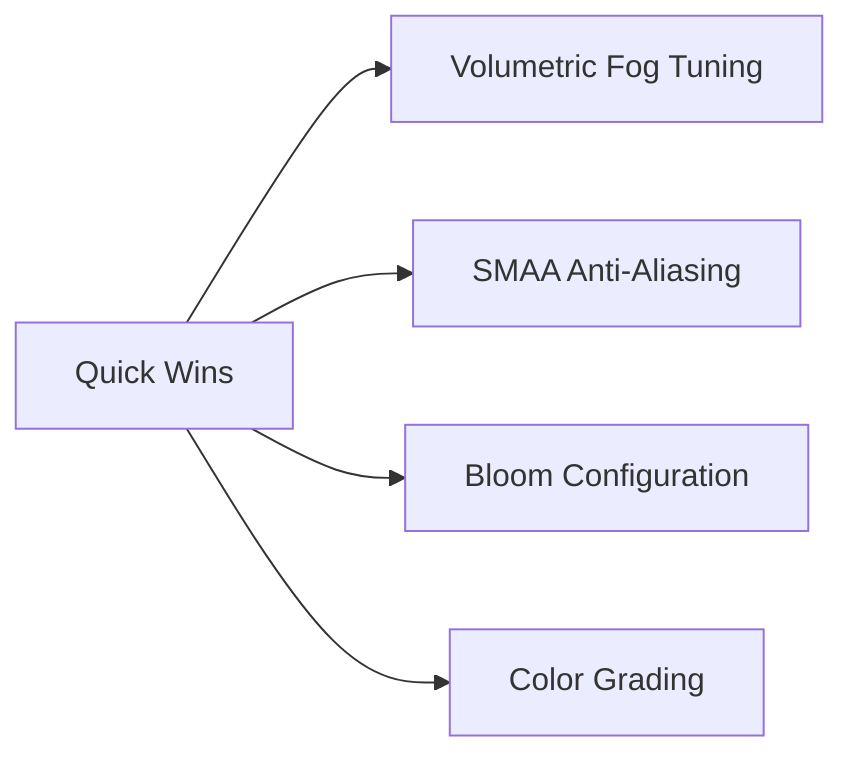

# Graphics Upgrades Report for ROSE Offline Client (Bevy 0.16.1)

## Executive Summary

This report analyzes the current graphics implementation of the ROSE Offline Client and identifies potential upgrade options within Bevy 0.16.1's capabilities. The project already has a sophisticated custom rendering pipeline with terrain, water, particle, and sky systems.

### Top Recommendations by Impact/Effort Ratio

| Priority | Upgrade | Impact | Difficulty | Status |
|----------|---------|--------|------------|--------|
| 🥇 | Shadow Quality Improvements | ⭐⭐⭐⭐⭐ | Medium | Plan Exists |
| 🥈 | Volumetric Fog Integration | ⭐⭐⭐⭐ | Easy | Plan Exists |
| 🥉 | Anti-Aliasing (TAA/SMAA) | ⭐⭐⭐⭐ | Easy | New |
| 4 | Post-Processing Stack | ⭐⭐⭐⭐ | Medium | Partial Impl |
| 5 | Water Rendering Fixes | ⭐⭐⭐⭐ | Medium | Analysis Exists |
| 6 | SSAO Implementation | ⭐⭐⭐ | Medium | New |
| 7 | Bloom Improvements | ⭐⭐⭐ | Easy | New |

### Not Feasible (Asset-Limited)

- **Irradiance Volumes** - Requires pre-baked data not present in game assets
- **Environment Map Lighting** - No zone-specific cubemaps available

---

## Current State Analysis

### Implemented Graphics Features

#### Custom Materials

| Material | Location | Features |
|----------|----------|----------|
| [`TerrainMaterial`](../src/render/terrain_material.rs) | Custom | Texture array (100 tiles), 2-layer blending, lightmap UVs |
| [`WaterMaterial`](../src/render/water_material.rs) | Custom | 25-frame animation, additive blending, procedural waves, foam, SSS, refraction |
| [`ParticleMaterial`](../src/render/particle_material.rs) | Custom | Storage buffer particles, billboarding, custom blending |
| [`SkyMaterial`](../src/render/sky_material.rs) | Custom | Day/night texture blending, time-based transitions |
| [`RoseObjectExtension`](../src/render/object_material_extension.rs) | Extended | Lightmap support, specular textures |

#### Lighting System

From [`zone_lighting.rs`](../src/render/zone_lighting.rs):

| Feature | Implementation | Status |
|---------|---------------|--------|
| Directional Light | `DirectionalLight` with cascade shadows | ✅ Active |
| Ambient Light | `AmbientLight` resource | ✅ Active |
| Volumetric Fog | `FogVolume` + `VolumetricLight` | ✅ Active |
| Custom Zone Lighting | `ZoneLighting` uniform buffer | ✅ Active |
| Height-based Fog | Custom shader implementation | ✅ Active |
| Time-of-Day | Day/night color transitions | ✅ Active |

#### Post-Processing

From [`post_processing.rs`](../src/render/post_processing.rs):

| Feature | Status | Notes |
|---------|--------|-------|
| Exposure | ⚠️ Placeholder | Settings defined but not applied |
| Gamma | ⚠️ Placeholder | Settings defined but not applied |
| Bloom | ✅ Active | Using Bevy's `Bloom::NATURAL` |
| Tonemapping | ✅ Active | `TonyMcMapface` |
| DoF | ✅ Active | Bokeh mode |
| Vignette | ⚠️ Placeholder | Settings defined but not applied |

### Existing Plans Summary

| Plan | Status | Key Points |
|------|--------|------------|
| [Irradiance Volumes](./irradiance-volumes-evaluation.md) | ❌ Not Feasible | Requires pre-baked assets unavailable in game |
| [Shadow Quality](./shadow-shader-quality-improvement-plan.md) | 📋 Ready | Zone lighting integration, shadow caster fixes |
| [Volumetric Lighting](./volumetric-lighting-upgrade-plan.md) | 📋 Ready | Light shafts via FogVolume + VolumetricLight |
| [Water Rendering](./water-rendering-analysis.md) | 📋 Ready | Fix animated textures, proper blending |

---

## Upgrade Options

### 1. Shadow Quality Improvements

**Status:** Comprehensive plan exists at [`shadow-shader-quality-improvement-plan.md`](./shadow-shader-quality-improvement-plan.md)

| Attribute | Rating |
|-----------|--------|
| Visual Impact | ⭐⭐⭐⭐⭐ |
| Implementation | Medium |
| Performance Cost | Medium |

**Current Issues:**
- Zone objects have `NotShadowCaster` preventing shadow casting
- Zone lighting not properly applied in shaders
- Lightmap textures loaded but not sampled
- High ambient light (500.0) washes out scene

**Implementation Approach:**

Phase 1 - Critical Fixes:
1. Remove `NotShadowCaster` from zone objects in [`zone_loader.rs`](../src/zone_loader.rs:2791)
2. Apply zone lighting fog in [`rose_object_extension.wgsl`](../src/render/shaders/rose_object_extension.wgsl)
3. Implement lightmap sampling in shaders
4. Reduce ambient light from 500.0 to ~100.0

Phase 2 - Shadow Quality:
1. Configure `ShadowFilteringMethod::Temporal` for soft shadows
2. Tune cascade shadow bounds: `[50.0, 200.0, 800.0, 3000.0]`
3. Enable TAA for temporal shadow filtering

**Bevy 0.16.1 Notes:**
- Shadow filtering methods unchanged from 0.15
- Cascade shadow config compatible
- TAA requires `Msaa::Off`

---

### 2. Volumetric Lighting (Light Shafts)

**Status:** Plan exists at [`volumetric-lighting-upgrade-plan.md`](./volumetric-lighting-upgrade-plan.md)

| Attribute | Rating |
|-----------|--------|
| Visual Impact | ⭐⭐⭐⭐ |
| Implementation | Easy |
| Performance Cost | Medium |

**Current State:**
- `VolumetricLight` component already added to directional light
- `FogVolume` spawned but with low density (0.02)
- Zone lighting integration exists via `update_volumetric_fog_system`

**Implementation Approach:**

1. **Already Done:**
   - `VolumetricLight` on directional light
   - `FogVolume` entity spawned
   - `ZoneLighting` resource with volumetric parameters

2. **Remaining:**
   - Add `VolumetricFog` component to camera
   - Tune default density/scattering values
   - Connect time-of-day to fog color transitions
   - Add debug UI controls

**Recommended Settings:**
```rust
VolumetricFog {
    step_count: 64,  // Balanced quality
    jitter: 0.0,     // Increase with TAA
}
FogVolume {
    density_factor: 0.05,
    scattering: 0.3,
    scattering_asymmetry: 0.5,
}
```

**Bevy 0.16.1 Notes:**
- `VolumetricFogPlugin` included in DefaultPlugins
- No breaking changes from 0.15

---

### 3. Anti-Aliasing (TAA/SMAA)

**Status:** New option - not implemented

| Attribute | Rating |
|-----------|--------|
| Visual Impact | ⭐⭐⭐⭐ |
| Implementation | Easy |
| Performance Cost | Low-Medium |

**Current State:**
- No explicit anti-aliasing configured
- Default MSAA likely active

**Available Options in Bevy 0.16.1:**

| Method | Quality | Performance | Notes |
|--------|---------|-------------|-------|
| MSAA | High | High | Default, doesn't work with deferred |
| FXAA | Low | Very Fast | Post-process, slightly blurry |
| SMAA | High | Medium | Best quality/performance balance |
| TAA | Very High | Medium | Requires motion vectors, best with temporal shadows |

**Implementation Approach:**

**Option A: SMAA (Recommended)**
```rust
// In Cargo.toml
bevy = { version = "0.16", features = ["smaa_luts"] }

// In camera spawn
app.add_plugins(bevy::anti_aliasing::SmaaPlugin);
commands.spawn((
    Camera3d::default(),
    bevy::anti_aliasing::SmaaSettings::default(),
));
```

**Option B: TAA (Best with temporal shadows)**
```rust
// TAA requires MSAA off
app.insert_resource(Msaa::Off);
app.add_plugins(bevy::anti_aliasing::TemporalAntiAliasPlugin);

// On camera
commands.spawn((
    Camera3d::default(),
    bevy::anti_aliasing::TemporalAntiAliasSettings::default(),
));
```

**Bevy 0.16.1 Notes:**
- Anti-aliasing moved to `bevy::anti_aliasing` module (from `bevy::core_pipeline`)
- TAA works best with HDR enabled
- TAA incompatible with MSAA

---

### 4. Post-Processing Stack

**Status:** Partially implemented - needs completion

| Attribute | Rating |
|-----------|--------|
| Visual Impact | ⭐⭐⭐⭐ |
| Implementation | Medium |
| Performance Cost | Low-Medium |

**Current State:**
- [`PostProcessingSettings`](../src/render/post_processing.rs:27-37) resource defined
- Render graph node exists but is passthrough
- Bloom and DoF using Bevy's built-in

**Missing Features:**
- Exposure control not applied
- Gamma correction not applied
- Contrast/saturation not applied
- Vignette not applied

**Implementation Approach:**

1. **Use Bevy's Built-in (Recommended):**
   Bevy 0.16 provides comprehensive post-processing:

```rust
commands.spawn((
    Camera3d::default(),
    // Bloom
    Bloom {
        intensity: 0.15,
        low_frequency_boost: 0.7,
        low_frequency_boost_curvature: 0.95,
        high_pass_frequency: 1.0,
        prefilter_settings: BloomPrefilterSettings {
            threshold: 0.5,
            threshold_softness: 0.5,
        },
        composite_mode: BloomCompositeMode::Additive,
    },
    // Tonemapping already active
    Tonemapping::TonyMcMapface,
    // Color grading
    ColorGrading {
        exposure: 0.0,
        gamma: 1.0,
        pre_saturation: 1.0,
        post_saturation: 1.0,
    },
    // Vignette (via ChromaticAberration or custom)
));
```

2. **Custom Post-Processing:**
   Complete the existing [`post_processing.wgsl`](../src/render/shaders/post_processing.wgsl) shader:
   - Implement exposure adjustment
   - Add gamma correction
   - Add contrast/saturation controls
   - Implement vignette effect

**Bevy 0.16.1 Notes:**
- `ColorGrading` component provides exposure/gamma/saturation
- Bloom API unchanged
- Consider `ScreenSpaceAmbientOcclusion` for additional depth

---

### 5. Water Rendering Fixes

**Status:** Analysis exists at [`water-rendering-analysis.md`](./water-rendering-analysis.md)

| Attribute | Rating |
|-----------|--------|
| Visual Impact | ⭐⭐⭐⭐ |
| Implementation | Medium |
| Performance Cost | Low |

**Current State:**
The water material is already quite sophisticated with:
- 25-frame texture animation with blending
- Procedural wave normals
- Fresnel effect
- Specular highlights
- Foam effects (organic noise-based)
- Subsurface scattering approximation
- Pseudo-refraction via UV distortion

**Current Issues:**
- Zone lighting not integrated (custom uniforms used instead)
- Missing reflection from environment

**Implementation Approach:**

1. **Zone Lighting Integration:**
   The water shader uses its own lighting uniforms instead of `zone_lighting`. Consider:
   - Adding zone fog to water shader
   - Connecting time-of-day to water colors

2. **Potential Enhancements:**
   - Screen-space reflections (SSR) - Bevy has experimental support
   - Better depth-based foam at water edges
   - Caustics simulation

**Bevy 0.16.1 Notes:**
- SSR available but experimental
- Water material implementation is solid

---

### 6. Screen-Space Ambient Occlusion (SSAO)

**Status:** New option - not implemented

| Attribute | Rating |
|-----------|--------|
| Visual Impact | ⭐⭐⭐ |
| Implementation | Medium |
| Performance Cost | Medium |

**Description:**
SSAO adds contact shadows in crevices and where objects meet surfaces, greatly improving depth perception.

**Implementation Approach:**

```rust
use bevy::pbr::{ScreenSpaceAmbientOcclusionPlugin, ScreenSpaceAmbientOcclusionSettings};

// In app setup
app.add_plugins(ScreenSpaceAmbientOcclusionPlugin);

// On camera
commands.spawn((
    Camera3d::default(),
    ScreenSpaceAmbientOcclusionSettings {
        quality: ScreenSpaceAmbientOcclusionQuality::Medium,
        ..default()
    },
    // Requires depth prepass
    DepthPrepass,
    NormalPrepass,
));
```

**Quality Settings:**
| Level | Performance | Quality |
|-------|-------------|---------|
| Low | Fast | Basic AO |
| Medium | Balanced | Good for most cases |
| High | Slower | Best quality |

**Bevy 0.16.1 Notes:**
- Requires `DepthPrepass` and `NormalPrepass` on camera
- Works with forward rendering
- May require shader modifications for custom materials

---

### 7. Bloom Improvements

**Status:** Basic bloom active, can be enhanced

| Attribute | Rating |
|-----------|--------|
| Visual Impact | ⭐⭐⭐ |
| Implementation | Easy |
| Performance Cost | Low |

**Current State:**
Using `Bloom::NATURAL` preset on camera.

**Enhancement Options:**

```rust
// Custom bloom configuration
Bloom {
    intensity: 0.15,
    low_frequency_boost: 0.7,
    low_frequency_boost_curvature: 0.95,
    high_pass_frequency: 1.0,
    prefilter_settings: BloomPrefilterSettings {
        threshold: 0.5,      // Lower = more bloom
        threshold_softness: 0.5,
    },
    composite_mode: BloomCompositeMode::Additive,
}
```

**Visual Impact by Scene Type:**
| Scene | Threshold | Intensity |
|-------|-----------|-----------|
| Day Outdoor | 0.6 | 0.1 |
| Night/Evening | 0.4 | 0.2 |
| Indoor | 0.7 | 0.15 |
| Water/Sun Reflection | 0.3 | 0.25 |

---

### 8. Screen-Space Reflections (SSR)

**Status:** Experimental in Bevy - not implemented

| Attribute | Rating |
|-----------|--------|
| Visual Impact | ⭐⭐⭐⭐⭐ |
| Implementation | Hard |
| Performance Cost | High |

**Description:**
SSR provides real-time reflections on surfaces, particularly impactful for water and metallic objects.

**Implementation Approach:**

```rust
use bevy::pbr::{ScreenSpaceReflectionsPlugin, ScreenSpaceReflectionsSettings};

// In app setup
app.add_plugins(ScreenSpaceReflectionsPlugin);

// On camera
commands.spawn((
    Camera3d::default(),
    ScreenSpaceReflectionsSettings {
        enabled: true,
        // Quality/performance tuning
        ..default()
    },
    // Requires prepasses
    DepthPrepass,
    NormalPrepass,
    MotionVectorPrepass,
));
```

**Bevy 0.16.1 Notes:**
- Experimental feature
- Requires `MotionVectorPrepass`
- Performance intensive
- May have artifacts on complex geometry

---

### 9. Order Independent Transparency (OIT)

**Status:** Available in Bevy 0.16 - not implemented

| Attribute | Rating |
|-----------|--------|
| Visual Impact | ⭐⭐⭐⭐ |
| Implementation | Easy |
| Performance Cost | Medium-High |

**Description:**
OIT solves the sorting problem for transparent objects, making particles and foliage look correct from any angle.

**Implementation Approach:**

```rust
use bevy::core_pipeline::oit::OrderIndependentTransparencySettings;

commands.spawn((
    Camera3d::default(),
    OrderIndependentTransparencySettings {
        layer_count: 16,  // More layers = better quality, more memory
        alpha_threshold: 0.0,
    },
));
```

**Bevy 0.16.1 Notes:**
- New `alpha_threshold` field added in 0.16
- Requires sufficient GPU memory
- Works automatically with transparent materials

---

### 10. Deferred Rendering

**Status:** Available but not implemented

| Attribute | Rating |
|-----------|--------|
| Visual Impact | ⭐⭐⭐ |
| Implementation | Medium |
| Performance Cost | Variable |

**Description:**
Deferred rendering separates geometry from lighting, beneficial for scenes with many lights.

**Pros:**
- Better performance with many lights
- Consistent lighting quality
- Required for some advanced effects

**Cons:**
- No MSAA support
- Higher memory usage
- May not benefit ROSE's typical single-light scenes

**Implementation Approach:**

```rust
commands.spawn((
    Camera3d::default(),
    // Enable deferred mode
    DeferredPrepass,
    DepthPrepass,
    NormalPrepass,
    MotionVectorPrepass,
));
```

**Recommendation:** 
Not recommended for ROSE Offline Client as the game typically uses a single directional light with lightmaps. Forward rendering is more appropriate.

---

## Priority Recommendations

### Quick Wins (Easy + High Impact)



| Upgrade | Effort | Impact | ROI |
|---------|--------|--------|-----|
| Volumetric Fog | 2h | High | ⭐⭐⭐⭐⭐ |
| SMAA | 1h | High | ⭐⭐⭐⭐⭐ |
| Bloom Tuning | 30m | Medium | ⭐⭐⭐⭐ |
| Color Grading | 1h | Medium | ⭐⭐⭐⭐ |

### Medium Investment (Medium Effort + High Impact)

| Upgrade | Effort | Impact | ROI |
|---------|--------|--------|-----|
| Shadow Quality | 1-2 days | Very High | ⭐⭐⭐⭐⭐ |
| Post-Processing | 1 day | High | ⭐⭐⭐⭐ |
| SSAO | 4h | Medium-High | ⭐⭐⭐ |

### Major Projects (High Effort)

| Upgrade | Effort | Impact | ROI |
|---------|--------|--------|-----|
| SSR | 2-3 days | Very High | ⭐⭐⭐ |
| OIT | 1-2 days | High | ⭐⭐⭐ |
| Water Enhancements | 2-3 days | High | ⭐⭐⭐ |

---

## Implementation Roadmap

### Phase 1: Quick Wins (1-2 days)

1. **Enable SMAA**
   - Add `SmaaPlugin`
   - Configure `SmaaSettings` on camera
   - Disable MSAA

2. **Configure Volumetric Fog**
   - Add `VolumetricFog` to camera
   - Tune density/scattering values
   - Connect time-of-day transitions

3. **Tune Bloom**
   - Replace `Bloom::NATURAL` with custom settings
   - Add scene-specific configurations

4. **Add Color Grading**
   - Add `ColorGrading` component
   - Create presets for different times of day

### Phase 2: Shadow Quality (2-3 days)

Follow existing plan in [`shadow-shader-quality-improvement-plan.md`](./shadow-shader-quality-improvement-plan.md):

1. Remove `NotShadowCaster` from objects
2. Apply zone lighting in shaders
3. Implement lightmap sampling
4. Configure shadow filtering
5. Tune cascade parameters

### Phase 3: Post-Processing (1-2 days)

1. Complete custom post-processing shader OR
2. Use Bevy's built-in `ColorGrading`
3. Add vignette effect
4. Create time-of-day presets

### Phase 4: Advanced Effects (Optional)

1. **SSAO** - Add depth to scenes
2. **SSR** - For water reflections (experimental)
3. **OIT** - For particle sorting

---

## Technical Reference

### Bevy 0.16.1 Graphics Changes

From the migration guide, relevant changes include:

| Change | Impact on Project |
|--------|------------------|
| Anti-aliasing moved to `bevy::anti_aliasing` | Update imports |
| OIT has new `alpha_threshold` field | Configure if using OIT |
| wgpu v24 upgrade | DXC compiler priority changed |
| Indirect drawing enabled by default | May improve performance |
| `ColorGrading` component available | Use for post-processing |

### File References

| Component | File | Lines |
|-----------|------|-------|
| Camera Setup | [`lib.rs`](../src/lib.rs) | ~1528-1558 |
| Zone Lighting | [`zone_lighting.rs`](../src/render/zone_lighting.rs) | Full file |
| Water Material | [`water_material.rs`](../src/render/water_material.rs) | Full file |
| Water Shader | [`water_material.wgsl`](../src/render/shaders/water_material.wgsl) | Full file |
| Terrain Material | [`terrain_material.rs`](../src/render/terrain_material.rs) | Full file |
| Object Shader | [`rose_object_extension.wgsl`](../src/render/shaders/rose_object_extension.wgsl) | Full file |
| Post Processing | [`post_processing.rs`](../src/render/post_processing.rs) | Full file |

### Performance Considerations

| Effect | GPU Cost | Memory Cost | Recommendation |
|--------|----------|-------------|----------------|
| SMAA | Low | Low | Enable |
| TAA | Medium | Low | Optional (with temporal shadows) |
| SSAO | Medium | Low | Optional |
| SSR | High | Medium | Experimental only |
| OIT | Medium | High | For particle-heavy scenes |
| Volumetric Fog | Medium | Low | Enable (already present) |

---

## Conclusion

The ROSE Offline Client has a solid graphics foundation with custom materials for terrain, water, particles, and sky. The most impactful upgrades are:

1. **Shadow Quality** - Following the existing plan will dramatically improve visual quality
2. **Volumetric Fog** - Already partially implemented, just needs tuning
3. **Anti-Aliasing** - Quick win with significant visual improvement
4. **Post-Processing** - Complete the existing system or use Bevy's built-in

The existing plans are well-researched and ready for implementation. The new options identified (SMAA, SSAO, OIT) can be added incrementally based on visual priorities and performance budget.

---

## Appendix: Not Feasible Options

### Irradiance Volumes / Light Probes

**Status:** NOT FEASIBLE

As documented in [`irradiance-volumes-evaluation.md`](./irradiance-volumes-evaluation.md):

- Requires pre-baked 3D texture data not present in game assets
- Original ROSE Online used lightmaps, not irradiance volumes
- Creating custom data would require:
  - Exporting all zone geometry to Blender
  - Setting up Eevee irradiance volumes
  - Baking and exporting for each of 50+ zones
  - Significant manual labor

**Alternative:** Continue using existing lightmap system which already provides static GI.

---

*Report generated: 2026-02-22*
*Bevy Version: 0.16.1*
*Project: ROSE Offline Client*
