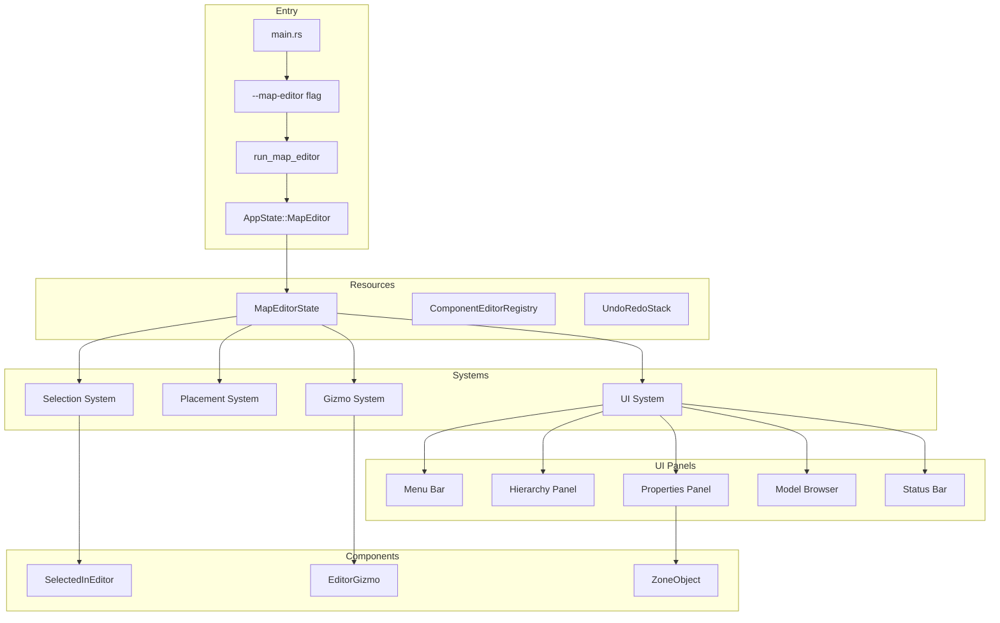

# Map Editor System Architecture

## Overview

This document describes the architecture for implementing a live map editor for the Rose Online client. The editor will allow real-time editing of zone objects, terrain, and entity properties through an egui-based interface.

## Table of Contents

1. [Command Line Argument Parsing](#1-command-line-argument-parsing)
2. [MapEditorState Resource Design](#2-mapeditorstate-resource-design)
3. [Entity Selection System](#3-entity-selection-system)
4. [egui Panel Design](#4-egui-panel-design)
5. [Property Editing System](#5-property-editing-system)
6. [Model Management System](#6-model-management-system)
7. [Map Serialization and Saving](#7-map-serialization-and-saving)
8. [Implementation Steps](#8-implementation-steps)

---

## 1. Command Line Argument Parsing

### Approach

Add a new `--map-editor` flag to [`src/main.rs`](src/main.rs:1) following the existing pattern used for `--zone-viewer` and `--model-viewer`.

### Implementation

```rust
// In src/main.rs, add to clap Command:
.arg(
    clap::Arg::new("map-editor")
        .long("map-editor")
        .help("Run map editor mode"),
)

// Add new run mode check:
if matches.is_present("map-editor") {
    run_map_editor(&config, zone_id);
}
```

### New Entry Point

Create a new `run_map_editor()` function in [`src/lib.rs`](src/lib.rs:1):

```rust
pub fn run_map_editor(config: &Config, zone_id: Option<ZoneId>) {
    run_client(
        config,
        AppState::MapEditor,
        SystemsConfig {
            add_custom_systems: Some(Box::new(move |app| {
                app.world_mut().send_event(LoadZoneEvent::new(
                    zone_id.unwrap_or_else(|| ZoneId::new(1).unwrap()),
                ));
            })),
            ..Default::default()
        },
    );
}
```

### AppState Extension

Add new state to [`src/resources/app_state.rs`](src/resources/app_state.rs):

```rust
#[derive(Debug, Clone, Copy, Default, Eq, Hash, PartialEq, States)]
pub enum AppState {
    #[default]
    GameLogin,
    GameCharacterSelect,
    Game,
    ModelViewer,
    ZoneViewer,
    MapEditor,  // NEW
}
```

---

## 2. MapEditorState Resource Design

### Core Resource Structure

```rust
// src/resources/map_editor.rs

use bevy::prelude::*;
use std::collections::HashSet;

#[derive(Resource, Default)]
pub struct MapEditorState {
    // Selection
    pub selected_entity: Option<Entity>,
    pub selected_entities: HashSet<Entity>,  // Multi-select with Ctrl
    pub selection_mode: SelectionMode,
    
    // Editor Mode
    pub editor_mode: EditorMode,
    pub transform_mode: TransformMode,
    pub transform_space: TransformSpace,
    
    // UI State
    pub hierarchy_filter: HierarchyFilter,
    pub show_grid: bool,
    pub show_colliders: bool,
    pub show_gizmos: bool,
    pub snap_to_grid: bool,
    pub grid_size: f32,
    
    // Undo/Redo
    pub undo_stack: Vec<EditorAction>,
    pub redo_stack: Vec<EditorAction>,
    pub max_undo_steps: usize,
    
    // Modified State
    pub is_modified: bool,
    pub current_zone_id: Option<ZoneId>,
    
    // Model Browser
    pub model_browser_search: String,
    pub model_browser_category: ModelCategory,
}

#[derive(Default, Clone, Copy, PartialEq, Eq)]
pub enum SelectionMode {
    #[default]
    Single,
    Multi,
    Area,
}

#[derive(Default, Clone, Copy, PartialEq, Eq)]
pub enum EditorMode {
    #[default]
    Select,
    Translate,
    Rotate,
    Scale,
    Add,
    Delete,
}

#[derive(Default, Clone, Copy, PartialEq, Eq)]
pub enum TransformMode {
    #[default]
    Translate,
    Rotate,
    Scale,
}

#[derive(Default, Clone, Copy, PartialEq, Eq)]
pub enum TransformSpace {
    #[default]
    World,
    Local,
}

#[derive(Default, Clone, Copy, PartialEq, Eq)]
pub enum HierarchyFilter {
    #[default]
    All,
    DecoObjects,
    CnstObjects,
    EventObjects,
    WarpObjects,
    Terrain,
    Water,
    Effects,
    Sounds,
}

#[derive(Default, Clone, Copy, PartialEq, Eq)]
pub enum ModelCategory {
    #[default]
    All,
    Deco,
    Cnst,
    Event,
    Special,
}
```

### Editor Action for Undo/Redo

```rust
// src/resources/map_editor.rs

#[derive(Clone)]
pub enum EditorAction {
    TransformEntity {
        entity: Entity,
        old_transform: Transform,
        new_transform: Transform,
    },
    AddEntity {
        entity: Entity,
        zone_object: ZoneObject,
        transform: Transform,
    },
    RemoveEntity {
        entity: Entity,
        zone_object: ZoneObject,
        transform: Transform,
        parent: Option<Entity>,
    },
    PropertyChange {
        entity: Entity,
        component_type: ComponentType,
        old_value: Box<dyn std::any::Any>,
        new_value: Box<dyn std::any::Any>,
    },
}
```

---

## 3. Entity Selection System

### Raycasting from Mouse Position

Based on the existing [`debug_inspector_picking_system`](src/systems/debug_inspector_system.rs:93), implement a click-based selection system.

```rust
// src/systems/map_editor_selection_system.rs

use bevy::prelude::*;
use bevy_egui::EguiContexts;
use bevy_rapier3d::prelude::*;

fn map_editor_selection_system(
    mut map_editor_state: ResMut<MapEditorState>,
    mut egui_ctx: EguiContexts,
    mouse_input: Res<ButtonInput<MouseButton>>,
    keyboard: Res<ButtonInput<KeyCode>>,
    rapier_context: ReadRapierContext,
    query_window: Query<&Window, With<PrimaryWindow>>,
    query_camera: Query<(&Camera, &GlobalTransform), With<Camera3d>>,
    query_zone_objects: Query<(Entity, &ZoneObject, &Transform)>,
) {
    // Skip if egui wants pointer input
    if egui_ctx.ctx_mut().wants_pointer_input() {
        return;
    }
    
    let Ok(window) = query_window.get_single() else { return; };
    let Some(cursor_position) = window.cursor_position() else { return; };
    
    // Handle click selection
    if mouse_input.just_pressed(MouseButton::Left) {
        for (camera, camera_transform) in query_camera.iter() {
            if let Ok(ray) = camera.viewport_to_world(camera_transform, cursor_position) {
                // Cast ray to find entity
                if let Some((entity, _distance)) = rapier_context.cast_ray(
                    ray.origin,
                    *ray.direction,
                    10000000.0,
                    false,
                    QueryFilter::new().groups(CollisionGroups::new(
                        COLLISION_FILTER_INSPECTABLE,
                        Group::all(),
                    )),
                ) {
                    // Handle multi-select with Ctrl
                    if keyboard.pressed(KeyCode::ControlLeft) {
                        if map_editor_state.selected_entities.contains(&entity) {
                            map_editor_state.selected_entities.remove(&entity);
                        } else {
                            map_editor_state.selected_entities.insert(entity);
                        }
                    } else {
                        map_editor_state.selected_entities.clear();
                        map_editor_state.selected_entities.insert(entity);
                    }
                    map_editor_state.selected_entity = Some(entity);
                } else {
                    // Clicked empty space - clear selection
                    if !keyboard.pressed(KeyCode::ControlLeft) {
                        map_editor_state.selected_entities.clear();
                        map_editor_state.selected_entity = None;
                    }
                }
            }
        }
    }
}
```

### Selection Highlighting

```rust
// src/systems/map_editor_selection_highlight_system.rs

fn map_editor_selection_highlight_system(
    map_editor_state: Res<MapEditorState>,
    mut query_selected: Query<&mut Visibility, With<SelectedInEditor>>,
    mut query_not_selected: Query<&mut Visibility, (Without<SelectedInEditor>, With<ZoneObject>)>,
) {
    // Add/remove SelectedInEditor marker component based on selection
    // Update outline shader or highlight material
}
```

### Component Marker

```rust
// src/components/map_editor.rs

#[derive(Component)]
pub struct SelectedInEditor;

#[derive(Component)]
pub struct EditorGizmo {
    pub target_entity: Entity,
    pub gizmo_type: GizmoType,
}

pub enum GizmoType {
    Translate,
    Rotate,
    Scale,
}
```

---

## 4. egui Panel Design

### Panel Layout

```
+--------------------------------------------------+
| Menu Bar (File, Edit, View, Object, Help)       |
+------------+---------------------+---------------+
| Hierarchy  | 3D View            | Properties    |
| Panel      | (Main Viewport)    | Panel         |
|            |                     |               |
| - Zone     |  [Selected Object]  | Transform:    |
|   - Block  |                     |   Position    |
|     - Objs |                     |   Rotation    |
|   - Block  |                     |   Scale       |
|     - Objs |                     |               |
|            |                     | ZoneObject:   |
|            |                     |   Type        |
|            |                     |   ID          |
|            |                     |   ...         |
+------------+---------------------+---------------+
| Model Browser (Collapsible)                      |
+--------------------------------------------------+
| Status Bar: Zone ID | Object Count | Modified    |
+--------------------------------------------------+
```

### Main Editor UI System

```rust
// src/ui/ui_map_editor_system.rs

use bevy::prelude::*;
use bevy_egui::{egui, EguiContexts};

pub fn ui_map_editor_system(
    mut egui_context: EguiContexts,
    mut map_editor_state: ResMut<MapEditorState>,
    mut ui_state: Local<UiMapEditorState>,
    // ... other params
) {
    let ctx = egui_context.ctx_mut();
    
    // Menu Bar
    egui::TopBottomPanel::top("map_editor_menu").show(ctx, |ui| {
        egui::menu::bar(ui, |ui| {
            ui.menu_button("File", |ui| file_menu(ui, &mut map_editor_state));
            ui.menu_button("Edit", |ui| edit_menu(ui, &mut map_editor_state));
            ui.menu_button("View", |ui| view_menu(ui, &mut map_editor_state));
            ui.menu_button("Object", |ui| object_menu(ui, &mut map_editor_state));
        });
    });
    
    // Hierarchy Panel (Left)
    egui::SidePanel::left("hierarchy_panel")
        .default_width(250.0)
        .show(ctx, |ui| {
            hierarchy_panel(ui, &mut map_editor_state, &query_zone_objects);
        });
    
    // Properties Panel (Right)
    egui::SidePanel::right("properties_panel")
        .default_width(300.0)
        .show(ctx, |ui| {
            properties_panel(ui, &mut map_editor_state, world);
        });
    
    // Model Browser (Bottom, collapsible)
    if map_editor_state.editor_mode == EditorMode::Add {
        egui::TopBottomPanel::bottom("model_browser")
            .default_height(200.0)
            .show(ctx, |ui| {
                model_browser_panel(ui, &mut map_editor_state, &game_data);
            });
    }
    
    // Status Bar
    egui::TopBottomPanel::bottom("status_bar")
        .height(20.0)
        .show(ctx, |ui| {
            status_bar(ui, &map_editor_state, &current_zone);
        });
}
```

### Hierarchy Panel Implementation

```rust
// src/ui/ui_map_editor_hierarchy.rs

fn hierarchy_panel(
    ui: &mut egui::Ui,
    map_editor_state: &mut MapEditorState,
    query_zone_objects: &Query<(Entity, &ZoneObject, &Transform, Option<&Parent>)>,
) {
    ui.heading("Hierarchy");
    ui.separator();
    
    // Filter dropdown
    egui::ComboBox::from_label("Filter")
        .selected_text(format!("{:?}", map_editor_state.hierarchy_filter))
        .show_ui(ui, |ui| {
            ui.selectable_value(&mut map_editor_state.hierarchy_filter, HierarchyFilter::All, "All");
            ui.selectable_value(&mut map_editor_state.hierarchy_filter, HierarchyFilter::DecoObjects, "Deco Objects");
            ui.selectable_value(&mut map_editor_state.hierarchy_filter, HierarchyFilter::CnstObjects, "Cnst Objects");
            ui.selectable_value(&mut map_editor_state.hierarchy_filter, HierarchyFilter::EventObjects, "Event Objects");
        });
    
    ui.separator();
    
    // Scrollable list
    egui::ScrollArea::vertical().show(ui, |ui| {
        for (entity, zone_object, transform, parent) in query_zone_objects.iter() {
            if !matches_filter(zone_object, map_editor_state.hierarchy_filter) {
                continue;
            }
            
            let is_selected = map_editor_state.selected_entities.contains(&entity);
            let label = format_zone_object_label(zone_object);
            
            let response = ui.selectable_label(is_selected, &label);
            if response.clicked() {
                map_editor_state.selected_entity = Some(entity);
                map_editor_state.selected_entities.clear();
                map_editor_state.selected_entities.insert(entity);
            }
            
            // Context menu
            response.context_menu(|ui| {
                if ui.button("Delete").clicked() {
                    // Queue for deletion
                }
                if ui.button("Duplicate").clicked() {
                    // Duplicate entity
                }
            });
        }
    });
}

fn format_zone_object_label(zone_object: &ZoneObject) -> String {
    match zone_object {
        ZoneObject::DecoObject(id) => format!("Deco Object {}", id.ifo_object_id),
        ZoneObject::CnstObject(id) => format!("Cnst Object {}", id.ifo_object_id),
        ZoneObject::EventObject(id) => format!("Event Object {}", id.ifo_object_id),
        ZoneObject::WarpObject(id) => format!("Warp Object {}", id.ifo_object_id),
        ZoneObject::AnimatedObject(obj) => format!("Animated: {}", obj.mesh_path),
        ZoneObject::Terrain(terrain) => format!("Terrain Block {}_{}", terrain.block_x, terrain.block_y),
        ZoneObject::Water => "Water".to_string(),
        ZoneObject::EffectObject { effect_path, .. } => format!("Effect: {}", effect_path),
        ZoneObject::SoundObject { sound_path, .. } => format!("Sound: {}", sound_path),
        ZoneObject::EventObjectPart(_) => "Event Object Part".to_string(),
        ZoneObject::WarpObjectPart(_) => "Warp Object Part".to_string(),
        ZoneObject::CnstObjectPart(_) => "Cnst Object Part".to_string(),
        ZoneObject::DecoObjectPart(part) => format!("Part {} [{}]", part.zsc_part_id, part.mesh_path),
    }
}
```

### Properties Panel Implementation

```rust
// src/ui/ui_map_editor_properties.rs

fn properties_panel(
    ui: &mut egui::Ui,
    map_editor_state: &mut MapEditorState,
    world: &mut World,
) {
    ui.heading("Properties");
    ui.separator();
    
    let Some(entity) = map_editor_state.selected_entity else {
        ui.label("No object selected");
        return;
    };
    
    // Transform section
    ui.collapsing("Transform", |ui| {
        transform_editor(ui, entity, world, map_editor_state);
    });
    
    ui.separator();
    
    // ZoneObject section
    world.resource_scope(|world: &mut World, query_zone_objects: Mut<Query<&ZoneObject>>| {
        if let Ok(zone_object) = query_zone_objects.get(entity) {
            ui.collapsing("Zone Object", |ui| {
                zone_object_editor(ui, zone_object);
            });
        }
    });
    
    // Type-specific sections
    world.resource_scope(|world: &mut World, query_parts: Mut<Query<&ZoneObjectPart>>| {
        if let Ok(part) = query_parts.get(entity) {
            ui.collapsing("Object Part", |ui| {
                zone_object_part_editor(ui, part);
            });
        }
    });
    
    // Collision section
    world.resource_scope(|world: &mut World, query_collider: Mut<Query<&Collider>>| {
        if query_collider.get(entity).is_ok() {
            ui.collapsing("Collision", |ui| {
                collision_editor(ui, entity, world);
            });
        }
    });
}

fn transform_editor(
    ui: &mut egui::Ui,
    entity: Entity,
    world: &mut World,
    map_editor_state: &mut MapEditorState,
) {
    world.resource_scope(|world: &mut World, mut query_transform: Mut<Query<&mut Transform>>| {
        if let Ok(mut transform) = query_transform.get_mut(entity) {
            let mut changed = false;
            
            // Position
            ui.label("Position");
            ui.horizontal(|ui| {
                changed |= ui.add(egui::DragValue::new(&mut transform.translation.x).prefix("X: ")).changed();
                changed |= ui.add(egui::DragValue::new(&mut transform.translation.y).prefix("Y: ")).changed();
                changed |= ui.add(egui::DragValue::new(&mut transform.translation.z).prefix("Z: ")).changed();
            });
            
            // Rotation (as Euler angles for UX)
            ui.label("Rotation (degrees)");
            let (mut yaw, mut pitch, mut roll) = transform.rotation.to_euler(EulerRot::YXZ);
            yaw = yaw.to_degrees();
            pitch = pitch.to_degrees();
            roll = roll.to_degrees();
            
            ui.horizontal(|ui| {
                changed |= ui.add(egui::DragValue::new(&mut yaw).prefix("Y: ")).changed();
                changed |= ui.add(egui::DragValue::new(&mut pitch).prefix("P: ")).changed();
                changed |= ui.add(egui::DragValue::new(&mut roll).prefix("R: ")).changed();
            });
            
            if changed {
                transform.rotation = Quat::from_euler(
                    EulerRot::YXZ,
                    yaw.to_radians(),
                    pitch.to_radians(),
                    roll.to_radians(),
                );
                map_editor_state.is_modified = true;
            }
            
            // Scale
            ui.label("Scale");
            ui.horizontal(|ui| {
                changed |= ui.add(egui::DragValue::new(&mut transform.scale.x).prefix("X: ")).changed();
                changed |= ui.add(egui::DragValue::new(&mut transform.scale.y).prefix("Y: ")).changed();
                changed |= ui.add(egui::DragValue::new(&mut transform.scale.z).prefix("Z: ")).changed();
            });
            
            if changed {
                map_editor_state.is_modified = true;
            }
        }
    });
}
```

---

## 5. Property Editing System

### Component Type Registry

Create a registry for editable components:

```rust
// src/map_editor/component_editors.rs

use bevy::prelude::*;

pub trait ComponentEditor {
    fn ui(&self, ui: &mut egui::Ui, entity: Entity, world: &mut World) -> bool;
    fn component_name(&self) -> &'static str;
}

pub struct ComponentEditorRegistry {
    editors: Vec<Box<dyn ComponentEditor>>,
}

impl ComponentEditorRegistry {
    pub fn new() -> Self {
        let mut registry = Self { editors: Vec::new() };
        
        // Register all component editors
        registry.register(ZoneObjectEditor);
        registry.register(ZoneObjectPartEditor);
        registry.register(EventObjectEditor);
        registry.register(WarpObjectEditor);
        registry.register(TransformEditor);
        
        registry
    }
    
    pub fn register(&mut self, editor: impl ComponentEditor + 'static) {
        self.editors.push(Box::new(editor));
    }
    
    pub fn draw(&self, ui: &mut egui::Ui, entity: Entity, world: &mut World) {
        for editor in &self.editors {
            ui.collapsing(editor.component_name(), |ui| {
                editor.ui(ui, entity, world);
            });
        }
    }
}
```

### ZoneObject Editor

```rust
// src/map_editor/editors/zone_object_editor.rs

struct ZoneObjectEditor;

impl ComponentEditor for ZoneObjectEditor {
    fn component_name(&self) -> &'static str {
        "Zone Object"
    }
    
    fn ui(&self, ui: &mut egui::Ui, entity: Entity, world: &mut World) -> bool {
        world.resource_scope(|world: &mut World, mut query: Mut<Query<&ZoneObject>>| {
            if let Ok(zone_object) = query.get(entity) {
                match zone_object {
                    ZoneObject::DecoObject(id) => {
                        ui.label("Type: Decoration Object");
                        ui.label(format!("IFO Object ID: {}", id.ifo_object_id));
                        ui.label(format!("ZSC Object ID: {}", id.zsc_object_id));
                    }
                    ZoneObject::CnstObject(id) => {
                        ui.label("Type: Construction Object");
                        ui.label(format!("IFO Object ID: {}", id.ifo_object_id));
                        ui.label(format!("ZSC Object ID: {}", id.zsc_object_id));
                    }
                    ZoneObject::EventObject(id) => {
                        ui.label("Type: Event Object");
                        ui.label(format!("IFO Object ID: {}", id.ifo_object_id));
                        ui.label(format!("ZSC Object ID: {}", id.zsc_object_id));
                    }
                    ZoneObject::WarpObject(id) => {
                        ui.label("Type: Warp Object");
                        ui.label(format!("IFO Object ID: {}", id.ifo_object_id));
                        ui.label(format!("ZSC Object ID: {}", id.zsc_object_id));
                    }
                    ZoneObject::AnimatedObject(obj) => {
                        ui.label("Type: Animated Object");
                        ui.label(format!("Mesh: {}", obj.mesh_path));
                        ui.label(format!("Motion: {}", obj.motion_path));
                        ui.label(format!("Texture: {}", obj.texture_path));
                    }
                    ZoneObject::Terrain(terrain) => {
                        ui.label("Type: Terrain");
                        ui.label(format!("Block X: {}", terrain.block_x));
                        ui.label(format!("Block Y: {}", terrain.block_y));
                    }
                    ZoneObject::Water => {
                        ui.label("Type: Water");
                    }
                    ZoneObject::EffectObject { ifo_object_id, effect_path } => {
                        ui.label("Type: Effect");
                        ui.label(format!("IFO Object ID: {}", ifo_object_id));
                        ui.label(format!("Effect Path: {}", effect_path));
                    }
                    ZoneObject::SoundObject { ifo_object_id, sound_path } => {
                        ui.label("Type: Sound");
                        ui.label(format!("IFO Object ID: {}", ifo_object_id));
                        ui.label(format!("Sound Path: {}", sound_path));
                    }
                    _ => {
                        ui.label("Part Object");
                    }
                }
                false
            } else {
                ui.label("Not a zone object");
                false
            }
        })
    }
}
```

### EventObject Editor (with editable properties)

```rust
// src/map_editor/editors/event_object_editor.rs

struct EventObjectEditor;

impl ComponentEditor for EventObjectEditor {
    fn component_name(&self) -> &'static str {
        "Event Object"
    }
    
    fn ui(&self, ui: &mut egui::Ui, entity: Entity, world: &mut World) -> bool {
        world.resource_scope(|world: &mut World, mut query: Mut<Query<&mut EventObject>>| {
            if let Ok(mut event_object) = query.get_mut(entity) {
                let mut changed = false;
                
                ui.horizontal(|ui| {
                    ui.label("Quest Trigger:");
                    changed |= ui.text_edit_singleline(&mut event_object.quest_trigger_name).changed();
                });
                
                ui.horizontal(|ui| {
                    ui.label("Script Function:");
                    changed |= ui.text_edit_singleline(&mut event_object.script_function_name).changed();
                });
                
                changed
            } else {
                ui.label("No Event Object component");
                false
            }
        })
    }
}
```

---

## 6. Model Management System

### Model Browser Panel

```rust
// src/ui/ui_map_editor_model_browser.rs

fn model_browser_panel(
    ui: &mut egui::Ui,
    map_editor_state: &mut MapEditorState,
    game_data: &GameData,
) {
    ui.heading("Model Browser");
    ui.separator();
    
    // Search bar
    ui.horizontal(|ui| {
        ui.label("Search:");
        ui.text_edit_singleline(&mut map_editor_state.model_browser_search);
    });
    
    // Category filter
    ui.horizontal(|ui| {
        ui.selectable_value(&mut map_editor_state.model_browser_category, ModelCategory::All, "All");
        ui.selectable_value(&mut map_editor_state.model_browser_category, ModelCategory::Deco, "Deco");
        ui.selectable_value(&mut map_editor_state.model_browser_category, ModelCategory::Cnst, "Cnst");
        ui.selectable_value(&mut map_editor_state.model_browser_category, ModelCategory::Event, "Event");
    });
    
    ui.separator();
    
    // Model list
    egui::ScrollArea::vertical().show(ui, |ui| {
        let search_lower = map_editor_state.model_browser_search.to_lowercase();
        
        // Deco objects
        if matches!(map_editor_state.model_browser_category, ModelCategory::All | ModelCategory::Deco) {
            ui.label("Decoration Objects:");
            for (id, object) in game_data.zsc_deco.objects.iter().enumerate() {
                for mesh in &object.meshes {
                    let mesh_path = mesh.path().to_string_lossy();
                    if search_lower.is_empty() || mesh_path.to_lowercase().contains(&search_lower) {
                        if ui.selectable_label(false, &mesh_path).clicked() {
                            // Add model at cursor position or origin
                            // spawn_model_at_cursor(id as usize, ZoneObject::DecoObject);
                        }
                    }
                }
            }
        }
        
        // Cnst objects
        if matches!(map_editor_state.model_browser_category, ModelCategory::All | ModelCategory::Cnst) {
            ui.label("Construction Objects:");
            // Similar listing...
        }
        
        // Event objects
        if matches!(map_editor_state.model_browser_category, ModelCategory::All | ModelCategory::Event) {
            ui.label("Event Objects:");
            // Similar listing...
        }
    });
}
```

### Model Placement System

```rust
// src/systems/map_editor_placement_system.rs

fn map_editor_placement_system(
    mut commands: Commands,
    map_editor_state: Res<MapEditorState>,
    mouse_input: Res<ButtonInput<MouseButton>>,
    keyboard: Res<ButtonInput<KeyCode>>,
    rapier_context: ReadRapierContext,
    query_camera: Query<(&Camera, &GlobalTransform), With<Camera3d>>,
    query_window: Query<&Window, With<PrimaryWindow>>,
    asset_server: Res<AssetServer>,
    game_data: Res<GameData>,
    mut zone_loading_assets: ResMut<Vec<UntypedHandle>>,
    object_materials: ResMut<Assets<ExtendedMaterial<StandardMaterial, RoseObjectExtension>>>,
    specular_texture: Res<SpecularTexture>,
    vfs_resource: Res<VfsResource>,
) {
    // Only in Add mode
    if map_editor_state.editor_mode != EditorMode::Add {
        return;
    }
    
    // Check if we have a model selected to place
    let Some(model_to_place) = &map_editor_state.model_to_place else {
        return;
    };
    
    // Skip if egui wants pointer input
    if egui_ctx.ctx_mut().wants_pointer_input() {
        return;
    }
    
    let Ok(window) = query_window.get_single() else { return; };
    let Some(cursor_position) = window.cursor_position() else { return; };
    
    // Get ray from camera
    for (camera, camera_transform) in query_camera.iter() {
        if let Ok(ray) = camera.viewport_to_world(camera_transform, cursor_position) {
            // Raycast to find placement position
            if let Some((_, distance)) = rapier_context.cast_ray(
                ray.origin,
                *ray.direction,
                10000000.0,
                false,
                QueryFilter::new().groups(CollisionGroups::new(
                    COLLISION_GROUP_ZONE_TERRAIN,
                    Group::all(),
                )),
            ) {
                let placement_position = ray.origin + *ray.direction * distance;
                
                // Preview at placement position
                // TODO: Draw preview gizmo
                
                // Place on click
                if mouse_input.just_pressed(MouseButton::Left) {
                    spawn_new_zone_object(
                        &mut commands,
                        &asset_server,
                        &mut zone_loading_assets,
                        &vfs_resource,
                        object_materials.into(),
                        &specular_texture,
                        &game_data,
                        model_to_place,
                        placement_position,
                    );
                }
            }
        }
    }
}

fn spawn_new_zone_object(
    commands: &mut Commands,
    asset_server: &AssetServer,
    zone_loading_assets: &mut Vec<UntypedHandle>,
    vfs_resource: &VfsResource,
    object_materials: &mut Assets<ExtendedMaterial<StandardMaterial, RoseObjectExtension>>,
    specular_texture: &SpecularTexture,
    game_data: &GameData,
    model_info: &ModelToPlace,
    position: Vec3,
) -> Entity {
    let (zsc, object_type_fn, part_type_fn, collision_group) = match model_info.category {
        ModelCategory::Deco => (&game_data.zsc_deco, ZoneObject::DecoObject, ZoneObject::DecoObjectPart, COLLISION_GROUP_ZONE_OBJECT),
        ModelCategory::Cnst => (&game_data.zsc_cnst, ZoneObject::CnstObject, ZoneObject::CnstObjectPart, COLLISION_GROUP_ZONE_OBJECT),
        ModelCategory::Event => (&game_data.zsc_event_object, ZoneObject::EventObject, ZoneObject::EventObjectPart, COLLISION_GROUP_ZONE_EVENT_OBJECT),
        _ => return Entity::PLACEHOLDER,
    };
    
    // Use existing spawn_object function from zone_loader.rs
    let object_instance = IfoObject {
        object_id: model_info.object_id as u32,
        position: IfoPosition {
            x: position.x * 100.0,
            y: -position.z * 100.0,
            z: position.y * 100.0,
        },
        rotation: IfoRotation::default(),
        scale: IfoScale::splat(100.0),
    };
    
    spawn_object(
        commands,
        asset_server,
        zone_loading_assets,
        vfs_resource,
        object_materials,
        specular_texture,
        zsc,
        &PathBuf::new(), // No lightmap for new objects
        None,
        &object_instance,
        0, // ifo_object_id (will be assigned)
        model_info.object_id,
        object_type_fn,
        part_type_fn,
        collision_group,
    )
}
```

---

## 7. Map Serialization and Saving

### Save Format

Save modified zone data back to IFO format:

```rust
// src/map_editor/map_saver.rs

use rose_file_readers::{IfoFile, IfoObject, IfoEffectObject, IfoSoundObject};
use std::path::PathBuf;

pub struct MapSaver;

impl MapSaver {
    /// Export current zone state to IFO files
    pub fn export_zone(
        world: &World,
        zone_id: ZoneId,
        output_path: &Path,
    ) -> Result<(), anyhow::Error> {
        // Collect all zone objects
        let objects = Self::collect_zone_objects(world);
        
        // Group by block
        let mut blocks: HashMap<(u32, u32), BlockData> = HashMap::new();
        
        for (entity, zone_object, transform) in objects {
            let (block_x, block_y) = Self::get_block_coords(&transform.translation);
            
            let block = blocks.entry((block_x, block_y)).or_default();
            
            match zone_object {
                ZoneObject::DecoObject(id) => {
                    block.deco_objects.push(Self::to_ifo_object(entity, transform, id.zsc_object_id));
                }
                ZoneObject::CnstObject(id) => {
                    block.cnst_objects.push(Self::to_ifo_object(entity, transform, id.zsc_object_id));
                }
                ZoneObject::EventObject(id) => {
                    block.event_objects.push(Self::to_ifo_event_object(entity, transform, id.zsc_object_id));
                }
                ZoneObject::WarpObject(id) => {
                    block.warps.push(Self::to_ifo_warp(entity, transform, id.zsc_object_id));
                }
                ZoneObject::EffectObject { effect_path, .. } => {
                    block.effect_objects.push(Self::to_ifo_effect_object(entity, transform, effect_path));
                }
                ZoneObject::SoundObject { sound_path, .. } => {
                    block.sound_objects.push(Self::to_ifo_sound_object(entity, transform, sound_path));
                }
                _ => {}
            }
        }
        
        // Write each block's IFO file
        for ((block_x, block_y), block_data) in blocks {
            let ifo_path = output_path.join(format!("{}_{}.IFO", block_x, block_y));
            Self::write_ifo_file(&ifo_path, &block_data)?;
        }
        
        Ok(())
    }
    
    fn collect_zone_objects(world: &World) -> Vec<(Entity, ZoneObject, Transform)> {
        let mut result = Vec::new();
        
        world.resource_scope(|world: &World, query: Mut<Query<(Entity, &ZoneObject, &Transform)>>| {
            for (entity, zone_object, transform) in query.iter() {
                result.push((entity, zone_object.clone(), *transform));
            }
        });
        
        result
    }
    
    fn get_block_coords(position: &Vec3) -> (u32, u32) {
        // Convert world position to block coordinates
        let block_x = (position.x / 160.0).floor() as u32;
        let block_y = (65.0 - (position.z / 160.0)).floor() as u32;
        (block_x, block_y)
    }
    
    fn to_ifo_object(entity: Entity, transform: &Transform, object_id: usize) -> IfoObject {
        IfoObject {
            object_id: object_id as u32,
            position: IfoPosition {
                x: transform.translation.x * 100.0,
                y: -transform.translation.z * 100.0,
                z: transform.translation.y * 100.0,
            },
            rotation: Self::quat_to_ifo_rotation(&transform.rotation),
            scale: Self::scale_to_ifo(&transform.scale),
        }
    }
    
    fn write_ifo_file(path: &Path, block_data: &BlockData) -> Result<(), anyhow::Error> {
        // Write IFO file using rose_file_readers
        // This requires implementing IfoFile serialization
        Ok(())
    }
}
```

### Save Dialog

```rust
// src/ui/ui_map_editor_save.rs

fn save_dialog(
    ui: &mut egui::Ui,
    map_editor_state: &mut MapEditorState,
    save_state: &mut SaveDialogState,
) {
    egui::Window::new("Save Map")
        .open(&mut save_state.show_dialog)
        .show(ui.ctx(), |ui| {
            ui.label("Save modified zone data?");
            ui.label(format!("Zone ID: {}", map_editor_state.current_zone_id.map_or("None", |id| id.get().to_string())));
            
            ui.horizontal(|ui| {
                if ui.button("Save").clicked() {
                    // Perform save
                    save_state.show_dialog = false;
                }
                if ui.button("Save As...").clicked() {
                    // Show file dialog
                }
                if ui.button("Cancel").clicked() {
                    save_state.show_dialog = false;
                }
            });
        });
}
```

---

## 8. Implementation Steps

### Phase 1: Foundation

1. **Add command line flag**
   - Modify [`src/main.rs`](src/main.rs:14) to add `--map-editor` flag
   - Add `MapEditor` to `AppState` enum
   - Create `run_map_editor()` entry point

2. **Create MapEditorState resource**
   - Create `src/resources/map_editor.rs`
   - Register resource in plugin

3. **Create MapEditorPlugin**
   - Create `src/map_editor/mod.rs`
   - Register systems and resources

### Phase 2: Selection System

4. **Implement entity picking**
   - Create `src/systems/map_editor_selection_system.rs`
   - Based on existing `debug_inspector_picking_system`
   - Add multi-select support

5. **Add selection highlighting**
   - Create outline shader or highlight material
   - Add `SelectedInEditor` marker component

### Phase 3: UI Panels

6. **Create menu bar**
   - File menu: New, Open, Save, Save As
   - Edit menu: Undo, Redo, Cut, Copy, Paste, Delete
   - View menu: Grid, Colliders, Gizmos
   - Object menu: Add, Duplicate, Delete

7. **Create hierarchy panel**
   - Tree view of zone objects
   - Filtering by object type
   - Context menu for actions

8. **Create properties panel**
   - Transform editor
   - ZoneObject type display
   - Type-specific property editors

### Phase 4: Property Editing

9. **Implement transform editing**
   - Position, rotation, scale drag values
   - Undo/redo support for transforms

10. **Implement component editors**
    - EventObject properties
    - WarpObject destination
    - SoundObject path

### Phase 5: Model Management

11. **Create model browser**
    - List available models from ZSC files
    - Search and filter functionality
    - Preview thumbnails (optional)

12. **Implement model placement**
    - Click to place at cursor
    - Preview before placement
    - Snap to grid option

### Phase 6: Saving

13. **Implement map export**
    - Collect zone objects by block
    - Convert to IFO format
    - Write to output directory

14. **Add save dialog**
    - Confirm save
    - Choose output location
    - Show progress

### Phase 7: Polish

15. **Add undo/redo system**
    - Track all editor actions
    - Implement undo/redo stacks
    - Keyboard shortcuts (Ctrl+Z, Ctrl+Y)

16. **Add gizmos**
    - Translation gizmo (arrows)
    - Rotation gizmo (rings)
    - Scale gizmo (boxes)

17. **Testing and documentation**
    - Test all features
    - Write user documentation
    - Add tooltips to UI

---

## System Architecture Diagram



---

## File Structure

```
src/
├── map_editor/
│   ├── mod.rs                    # MapEditorPlugin
│   ├── resources.rs              # MapEditorState, etc.
│   ├── components.rs             # SelectedInEditor, EditorGizmo
│   ├── systems/
│   │   ├── mod.rs
│   │   ├── selection_system.rs   # Entity picking
│   │   ├── placement_system.rs   # Model placement
│   │   ├── gizmo_system.rs       # Transform gizmos
│   │   └── highlight_system.rs   # Selection highlighting
│   ├── ui/
│   │   ├── mod.rs
│   │   ├── menu_bar.rs           # Top menu bar
│   │   ├── hierarchy_panel.rs    # Left panel
│   │   ├── properties_panel.rs   # Right panel
│   │   ├── model_browser.rs      # Bottom panel
│   │   └── status_bar.rs         # Bottom status
│   ├── editors/
│   │   ├── mod.rs
│   │   ├── component_editor.rs   # Trait definition
│   │   ├── zone_object_editor.rs
│   │   ├── event_object_editor.rs
│   │   └── transform_editor.rs
│   └── save/
│       ├── mod.rs
│       ├── map_saver.rs          # Export to IFO
│       └── save_dialog.rs        # Save UI
└── resources/
    └── map_editor.rs             # Resource definitions
```

---

## Integration Points

### Existing Systems to Reuse

1. **[`spawn_object`](src/zone_loader.rs:2593)** - Use for placing new objects
2. **[`debug_inspector_picking_system`](src/systems/debug_inspector_system.rs:93)** - Base for selection
3. **[`EguiContexts`](src/lib.rs:31)** - egui integration pattern
4. **[`CollisionGroups`](src/components/mod.rs)** - Collision filtering for selection

### New Events

```rust
// src/events/map_editor_event.rs

#[derive(Event)]
pub enum MapEditorEvent {
    ObjectSelected(Entity),
    ObjectDeselected(Entity),
    ObjectAdded(Entity),
    ObjectRemoved(Entity),
    TransformChanged(Entity),
    PropertyChanged(Entity, ComponentType),
    SaveRequested,
    UndoRequested,
    RedoRequested,
}
```

---

## Keyboard Shortcuts

| Shortcut | Action |
|----------|--------|
| Ctrl+D | Toggle debug UI |
| Delete | Delete selected |
| Ctrl+Z | Undo |
| Ctrl+Y | Redo |
| Ctrl+C | Copy |
| Ctrl+V | Paste |
| Ctrl+D | Duplicate |
| W | Translate mode |
| E | Rotate mode |
| R | Scale mode |
| G | Toggle grid |
| Escape | Deselect all |
```
