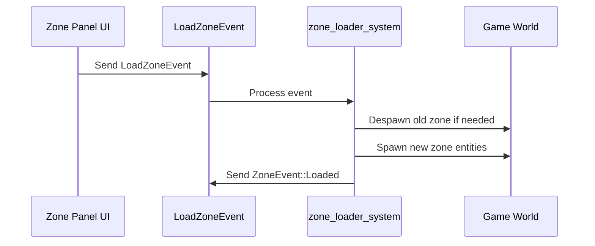

# Zone Viewer Features for Map Editor Integration

## Overview

This document analyzes the existing `--zone-viewer` mode to identify features that should be integrated into the map editor. The zone viewer provides a streamlined experience for viewing and navigating game zones, with several features that would enhance the map editor workflow.

## Executive Summary

The zone viewer contains several reusable systems that are already partially shared with the map editor (like `FreeCamera`), but also contains UI and workflow features that could enhance the map editor experience.

**Key Integration Opportunities:**
1. Zone switching UI with filtering
2. Debug camera info panel
3. Automatic debug window configuration on enter
4. Camera positioning for zone viewing

---

## Feature Analysis

### 1. Free Camera System

**Location:** [`src/systems/free_camera_system.rs`](src/systems/free_camera_system.rs)

**Current Status:** ✅ Already shared between zone-viewer and map-editor

**Description:**
A fast free-fly camera system using the `dolly` camera rig library with smooth movement and rotation.

**Controls:**
| Key | Action |
|-----|--------|
| W/S | Move forward/backward |
| A/D | Strafe left/right |
| Q/E | Move down/up |
| Shift | Speed boost (4x) |
| Right Mouse | Rotate camera |
| Middle Mouse | Pan camera |
| Mouse Wheel | Adjust move speed |

**Code Structure:**
```rust
#[derive(Component)]
pub struct FreeCamera {
    pub rig: CameraRig<LeftHanded>,
    pub move_speed: f32,  // Default: 20.0
    pub drag_speed: f32,  // Default: 4.0
}
```

**Integration Recommendation:** 
- Already integrated via shared system
- Consider exposing speed configuration in map editor UI

---

### 2. Zone Viewer Enter System

**Location:** [`src/systems/zone_viewer_system.rs:13-68`](src/systems/zone_viewer_system.rs:13)

**Description:**
Initializes the camera and UI state when entering zone viewer mode.

**Key Actions:**
1. Sets camera to optimal zone viewing position: `(5120.0, 50.0, -5120.0)`
2. Sets initial camera angles: yaw `-45°`, pitch `-20°`
3. Removes `OrbitCamera` and `CameraAnimation` components
4. Inserts `FreeCamera` component
5. Opens debug windows automatically

**Code Snippet:**
```rust
pub fn zone_viewer_enter_system(
    mut commands: Commands,
    query_cameras: Query<Entity, With<Camera3d>>,
    mut ui_state_debug_windows: ResMut<UiStateDebugWindows>,
) {
    let camera_position = Vec3::new(5120.0, 50.0, -5120.0);
    let camera_yaw: f32 = -45.0;
    let camera_pitch: f32 = -20.0;

    for entity in query_cameras.iter() {
        commands.entity(entity)
            .remove::<OrbitCamera>()
            .remove::<CameraAnimation>()
            .insert(FreeCamera::new(camera_position, camera_yaw, camera_pitch));
    }

    // Open relevant debug windows
    ui_state_debug_windows.camera_info_open = true;
    ui_state_debug_windows.debug_ui_open = true;
    ui_state_debug_windows.zone_list_open = true;
}
```

**Integration Recommendation:**
- Map editor should set a similar initial camera position
- Consider adding zone list panel to map editor UI

---

### 3. Zone List UI System

**Location:** [`src/ui/ui_debug_zone_list_system.rs`](src/ui/ui_debug_zone_list_system.rs)

**Description:**
An egui panel that lists all available zones with filtering and zone switching capability.

**Features:**
- Zone name filtering with regex support
- Zone ID and name display in table format
- "Despawn other zones" checkbox (zone viewer only)
- Load button to switch zones via `LoadZoneEvent`

**UI Layout:**
```
┌─ Zone List ──────────────────────────┐
│ Zone Name Filter: [_________]        │
│ Despawn other zones: [x] Despawn     │
├──────────────────────────────────────┤
│ ID    │ Name           │ Action      │
│ 1     │ Adventurer's   │ [Load]      │
│ 2     │ Zant           │ [Load]      │
│ ...   │ ...            │ [Load]      │
└──────────────────────────────────────┘
```

**Code Snippet:**
```rust
pub fn ui_debug_zone_list_system(
    mut egui_context: EguiContexts,
    mut ui_state: Local<UiDebugZoneListState>,
    mut load_zone_events: EventWriter<LoadZoneEvent>,
    app_state: Res<State<AppState>>,
    game_data: Res<GameData>,
) {
    egui::Window::new("Zone List")
        .vscroll(true)
        .resizable(true)
        .default_height(300.0)
        .show(egui_context.ctx_mut(), |ui| {
            // Filter input
            // Zone table with Load buttons
        });
}
```

**Integration Recommendation:**
- **HIGH PRIORITY** - Add zone switching capability to map editor
- Create a dedicated map editor zone panel
- Include zone preview thumbnail if possible

---

### 4. Debug Camera Info Panel

**Location:** [`src/ui/ui_debug_camera_info_system.rs`](src/ui/ui_debug_camera_info_system.rs)

**Description:**
Displays current camera position, rotation, and type (Free/Orbit).

**Information Shown:**
- Camera type (Free or Orbit)
- Yaw and pitch angles
- Camera position (implied from transform)

**Integration Recommendation:**
- **MEDIUM PRIORITY** - Useful for precise camera positioning
- Could be integrated into map editor status bar

---

### 5. Zone Loading System

**Location:** [`src/events/zone_event.rs`](src/events/zone_event.rs)

**Description:**
Event-based zone loading system used by zone viewer.

**Events:**
```rust
#[derive(Event)]
pub struct LoadZoneEvent {
    pub id: ZoneId,
    pub despawn_other_zones: bool,
}

#[derive(Event)]
pub enum ZoneEvent {
    Loaded(ZoneId),
}
```

**Integration Recommendation:**
- Already available via shared event system
- Map editor should use `LoadZoneEvent` for zone switching
- Consider adding "recent zones" feature

---

### 6. Debug Menu System

**Location:** [`src/ui/ui_debug_window_system.rs`](src/ui/ui_debug_window_system.rs)

**Description:**
Top menu bar with app state switching and debug window toggles.

**Features:**
- App state switching (Model Viewer, Zone Viewer, Game Login, etc.)
- Camera type switching (Orbit/Free)
- View menu for toggling debug windows
- Cheats menu (in game mode)

**Integration Recommendation:**
- Map editor already has its own menu bar
- Consider integrating zone switching into existing menu

---

## Current Map Editor Architecture

**Location:** [`src/map_editor/`](src/map_editor/)

The map editor already has a well-structured architecture:

```
src/map_editor/
├── mod.rs           # Plugin and enter/exit systems
├── components.rs    # Editor marker components
├── resources.rs     # MapEditorState and configuration
├── systems/
│   ├── grid_system.rs              # Visual grid
│   ├── keyboard_shortcuts_system.rs # W/E/R, Delete, Duplicate
│   ├── load_models_system.rs       # Model loading
│   ├── model_placement_system.rs   # Click-to-place
│   ├── property_update_system.rs   # Property editing
│   ├── selection_highlight_system.rs
│   ├── selection_system.rs
│   └── transform_gizmo_system.rs   # Transform gizmos
├── ui/
│   ├── hierarchy_panel.rs          # Object hierarchy
│   ├── menu_bar.rs                 # File/Edit/View menus
│   ├── model_browser_panel.rs      # Model selection
│   ├── properties_panel.rs         # Property editing
│   └── status_bar.rs               # Status display
└── save/
    ├── ifo_export.rs               # IFO format export
    ├── ifo_types.rs                # IFO data types
    ├── mod.rs
    └── save_system.rs              # Save functionality
```

---

## Integration Plan

### Phase 1: Zone Switching (High Priority)

**Goal:** Add zone switching capability to the map editor

**Tasks:**
1. Create `ZonePanel` in `src/map_editor/ui/zone_panel.rs`
2. Add zone list with filtering
3. Add zone switching via `LoadZoneEvent`
4. Add "Recent Zones" feature
5. Integrate into menu bar (File > Open Zone...)

**Files to Create/Modify:**
- Create: `src/map_editor/ui/zone_panel.rs`
- Modify: `src/map_editor/ui/mod.rs`
- Modify: `src/map_editor/ui/menu_bar.rs`
- Modify: `src/map_editor/resources.rs` (add recent zones tracking)

### Phase 2: Camera Enhancements (Medium Priority)

**Goal:** Improve camera feedback and controls

**Tasks:**
1. Add camera info to status bar
2. Add camera speed slider to settings
3. Add "Reset Camera to Zone Center" button
4. Add camera bookmarks/presets

**Files to Modify:**
- `src/map_editor/ui/status_bar.rs`
- `src/map_editor/resources.rs`
- `src/map_editor/ui/menu_bar.rs`

### Phase 3: Debug Window Integration (Low Priority)

**Goal:** Optional debug windows for advanced users

**Tasks:**
1. Add View menu with debug window toggles
2. Add zone lighting controls
3. Add zone time controls

**Files to Modify:**
- `src/map_editor/ui/menu_bar.rs`

---

## Code Locations Reference

| Feature | File | Key Functions/Types |
|---------|------|---------------------|
| Free Camera | [`src/systems/free_camera_system.rs`](src/systems/free_camera_system.rs) | `FreeCamera`, `free_camera_system` |
| Zone Viewer Enter | [`src/systems/zone_viewer_system.rs`](src/systems/zone_viewer_system.rs) | `zone_viewer_enter_system` |
| Zone List UI | [`src/ui/ui_debug_zone_list_system.rs`](src/ui/ui_debug_zone_list_system.rs) | `ui_debug_zone_list_system` |
| Camera Info UI | [`src/ui/ui_debug_camera_info_system.rs`](src/ui/ui_debug_camera_info_system.rs) | `ui_debug_camera_info_system` |
| Zone Events | [`src/events/zone_event.rs`](src/events/zone_event.rs) | `LoadZoneEvent`, `ZoneEvent` |
| Debug Menu | [`src/ui/ui_debug_window_system.rs`](src/ui/ui_debug_window_system.rs) | `ui_debug_menu_system` |
| App State | [`src/resources/app_state.rs`](src/resources/app_state.rs) | `AppState::ZoneViewer` |
| Map Editor | [`src/map_editor/mod.rs`](src/map_editor/mod.rs) | `MapEditorPlugin` |

---

## Technical Notes

### Shared Systems

The following systems are already shared between zone viewer and map editor:

1. **Free Camera System** - Both modes use `free_camera_system` from `src/systems/free_camera_system.rs`
2. **Zone Loading** - Both use `LoadZoneEvent` for zone switching
3. **Debug UI** - Both have access to `UiStateDebugWindows`

### Mode Differences

| Aspect | Zone Viewer | Map Editor |
|--------|-------------|------------|
| Camera | FreeCamera only | FreeCamera only |
| UI Focus | Debug/Inspection | Editing/Authoring |
| Zone Switching | Via Zone List panel | Not yet implemented |
| Object Selection | View only | Full editing support |
| Save Capability | No | Yes (IFO export) |

### Event Flow for Zone Switching



---

## Conclusion

The zone viewer contains several well-structured features that can be integrated into the map editor. The highest priority is adding zone switching capability, which would significantly improve the map editor workflow. The existing shared systems (FreeCamera, LoadZoneEvent) provide a solid foundation for this integration.

**Recommended Implementation Order:**
1. Zone switching panel (highest impact)
2. Camera info in status bar
3. Debug window toggles in View menu
