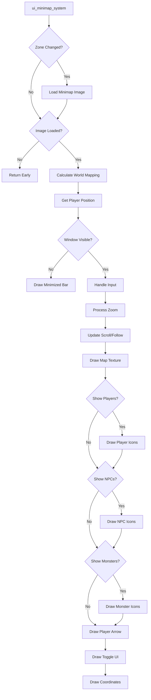

# Map UI Rework Plan

## Overview

This plan outlines the rework of the minimap system to provide a more usable and feature-rich map experience. The current implementation in [`ui_minimap_system.rs`](../src/ui/ui_minimap_system.rs) is functional but limited in its capabilities.

## Current State Analysis

### Existing Features
- **Fixed Size Modes**: Small and expanded modes with hardcoded dimensions
- **Basic Scrolling**: Click-and-drag to pan around the map
- **Entity Display**: Shows player arrow, other characters, and NPCs
- **Zone Name Display**: Shows current zone name
- **Player Coordinates**: Shows X, Y position at bottom
- **Minimize Toggle**: Can minimize to just the title bar

### Current Limitations
1. **Not Resizable**: Only two fixed sizes available
2. **No Zoom**: Cannot zoom in/out on the map
3. **No Monster Icons**: Monsters are not displayed on the map
4. **No Icon Filtering**: Cannot toggle which entity types are shown
5. **Image Quality**: Uses basic texture sampling without filtering options

### Architecture
The current system uses:
- `egui` for UI rendering via [`bevy_egui`](../Cargo.toml)
- [`UiStateMinimap`](../src/ui/ui_minimap_system.rs:44) struct for state management
- Dialog XML system for UI layout
- Direct texture rendering for map image
- Custom mesh rendering for rotated player arrow

---

## Proposed Features

### 1. Resizable Map Window

**Description**: Allow users to resize the map window freely by dragging edges/corners.

**Implementation Details**:
- Replace fixed-size dialog-based approach with egui's resizable window
- Store custom size in `UiStateMinimap`
- Implement minimum and maximum size constraints
- Persist window size across sessions (optional)

**UI Changes**:
```rust
egui::Window::new("Minimap")
    .anchor(egui::Align2::RIGHT_TOP, [0.0, 0.0])
    .resizable(true)  // Enable resizing
    .min_size(egui::vec2(150.0, 150.0))  // Minimum size
    .max_size(egui::vec2(800.0, 800.0))  // Maximum size
    .default_width(current_width)
    .default_height(current_height)
```

**State Additions**:
```rust
pub struct UiStateMinimap {
    // ... existing fields
    pub window_size: Vec2,           // Current window size
    pub default_window_size: Vec2,   // Default starting size
}
```

### 2. Zoomable Map

**Description**: Enable zoom functionality with mouse wheel, with a default zoom level that focuses on the player's vicinity.

**Implementation Details**:
- Add zoom level state to `UiStateMinimap`
- Handle mouse scroll events when hovering over map
- Adjust UV coordinates based on zoom level
- Center zoom on player position by default
- Support zoom range: 0.5x to 4.0x

**Zoom Behavior**:
- **Default Zoom**: Start at 1.5x zoom centered on player
- **Scroll Wheel**: Zoom in/out centered on cursor position
- **Zoom Limits**: Min 0.5x (zoomed out), Max 4.0x (zoomed in)
- **Icon Scaling**: Entity icons should scale slightly with zoom but have min/max sizes

**State Additions**:
```rust
pub struct UiStateMinimap {
    // ... existing fields
    pub zoom_level: f32,             // Current zoom level (1.0 = default)
    pub min_zoom: f32,               // Minimum zoom (0.5)
    pub max_zoom: f32,               // Maximum zoom (4.0)
    pub follow_player: bool,         // Whether map follows player
}
```

**Zoom Calculation**:
```rust
// When zoom changes
let visible_width = minimap_size.x / zoom_level;
let visible_height = minimap_size.y / zoom_level;

// Adjust scroll to keep player centered (if follow_player is true)
if follow_player {
    scroll.x = player_map_pos.x - visible_width / 2.0;
    scroll.y = player_map_pos.y - visible_height / 2.0;
}
```

### 3. High Quality Map Rendering

**Description**: Improve map image quality with better filtering and rendering options.

**Implementation Details**:
- Use linear texture filtering for smoother zooming
- Implement mipmaps for the minimap texture (if supported)
- Add option to toggle between pixel-perfect and smooth rendering
- Consider rendering map at higher resolution when zoomed in

**Texture Options**:
```rust
pub struct UiStateMinimap {
    // ... existing fields
    pub smooth_filtering: bool,      // Use linear filtering vs nearest
}
```

### 4. Monster Display on Map

**Description**: Show monster positions on the map with distinct icons.

**Implementation Details**:
- Query entities with `ClientEntityType::Monster`
- Use different icon colors/shapes based on monster hostility
- Show monster name on hover
- Consider performance with many monsters (culling, clustering)

**Monster Icon Types**:
- **Hostile Monsters**: Red icon (existing enemy character icon)
- **Neutral Monsters**: Yellow icon
- **Boss/Elite Monsters**: Larger or special icon

**Query Addition**:
```rust
// Add to existing queries
query_monsters: Query<
    (&Position, &ClientEntity, &ClientEntityName, Option<&Team>),
    (With<ClientEntity>, With<Npc>, Without<PlayerCharacter>)
>,
```

### 5. Icon Toggle System

**Description**: Allow users to toggle visibility of different entity types on the map.

**Implementation Details**:
- Add toggle buttons or checkboxes in map UI
- Store visibility preferences in `UiStateMinimap`
- Filter entities during rendering based on toggles

**Toggle Categories**:
1. **Players** - Show/hide other player characters
2. **NPCs** - Show/hide NPC markers
3. **Monsters** - Show/hide monster markers
4. **Party Members** - Always show (or separate toggle)

**State Additions**:
```rust
pub struct UiStateMinimap {
    // ... existing fields
    pub show_players: bool,          // Show other players
    pub show_npcs: bool,             // Show NPCs
    pub show_monsters: bool,         // Show monsters
    pub show_party_members: bool,    // Show party members (always true?)
}
```

**UI Layout**:
Add a settings panel or toggle bar at the bottom/top of the map:
```
[Players ✓] [NPCs ✓] [Monsters ✓]
```

---

## Technical Architecture

### State Management

```rust
#[derive(Default)]
pub struct UiStateMinimap {
    // Zone tracking
    pub zone_id: Option<ZoneId>,
    pub zone_name_pixels_per_point: f32,
    pub zone_name_text_galley: Option<Arc<egui::Galley>>,
    pub zone_name_text_expanded_galley: Option<Arc<egui::Galley>>,
    
    // Map image
    pub minimap_image: Handle<Image>,
    pub minimap_texture: egui::TextureId,
    pub minimap_image_size: Option<Vec2>,
    
    // World coordinate mapping
    pub min_world_pos: Vec2,
    pub max_world_pos: Vec2,
    pub distance_per_pixel: f32,
    
    // View state
    pub scroll: Vec2,
    pub last_player_position: Vec2,
    
    // NEW: Window state
    pub window_size: Vec2,
    pub is_minimised: bool,
    
    // NEW: Zoom state
    pub zoom_level: f32,
    pub min_zoom: f32,
    pub max_zoom: f32,
    pub follow_player: bool,
    
    // NEW: Icon visibility toggles
    pub show_players: bool,
    pub show_npcs: bool,
    pub show_monsters: bool,
    pub show_party_members: bool,
    
    // NEW: Rendering options
    pub smooth_filtering: bool,
}
```

### Entity Queries

```rust
// Player query (existing)
query_player: Query<(&Position, &Team, Option<&PartyInfo>), With<PlayerCharacter>>,

// Other characters (existing)
query_characters: Query<(&CharacterInfo, &Position, &Team), Without<PlayerCharacter>>,

// NEW: Monster query
query_monsters: Query<
    (&Position, &ClientEntity, Option<&ClientEntityName>, Option<&Team>),
    (
        With<ClientEntity>,
        With<Npc>,
        Without<PlayerCharacter>,
        Added<Position> // Or use change detection
    ),
>,
```

### System Flow



---

## Implementation Steps

### Phase 1: Window Resizing
1. Modify egui::Window creation to enable resizing
2. Add window_size state field
3. Implement size constraints
4. Update minimap_rect calculation to use dynamic size
5. Test resizing functionality

### Phase 2: Zoom Implementation
1. Add zoom state fields
2. Handle mouse scroll input over map area
3. Modify UV calculation to account for zoom level
4. Implement zoom centered on cursor vs player
5. Add follow_player toggle
6. Test zoom functionality

### Phase 3: Icon Toggle System
1. Add visibility toggle state fields
2. Create toggle UI elements
3. Wrap entity rendering in conditional checks
4. Persist toggle states (optional)
5. Test toggle functionality

### Phase 4: Monster Display
1. Add monster query to system
2. Determine monster icon appearance
3. Add monster rendering logic
4. Handle monster hover tooltips
5. Test monster display

### Phase 5: Quality Improvements
1. Implement smooth filtering option
2. Add zoom quality improvements
3. Performance optimization for many entities
4. Final polish and testing

---

## UI Mockup

```
┌─────────────────────────────────┐
│  Zone Name          [−][□][×]  │  ← Title bar with minimize/expand/close
├─────────────────────────────────┤
│                                 │
│     ↑ Player Arrow              │
│     │                           │
│   ● NPC    ◆ Monster           │  ← Map area with entities
│                                 │
│         ● NPC                   │
│                                 │
│   ○ Other Player                │
│                                 │
├─────────────────────────────────┤
│ [P ✓] [N ✓] [M ✓]  🔍 1.5x    │  ← Toggle bar + zoom indicator
├─────────────────────────────────┤
│ Position: 1234, 5678           │  ← Coordinates display
└─────────────────────────────────┘

Legend:
  ↑ = Player (rotates with camera)
  ● = NPC
  ◆ = Monster (red = hostile)
  ○ = Other player/party member
  P = Players toggle
  N = NPCs toggle  
  M = Monsters toggle
```

---

## Performance Considerations

### Entity Culling
- Only render icons within visible map area
- Skip entities outside viewport
- Consider spatial hashing for large entity counts

### Zoom Performance
- Cache UV calculations when zoom doesn't change
- Use efficient texture sampling

### Memory
- Don't store unnecessary per-frame data
- Reuse allocations where possible

---

## Configuration Options

```rust
// Default values for new saves
const DEFAULT_WINDOW_SIZE: Vec2 = Vec2::new(200.0, 200.0);
const DEFAULT_ZOOM: f32 = 1.5;
const MIN_ZOOM: f32 = 0.5;
const MAX_ZOOM: f32 = 4.0;
const MIN_WINDOW_SIZE: Vec2 = Vec2::new(150.0, 150.0);
const MAX_WINDOW_SIZE: Vec2 = Vec2::new(800.0, 800.0);
```

---

## Testing Checklist

- [ ] Window resizing works smoothly
- [ ] Zoom with scroll wheel functions correctly
- [ ] Zoom centers on cursor position
- [ ] Follow player mode works
- [ ] All toggle buttons work
- [ ] Monsters display correctly
- [ ] Icon hover tooltips work
- [ ] Performance is acceptable with many entities
- [ ] Map transitions correctly between zones
- [ ] Settings persist across game restarts (optional)

---

## Future Enhancements (Out of Scope)

- Custom waypoint markers
- Map panning with click-drag (already exists)
- Full-screen map mode
- Map opacity slider
- Custom icon sizes
- Party member highlighting
- Quest objective markers
- Area of interest circles
