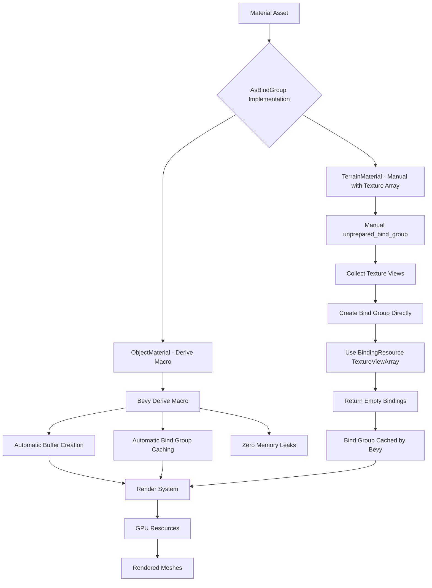

# Material Rendering and Memory Leak Fix Plan

## Executive Summary

This plan addresses two critical rendering issues in the Rose Online client:

1. **Memory Leak in ObjectMaterial**: Creating new GPU buffers every frame
2. **Terrain Not Rendering**: Bind group never prepared due to incorrect AsBindGroup implementation

## Root Cause Analysis

### ObjectMaterial Memory Leak

**Current Implementation (Lines 470-600 in object_material.rs):**
- Manually implements `AsBindGroup` trait
- In `unprepared_bind_group()` (lines 473-536), creates a new GPU buffer every call:
  ```rust
  let uniform_buffer = render_device.create_buffer_with_data(&BufferInitDescriptor {
      label: Some("object_material_uniform_buffer"),
      usage: BufferUsages::UNIFORM | BufferUsages::COPY_DST,
      contents: buffer.as_ref(),
  });
  ```
- This method is called **every frame** for every material instance
- Each call allocates new GPU memory that is never freed
- Result: Continuous memory growth until crash

**Why This Happens:**
- Bevy's `Material` trait expects `unprepared_bind_group` to return resources for bind group creation
- The render system caches the final bind group, but the buffer creation happens BEFORE caching
- Manual implementation doesn't leverage Bevy's automatic caching

### TerrainMaterial Not Rendering

**Current Implementation (Lines 154-177 in terrain_material.rs):**
- Returns `RetryNextUpdate` unconditionally (line 176)
- This means the bind group is **never** prepared
- Shader expects `binding_array<texture_2d<f32>>` at binding 0
- But implementation can't create proper texture array binding

**Why This Happens:**
- `OwnedBindingResource` (used in `UnpreparedBindGroup`) doesn't support `TextureViewArray`
- Original code tried to create bind group directly but returned empty bindings
- This caused the bind group to never be used properly

## Solution Strategy

### ObjectMaterial: Switch to Derive Macro Pattern

**Reference Implementation:** `effect_mesh_material.rs` and `sky_material.rs`

**Pattern:**
```rust
#[derive(Asset, AsBindGroup, Debug, Clone, TypePath)]
#[bind_group_data(MaterialKey)]
#[uniform(0, UniformDataType)]
pub struct Material {
    #[texture(1)]
    #[sampler(2)]
    pub texture: Option<Handle<Image>>,
    
    // Non-binding fields
    pub alpha_enabled: bool,
}
```

**Benefits:**
- Bevy's derive macro handles all caching automatically
- No manual buffer creation
- Bind groups cached and reused
- Zero memory leaks

### TerrainMaterial: Follow WaterMaterial Pattern

**Reference Implementation:** `water_material.rs` (Lines 189-261)

**Pattern for Texture Arrays:**
```rust
impl AsBindGroup for TerrainMaterial {
    type Data = ();

    fn unprepared_bind_group(
        &self,
        layout: &BindGroupLayout,
        render_device: &RenderDevice,
        image_assets: &RenderAssets<Image>,
        fallback_image: &FallbackImage,
    ) -> Result<UnpreparedBindGroup<Self::Data>, AsBindGroupError> {
        // 1. Collect all texture views
        let mut textures = vec![&*fallback_image.d2.texture_view; MAX_TEXTURES];
        for (id, handle) in self.textures.iter().take(MAX_TEXTURES).enumerate() {
            match image_assets.get(handle) {
                Some(image) => textures[id] = &*image.texture_view,
                None => return Err(AsBindGroupError::RetryNextUpdate),
            }
        }

        // 2. Create bind group directly with TextureViewArray
        let bind_group = render_device.create_bind_group(
            "terrain_material_bind_group",
            layout,
            &[
                BindGroupEntry {
                    binding: 0,
                    resource: BindingResource::TextureViewArray(&textures[..]),
                },
                // ... other bindings
            ],
        );

        // 3. Return empty bindings (bind group already created)
        Ok(UnpreparedBindGroup {
            bindings: vec![],
            data: (),
        })
    }
}
```

**Key Points:**
- Create bind group directly using `render_device.create_bind_group`
- Use `BindingResource::TextureViewArray` for texture arrays
- Return empty `bindings` vector in `UnpreparedBindGroup`
- Return `RetryNextUpdate` if textures not loaded

## Implementation Plan

### Phase 1: Fix ObjectMaterial

1. **Add AsBindGroup derive macro to ObjectMaterial struct**
   - Add `AsBindGroup` to derive macro
   - Add `#[bind_group_data(ObjectMaterialKey)]` attribute
   - Add `#[uniform(0, ObjectMaterialUniformData)]` attribute
   - Add `#[texture(n)]` and `#[sampler(n)]` attributes to texture fields

2. **Implement AsBindGroupShaderType trait**
   - Convert `ObjectMaterialUniformData::from_material()` to `AsBindGroupShaderType` implementation
   - This is called by derive macro to create uniform data

3. **Remove manual AsBindGroup implementation**
   - Delete entire `impl AsBindGroup for ObjectMaterial` block (lines 470-600)
   - Delete `bind_group_layout_entries()` method
   - Delete `unprepared_bind_group()` method

4. **Verify shader bindings match**
   - Ensure binding indices in attributes match shader (object_material.wgsl)
   - Binding 0: uniform buffer
   - Binding 1: base_texture
   - Binding 2: base_sampler
   - Binding 3: lightmap_texture
   - Binding 4: lightmap_sampler
   - Binding 5: specular_texture
   - Binding 6: specular_sampler

### Phase 2: Fix TerrainMaterial

1. **Implement proper texture array handling**
   - Collect all texture views into a vector
   - Use fallback image for missing textures
   - Return `RetryNextUpdate` if any texture not loaded

2. **Create bind group with TextureViewArray**
   - Use `BindingResource::TextureViewArray(&textures[..])` for binding 0
   - Create sampler for tile array (binding 1)
   - Handle detail texture (binding 2) and detail sampler (binding 3)

3. **Return proper UnpreparedBindGroup**
   - Return empty `bindings` vector
   - Bind group already created and cached by render system

4. **Verify shader bindings match**
   - Ensure layout entries match shader (terrain_material.wgsl)
   - Binding 0: tile_array_texture (texture array)
   - Binding 1: tile_array_sampler
   - Binding 2: detail_texture
   - Binding 3: detail_sampler

## Architecture Diagram



## Expected Outcomes

### ObjectMaterial
- ✅ No more GPU buffer creation every frame
- ✅ Bind groups properly cached and reused
- ✅ Memory allocation stable
- ✅ Objects render correctly
- ✅ Follows Bevy best practices

### TerrainMaterial
- ✅ Texture array properly bound
- ✅ Bind group prepared successfully
- ✅ Terrain renders correctly
- ✅ No memory leaks
- ✅ Follows pattern from WaterMaterial

## Testing Checklist

- [ ] Build completes without errors
- [ ] Zone loads successfully
- [ ] Objects render with correct textures
- [ ] Terrain renders with tile textures
- [ ] Lightmaps apply correctly
- [ ] Specular textures work
- [ ] Memory allocation remains stable
- [ ] No GPU memory leaks
- [ ] Frame rate is acceptable
- [ ] No warnings or errors in logs

## Risk Mitigation

### Potential Issues
1. **Binding index mismatch** - Verify all binding indices match between attributes and shaders
2. **Uniform data structure mismatch** - Ensure `ObjectMaterialUniformData` matches shader layout exactly
3. **Texture array size mismatch** - Ensure TERRAIN_MATERIAL_MAX_TEXTURES matches shader expectations
4. **Sampler creation** - Ensure samplers are created with correct settings

### Mitigation Strategies
1. Carefully review shader files and match binding indices exactly
2. Use `#[repr(C)]` on uniform structs to ensure correct memory layout
3. Add debug logging to verify bind group creation
4. Test with a minimal zone first before loading complex zones
