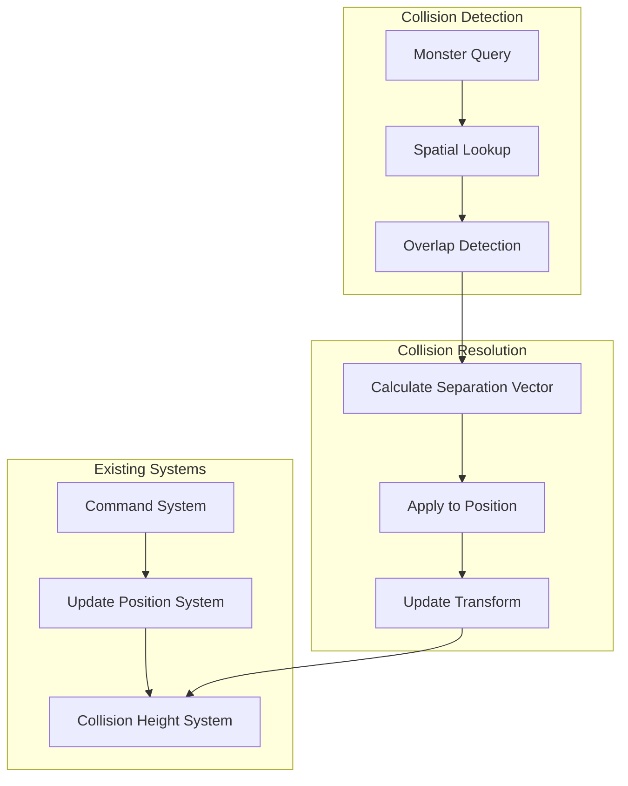

# Monster Collision System Plan

## Overview

This plan outlines the implementation of collision detection and response for **hostile monsters** to prevent them from overlapping when fighting multiple monsters. The system will use the existing bevy_rapier3d physics infrastructure with a **simple soft collision** approach.

### Design Decisions (User Confirmed)
- **Equal separation** for all monsters regardless of size
- **Hostile monsters only** - friendly NPCs will not have this behavior
- **Simple overlap avoidance** - no tactical combat positioning

## Current State Analysis

### Existing Collision Infrastructure

The project already has a robust collision system using `bevy_rapier3d` v0.31:

1. **Collision Groups** (defined in [`src/components/collision.rs`](src/components/collision.rs:57-72)):
 - `COLLISION_GROUP_NPC` (bit 11) - Used for both NPCs and monsters
 - `COLLISION_GROUP_PLAYER` (bit 9)
 - `COLLISION_GROUP_CHARACTER` (bit 10)
 - `COLLISION_FILTER_MOVEABLE` (bit 19) - For entities that can move
 - `COLLISION_FILTER_COLLIDABLE` (bit 17) - For solid objects

2. **Monster Collider Creation** (in [`src/systems/npc_model_add_collider_system.rs`](src/systems/npc_model_add_collider_system.rs:92-106)):
 - Creates cuboid colliders based on AABB bounds
 - Uses `COLLISION_GROUP_NPC` for membership
 - Filter mask: `COLLISION_FILTER_INSPECTABLE | COLLISION_FILTER_CLICKABLE | COLLISION_GROUP_PHYSICS_TOY`
 - **Problem**: Does NOT include `COLLISION_GROUP_NPC` in filter mask, so monsters don't collide with each other

3. **Monster Movement** (in [`src/systems/update_position_system.rs`](src/systems/update_position_system.rs)):
 - Direct position updates based on `CommandMove`
 - No collision avoidance or separation behavior

### Why Monsters Currently Overlap

Monsters don't collide with each other because:
1. Their collision filter (`CollisionGroups`) doesn't include `COLLISION_GROUP_NPC` in the filter mask
2. Movement system doesn't check for collisions with other monsters
3. No separation/avoidance behavior exists

## Proposed Solution

### Approach: Soft Collision with Separation Force

Rather than using hard physics collisions (which would make monsters feel like solid objects), we'll implement a **soft collision** system that applies separation forces to push overlapping monsters apart. This approach:

- Keeps monsters from stacking/overlapping
- Allows monsters to still get close during combat
- Feels more natural for game gameplay
- Doesn't interfere with server-authoritative movement

### Architecture Diagram



## Implementation Steps

### Step 1: Add New Collision Group for Monsters

Create a dedicated collision group for monsters separate from NPCs:

```rust
// In src/components/collision.rs
pub const COLLISION_GROUP_MONSTER: Group = Group::from_bits_truncate(1 << 13);
```

### Step 2: Create Monster Separation Component

Add a component to track separation state for hostile monsters only:

```rust
// In src/components/monster_separation.rs
use bevy::prelude::{Component, Reflect};

/// Component for hostile monster collision separation.
/// This is only added to monsters (ClientEntityType::Monster), not NPCs.
#[derive(Component, Reflect)]
pub struct MonsterSeparation {
    /// Radius for separation detection in meters
    pub separation_radius: f32,
    /// Force strength when overlapping
    pub separation_force: f32,
    /// Maximum separation per frame in meters
    pub max_separation: f32,
}

impl Default for MonsterSeparation {
    fn default() -> Self {
        Self {
            separation_radius: 1.5,  // 1.5 meters
            separation_force: 5.0,
            max_separation: 2.0,     // 2 meters per second max
        }
    }
}
```

### Step 3: Update Monster Collider System

Modify [`src/systems/npc_model_add_collider_system.rs`](src/systems/npc_model_add_collider_system.rs) to:
1. Detect if the entity is a hostile monster (has `ClientEntityType::Monster`)
2. Add `MonsterSeparation` component to hostile monsters only
3. Keep existing collision groups for click/inspect functionality

**Note**: We need to pass `ClientEntityType` information to this system. This may require adding a query parameter or using a marker component.

### Step 4: Create Monster Separation System

Create a new system that runs after movement and applies only to hostile monsters:

```rust
// In src/systems/monster_separation_system.rs
use bevy::prelude::*;
use bevy_rapier3d::plugin::context::systemparams::ReadRapierContext;
use crate::components::{MonsterSeparation, Position, ClientEntity, ClientEntityType};

/// System that pushes overlapping hostile monsters apart.
/// Only applies to entities with ClientEntityType::Monster.
pub fn monster_separation_system(
    mut query: Query<
        (Entity, &mut Position, &MonsterSeparation, &ClientEntity),
        With<MonsterSeparation>,
    >,
    rapier_context: ReadRapierContext,
    time: Res<Time>,
) {
    let Ok(rapier_context) = rapier_context.single() else {
        return;
    };
    
    // Collect all monster positions for overlap checking
    let monster_positions: Vec<(Entity, Vec3, f32)> = query
        .iter()
        .map(|(e, pos, sep, _)| (e, pos.position, sep.separation_radius))
        .collect();
    
    for (entity, mut position, separation, client_entity) in query.iter_mut() {
        // Only apply to hostile monsters
        if client_entity.entity_type != ClientEntityType::Monster {
            continue;
        }
        
        let mut total_separation = Vec3::ZERO;
        let mut overlap_count = 0;
        
        for (other_entity, other_pos, other_radius) in &monster_positions {
            if *other_entity == entity {
                continue;
            }
            
            let distance = (position.position - *other_pos).length();
            let min_distance = separation.separation_radius + other_radius;
            
            if distance < min_distance && distance > 0.001 {
                // Calculate overlap and push direction
                let overlap = min_distance - distance;
                let direction = (position.position - *other_pos).normalize();
                
                // Add separation force proportional to overlap
                total_separation += direction * overlap * separation.separation_force;
                overlap_count += 1;
            }
        }
        
        if overlap_count > 0 {
            // Apply averaged separation, clamped to max
            let separation_vector = (total_separation / overlap_count as f32)
                .clamp_length_max(separation.max_separation * time.delta_secs());
            position.position += separation_vector;
        }
    }
}
```

### Step 5: Integration with Movement Pipeline

The separation system should run in this order:
1. `update_position_system` - Apply movement commands
2. `monster_separation_system` - Push overlapping monsters apart
3. `collision_height_only_system` - Snap to terrain height

## Detailed Design

### Separation Algorithm

```
for each monster A:
    total_separation = Vec3::ZERO
    overlap_count = 0
    
    for each nearby monster B:
        distance = distance_between(A.position, B.position)
        min_distance = A.radius + B.radius
        
        if distance < min_distance:
            // Calculate overlap
            overlap = min_distance - distance
            direction = normalize(A.position - B.position)
            
            // Add separation force (stronger when more overlap)
            force = separation_force * (overlap / min_distance)
            total_separation += direction * force
            overlap_count += 1
    
    if overlap_count > 0:
        // Apply averaged separation, clamped to max
        separation = clamp(total_separation, max_separation)
        A.position += separation * time.delta_secs()
```

### Configuration Parameters

| Parameter | Default Value | Description |
|-----------|---------------|-------------|
| `separation_radius` | 1.5 meters | Distance at which separation begins |
| `separation_force` | 5.0 | Strength of separation push |
| `max_separation` | 2.0 m/s | Maximum separation velocity |

**Note**: All monsters use the same parameters (equal separation). No size-based variation.

## Alternative Approaches Considered

### 1. Hard Physics Collision (Rejected)
Using `RigidBody::Dynamic` with full physics simulation.
- **Pros**: Realistic collision response
- **Cons**: Would interfere with server-authoritative movement, feels too rigid

### 2. Kinematic Character Controller (Rejected)
Using Rapier's `KinematicCharacterController`.
- **Pros**: Built-in collision handling
- **Cons**: Major refactor required, designed for player-style movement

### 3. Sensor Colliders Only (Rejected)
Using sensor colliders with events.
- **Pros**: Event-driven, clean separation
- **Cons**: Requires additional event handling infrastructure

### 4. Chosen: Soft Separation Forces (Simple)
Custom system applying gentle separation forces with equal strength for all monsters.
- **Pros**: Simple, controllable, doesn't fight server movement, easy to tune
- **Cons**: Custom implementation required, O(n²) complexity without spatial partitioning

## Files to Modify

| File | Changes |
|------|---------|
| New: [`src/components/monster_separation.rs`](src/components/monster_separation.rs) | New component definition |
| [`src/components/mod.rs`](src/components/mod.rs) | Export `MonsterSeparation` component |
| [`src/systems/game_connection_system.rs`](src/systems/game_connection_system.rs) | Add `MonsterSeparation` component when spawning hostile monsters (line ~591) |
| New: [`src/systems/monster_separation_system.rs`](src/systems/monster_separation_system.rs) | Separation logic system |
| [`src/systems/mod.rs`](src/systems/mod.rs) | Export new system |
| [`src/lib.rs`](src/lib.rs) | Register new system in schedule after `update_position_system` |

## System Ordering

The separation system must run in this specific order:

```
update_position_system      // Apply movement commands
    ↓
monster_separation_system   // Push overlapping monsters apart (NEW)
    ↓
collision_height_only_system // Snap to terrain height
```

## Testing Strategy

1. **Visual Debug**: Add optional gizmo drawing for separation radii (debug mode)
2. **In-Game Testing**:
 - Spawn multiple monsters (e.g., `/mon 1 5`)
 - Verify they spread out naturally
 - Verify combat still works correctly
 - Verify no performance degradation with 10+ monsters

## Performance Considerations

For the simple implementation:
- O(n²) overlap checks - acceptable for <20 monsters
- Only processes hostile monsters (not NPCs)
- Early exit if no overlaps detected

Future optimization if needed:
- Use spatial partitioning (grid or quadtree) for O(n) checks
- Only run separation for moving monsters
- Use Rapier's `intersections_with` for efficient overlap queries

## Summary

This plan implements a **simple soft collision system** for hostile monsters using separation forces. The approach:

- **Equal separation** for all monsters regardless of size
- **Hostile monsters only** - friendly NPCs are excluded
- **Simple overlap avoidance** - no tactical positioning
- Reuses existing bevy_rapier3d infrastructure where possible
- Adds minimal new code (~100 lines)
- Doesn't interfere with server-authoritative movement
- Is configurable through component parameters

### Implementation Complexity: Low
- 1 new component file
- 1 new system file
- ~5 lines of changes to existing files
