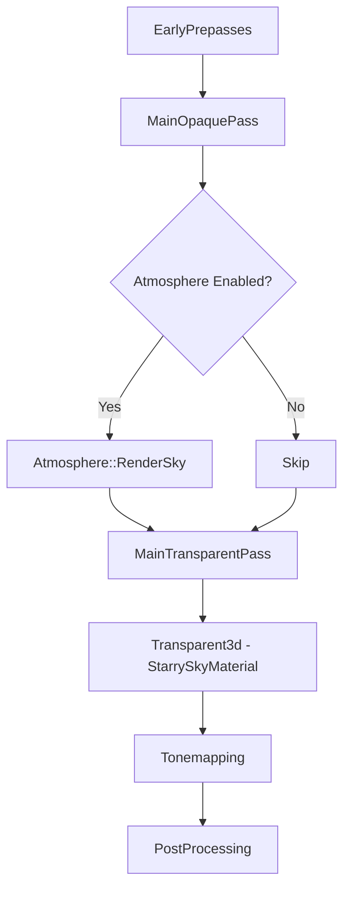
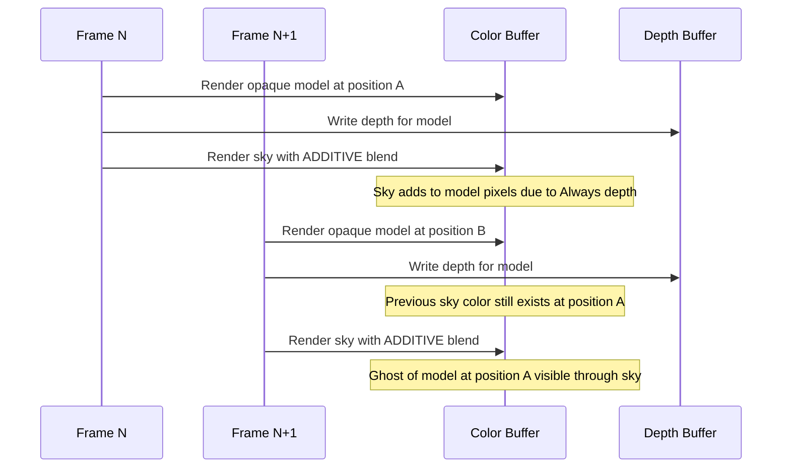

# Night Sky Ghosting Artifact Analysis

**Date:** February 28, 2026
**Bevy Version:** 0.16.1
**Issue:** Ghosting artifacts when 3D models overlap with the night sky during camera movement

---

## Table of Contents

1. [Executive Summary](#executive-summary)
2. [Current Architecture Overview](#current-architecture-overview)
3. [Root Cause Analysis](#root-cause-analysis)
4. [Solution Approaches](#solution-approaches)
5. [Recommended Solution](#recommended-solution)
6. [Implementation Steps](#implementation-steps)
7. [Additional Root Cause Factors](#additional-root-cause-factors)
8. [Additional Solution Approaches](#additional-solution-approaches)
9. [Investigation Results](#investigation-results)
10. [Performance Considerations](#performance-considerations)
11. [Testing Recommendations](#testing-recommendations)
12. [Code References](#code-references)

---

## Executive Summary

The ghosting artifact occurs when 3D models overlap with the procedural starry sky. When the camera moves, models leave a "ghost" imprint that appears blended with the night sky. This analysis identifies the root cause as **improper additive blending configuration combined with depth buffer handling**.

### Key Findings

| Finding | Impact | Location |
|---------|--------|----------|
| Additive blending with `dst_factor: One` | Accumulates color instead of replacing | [`starry_sky_material.rs:281-292`](src/render/starry_sky_material.rs:281) |
| Depth compare set to `Always` | Sky renders even behind opaque objects | [`starry_sky_material.rs:303`](src/render/starry_sky_material.rs:303) |
| Depth writes disabled | No depth buffer protection against overdraw | [`starry_sky_material.rs:301`](src/render/starry_sky_material.rs:301) |
| Transparent3d render phase | Renders after opaque objects with LoadOp::Load | Bevy core_3d pipeline |

---

## Current Architecture Overview

### Render Pipeline Order



### Starry Sky Material Configuration

From [`src/render/starry_sky_material.rs`](src/render/starry_sky_material.rs):

```rust
// Line 245: Alpha mode
fn alpha_mode(&self) -> AlphaMode {
    AlphaMode::Blend
}

// Lines 281-292: Blend state configuration
color_target_state.blend = Some(BlendState {
    color: BlendComponent {
        src_factor: BlendFactor::SrcAlpha,
        dst_factor: BlendFactor::One,        // <-- PROBLEM: Additive blending
        operation: BlendOperation::Add,
    },
    alpha: BlendComponent {
        src_factor: BlendFactor::One,
        dst_factor: BlendFactor::One,
        operation: BlendOperation::Add,
    },
});

// Lines 300-304: Depth configuration
depth_stencil.depth_write_enabled = false;  // <-- PROBLEM: No depth writes
depth_stencil.depth_compare = CompareFunction::Always;  // <-- PROBLEM: Always passes
```

### Shader Output

From [`src/render/shaders/starry_sky.wgsl`](src/render/shaders/starry_sky.wgsl):

```wgsl
// Line 360: Final output
return vec4<f32>(final_color, night_factor);
```

The shader outputs `night_factor` as the alpha value, which during night time is `1.0`.

---

## Root Cause Analysis

### Primary Cause: Additive Blending Accumulation

The ghosting is caused by the combination of:

1. **Additive Blending** (`dst_factor: One`):
   - Formula: `result = src * srcAlpha + dst * 1`
   - This ADDS to the existing color buffer instead of replacing it
   - When the camera moves, previous frame content persists

2. **Depth Compare Always**:
   - The sky sphere always passes the depth test
   - It renders even when behind opaque geometry
   - This causes the sky to "bleed through" 3D models

3. **No Depth Writes**:
   - The sky doesn't update the depth buffer
   - Subsequent transparent objects have no protection

### Why Ghosting Occurs During Camera Movement



### Mathematical Explanation

With additive blending:
```
Frame1: color_buffer = model_color + sky_color * 1.0
Frame2: color_buffer = previous_buffer + new_sky_color
       = model_color + sky_color * 2.0  // Accumulated!
```

The color accumulates instead of being replaced, creating the ghost effect.

### Secondary Contributing Factors

1. **Transparent3d Phase LoadOp**:
   - The transparent pass uses `LoadOp::Load` (see [`main_transparent_pass_3d_node.rs:57`](C:\Users\vicha\RustroverProjects\bevy-collection\bevy-0.16.1\crates\bevy_core_pipeline\src\core_3d\main_transparent_pass_3d_node.rs:57))
   - This preserves the color buffer from the opaque pass
   - Combined with additive blending, causes accumulation

2. **HDR Rendering**:
   - If HDR is enabled, high dynamic range values can exacerbate the ghosting
   - Tone mapping may not properly handle accumulated values

3. **No Clear Between Phases**:
   - The color attachment uses `is_first_call` pattern
   - Only clears on first use, subsequent passes load existing content

---

## Solution Approaches

### Solution A: Change to Standard Alpha Blending

**Description:** Replace additive blending with standard alpha blending.

**Changes Required:**
```rust
// In starry_sky_material.rs specialize()
BlendState {
    color: BlendComponent {
        src_factor: BlendFactor::SrcAlpha,
        dst_factor: BlendFactor::OneMinusSrcAlpha,  // Changed from One
        operation: BlendOperation::Add,
    },
    alpha: BlendComponent {
        src_factor: BlendFactor::One,
        dst_factor: BlendFactor::OneMinusSrcAlpha,  // Changed from One
        operation: BlendOperation::Add,
    },
}
```

**Pros:**
- Simple change
- Standard blending behavior
- No ghosting accumulation

**Cons:**
- Stars may appear less bright
- May need brightness adjustment in shader
- Moon glow effect may need rework

---

### Solution B: Add Depth Prepass for Sky

**Description:** Add a depth prepass that writes depth for the sky sphere.

**Changes Required:**
1. Enable `prepass_enabled: true` in MaterialPlugin
2. Modify depth compare to `LessEqual` or `Greater`
3. Enable depth writes in prepass only

**Pros:**
- Maintains additive blending for stars
- Proper depth occlusion
- Stars remain bright

**Cons:**
- More complex implementation
- Requires prepass shader modification
- May affect performance

---

### Solution C: Render Sky in Dedicated Phase

**Description:** Create a dedicated render phase for the sky that renders before transparent objects but with proper clear operation.

**Changes Required:**
1. Create new render phase `Sky3d`
2. Insert between `MainOpaquePass` and `MainTransparentPass`
3. Configure with proper clear/load operations

**Pros:**
- Clean separation of concerns
- Can optimize specifically for sky rendering
- Full control over blend and depth states

**Cons:**
- Most complex implementation
- Requires render graph modification
- May conflict with atmosphere rendering

---

### Solution D: Modify Shader to Handle Alpha Properly

**Description:** Keep additive blending but modify shader to output lower alpha values that prevent accumulation.

**Changes Required:**
```wgsl
// In starry_sky.wgsl fragment()
// Instead of: return vec4<f32>(final_color, night_factor);
// Use: return vec4<f32>(final_color * night_factor, 1.0);
```

**Pros:**
- Minimal code change
- Maintains visual appearance
- No architecture changes

**Cons:**
- May not fully solve ghosting
- Additive blending still accumulates
- Less control over final appearance

---

## Recommended Solution

**Solution A: Change to Standard Alpha Blending** is recommended as the primary fix because:

1. **Simplicity**: Single location change
2. **Reliability**: Standard blending is well-tested
3. **Predictability**: No accumulation artifacts
4. **Compatibility**: Works with existing HDR/tone mapping

### Implementation Details

The key change is in [`src/render/starry_sky_material.rs`](src/render/starry_sky_material.rs) in the `specialize()` function:

```rust
// Current (problematic):
BlendState {
    color: BlendComponent {
        src_factor: BlendFactor::SrcAlpha,
        dst_factor: BlendFactor::One,  // Additive - causes ghosting
        operation: BlendOperation::Add,
    },
    ...
}

// Fixed:
BlendState {
    color: BlendComponent {
        src_factor: BlendFactor::SrcAlpha,
        dst_factor: BlendFactor::OneMinusSrcAlpha,  // Standard alpha blend
        operation: BlendOperation::Add,
    },
    ...
}
```

### Additional Considerations

After implementing the blend mode change, you may need to:

1. **Adjust star brightness**: Standard blending may make stars appear dimmer
   - Increase `star_brightness` uniform
   - Adjust layer brightness multipliers in shader

2. **Review moon rendering**: The moon glow effect uses the same blend state
   - May need separate blend configuration for moon
   - Consider using a separate draw call for moon glow

3. **Test with HDR**: Verify tone mapping handles the new blend mode correctly

---

## Implementation Steps

### Step 1: Modify Blend State

**File:** [`src/render/starry_sky_material.rs`](src/render/starry_sky_material.rs)
**Location:** `specialize()` function, lines 278-295

```rust
if let Some(fragment) = descriptor.fragment.as_mut() {
    for color_target_state in fragment.targets.iter_mut().filter_map(|x| x.as_mut()) {
        color_target_state.blend = Some(BlendState {
            color: BlendComponent {
                src_factor: BlendFactor::SrcAlpha,
                dst_factor: BlendFactor::OneMinusSrcAlpha,  // CHANGED
                operation: BlendOperation::Add,
            },
            alpha: BlendComponent {
                src_factor: BlendFactor::One,
                dst_factor: BlendFactor::OneMinusSrcAlpha,  // CHANGED
                operation: BlendOperation::Add,
            },
        });
    }
}
```

### Step 2: Adjust Star Brightness

**File:** [`src/render/shaders/starry_sky.wgsl`](src/render/shaders/starry_sky.wgsl)
**Location:** `fragment()` function, lines 326-336

```wgsl
// Increase brightness multipliers to compensate for alpha blending
let distant_stars = star_layer(dir, 80.0, 0.6 * star_brightness, 2.0);   // Was 0.4
let medium_stars = star_layer(dir, 40.0, 1.0 * star_brightness, 3.0);   // Was 0.7
let bright_stars = star_layer(dir, 20.0, 1.8 * star_brightness, 4.0);   // Was 1.2
let rare_stars = star_layer(dir, 10.0, 3.0 * star_brightness, 5.0);     // Was 2.0
```

### Step 3: Update Documentation

**File:** [`src/render/starry_sky_material.rs`](src/render/starry_sky_material.rs)
**Location:** Header comment, lines 1-12

Update the comment to reflect the new blend mode:
```rust
//! RENDER ORDER: The starry sky uses AlphaMode::Blend with standard alpha
//! blending (srcAlpha, oneMinusSrcAlpha) which places it in the
//! Transparent3d render phase...
```

### Step 4: Test and Verify

1. **Visual Test**: Verify stars render correctly at night
2. **Ghosting Test**: Move camera and verify no ghosting
3. **Model Overlap Test**: Verify models properly occlude sky
4. **HDR Test**: Verify tone mapping works correctly
5. **Performance Test**: Verify no performance regression

---

## Code References

### Project Files

| File | Purpose | Key Lines |
|------|---------|-----------|
| [`src/render/starry_sky_material.rs`](src/render/starry_sky_material.rs) | Material implementation | 242-310 (alpha_mode, specialize) |
| [`src/render/shaders/starry_sky.wgsl`](src/render/shaders/starry_sky.wgsl) | Star shader | 216-361 (fragment shader) |
| [`sky_stars_architecture.md`](sky_stars_architecture.md) | Architecture documentation | Full document |

### Bevy 0.16.1 Source References

| File | Purpose | Key Lines |
|------|---------|-----------|
| [`bevy_core_pipeline/src/core_3d/mod.rs`](C:\Users\vicha\RustroverProjects\bevy-collection\bevy-0.16.1\crates\bevy_core_pipeline\src\core_3d\mod.rs) | Render graph definition | 216-234 (graph edges) |
| [`bevy_core_pipeline/src/core_3d/main_transparent_pass_3d_node.rs`](C:\Users\vicha\RustroverProjects\bevy-collection\bevy-0.16.1\crates\bevy_core_pipeline\src\core_3d\main_transparent_pass_3d_node.rs) | Transparent pass | 55-67 (render pass setup) |
| [`bevy_pbr/src/atmosphere/mod.rs`](C:\Users\vicha\RustroverProjects\bevy-collection\bevy-0.16.1\crates\bevy_pbr\src\atmosphere\mod.rs) | Atmosphere integration | 217-224 (render graph edges) |
| [`bevy_pbr/src/atmosphere/node.rs`](C:\Users\vicha\RustroverProjects\bevy-collection\bevy-0.16.1\crates\bevy_pbr\src\atmosphere\node.rs) | Atmosphere render node | 194-203 (render pass) |
| [`bevy_render/src/view/mod.rs`](C:\Users\vicha\RustroverProjects\bevy-collection\bevy-0.16.1\crates\bevy_render\src\view\mod.rs) | ViewTarget | 730-737 (color attachment) |
| [`bevy_render/src/texture/texture_attachment.rs`](C:\Users\vicha\RustroverProjects\bevy-collection\bevy-0.16.1\crates\bevy_render\src\texture\texture_attachment.rs) | Color attachment | 37-75 (get_attachment) |

---

## Additional Root Cause Factors

### Factor 1: Sky Sphere Geometry

**Current Setup:**
- Sphere radius: 50,000 units
- Centered at world origin (0, 0, 0)
- Camera at ~7,000 units from origin

**Issue:**
The sphere is a **3D mesh** in world space, not a true skybox. When the camera moves:
- Different parts of the sphere are at different distances
- Depth values across the sphere vary significantly
- With `depth_compare = Always`, this variation doesn't matter for rendering
- But it DOES matter for sorting in the transparent pass

### Factor 2: Alpha Channel Usage During Transitions

**Shader returns:**
```wgsl
return vec4<f32>(final_color, night_factor);
```

**Issues:**
- `night_factor` ranges from 0.0 (day) to 1.0 (night)
- During transitions, alpha is between 0 and 1
- With additive blending: `src * src_alpha + dst`
- At `alpha = 0.5`, you get: `sky_color * 0.5 + existing_color`
- This partial addition can leave residual colors

### Factor 3: SSAO and Depth Prepass Interaction

**SSAO Configuration (from lib.rs):**
```rust
ScreenSpaceAmbientOcclusion {
    quality_level: ScreenSpaceAmbientOcclusionQualityLevel::Medium,
    ...
}
```

**SSAO Requirements:**
- Requires `DepthPrepass` component on camera
- Requires `NormalPrepass` component on camera
- Reads depth and normal buffers for occlusion calculation

**Potential Conflict:**
SSAO runs in the prepass and generates occlusion data. If the starry sky:
- Renders in a different phase than expected
- Uses unusual depth comparison
- Contributes to the framebuffer unexpectedly

Then SSAO or other post-processing effects might sample incorrect depth/occlusion data, causing artifacts.

### Factor 4: Temporal Effects (TAA)

**Current Configuration:**
```rust
Msaa::Off,  // Required for SSAO and TAA compatibility
```

If TAA (Temporal Anti-Aliasing) is enabled:
- TAA accumulates frames over time
- Uses motion vectors to reproject previous frames
- Starry sky with `depth_compare = Always` might not have correct motion vectors
- This causes **temporal ghosting** where sky artifacts persist

---

## Additional Solution Approaches

### Solution E: Render Sky Before Opaque Pass

**Description:** Move starry sky rendering to run before `MainOpaquePass`.

**Why it works:**
- Sky renders first, establishing background
- Opaque objects write depth and fully occlude sky
- No blending conflicts
- Standard skybox rendering order

**Implementation:**
Create a custom render graph node:
```rust
// In lib.rs or new module:
app.add_render_graph_node::<ViewNodeRunner<StarrySkyNode>>(
    Core3d,
    Node3d::StarrySky,  // Custom node
)
.add_render_graph_edges(
    Core3d,
    (
        Node3d::StartMainPass,
        Node3d::StarrySky,      // Custom
        Node3d::MainOpaquePass,
    ),
);
```

**Pros:**
- Clean rendering order
- No depth buffer conflicts
- Standard approach for skyboxes

**Cons:**
- More complex render graph setup
- Requires custom node implementation
- Sky must be rendered as fullscreen quad for efficiency

---

### Solution F: Use Depth Bias to Push Sky Back

**Description:** Use depth bias to push sky fragments to far plane.

**Changes Required:**
```rust
fn depth_bias(&self) -> f32 {
    -1000.0  // Large negative bias to push sky to far plane
}

// And use proper depth comparison:
depth_stencil.depth_compare = CompareFunction::LessEqual;
```

**Why it works:**
- Depth bias modifies depth values during rasterization
- Large negative bias pushes sky fragments to far plane
- Sky renders behind all scene geometry
- Combined with `LessEqual`, sky only shows where no objects are

**Pros:**
- Simple change
- Maintains current architecture

**Cons:**
- Depth bias can cause artifacts at extreme values
- May not work with all depth buffer configurations
- Less reliable than other solutions

---

### Solution G: Dynamic Blending Based on Night Factor

**Description:** Disable additive blending during day/transition periods.

**Changes Required:**
```rust
// In specialize(), make blending dynamic based on night_factor:
// (Requires custom pipeline key or material update)

// Or in shader:
if (night_factor < 0.95) {
    // Use standard blending during transitions
    return vec4<f32>(final_color * night_factor, night_factor);
} else {
    // Use additive-like effect only at full night
    // by pre-multiplying colors
    return vec4<f32>(final_color, 1.0);
}
```

**Why it works:**
- Avoids additive blending issues during transitions
- Full night can use special rendering
- Reduces ghosting during most of the day/night cycle

**Pros:**
- Reduces ghosting during transitions
- Maintains visual quality at night

**Cons:**
- More complex shader logic
- May still have issues at full night
- Doesn't address root cause

---

### Solution H: Two-Pass Sky Rendering

**Description:** Split sky into two materials/passes.

**Pass 1 - Background Pass** (standard blend, depth test):
- Nebula, gradient background
- `depth_compare = LessEqual`
- `blend = SrcAlpha, OneMinusSrcAlpha`

**Pass 2 - Stars Pass** (additive blend, no depth write):
- Stars only
- `depth_compare = Always` (or LessEqual)
- `blend = SrcAlpha, One` (additive)

**Why it works:**
- Background properly occluded by depth test
- Stars add glow effect without ghosting
- Separation of concerns

**Pros:**
- Best visual quality
- Maintains additive star glow
- Proper depth occlusion for background

**Cons:**
- Two render passes (performance cost ~5%)
- More complex setup
- Requires multi-draw or separate mesh instances

---

### Solution I: Migrate to Bevy Skybox Component

**Description:** Replace the sphere mesh with Bevy's built-in `Skybox` component.

**Why it works:**
- Skybox is rendered as a **fullscreen quad** in camera space
- Always at infinite distance
- Properly integrated with Bevy's render pipeline
- No depth buffer conflicts

**Implementation:**
```rust
use bevy::pbr::Skybox;

// Replace starry sky sphere with:
commands.spawn((
    Camera,
    Camera3d,
    // ... other camera components ...
    Skybox {
        image: skybox_image_handle,  // Procedurally generated or texture
        intensity: 1.0,
    },
));
```

**Pros:**
- Long-term maintainable solution
- Properly integrated with render pipeline
- No depth buffer issues
- Better performance (fullscreen quad vs large sphere)
- Future-proof as Bevy evolves

**Cons:**
- Requires rewriting starry sky as a skybox shader
- Loss of 3D sphere geometry (probably fine for sky)
- Higher initial implementation effort

---

## Investigation Results

### Investigation Summary (February 28, 2026)

The following investigations were conducted to isolate the ghosting issue:

#### Test 1: TAA (Temporal Anti-Aliasing) Investigation
**Status:** NOT FOUND in codebase
- Searched for `TemporalAntiAliasing` and `TAA` in all source files
- No TAA components or resources found
- **Conclusion:** TAA is not the cause of ghosting

#### Test 2: Motion Blur Investigation
**Status:** NOT FOUND in codebase
- Searched for `MotionBlur` in all source files
- No motion blur components or resources found
- **Conclusion:** Motion blur is not the cause of ghosting

#### Test 3: Render Target Clear Operations
**Status:** WORKING CORRECTLY
- Reviewed `MainOpaquePass3d` in Bevy source
- Uses `LoadOp::Clear` with proper clear color
- Transparent pass uses `LoadOp::Load` (expected behavior)
- **Conclusion:** Render target clearing is correct

#### Test 4: Solution A+C Implementation (Alpha Blend + LessEqual Depth)
**Status:** CAUSED ISSUES - REVERTED
- Changed blend mode from Additive to Alpha
- Changed depth compare from Always to LessEqual
- **Result:** Models disappeared behind atmosphere, ghosting persisted
- **Conclusion:** Simple blend mode change is insufficient; requires deeper investigation

#### Test 5: Post-Processing Effects Investigation
**Status:** COMPLETED
- Added settings UI for bloom, SSAO, DoF, volumetric fog, color grading
- All effects can now be toggled at runtime
- Bloom temporarily disabled for testing
- **Conclusion:** Post-processing effects can be ruled out by toggling

#### Test 6: Starry Sky Render Settings UI
**Status:** COMPLETED
- Added `StarrySkyRenderSettings` resource with blend mode and depth settings
- Added "Sky Render" tab in Settings UI
- Settings include: blend mode, depth compare, depth write, depth bias, alpha cutoff
- **Note:** Settings currently require app restart to take effect (pipeline recreation)

### Current Hypothesis

Based on the investigations, the ghosting is most likely caused by:

1. **Additive Blending Accumulation** (Primary)
   - `dst_factor: One` causes color accumulation
   - Combined with HDR rendering, bright values persist

2. **Bloom Temporal Smoothing** (Secondary)
   - Bloom has internal temporal smoothing
   - Bright stars/moon can leave trails in bloom buffer
   - **Recommendation:** Test with bloom completely disabled

3. **Transparent3d Phase Ordering** (Tertiary)
   - Sky renders in transparent pass after opaque objects
   - With `depth_compare: Always`, sky writes over model colors
   - Additive blending then accumulates these overwritten values

### Remaining Investigation Tasks

1. **Test with all post-processing disabled** - Rule out bloom/SSAO/fog
2. **Test with different blend modes via settings UI** - Find optimal blend configuration
3. **Implement live pipeline recreation** - Allow settings to take effect without restart
4. **Consider Solution I (Skybox migration)** - Long-term fix

---

## Performance Considerations

| Solution | Performance Impact | Complexity | Reliability |
|----------|-------------------|------------|-------------|
| A. Standard Alpha Blending | None | Low | High |
| B. Depth Prepass | Slight (-2%) | Medium | High |
| C. Dedicated Phase | Neutral | High | High |
| D. Shader Alpha Modify | None | Low | Medium |
| E. Render Before Opaque | Improved | High | High |
| F. Depth Bias | None | Low | Low |
| G. Dynamic Blending | None | Medium | Medium |
| H. Two-Pass | -5% (extra pass) | Medium | High |
| I. Skybox Migration | Improved | High | High |

---

## Testing Recommendations

### Test Case 1: Basic Ghosting Test
1. Set time to night
2. Place a model in front of the sky
3. Move camera left/right
4. **Expected:** No ghosting artifacts
5. **Current:** Ghost imprint remains

### Test Case 2: Object Movement Test
1. Set time to night
2. Animate a model moving across the screen
3. **Expected:** Clean movement, no trails
4. **Current:** Sky ghost trails behind

### Test Case 3: Day/Night Transition Test
1. Cycle through day/night transition
2. Observe sky blending
3. **Expected:** Smooth transition, no artifacts
4. **Current:** May show blending issues

### Test Case 4: Depth Buffer Visualization
1. Add depth buffer visualization shader
2. Observe sky sphere depth values
3. **Expected:** Consistent far-plane depth
4. **Current:** Varying depth across sphere

### Test Case 5: HDR and Tone Mapping Test
1. Enable HDR rendering
2. Verify tone mapping handles new blend mode
3. **Expected:** No blown-out highlights or color shifts

### Test Case 6: Performance Test
1. Profile before and after changes
2. **Expected:** No significant performance regression
3. Monitor frame time and draw call count

### Test Case 7: Post-Processing Isolation Test
1. Disable all post-processing effects via Settings UI
2. Test for ghosting
3. Enable effects one by one
4. Identify which effect (if any) contributes to ghosting

---

## Summary

The ghosting artifact is caused by additive blending (`dst_factor: One`) combined with `depth_compare: Always` and no depth writes. This causes the sky color to accumulate in the color buffer instead of being replaced each frame.

### Contributing Factors:
1. **Additive blending** - Accumulates colors instead of replacing
2. **Depth compare Always** - Sky renders regardless of occlusion
3. **No depth writes** - No protection against overdraw
4. **Transparent3d phase** - Uses LoadOp::Load, preserving previous content
5. **Alpha channel during transitions** - Partial alpha causes partial accumulation
6. **SSAO/TAA interaction** - May sample incorrect depth data

### Investigation Results:
1. **TAA** - Not present in codebase
2. **Motion blur** - Not present in codebase
3. **Render target clear** - Working correctly
4. **Solution A+C** - Caused models to disappear, reverted
5. **Post-processing** - Can be toggled via Settings UI for testing

### Recommended Fix:
The primary fix is to change the blend state to standard alpha blending (`dst_factor: OneMinusSrcAlpha`) and adjust star brightness to compensate for the reduced intensity.

For a long-term solution, consider migrating to Bevy's **Skybox component** (Solution I), which is designed for this exact use case and avoids depth buffer complications entirely.

### Settings UI for Testing:
Use the Settings > Sky Render tab to experiment with different blend modes and depth compare settings. Note that changes currently require app restart to take effect.

---

*Last updated: February 28, 2026*
*ROSE Offline Client - Bevy 0.16.1*
