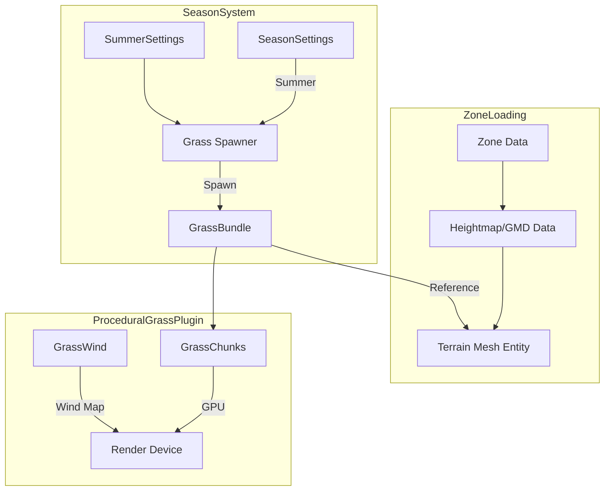

# Procedural Grass Integration Plan

## Overview

This document outlines a comprehensive plan to integrate the `bevy_procedural_grass` plugin (located at `C:\Users\vicha\RustroverProjects\bevy_procedural_grass`) to replace the current CPU-based grass system in the summer season weather system.

**Last Updated:** 2026-03-06

## Current State Analysis

### Existing Summer Grass System

**Location:** `src/systems/season/summer_system.rs`

**Characteristics:**
- Uses simple 2D billboard quads (`Rectangle` mesh) for grass blades
- CPU-based spawning near the player (up to 50,000 entities)
- CPU-based animation for swaying via `vegetation_sway_system`
- Uses `StandardMaterial` for rendering
- Spawns grass in a radius around the player
- Samples terrain height from zone data
- Each grass blade is a separate entity with `GrassBlade` component

**Components:**
- [`GrassBlade`](src/components/season.rs:38) - Component with sway parameters
- [`SeasonMarker(Season::Summer)`](src/components/season.rs:29) - For cleanup on season change

**Resources:**
- [`SummerSettings`](src/resources/season_settings.rs:108) - Configuration for grass spawning
- [`SeasonMaterials`](src/resources/season_materials.rs:21) - Pre-loaded grass meshes and materials

### bevy_procedural_grass Plugin

**Location:** `C:\Users\vicha\RustroverProjects\bevy_procedural_grass`

**Version:** 0.4.0 (Bevy 0.16.1 compatible)

**Characteristics:**
- GPU instancing for high-performance rendering
- Generates grass positions from mesh triangles using barycentric coordinates
- Custom WGSL shader with realistic 3D blade geometry (bezier curves)
- Perlin noise wind map (2048x2048) for natural wind animation
- Chunked rendering (30-unit chunks) with frustum/distance culling
- LOD support (high/low detail based on 50-unit distance threshold)
- Directional light shadows support
- Alpha blending for semi-transparent blades

**Key Types:**

| Type | File | Description |
|------|------|-------------|
| `ProceduralGrassPlugin` | `src/lib.rs:37` | Main plugin with config and wind settings |
| `GrassBundle` | `src/grass/grass.rs:30` | Bundle: Grass + GrassChunks + GrassLODMesh + Transform + Visibility |
| `Grass` | `src/grass/grass.rs:59` | Main component: entity, density, color, blade settings |
| `GrassColor` | `src/grass/grass.rs:151` | Three-color gradient: ao, color_1, color_2 |
| `Blade` | `src/grass/grass.rs:181` | Blade geometry: length, width, tilt, flexibility, curve, specular |
| `GrassWind` | `src/grass/wind.rs:44` | Wind resource/component: speed, amplitude, frequency, direction |
| `Wind` | `src/grass/wind.rs:15` | POD struct for GPU: speed, amplitude, frequency, direction, oscillation, scale |
| `GrassConfig` | `src/grass/config.rs:8` | Culling config: cull_distance (200), lod_distance (50) |
| `GrassChunks` | `src/grass/chunk.rs:31` | Spatial chunks with culling state |
| `GrassLODMesh` | `src/grass/grass.rs:208` | Optional lower-detail mesh for distant grass |
| `GrassMesh` | `src/grass/mesh.rs:9` | Procedural blade mesh generator |
| `GrassData` | `src/render/instance.rs:15` | GPU instance data: position, normal, chunk_uvw |

---

## Comparison Matrix

| Feature | Current System | bevy_procedural_grass |
|---------|---------------|----------------------|
| Rendering | CPU entities | GPU Instancing |
| Blade Geometry | 2D Billboard | 3D Bezier Curve |
| Max Blades | ~50,000 | Much higher (GPU) |
| Wind Animation | CPU per-entity | GPU Shader |
| LOD | None | High/Low based on distance |
| Culling | None | Frustum + Distance (2D or 3D) |
| Shadows | Via StandardMaterial | Custom shader support |
| Terrain Binding | Zone height sampling | Mesh triangle sampling |
| Chunk Size | N/A | 30 units (configurable) |
| LOD Distance | N/A | 50 units |
| Cull Distance | N/A | 200 units |

---

## Plugin API Reference

### ProceduralGrassPlugin

```rust
// Create plugin with custom configuration
ProceduralGrassPlugin {
    config: GrassConfig {
        cull_distance: 200.0,      // Distance at which grass is culled
        lod_distance: 50.0,        // Distance for LOD transition
        displacement_resolution: 90, // For grass displacement (future feature)
    },
    wind: GrassWind {
        wind_data: Wind {
            speed: 0.15,           // Wind animation speed
            amplitude: 1.0,        // Wind displacement amount
            frequency: 1.0,        // Wind wave frequency
            direction: 0.0,        // Wind direction in degrees
            oscillation: 1.5,      // Secondary oscillation strength
            scale: 100.0,          // Wind noise scale
            _padding: [0.0, 0.0],
        },
        wind_map: Handle<Image>::default(), // Auto-generated Perlin noise
    },
}
```

### GrassBundle Components

```rust
GrassBundle {
    // Required: Reference to terrain mesh entity
    grass: Grass {
        entity: Some(terrain_entity),  // Entity with Mesh3d component
        density: 25,                    // Grass blades per unit area
        color: GrassColor {
            ao: LinearRgba::new(0.01, 0.02, 0.05, 1.0),      // Base ambient occlusion
            color_1: LinearRgba::new(0.1, 0.23, 0.09, 1.0),  // Bottom color
            color_2: LinearRgba::new(0.12, 0.39, 0.15, 1.0), // Top color
        },
        blade: Blade {
            length: 1.5,           // Blade height
            width: 0.05,           // Blade width at base
            tilt: 0.5,             // Base tilt amount
            tilt_variance: 0.2,    // Random tilt variation
            p1_flexibility: 0.5,   // Lower section flexibility
            p2_flexibility: 0.5,   // Upper section flexibility
            curve: 15.0,           // Blade curvature (degrees)
            specular: 0.02,        // Specular highlight strength
        },
    },
    
    // Optional: LOD mesh for distant grass
    lod: GrassLODMesh::new(meshes.add(GrassMesh::mesh(3))), // Fewer segments
    
    // Standard components (defaults are fine)
    transform: Transform::default(),
    visibility: Visibility::default(),
    grass_chunks: GrassChunks::default(), // Auto-populated
}
```

### GrassMesh Generator

```rust
// Create blade mesh with different segment counts
let high_detail = GrassMesh::mesh(7);  // 7 segments = 15 vertices
let low_detail = GrassMesh::mesh(3);   // 3 segments = 7 vertices

// The mesh is a vertical blade with UV coordinates
// Vertices are positioned along Y-axis with sqrt() distribution
// for more natural blade shape
```

### GrassChunks Configuration

```rust
// Customize chunk settings via component
GrassChunks {
    chunk_size: 30.0,                    // Size of each chunk in world units
    cull_dimension: CullDimension::D2,   // D2 = XZ plane, D3 = full 3D
    chunks: HashMap::new(),              // Auto-populated during generation
    loaded: HashMap::new(),              // Auto-managed GPU buffers
    render: Vec::new(),                  // Auto-populated each frame
}
```

---

## Integration Architecture

### High-Level Design

```
┌─────────────────────────────────────────────────────────────────┐
│                      Season System                               │
├─────────────────────────────────────────────────────────────────┤
│  SeasonSettings    SummerSettings    SeasonMaterials            │
│       │                  │                  │                   │
│       ▼                  ▼                  ▼                   │
│  ┌─────────────────────────────────────────────────────────┐   │
│  │              ProceduralGrassPlugin                        │   │
│  │  ┌─────────────┐  ┌─────────────┐  ┌─────────────────┐  │   │
│  │  │ GrassConfig │  │  GrassWind  │  │ GrassColor/Blade│  │   │
│  │  └─────────────┘  └─────────────┘  └─────────────────┘  │   │
│  └─────────────────────────────────────────────────────────┘   │
│       │                                                          │
│       ▼                                                          │
│  ┌─────────────────────────────────────────────────────────┐   │
│  │              Zone Terrain Mesh                            │   │
│  │  (Generated from zone heightmap or existing geometry)    │   │
│  └─────────────────────────────────────────────────────────┘   │
│       │                                                          │
│       ▼                                                          │
│  ┌─────────────────────────────────────────────────────────┐   │
│  │              GrassBundle                                  │   │
│  │  - Grass component (density, colors, blade settings)     │   │
│  │  - GrassChunks (automatic culling)                       │   │
│  │  - GrassLODMesh (LOD support)                            │   │
│  └─────────────────────────────────────────────────────────┘   │
└─────────────────────────────────────────────────────────────────┘
```

### Component Flow



---

## Implementation Plan

### Phase 1: Plugin Integration & Terrain Mesh Setup

**Goal:** Add the plugin and create terrain mesh entities for grass generation.

#### Step 1.1: Add Dependency

Update [`Cargo.toml`](Cargo.toml):

```toml
[dependencies]
bevy_procedural_grass = { path = "../bevy_procedural_grass" }
```

#### Step 1.2: Register Plugin

Update [`src/lib.rs`](src/lib.rs):

```rust
use bevy_procedural_grass::prelude::*;

pub struct RoseOfflineClientPlugin;

impl Plugin for RoseOfflineClientPlugin {
    fn build(&self, app: &mut App) {
        // ... existing plugins ...
        
        // Add procedural grass plugin (only when needed for summer)
        app.add_plugins(bevy_procedural_grass::ProceduralGrassPlugin::default());
    }
}
```

#### Step 1.3: Create Terrain Mesh Entity

The bevy_procedural_grass plugin requires a mesh entity to generate grass on. We need to create a terrain mesh from zone data.

**Option A: Use Existing Zone Geometry**

If the zone already has terrain meshes loaded, we can reference them directly.

**Option B: Generate Terrain Mesh from Heightmap**

Create a new system that generates a terrain mesh from zone heightmap data:

```rust
// New file: src/systems/terrain_mesh.rs

use bevy::prelude::*;
use crate::zone_loader::ZoneLoaderAsset;

/// Marker for terrain mesh entities that can have grass
#[derive(Component)]
pub struct TerrainMeshForGrass;

/// System that creates/updates terrain mesh for grass generation
pub fn setup_terrain_for_grass(
    mut commands: Commands,
    mut meshes: ResMut<Assets<Mesh>>,
    zone_assets: Res<Assets<ZoneLoaderAsset>>,
    current_zone: Option<Res<CurrentZone>>,
    terrain_query: Query<(), With<TerrainMeshForGrass>>,
) {
    // Only create once per zone
    if !terrain_query.is_empty() {
        return;
    }
    
    let Some(zone_data) = current_zone.as_ref()
        .and_then(|cz| zone_assets.get(&cz.handle)) 
    else {
        return;
    };
    
    // Generate terrain mesh from zone heightmap
    let terrain_mesh = generate_terrain_mesh_from_zone(zone_data);
    
    commands.spawn((
        Mesh3d(meshes.add(terrain_mesh)),
        Transform::default(),
        TerrainMeshForGrass,
    ));
}

fn generate_terrain_mesh_from_zone(zone: &ZoneLoaderAsset) -> Mesh {
    // Implementation: Create mesh from zone height data
    // This should create a mesh with proper vertex positions matching
    // the zone's terrain
    todo!()
}
```

### Phase 2: Replace Summer Grass System

**Goal:** Replace the CPU-based grass spawning with GPU instanced grass.

#### Step 2.1: Create Grass Spawning System

Update [`src/systems/season/summer_system.rs`](src/systems/season/summer_system.rs):

```rust
use bevy_procedural_grass::prelude::*;

/// System that spawns procedural grass when season is Summer
pub fn summer_procedural_grass_system(
    mut commands: Commands,
    settings: Res<SeasonSettings>,
    summer_settings: Res<SummerSettings>,
    mut meshes: ResMut<Assets<Mesh>>,
    terrain_query: Query<Entity, With<TerrainMeshForGrass>>,
    grass_query: Query<(), With<Grass>>,
    season_materials: Res<SeasonMaterials>,
) {
    if !settings.enabled || settings.current_season != Season::Summer {
        return;
    }
    
    // Only spawn grass once
    if !grass_query.is_empty() {
        return;
    }
    
    let Ok(terrain_entity) = terrain_query.get_single() else {
        return;
    };
    
    // Create grass mesh with desired segment count
    let grass_mesh = GrassMesh::mesh(7); // 7 segments for smooth blades
    let lod_mesh = GrassMesh::mesh(3);    // 3 segments for LOD
    
    // Convert season materials to grass colors
    let grass_color = GrassColor {
        ao: LinearRgba::new(0.01, 0.02, 0.05, 1.0),
        color_1: LinearRgba::new(0.1, 0.23, 0.09, 1.0),  // Dark green
        color_2: LinearRgba::new(0.12, 0.39, 0.15, 1.0), // Light green
    };
    
    // Spawn procedural grass
    commands.spawn(
        GrassBundle {
            mesh: meshes.add(grass_mesh),
            lod: GrassLODMesh::new(meshes.add(lod_mesh)),
            grass: Grass {
                entity: Some(terrain_entity),
                density: summer_settings.grass_density, // New field in SummerSettings
                color: grass_color,
                blade: Blade {
                    length: summer_settings.grass_height_range.1,
                    width: summer_settings.grass_width * 0.5,
                    tilt: 0.5,
                    tilt_variance: 0.2,
                    p1_flexibility: summer_settings.grass_sway_amplitude,
                    p2_flexibility: summer_settings.grass_sway_amplitude * 0.8,
                    curve: 15.0,
                    specular: 0.02,
                },
            },
            ..default()
        }
    );
}
```

#### Step 2.2: Update SummerSettings

Update [`src/resources/season_settings.rs`](src/resources/season_settings.rs):

```rust
#[derive(Resource, Debug, Clone, Reflect)]
pub struct SummerSettings {
    // Remove or deprecate CPU-based settings
    // pub max_grass_blades: usize,  // No longer needed - GPU handles this
    // pub grass_height_range: (f32, f32),  // Replaced by blade settings
    // pub grass_width: f32,
    // pub grass_sway_speed: f32,
    // pub grass_sway_amplitude: f32,
    
    // New procedural grass settings
    /// Grass density per unit area (higher = more grass)
    pub grass_density: u32,
    /// Grass blade length
    pub blade_length: f32,
    /// Grass blade width at base
    pub blade_width: f32,
    /// Blade tilt angle
    pub blade_tilt: f32,
    /// Random variance in tilt
    pub blade_tilt_variance: f32,
    /// Flexibility of lower blade section
    pub blade_p1_flexibility: f32,
    /// Flexibility of upper blade section
    pub blade_p2_flexibility: f32,
    /// Blade curvature
    pub blade_curve: f32,
    
    // Keep existing flower settings
    pub max_flowers: usize,
    pub flower_spawn_chance: f32,
    pub flower_stem_height_range: (f32, f32),
    pub flower_head_size: f32,
    pub wind_intensity: f32,
    pub spawn_radius: f32,
}
```

#### Step 2.3: Update Wind Integration

Connect the existing wind settings to `GrassWind`:

```rust
/// System to sync wind settings with procedural grass
pub fn sync_grass_wind(
    settings: Res<SeasonSettings>,
    summer_settings: Res<SummerSettings>,
    mut grass_wind: ResMut<GrassWind>,
) {
    if settings.is_changed() || summer_settings.is_changed() {
        grass_wind.wind_data.speed = settings.wind_strength * 0.1;
        grass_wind.wind_data.amplitude = summer_settings.wind_intensity * 4.0;
        grass_wind.wind_data.direction = settings.wind_direction.to_degrees();
        grass_wind.wind_data.frequency = 1.0;
        grass_wind.wind_data.oscillation = 1.5;
    }
}
```

### Phase 3: Season Transition Handling

**Goal:** Properly show/hide grass based on season changes.

#### Step 3.1: Grass Visibility System

```rust
/// System to show/hide grass based on current season
pub fn grass_season_visibility(
    settings: Res<SeasonSettings>,
    mut grass_query: Query<&mut Visibility, With<Grass>>,
) {
    let should_show = settings.enabled && settings.current_season == Season::Summer;
    
    for mut visibility in grass_query.iter_mut() {
        *visibility = if should_show {
            Visibility::Visible
        } else {
            Visibility::Hidden
        };
    }
}
```

#### Step 3.2: Cleanup on Season Change

```rust
/// Remove grass entities when leaving summer
pub fn cleanup_grass_on_season_change(
    mut commands: Commands,
    settings: Res<SeasonSettings>,
    grass_query: Query<Entity, With<Grass>>,
) {
    if settings.is_changed() && settings.current_season != Season::Summer {
        for entity in grass_query.iter() {
            commands.entity(entity).despawn();
        }
    }
}
```

### Phase 4: Zone Integration

**Goal:** Integrate with zone loading/unloading.

#### Step 4.1: Zone Change Handler

```rust
/// Despawn grass when changing zones
pub fn cleanup_grass_on_zone_change(
    mut commands: Commands,
    mut zone_events: EventReader<ZoneChangeEvent>,
    grass_query: Query<Entity, With<Grass>>,
    terrain_query: Query<Entity, With<TerrainMeshForGrass>>,
) {
    for _ in zone_events.read() {
        // Despawn all grass
        for entity in grass_query.iter() {
            commands.entity(entity).despawn();
        }
        
        // Despawn terrain mesh
        for entity in terrain_query.iter() {
            commands.entity(entity).despawn();
        }
    }
}
```

### Phase 5: UI Integration

**Goal:** Add grass configuration to settings UI.

#### Step 5.1: Update Settings UI

Update [`src/ui/ui_settings_system.rs`](src/ui/ui_settings_system.rs):

```rust
SettingsPage::Seasons => {
    // ... existing season settings ...
    
    ui.separator();
    ui.label("Procedural Grass Settings:");
    
    egui::Grid::new("grass_settings")
        .num_columns(2)
        .show(ui, |ui| {
            ui.label("Grass Density:");
            ui.add(egui::Slider::new(&mut summer_settings.grass_density, 5..=100)
                .show_value(true));
            ui.end_row();
            
            ui.label("Blade Length:");
            ui.add(egui::Slider::new(&mut summer_settings.blade_length, 0.5..=3.0)
                .show_value(true));
            ui.end_row();
            
            ui.label("Blade Width:");
            ui.add(egui::Slider::new(&mut summer_settings.blade_width, 0.01..=0.2)
                .show_value(true));
            ui.end_row();
            
            ui.label("Blade Flexibility:");
            ui.add(egui::Slider::new(&mut summer_settings.blade_p1_flexibility, 0.1..=1.0)
                .show_value(true));
            ui.end_row();
        });
}
```

---

## File Changes Summary

### New Files

| File | Purpose |
|------|---------|
| `src/systems/terrain_mesh.rs` | Terrain mesh generation for grass |

### Modified Files

| File | Changes |
|------|---------|
| `Cargo.toml` | Add bevy_procedural_grass dependency |
| `src/lib.rs` | Register ProceduralGrassPlugin |
| `src/systems/season/mod.rs` | Add new grass systems |
| `src/systems/season/summer_system.rs` | Replace CPU grass with GPU procedural grass |
| `src/resources/season_settings.rs` | Update SummerSettings for procedural grass |
| `src/resources/season_materials.rs` | Remove unused grass mesh/material creation |
| `src/components/season.rs` | Remove or deprecate GrassBlade component |
| `src/ui/ui_settings_system.rs` | Add procedural grass settings UI |

### Deprecated/Removed

| Item | Reason |
|------|--------|
| `GrassBlade` component | Replaced by GPU-based rendering |
| `vegetation_sway_system` | Replaced by GPU wind shader |
| `spawn_grass_blade()` function | Replaced by GrassBundle spawning |
| CPU-based grass materials | Replaced by GrassColor |

---

## Technical Considerations

### Terrain Mesh Requirements

The bevy_procedural_grass plugin generates grass on mesh triangles. The terrain mesh must:

1. **Cover all areas where grass should appear**
2. **Have accurate vertex positions** matching the zone's terrain height
3. **Use proper winding order** for normal calculation
4. **Be reasonably subdivided** for natural grass distribution

**Important:** The grass is generated at `PostStartup` in the `generate_grass` system. The terrain mesh must exist before this runs, or grass generation will be skipped.

### Performance Considerations

1. **Density Setting**: Higher density = more GPU work. Start with ~25 and adjust.
2. **LOD Distance**: Configure `GrassConfig.lod_distance` (default: 50) for smooth transitions.
3. **Cull Distance**: Configure `GrassConfig.cull_distance` (default: 200) to avoid rendering distant grass.
4. **Chunk Size**: Default 30 units works well for most zones.
5. **Cull Dimension**: Use `CullDimension::D2` for flat terrain (XZ plane only), `CullDimension::D3` for hilly terrain.

### Wind Integration

The procedural grass uses a Perlin noise wind map (2048x2048) for animation. The wind map is auto-generated at startup in the `create_wind_map` system. Connect to existing wind settings:

```rust
// In your settings sync system
fn sync_grass_wind(
    settings: Res<SeasonSettings>,
    summer_settings: Res<SummerSettings>,
    mut grass_wind: ResMut<GrassWind>,
) {
    if settings.is_changed() || summer_settings.is_changed() {
        // Convert from our wind settings to grass wind
        grass_wind.wind_data.speed = settings.wind_strength * 0.1;
        grass_wind.wind_data.amplitude = summer_settings.wind_intensity * 4.0;
        grass_wind.wind_data.direction = settings.wind_direction.to_degrees();
        grass_wind.wind_data.frequency = 1.0;
        grass_wind.wind_data.oscillation = 1.5;
        grass_wind.wind_data.scale = 100.0;
    }
}
```

### Shader Details

The grass shader (`grass.wgsl`) handles all rendering:

**Vertex Shader:**
- Generates 3D blade geometry using cubic Bezier curves
- Applies wind displacement using Perlin noise texture sampling
- Aligns blades to surface normals via rotation matrix
- Computes per-vertex lighting data (normal, tangent, world position)

**Fragment Shader:**
- Color gradient from base to tip (color_1 → color_2)
- Ambient occlusion at base (ao color)
- Directional light shadows via `shadows::fetch_directional_shadow`
- Specular highlights based on view distance
- Normal curve adjustment for double-sided rendering

**Shader Imports** (from Bevy PBR):
```wgsl
#import bevy_pbr::mesh_functions::mesh_position_local_to_clip
#import bevy_pbr::mesh_bindings::mesh
#import bevy_pbr::mesh_view_bindings::globals
#import bevy_pbr::mesh_view_bindings::lights
#import bevy_pbr::mesh_view_bindings::view
#import bevy_pbr::utils::PI
#import bevy_pbr::utils::random1D
#import bevy_pbr::shadows
```

### Grass Generation Algorithm

The grass is generated in the `generate_grass()` system at `PostStartup`:

1. For each `Grass` component with a valid entity reference:
   - Get the mesh from the referenced entity
   - For each triangle in the mesh:
     - Calculate triangle area
     - Determine grass count: `density * area`
     - For each grass blade:
       - Generate random barycentric coordinates
       - Calculate world position on triangle
       - Store in appropriate chunk based on position

2. Chunks are keyed by `(floor(x/chunk_size), floor(y/chunk_size), floor(z/chunk_size))`.

3. Each frame, `grass_culling()` system:
   - Tests each chunk against camera frustum using OBB intersection
   - Checks distance-based culling (2D or 3D based on `cull_dimension`)
   - Determines LOD level based on distance from camera
   - Updates render list with visible chunks

### Zone Coordinate System

Remember that zone coordinates differ from world coordinates:
- World X = Zone X / 100
- World Z = -Zone Y / 100

The terrain mesh must be generated in world coordinates.

---

## Migration Path

### Step-by-Step Migration

1. **Add dependency and plugin** (no behavior change)
2. **Create terrain mesh system** (parallel to existing)
3. **Add procedural grass spawning** (parallel to existing, disabled)
4. **Test procedural grass in one zone**
5. **Add settings UI toggle** to switch between systems
6. **Verify performance and visuals**
7. **Remove old CPU-based system**
8. **Clean up deprecated code**

### Rollback Plan

If issues arise:
1. Disable `ProceduralGrassPlugin`
2. Re-enable old `summer_vegetation_system`
3. Restore `GrassBlade` component usage

---

## Testing Checklist

### Visual Tests
- [ ] Grass appears on terrain in summer
- [ ] Grass color matches expected green shades
- [ ] Wind animation looks natural
- [ ] LOD transition is smooth
- [ ] No grass appears outside terrain bounds
- [ ] Grass disappears when season changes
- [ ] Grass respawns when returning to summer

### Performance Tests
- [ ] FPS stable with max grass density
- [ ] No frame drops when approaching grass areas
- [ ] Memory usage acceptable
- [ ] No GPU timeouts or crashes

### Integration Tests
- [ ] Zone transitions work correctly
- [ ] Settings UI changes apply immediately
- [ ] Wind direction affects grass movement
- [ ] Shadows render correctly on grass

---

## Open Questions

1. **Terrain Mesh Generation**: Should we generate a separate mesh for grass or use existing zone geometry?
   - *Option A*: Generate dedicated low-poly terrain mesh from heightmap
   - *Option B*: Reference existing zone ground meshes

2. **Flower Integration**: Should flowers remain CPU-based or integrate with procedural system?
   - *Current*: Flowers are separate entities with billboard behavior
   - *Option*: Could extend procedural system for flowers

3. **Grass Displacement**: The plugin mentions TODO for grass interaction/displacement
   - Should we implement custom displacement for player/NPC movement?

4. **Multiple Grass Types**: The current system supports multiple grass colors
   - How to handle with single `GrassColor` in procedural system?
   - *Option*: Spawn multiple GrassBundle entities with different colors

---

## Timeline Estimate

| Phase | Estimated Time | Priority |
|-------|---------------|----------|
| Phase 1: Plugin Integration | 2-4 hours | High |
| Phase 2: Replace Summer System | 4-6 hours | High |
| Phase 3: Season Transitions | 2-3 hours | High |
| Phase 4: Zone Integration | 2-3 hours | Medium |
| Phase 5: UI Integration | 1-2 hours | Medium |
| Testing & Polish | 4-6 hours | High |

**Total Estimate**: 15-24 hours

---

## References

- [bevy_procedural_grass Repository](https://github.com/jadedbay/bevy_procedural_grass/)
- [bevy_procedural_grass Documentation](https://docs.rs/bevy_procedural_grass/latest/bevy_procedural_grass/)
- [Weather Season System Architecture](../docs/weather-season-system.md)
- [Ghost of Tsushima Grass GDC Talk](https://www.youtube.com/watch?v=Ibe1JBF5i5Y)
- [Acerola Foliage Rendering Video](https://www.youtube.com/watch?v=jw00MbIJcrk)
