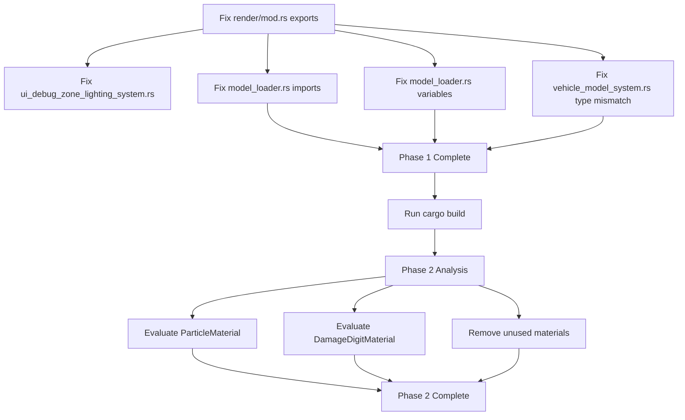

# Rose Online Client - Render System Simplification Resolution Plan

## Executive Summary

This plan addresses 18 compilation errors and 136 warnings in the Rose Online client by fixing missing type exports and aligning the rendering system with Bevy 0.13.2's built-in render pipeline. The approach focuses on immediate error resolution while laying out a path for long-term simplification.

---

## Current State Analysis

### Render Module Structure (src/render/mod.rs)

The render module has been partially simplified to use Bevy's built-in materials, but critical type exports are missing:

**Currently Re-exported:**
- `WorldUiRect`
- `ObjectMaterial` (Bevy Material trait)
- `EffectMeshMaterial` (Bevy Material trait)
- `ParticleMaterial` (Simple texture wrapper)
- `ZoneLighting` (Resource)
- `DamageDigitMaterial` (Simple texture wrapper)

**Custom Materials Still Present:**
1. **ObjectMaterial** - Uses Bevy's Material trait with custom shader
2. **EffectMeshMaterial** - Uses Bevy's Material trait with custom shader
3. **ParticleMaterial** - Simple texture wrapper using RenderAsset
4. **DamageDigitMaterial** - Simple texture wrapper using RenderAsset
5. **TrailEffect** - Full custom render pipeline (not a material)
6. **ZoneLighting** - Resource for zone lighting

### Missing Re-exports (9 types)

1. `EffectMeshAnimationFlags` - from `effect_mesh_material.rs`
2. `EffectMeshAnimationRenderState` - from `effect_mesh_material.rs`
3. `ParticleRenderBillboardType` - from `particle_render_data.rs`
4. `ParticleRenderData` - from `particle_render_data.rs`
5. `DamageDigitRenderData` - from `damage_digit_render_data.rs`
6. `ObjectMaterialClipFace` - from `object_material_simple.rs`
7. `ObjectMaterialBlend` - from `object_material_simple.rs`
8. `ObjectMaterialGlow` - from `object_material_simple.rs`
9. `TrailEffect` - from `trail_effect.rs`

### Compilation Errors by Category

**Category 1: Unresolved Imports (E0432) - 13 errors**
- Files affected:
  - `src/animation/mesh_animation.rs` (2 errors)
  - `src/effect_loader.rs` (3 errors)
  - `src/resources/damage_digits_spawner.rs` (1 error)
  - `src/systems/character_model_blink_system.rs` (1 error)
  - `src/systems/damage_digit_render_system.rs` (1 error)
  - `src/systems/debug_inspector_system.rs` (2 errors)
  - `src/systems/item_drop_model_system.rs` (1 error)
  - `src/systems/npc_model_system.rs` (3 errors)
  - `src/systems/personal_store_model_system.rs` (1 error)

**Category 2: Cannot Find Value/Type (E0425) - 4 errors**
- `src/model_loader.rs` (4 errors):
  - `particle_materials` variable not found (lines 263, 979)
  - `effect_mesh_materials` variable not found (lines 264, 980)
  - `TrailEffect` struct not found (line 494)

**Category 3: Cannot Find Struct (E0422) - 1 error**
- `src/model_loader.rs`: `TrailEffect` struct not found (line 494)

**Category 4: Private Import (E0603) - 1 error**
- `src/ui/ui_debug_zone_lighting_system.rs`: `ZoneLighting` imported from private location

**Category 5: Type Mismatch (E0308) - 1 error**
- `src/systems/vehicle_model_system.rs`: `Assets<ObjectMaterial>` vs `Assets<StandardMaterial>` (line 128)

---

## Phase 1: Immediate Fixes (Resolve Compilation Errors)

### Objective
Fix all 18 compilation errors to achieve a buildable state.

### Tasks

#### Task 1.1: Fix Render Module Exports
**File:** `src/render/mod.rs`

**Changes Required:**
```rust
// Add these re-exports after existing ones
pub mod particle_render_data;
pub use particle_render_data::{ParticleRenderBillboardType, ParticleRenderData};

pub mod damage_digit_render_data;
pub use damage_digit_render_data::DamageDigitRenderData;

pub mod trail_effect;
pub use trail_effect::TrailEffect;

// Re-export enums from object_material_simple
pub use object_material_simple::{ObjectMaterialClipFace, ObjectMaterialBlend, ObjectMaterialGlow};

// Re-export types from effect_mesh_material
pub use effect_mesh_material::{EffectMeshAnimationFlags, EffectMeshAnimationRenderState};
```

**Risk:** Low - Adding public re-exports is safe and backward compatible

---

#### Task 1.2: Fix Private Import in ui_debug_zone_lighting_system.rs
**File:** `src/ui/ui_debug_zone_lighting_system.rs`

**Current Issue:**
```rust
use crate::{systems::zone_time_system::ZoneLighting, ui::UiStateDebugWindows};
```

**Required Fix:**
```rust
use crate::{render::ZoneLighting, ui::UiStateDebugWindows};
```

**Risk:** Low - Direct import from render module

---

#### Task 1.3: Fix Missing Variables in model_loader.rs
**File:** `src/model_loader.rs`

**Current Issues:**
- Lines 263, 979: `particle_materials` variable not found
- Lines 264, 980: `effect_mesh_materials` variable not found

**Root Cause:**
The `spawn_npc_model()` and `spawn_vehicle_model()` functions call `spawn_effect()` which requires `particle_materials` and `effect_mesh_materials` parameters, but these are not passed from calling functions.

**Required Fixes:**

**Option A - Add parameters to functions (Recommended):**
Update function signatures to accept these parameters:

```rust
// In spawn_npc_model() - add parameters
pub fn spawn_npc_model(
    &self,
    commands: &mut Commands,
    asset_server: &AssetServer,
    standard_materials: &mut Assets<bevy::pbr::StandardMaterial>,
    skinned_mesh_inverse_bindposes_assets: &mut Assets<SkinnedMeshInverseBindposes>,
    particle_materials: &mut Assets<ParticleMaterial>,      // ADD
    effect_mesh_materials: &mut Assets<EffectMeshMaterial>, // ADD
    model_entity: Entity,
    npc_id: NpcId,
) -> Option<(NpcModel, SkinnedMesh, DummyBoneOffset)>

// In spawn_vehicle_model() - add parameters
pub fn spawn_vehicle_model(
    &self,
    commands: &mut Commands,
    asset_server: &AssetServer,
    standard_materials: &mut Assets<bevy::pbr::StandardMaterial>,
    skinned_mesh_inverse_bindposes_assets: &mut Assets<SkinnedMeshInverseBindposes>,
    particle_materials: &mut Assets<ParticleMaterial>,      // ADD
    effect_mesh_materials: &mut Assets<EffectMeshMaterial>, // ADD
    vehicle_model_entity: Entity,
    driver_model_entity: Entity,
    equipment: &Equipment,
) -> (VehicleModel, SkinnedMesh, DummyBoneOffset)
```

Then update all call sites to pass these parameters.

**Option B - Remove effect spawning (Alternative):**
Comment out effect spawning code in `spawn_npc_model()` and `spawn_vehicle_model()` functions.

**Risk:** Medium - Option A requires updating multiple call sites

---

#### Task 1.4: Fix TrailEffect Usage in model_loader.rs
**File:** `src/model_loader.rs`

**Current Issue:**
Line 494 uses `TrailEffect` struct which is not imported.

**Required Fix:**
Add import:
```rust
use crate::render::TrailEffect;
```

**Risk:** Low - Simple import addition

---

#### Task 1.5: Fix Type Mismatch in vehicle_model_system.rs
**File:** `src/systems/vehicle_model_system.rs`

**Current Issue:**
Line 128 passes `&mut object_materials` (type `Assets<ObjectMaterial>`) to `spawn_vehicle_model()` which expects `&mut Assets<StandardMaterial>`.

**Required Fix:**
Update function signature to use correct type:
```rust
// Change from:
mut object_materials: ResMut<Assets<ObjectMaterial>>,

// To:
mut standard_materials: ResMut<Assets<bevy::pbr::StandardMaterial>>,
```

Then update line 128 to pass `standard_materials` instead of `object_materials`.

**Risk:** Medium - Requires understanding that vehicle models now use StandardMaterial

---

### Phase 1 Testing Strategy

After completing Phase 1 tasks:

1. Run `cargo build` to verify all compilation errors are resolved
2. Review and address any remaining warnings (136 warnings)
3. Test basic game functionality (spawn NPC, spawn vehicle, spawn item drop)

---

## Phase 2: Simplification Strategy

### Objective
Identify which custom materials can be replaced with Bevy's StandardMaterial and which custom render pipelines can be removed, while maintaining visual fidelity.

### Analysis of Custom Materials

#### 2.1 ObjectMaterial
**Current Status:** Uses Bevy's Material trait with custom shader
**Purpose:** Character/NPC/Item models with support for:
- Multiple UV channels (lightmap, specular)
- Alpha modes (opaque, mask, blend)
- Two-sided rendering
- Custom blend modes (normal, lighten)
- Glow effects
- Skinned mesh support

**Assessment:** **KEEP** - Too complex to replace with StandardMaterial
**Reasoning:**
- Requires custom shader for multiple UV channels
- Glow effects need custom shader logic
- Blend modes need custom fragment shader
- Already integrates well with Bevy's Material trait

**Recommendation:** Keep as-is, ensure proper re-exports

---

#### 2.2 EffectMeshMaterial
**Current Status:** Uses Bevy's Material trait with custom shader
**Purpose:** Effect meshes with support for:
- Animation textures
- Custom blend operations
- Alpha testing
- Two-sided rendering

**Assessment:** **KEEP** - Requires custom animation support
**Reasoning:**
- Animation textures require custom shader logic
- Custom blend operations need specialized fragment shader
- Already integrates well with Bevy's Material trait

**Recommendation:** Keep as-is, ensure proper re-exports

---

#### 2.3 ParticleMaterial
**Current Status:** Simple texture wrapper using RenderAsset
**Purpose:** Particle effects with billboard rendering

**Assessment:** **CONSIDER REPLACEMENT**
**Reasoning:**
- Simple texture-only material
- Could potentially use Bevy's StandardMaterial with emissive
- However, custom particle pipeline may need specific features

**Recommendation:** Evaluate particle rendering requirements before deciding

---

#### 2.4 DamageDigitMaterial
**Current Status:** Simple texture wrapper using RenderAsset
**Purpose:** Damage number display

**Assessment:** **CONSIDER REPLACEMENT**
**Reasoning:**
- Simple texture-only material
- Could use StandardMaterial with emissive
- Custom render pipeline handles quad generation

**Recommendation:** Evaluate damage digit rendering requirements before deciding

---

#### 2.5 TrailEffect
**Current Status:** Full custom render pipeline
**Purpose:** Weapon trail effects

**Assessment:** **KEEP** - Highly specialized
**Reasoning:**
- Custom vertex buffer management
- Catmull-Rom spline interpolation
- Custom render command implementation
- Not a material, but a complete render pipeline

**Recommendation:** Keep as-is, ensure proper re-export

---

#### 2.6 ZoneLighting
**Current Status:** Resource for zone lighting
**Purpose:** Time-based lighting and fog

**Assessment:** **KEEP** - Game logic resource
**Reasoning:**
- Not a render material
- Contains game state and configuration
- Used by multiple systems

**Recommendation:** Keep as-is, ensure proper re-export

---

### Simplification Recommendations

#### 2.7 Remove Unused Custom Materials
**Candidates for removal:**
- SkyMaterial (if exists)
- WaterMaterial (if exists)
- TerrainMaterial (if exists)

**Action:**
1. Search for these materials in `src/render/`
2. Check if they are used
3. If unused, remove files and update `mod.rs`

---

#### 2.8 Consolidate Simple Texture Wrappers
**Observation:** `ParticleMaterial` and `DamageDigitMaterial` are similar

**Potential Simplification:**
Consider creating a generic `SimpleTextureMaterial` if both share the same pattern.

**Action:**
1. Compare implementations
2. If similar, refactor to reduce code duplication

---

## Phase 3: Implementation Order

### Dependency Graph



### Prioritized Task List

**Priority 1 - Critical Path Compilation:**
1. Fix render module exports (Task 1.1)
2. Fix private import in ui_debug_zone_lighting_system.rs (Task 1.2)
3. Fix TrailEffect import in model_loader.rs (Task 1.4)
4. Fix type mismatch in vehicle_model_system.rs (Task 1.5)
5. Fix missing variables in model_loader.rs (Task 1.3)
6. Run cargo build to verify

**Priority 2 - Simplification (After compilation):**
7. Evaluate ParticleMaterial replacement feasibility
8. Evaluate DamageDigitMaterial replacement feasibility
9. Remove unused custom materials
10. Consolidate similar texture wrappers

---

## Risk Assessment and Mitigation

### Phase 1 Risks

| Risk | Likelihood | Impact | Mitigation |
|-------|-------------|--------|------------|
| Breaking existing functionality | Low | Low - Only adding exports, not changing implementations |
| Type mismatch in vehicle_model_system | Medium | Medium - Verify StandardMaterial works for vehicles |
| Missing parameter propagation | Medium | Medium - Update all call sites carefully |
| TrailEffect import issues | Low | Low - Simple import addition |

### Phase 2 Risks

| Risk | Likelihood | Impact | Mitigation |
|-------|-------------|--------|------------|
| Visual fidelity degradation | Medium | High - Thorough testing before replacement |
| Performance regression | Low | Medium - Benchmark before/after changes |
| Breaking particle effects | Medium | High - Keep custom pipeline if needed |
| Increased complexity | Low | Low - Only simplifying where beneficial |

---

## Trade-off Analysis

### Performance Impact

**Using StandardMaterial vs Custom Materials:**

| Aspect | Custom Materials | StandardMaterial | Assessment |
|---------|-----------------|------------------|------------|
| Shader compilation | Per-material | Shared | StandardMaterial may be faster |
| Draw calls | Specialized | General | Custom materials may be more efficient |
| Memory | Per-material | Shared | StandardMaterial uses less memory |
| GPU state changes | Optimized | May change more | Custom materials can batch better |

**Recommendation:**
- Keep specialized materials where they provide significant performance benefits
- Use StandardMaterial for simple cases
- Profile before and after changes

### Visual Fidelity

**Potential Changes:**
- **ParticleMaterial → StandardMaterial:** Minimal impact if emissive used correctly
- **DamageDigitMaterial → StandardMaterial:** Minimal impact
- **ObjectMaterial:** No change (keeping custom)
- **EffectMeshMaterial:** No change (keeping custom)

**Testing Strategy:**
1. Screenshot comparison before/after
2. Side-by-side comparison
3. User acceptance testing

### Code Maintainability

**Benefits of Simplification:**
- Reduced custom shader maintenance
- Easier Bevy version upgrades
- Less code to maintain
- Better community support

**Costs of Simplification:**
- Loss of specialized features
- Potential performance regressions
- Testing overhead

**Recommendation:**
- Simplify where benefits outweigh costs
- Keep custom materials for game-critical features
- Document decisions clearly

### Future Bevy Version Compatibility

**Current State:**
- Using Bevy 0.13.2
- Custom materials use Material trait (stable API)

**Benefits of Simplification:**
- Easier upgrades to future Bevy versions
- Less breaking changes when Bevy updates
- Better compatibility with Bevy ecosystem

**Recommendation:**
- Follow Bevy's Material trait for new custom materials
- Avoid direct render pipeline access when possible
- Monitor Bevy changelog for deprecations

---

## Testing Strategy

### Phase 1 Testing

**Compilation Testing:**
```bash
cargo build
```

**Expected Outcome:**
- 0 compilation errors
- Reduced warnings (from 136 to <50)

**Functional Testing:**
1. Load zone with NPCs
2. Spawn player character
3. Equip weapon (test weapon trails)
4. Spawn vehicle
5. Spawn item drop
6. Test damage digits
7. Test zone lighting changes

### Phase 2 Testing

**Performance Testing:**
1. Frame rate comparison (before/after)
2. Memory usage comparison
3. GPU draw call analysis
4. Shader compilation time

**Visual Testing:**
1. Screenshot comparison
2. Side-by-side rendering
3. Art team review
4. Community feedback

**Regression Testing:**
1. All existing functionality still works
2. No new visual artifacts
3. No performance degradation
4. No crashes or instability

---

## Rollback Strategy

### Phase 1 Rollback

If compilation errors persist or new issues arise:

1. **Git Revert:**
```bash
git checkout HEAD -- src/render/mod.rs
git checkout HEAD -- src/ui/ui_debug_zone_lighting_system.rs
git checkout HEAD -- src/model_loader.rs
git checkout HEAD -- src/systems/vehicle_model_system.rs
```

2. **Document Issues:**
   - What was attempted
   - What failed
   - Why it failed
   - Alternative approaches

### Phase 2 Rollback

If simplification causes issues:

1. **Gradual Reversion:**
   - Revert one material at a time
   - Test after each revert
   - Identify problematic change

2. **Feature Flags:**
   - Add compile-time flags to enable/disable simplifications
   - Allow runtime switching between old/new implementations
   - Facilitate A/B testing

3. **Branch Strategy:**
   - Keep simplification in separate branch
   - Merge only when stable
   - Maintain main branch stability

---

## File-Level Recommendations

### Files to Modify in Phase 1

| File | Changes | Lines Affected | Risk |
|-------|----------|-----------------|-------|
| `src/render/mod.rs` | Add re-exports | ~10 | Low |
| `src/ui/ui_debug_zone_lighting_system.rs` | Fix import | 1 | Low |
| `src/model_loader.rs` | Add imports, fix parameters | ~10 | Medium |
| `src/systems/vehicle_model_system.rs` | Fix type | 2 | Medium |
| `src/systems/npc_model_system.rs` | Update calls (if Option A) | ~5 | Low |
| `src/systems/character_model_system.rs` | Update calls (if Option A) | ~5 | Low |

### Files to Analyze in Phase 2

| File | Analysis Required | Decision Needed |
|-------|------------------|----------------|
| `src/render/particle_material.rs` | Replace with StandardMaterial? | Yes |
| `src/render/damage_digit_material.rs` | Replace with StandardMaterial? | Yes |
| `src/render/sky_material.rs` | Is it used? | Yes |
| `src/render/water_material.rs` | Is it used? | Yes |
| `src/render/terrain_material.rs` | Is it used? | Yes |
| `src/render/particle_pipeline.rs` | Can it be simplified? | Yes |
| `src/render/damage_digit_pipeline.rs` | Can it be simplified? | Yes |

---

## Success Criteria

### Phase 1 Success
- [ ] All 18 compilation errors resolved
- [ ] `cargo build` completes successfully
- [ ] Warnings reduced to <50
- [ ] Basic game functionality works

### Phase 2 Success
- [ ] At least 1 custom material replaced with StandardMaterial
- [ ] Unused custom materials removed
- [ ] Code complexity reduced
- [ ] Performance maintained or improved
- [ ] Visual fidelity maintained

---

## Next Steps After Plan Approval

1. Switch to Code mode
2. Implement Phase 1 tasks in order
3. Run `cargo build` after each task
4. Test compilation after Phase 1 completion
5. Create feature branch for Phase 2 changes
6. Implement Phase 2 tasks incrementally
7. Test thoroughly after each change
8. Document all decisions and trade-offs
9. Update this plan with lessons learned
