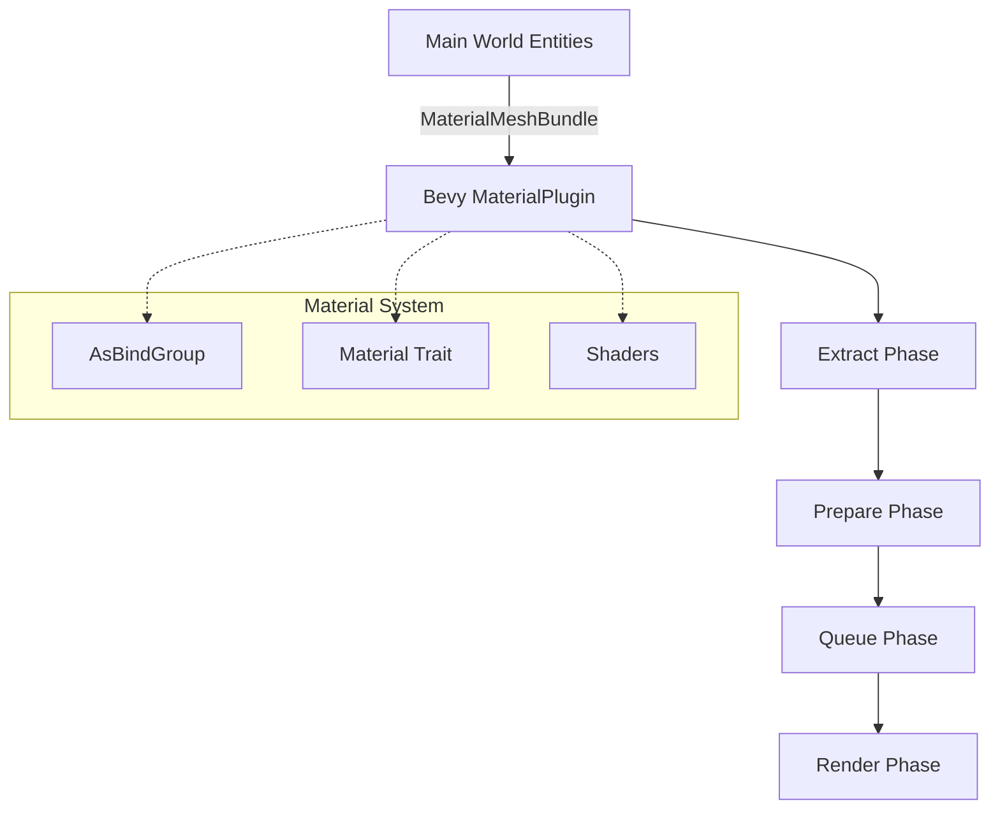

# Render Simplification and Resolution Plan

## Objective
Simplify the rendering implementation by migrating custom pipelines to Bevy's `Material` and `MaterialPlugin` system. This will reduce boilerplate, improve maintainability, and leverage Bevy's optimized rendering path.

## Scope
- Refactor `DamageDigitMaterial`, `ParticleMaterial`, and `WaterMaterial` to use the `Material` trait and `AsBindGroup`.
- Remove custom render pipelines and manual extraction/preparation/queuing systems.
- Update shaders to be compatible with Bevy's `Material` binding groups.
- Register new materials in `RoseRenderPlugin`.

## Detailed Steps

### 1. Refactor `DamageDigitMaterial`
- **File**: [`src/render/damage_digit_material.rs`](src/render/damage_digit_material.rs)
- **Changes**:
    - Implement `AsBindGroup` for `DamageDigitMaterial`.
    - Implement `Material` trait for `DamageDigitMaterial`.
    - Define the bind group layout to include the texture and any necessary storage buffers (if still using the storage buffer approach for batching).
    - *Note*: If moving to a more standard Bevy approach, consider if `DamageDigitRenderData` should be converted to a `Mesh`. However, for now, we will keep the storage buffer approach but wrap it in `AsBindGroup`.
- **Shader Update**: [`src/render/shaders/damage_digit.wgsl`](src/render/shaders/damage_digit.wgsl)
    - Update binding groups to match Bevy's `Material` convention (Group 1 for material bindings).
    - Ensure compatibility with `Material2d` or `Material` (3D).

### 2. Refactor `ParticleMaterial`
- **File**: [`src/render/particle_material.rs`](src/render/particle_material.rs)
- **Changes**:
    - Implement `AsBindGroup` and `Material` for `ParticleMaterial`.
    - Bind the particle texture and storage buffers (positions, sizes, colors, textures) via `AsBindGroup`.
- **Shader Update**: [`src/render/shaders/particle.wgsl`](src/render/shaders/particle.wgsl)
    - Update binding groups to Group 1.

### 3. Refactor `WaterMaterial`
- **File**: [`src/render/water_material.rs`](src/render/water_material.rs)
- **Changes**:
    - Implement `Material` trait.
    - Update `AsBindGroup` to properly handle the texture array (`binding_array<texture_2d<f32>>`).
    - Use `#[uniform(0)]` or similar for animation data instead of push constants if possible, or keep push constants if the `Material` trait is configured to support them.
    - Remove the manual `WaterMaterialPlugin` logic that handles bind groups and pipelines.
- **Shader Update**: [`src/render/shaders/water_material.wgsl`](src/render/shaders/water_material.wgsl)
    - Adjust bindings to match the new `AsBindGroup` layout.

### 4. Cleanup Redundant Code
- **Remove Files**:
    - `src/render/damage_digit_pipeline.rs`
    - `src/render/particle_pipeline.rs`
- **Update `src/render/mod.rs`**:
    - Remove imports and module declarations for the deleted pipeline files.
    - Update `RoseRenderPlugin` to register:
        - `MaterialPlugin::<DamageDigitMaterial>::default()`
        - `MaterialPlugin::<ParticleMaterial>::default()`
        - `MaterialPlugin::<WaterMaterial>::default()`
- **Update Systems**:
    - Review `src/systems/damage_digit_render_system.rs` to ensure it correctly interacts with the new material-based rendering (e.g., spawning `MaterialMeshBundle` if applicable).

### 5. Validation Strategy
- **Compilation**: Run `cargo build` to ensure all trait implementations are correct and types match.
- **Visual Verification**:
    - Verify damage digits appear correctly above entities.
    - Verify particles (effects) are rendered with correct blending and textures.
    - Verify water animation and transparency are working.
- **Regression Testing**:
    - Check `SkyMaterial` and `TerrainMaterial` to ensure they are unaffected by the changes in `RoseRenderPlugin`.

## Mermaid Diagram: New Rendering Flow

