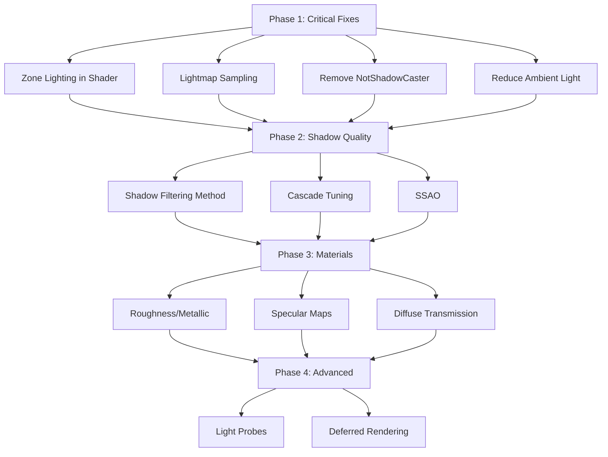

# Shadow/Shader Quality Improvement Plan

## Executive Summary

### Problem Statement
Trees and zone objects appear too bright in the ROSE Offline Client. The rendering lacks proper shadow casting, zone lighting integration, and material properties that would provide realistic lighting and depth.

### Root Causes Identified

| Issue | Location | Impact |
|-------|----------|--------|
| Zone lighting not applied | [`rose_object_extension.wgsl`](../src/render/shaders/rose_object_extension.wgsl:44-62) | Objects miss ambient/diffuse color adjustments |
| Lightmap textures not sampled | [`rose_object_extension.wgsl`](../src/render/shaders/rose_object_extension.wgsl:23-27) | Pre-baked lighting data unused |
| Objects don't cast shadows | [`zone_loader.rs:2441`](../src/zone_loader.rs:2441), [`2791`](../src/zone_loader.rs:2791) | No depth perception, flat appearance |
| Terrain doesn't cast shadows | [`terrain_material.rs:57`](../src/render/terrain_material.rs:57) | Shadows don't ground objects |
| High ambient light compensation | [`zone_lighting.rs:123`](../src/render/zone_lighting.rs:123) | `AmbientLight.brightness: 500.0` washes out details |

### Expected Outcomes
1. **Darker, more atmospheric zone objects** - Proper zone lighting application
2. **Enhanced depth perception** - Shadows from trees, buildings, and terrain
3. **Improved visual quality** - Soft shadows, ambient occlusion
4. **Better material representation** - Proper roughness/metallic values

---

## Phase 1: Critical Fixes (Immediate - High Impact)

### 1.1 Fix Zone Lighting Application in Shaders

**Problem:** The shader has zone lighting bind group at `@group(3)` but never calls `apply_zone_lighting()`.

**File:** [`src/render/shaders/rose_object_extension.wgsl`](../src/render/shaders/rose_object_extension.wgsl)

**Current Code (Lines 44-62):**
```wgsl
@fragment
fn fragment(
    in: VertexOutput,
    @builtin(front_facing) is_front: bool,
) -> FragmentOutput {
    var out: FragmentOutput;
    
    // Generate PBR input from standard material
    var pbr_input = pbr_input_from_standard_material(in, is_front);
    
    // Apply standard Bevy PBR lighting
    // This includes response to directional lights, ambient lights, and environment
    let color = apply_pbr_lighting(pbr_input);
    
    // Apply post-processing (fog, tonemapping, etc.)
    out.color = main_pass_post_lighting_processing(pbr_input, color);
    
    return out;
}
```

**Proposed Fix:**
```wgsl
#import rose_client::zone_lighting::{get_zone_lighting, apply_zone_lighting_fog}

#ifdef PREPASS_PIPELINE
@fragment
fn fragment(
    in: VertexOutput,
    @builtin(front_facing) is_front: bool,
) -> FragmentOutput {
    var pbr_input = pbr_input_from_standard_material(in, is_front);
    let out = deferred_output(in, pbr_input);
    return out;
}
#else
@fragment
fn fragment(
    in: VertexOutput,
    @builtin(front_facing) is_front: bool,
) -> FragmentOutput {
    var out: FragmentOutput;
    
    var pbr_input = pbr_input_from_standard_material(in, is_front);
    
    // Apply standard Bevy PBR lighting first
    let base_color = apply_pbr_lighting(pbr_input);
    
    // Apply zone lighting fog for distance-based darkening
    // This uses the zone's fog color and density to blend objects into the atmosphere
    let world_pos = in.world_position;
    let view_z = in.view.z;  // View-space Z for fog calculation
    
    out.color = apply_zone_lighting_fog(world_pos, base_color, view_z);
    
    // Apply post-processing (tonemapping, etc.)
    out.color = main_pass_post_lighting_processing(pbr_input, out.color);
    
    return out;
}
#endif
```

**Implementation Notes:**
- Import zone lighting functions from the zone_lighting module
- Apply fog after PBR lighting but before post-processing
- The `apply_zone_lighting_fog()` function handles distance-based fog blending

---

### 1.2 Implement Lightmap Sampling

**Problem:** Lightmap textures are loaded but never sampled in the shader.

**Files to Modify:**
- [`src/render/shaders/rose_object_extension.wgsl`](../src/render/shaders/rose_object_extension.wgsl)
- [`src/render/object_material_extension.rs`](../src/render/object_material_extension.rs)

**Current Bindings (Lines 23-27):**
```wgsl
// Extension bindings from RoseObjectExtension
// @group(2) @binding(100) lightmap_params: vec4<f32>
// @group(2) @binding(101) lightmap_texture: texture_2d<f32>
// @group(2) @binding(102) lightmap_sampler: sampler
// @group(2) @binding(103) specular_texture: texture_2d<f32>
// @group(2) @binding(104) specular_sampler: sampler
```

**Proposed Shader Code Addition:**
```wgsl
// Add to top of file after imports
@group(2) @binding(100) var<uniform> lightmap_params: vec4<f32>;
@group(2) @binding(101) var lightmap_texture: texture_2d<f32>;
@group(2) @binding(102) var lightmap_sampler: sampler;
@group(2) @binding(103) var specular_texture: texture_2d<f32>;
@group(2) @binding(104) var specular_sampler: sampler;

// Add to fragment function after base_color calculation:
fn apply_lightmap(base_color: vec4<f32>, uv: vec2<f32>, lightmap_uv: vec2<f32>) -> vec4<f32> {
    // Calculate lightmap UVs using offset and scale
    // lightmap_params: x = offset_x, y = offset_y, z = scale, w = unused
    let offset = lightmap_params.xy;
    let scale = lightmap_params.z;
    
    let adjusted_uv = (lightmap_uv + offset) * scale;
    
    // Sample lightmap texture
    let lightmap_color = textureSample(lightmap_texture, lightmap_sampler, adjusted_uv);
    
    // Multiply base color with lightmap (pre-baked lighting)
    return vec4<f32>(base_color.rgb * lightmap_color.rgb, base_color.a);
}
```

**Integration in Fragment Shader:**
```wgsl
// In fragment function:
let base_color = apply_pbr_lighting(pbr_input);

// Apply lightmap if available (check if texture is bound)
let lit_color = apply_lightmap(base_color, in.uv, in.uv1);  // UV1 = lightmap UVs
```

---

### 1.3 Enable Shadow Casting for Zone Objects

**Problem:** All zone objects have `NotShadowCaster` component, preventing them from casting shadows.

**File:** [`src/zone_loader.rs`](../src/zone_loader.rs)

**Locations to Modify:**
- Line 2441: Terrain entities
- Line 2527: Water entities  
- Line 2791: Object part entities
- Line 2980: Animated object entities

**Current Code (Line 2791):**
```rust
let part_entity = commands.spawn((
    part_object_type(ZoneObjectPart { ... }),
    Mesh3d(mesh.clone()),
    MeshMaterial3d(material),
    part_transform,
    // ... other components
    NotShadowCaster,  // REMOVE THIS
    // ... rest
)).id();
```

**Proposed Changes:**

1. **Remove `NotShadowCaster` from object parts (Line 2791):**
```rust
// Remove NotShadowCaster - objects should cast shadows
let part_entity = commands.spawn((
    part_object_type(ZoneObjectPart { ... }),
    Mesh3d(mesh.clone()),
    MeshMaterial3d(material),
    part_transform,
    GlobalTransform::default(),
    Visibility::Visible,
    InheritedVisibility::default(),
    ViewVisibility::default(),
    NoFrustumCulling,
    Aabb::from_min_max(Vec3::splat(-100000.0), Vec3::splat(100000.0)),
    RenderLayers::layer(0),
    // NotShadowCaster removed - objects now cast shadows
    // NotShadowReceiver removed - objects receive shadows from directional light
    ColliderParent::new(object_entity),
    AsyncCollider(ComputedColliderShape::TriMesh(bevy_rapier3d::prelude::TriMeshFlags::FIX_INTERNAL_EDGES)),
    CollisionGroups::new(collision_group, collision_filter),
)).id();
```

2. **Remove `NotShadowCaster` from animated objects (Line 2980):**
```rust
// Similar removal of NotShadowCaster component
```

3. **Keep `NotShadowCaster` for water (Line 2527)** - Water is transparent and shouldn't cast shadows

4. **Consider enabling shadow casting for terrain (Line 2441):**
```rust
// Terrain can optionally cast shadows for better grounding
// This is expensive but improves visual quality
// Remove NotShadowCaster if terrain shadows are desired
```

---

### 1.4 Adjust Ambient Light Levels

**Problem:** High ambient light (`500.0`) compensates for missing zone lighting, washing out the scene.

**File:** [`src/render/zone_lighting.rs`](../src/render/zone_lighting.rs:121-124)

**Current Code:**
```rust
commands.insert_resource(AmbientLight {
    color: Color::srgb(1.0, 1.0, 1.0),
    brightness: 500.0,  // Increased for better visibility in shadows
});
```

**Proposed Change:**
```rust
commands.insert_resource(AmbientLight {
    color: Color::srgb(
        zone_lighting.map_ambient_color.x,
        zone_lighting.map_ambient_color.y,
        zone_lighting.map_ambient_color.z,
    ),
    brightness: 100.0,  // Reduced - zone lighting will provide proper ambient
});
```

**Rationale:**
- After zone lighting is properly applied, high ambient compensation is unnecessary
- Use zone lighting's `map_ambient_color` for consistent ambient coloring
- Lower brightness creates more dramatic lighting and shadow contrast

---

## Phase 2: Shadow Quality Improvements (Short-term)

### 2.1 Configure Shadow Filtering Method

**File:** [`src/render/zone_lighting.rs`](../src/render/zone_lighting.rs:101-115)

**Current Configuration:**
```rust
DirectionalLight {
    illuminance: 15000.0,
    shadows_enabled: true,
    ..Default::default()
}
```

**Proposed Enhancement:**
```rust
use bevy::pbr::{DirectionalLight, CascadeShadowConfig, ShadowFilteringMethod};

DirectionalLight {
    illuminance: 15000.0,
    shadows_enabled: true,
    shadow_filtering_method: ShadowFilteringMethod::Temporal,  // Best quality with TAA
    ..Default::default()
}
```

**Shadow Filtering Options (Bevy 0.15):**
| Method | Quality | Performance | Notes |
|--------|---------|-------------|-------|
| `Hardware2x2` | Low | Fast | Default, basic PCF |
| `Gaussian` (Castano13) | Medium | Medium | Good soft shadow edges |
| `Temporal` (Jimenez14) | High | Requires TAA | Best quality, needs temporal anti-aliasing |

**App Configuration (in `main.rs` or `lib.rs`):**
```rust
// Enable TAA for temporal shadow filtering
app.insert_resource(Msaa::Off);  // TAA requires MSAA off
app.add_plugins(TemporalAntiAliasPlugin);

// Configure TAA settings
commands.spawn((
    Camera3dBundle {
        camera: Camera {
            hdr: true,  // TAA works best with HDR
            ..default()
        },
        temporal_jitter: TemporalJitter::default(),
        ..default()
    },
    TemporalAntiAliasSettings {
        enabled: true,
        ..default()
    },
));
```

---

### 2.2 Tune Cascade Shadow Parameters

**File:** [`src/render/zone_lighting.rs`](../src/render/zone_lighting.rs:108-112)

**Current Configuration:**
```rust
CascadeShadowConfig {
    bounds: vec![100.0, 500.0, 2000.0, 10000.0],
    overlap_proportion: 0.2,
    minimum_distance: 0.1,
}
```

**Proposed Optimization:**
```rust
CascadeShadowConfig {
    // Tighter bounds for better shadow resolution near camera
    bounds: vec![50.0, 200.0, 800.0, 3000.0],
    // Increased overlap for smoother cascade transitions
    overlap_proportion: 0.3,
    minimum_distance: 0.1,
    // Enable stable cascade for reduced shadow shimmering
    ..default()
}
```

**Cascade Visualization:**
```
Camera ───[Cascade 0]───[Cascade 1]─────[Cascade 2]──────[Cascade 3]───>
          0-50m         50-200m         200-800m          800-3000m
          High Res      Medium Res      Low Res           Lowest Res
```

---

### 2.3 Consider PCSS for Soft Shadows

**Status:** Experimental in Bevy 0.15

**Configuration (when stable):**
```rust
// In Cargo.toml, enable PCSS feature:
// bevy = { version = "0.15", features = ["pcss"] }

// In directional light configuration:
DirectionalLight {
    illuminance: 15000.0,
    shadows_enabled: true,
    soft_shadows: true,  // Enable PCSS
    ..default()
}
```

**Notes:**
- PCSS (Percentage-Closer Soft Shadows) provides realistic soft shadow edges
- Performance intensive - use sparingly
- Best for key light sources (sun/moon)

---

### 2.4 Add SSAO for Contact Shadows

**File:** Create new system or add to existing rendering setup

**Implementation:**
```rust
use bevy::pbr::{ScreenSpaceAmbientOcclusionPlugin, ScreenSpaceAmbientOcclusionSettings};

// In app setup:
app.add_plugins(ScreenSpaceAmbientOcclusionPlugin);

// On camera entity:
commands.spawn((
    Camera3dBundle::default(),
    ScreenSpaceAmbientOcclusionSettings {
        enabled: true,
        // Quality preset
        quality: ScreenSpaceAmbientOcclusionQuality::Medium,
        // Parameters for ROSE's art style
        radius: 0.5,           // Smaller radius for sharper contact shadows
        power: 2.0,            // Contrast of occlusion
        ..default()
    },
));
```

**Benefits:**
- Ground objects visually with contact shadows
- Adds depth to crevices and corners
- Works with existing shadow system

---

## Phase 3: Material Improvements (Medium-term)

### 3.1 Add Proper Roughness/Metallic Values

**File:** [`src/zone_loader.rs`](../src/zone_loader.rs:2694-2720) - Material creation in `spawn_object`

**Current Code:**
```rust
let material = object_materials.add(ExtendedMaterial {
    base: StandardMaterial {
        base_color_texture: Some(base_texture_handle.clone()),
        unlit: false,
        double_sided: zsc_material.two_sided,
        alpha_mode: if zsc_material.alpha_enabled { ... },
        ..Default::default()  // Missing roughness/metallic
    },
    extension: RoseObjectExtension { ... },
});
```

**Proposed Enhancement:**
```rust
// Define material type based on texture path or ZSC properties
let (roughness, metallic, reflectance) = match zsc_material.material_type {
    MaterialType::Metal => (0.3, 0.9, 0.5),
    MaterialType::Wood => (0.8, 0.0, 0.04),
    MaterialType::Stone => (0.9, 0.0, 0.02),
    MaterialType::Fabric => (0.95, 0.0, 0.01),
    MaterialType::Foliage => (0.7, 0.0, 0.03),  // Trees, plants
    _ => (0.5, 0.0, 0.04),  // Default
};

let material = object_materials.add(ExtendedMaterial {
    base: StandardMaterial {
        base_color_texture: Some(base_texture_handle.clone()),
        unlit: false,
        double_sided: zsc_material.two_sided,
        alpha_mode: if zsc_material.alpha_enabled { ... },
        // Add PBR properties
        perceptual_roughness: roughness,
        metallic,
        reflectance,
        ..Default::default()
    },
    extension: RoseObjectExtension { ... },
});
```

**Material Property Reference:**
| Material | Roughness | Metallic | Notes |
|----------|-----------|----------|-------|
| Tree bark/leaves | 0.7-0.8 | 0.0 | Diffuse, organic |
| Stone/rock | 0.85-0.95 | 0.0 | Very diffuse |
| Metal fixtures | 0.2-0.4 | 0.8-1.0 | Reflective |
| Water | 0.1 | 0.0 | Smooth, reflective |
| Fabric/cloth | 0.9-1.0 | 0.0 | Very diffuse |

---

### 3.2 Implement Specular Map Sampling

**File:** [`src/render/shaders/rose_object_extension.wgsl`](../src/render/shaders/rose_object_extension.wgsl)

**Current:** Specular texture bound but not used

**Proposed Shader Addition:**
```wgsl
// In fragment function:
fn apply_specular(base_color: vec4<f32>, uv: vec2<f32>) -> vec4<f32> {
    // Sample specular map (red channel = specular intensity)
    let specular_sample = textureSample(specular_texture, specular_sampler, uv);
    
    // Apply specular to the material's reflectance
    // This is already handled by StandardMaterial's PBR system
    // We just need to pass the specular value through
    return base_color;
}
```

**Note:** Bevy's StandardMaterial handles specular through `reflectance`. The specular map can modulate this per-pixel.

---

### 3.3 Consider Diffuse Transmission for Vegetation

**Status:** Available in Bevy 0.15

**Purpose:** Simulates light passing through leaves/vegetation

**Implementation:**
```rust
// In material creation for foliage objects:
StandardMaterial {
    base_color_texture: Some(foliage_texture),
    // Enable diffuse transmission for leaves
    diffuse_transmission: 0.3,  // Amount of light passing through
    ..default()
}
```

**Shader Support:**
```wgsl
// Bevy's PBR shader handles this automatically when diffuse_transmission > 0
// Light passes through thin materials like leaves
```

---

## Phase 4: Advanced Features (Long-term)

### 4.1 Volumetric Lighting Integration

**Current Status:** Partially implemented

**File:** [`src/render/zone_lighting.rs`](../src/render/zone_lighting.rs:114)

**Already Has:**
- `VolumetricLight` component on directional light
- `FogVolume` spawned with configurable parameters

**Enhancements:**
```rust
// Improve fog volume positioning and scale
let fog_volume_center = Vec3::new(5120.0, 100.0, -5120.0);  // Raised Y for better coverage
let fog_volume_scale = Vec3::new(5000.0, 500.0, 5000.0);  // Wider, shorter volume

// Tune volumetric parameters based on time of day
fn update_volumetric_fog_for_time_of_day(
    time: Res<Time>,
    mut zone_lighting: ResMut<ZoneLighting>,
) {
    let hour = time.elapsed_seconds_wrapped() / 3600.0 % 24.0;
    
    // Dawn/Dusk: More volumetric scattering
    if hour >= 6.0 && hour <= 8.0 || hour >= 18.0 && hour <= 20.0 {
        zone_lighting.volumetric_scattering = 0.8;  // Strong light shafts
        zone_lighting.volumetric_density_factor = 0.05;
    } else {
        zone_lighting.volumetric_scattering = 0.3;
        zone_lighting.volumetric_density_factor = 0.02;
    }
}
```

---

### 4.2 Light Probes / Irradiance Volumes

**Status:** Available in Bevy 0.15

**Purpose:** Provide indirect lighting for dynamic objects

**Implementation:**
```rust
use bevy::pbr::{IrradianceVolume, LightProbe};

// Spawn light probes throughout the zone
fn spawn_light_probes(
    mut commands: Commands,
    zone_data: Res<ZoneLoaderAsset>,
) {
    // Place probes at regular intervals
    for x in (0..10240).step_by(200) {
        for z in (-10240..0).step_by(200) {
            commands.spawn((
                LightProbe,
                IrradianceVolume {
                    // Sample from lightmap or use pre-computed data
                    ..default()
                },
                Transform::from_xyz(x as f32, 10.0, z as f32),
            ));
        }
    }
}
```

---

### 4.3 Deferred Rendering Considerations

**Current:** Forward rendering

**Benefits of Deferred:**
- Better performance with many lights
- Consistent shadow quality
- Easier SSAO/post-processing integration

**Implementation:**
```rust
// In camera setup:
commands.spawn((
    Camera3dBundle {
        camera: Camera {
            hdr: true,
            ..default()
        },
        ..default()
    },
    // Enable deferred rendering
    DeferredPrepass,
    // Depth prepass for SSAO
    DepthPrepass,
    // Motion vectors for TAA/motion blur
    MotionVectorPrepass,
));
```

**Trade-offs:**
- Higher memory usage (G-buffers)
- No MSAA support
- Better for complex scenes with many lights

---

## Implementation Details

### File Change Summary

| File | Changes | Priority |
|------|---------|----------|
| [`src/render/shaders/rose_object_extension.wgsl`](../src/render/shaders/rose_object_extension.wgsl) | Add zone lighting fog, lightmap sampling | Critical |
| [`src/zone_loader.rs`](../src/zone_loader.rs) | Remove `NotShadowCaster`, add material properties | Critical |
| [`src/render/zone_lighting.rs`](../src/render/zone_lighting.rs) | Reduce ambient, improve shadow config | Critical |
| [`src/render/terrain_material.rs`](../src/render/terrain_material.rs) | Enable shadow casting | Medium |
| [`src/render/extension_material_plugin.rs`](../src/render/extension_material_plugin.rs) | Ensure shadows enabled | Medium |
| Camera setup (main.rs/lib.rs) | Add TAA, SSAO | Low |

### Implementation Order



---

## Testing & Validation

### Visual Comparison Checklist

After each phase, verify:

- [ ] **Zone Objects**
  - [ ] Trees appear darker with proper shading
  - [ ] Buildings show shadow definition
  - [ ] Objects cast visible shadows on ground
  
- [ ] **Lighting**
  - [ ] Fog blends objects at distance
  - [ ] Lightmap data visible on objects
  - [ ] Ambient level appropriate (not washed out)
  
- [ ] **Shadows**
  - [ ] Shadow cascades transition smoothly
  - [ ] No shadow acne or peter-panning
  - [ ] Soft shadow edges when using temporal filtering
  
- [ ] **Materials**
  - [ ] Metal objects appear reflective
  - [ ] Vegetation has appropriate roughness
  - [ ] Consistent visual style across objects

### Performance Considerations

| Feature | Performance Impact | Recommendation |
|---------|-------------------|----------------|
| Shadow Casting (Objects) | Medium | Enable for key objects, disable for small decorations |
| Shadow Casting (Terrain) | High | Optional - significant performance cost |
| Temporal Shadow Filter | Low (with TAA) | Recommended if TAA already enabled |
| PCSS Soft Shadows | High | Use sparingly, main directional light only |
| SSAO | Medium | Quality setting adjustable |
| Light Probes | Medium | Sparse placement for large zones |

### Known Limitations

1. **Bevy 0.15 PCSS** - Experimental feature, may have artifacts
2. **Terrain Shadows** - High performance cost due to geometry complexity
3. **Light Probes** - Requires pre-baked data for best results
4. **TAA** - Not compatible with MSAA, may have ghosting artifacts

---

## References

- [Bevy 0.15 PBR Documentation](https://docs.rs/bevy/0.15.0/bevy/pbr/index.html)
- [Bevy 0.14 to 0.15 Migration Guide](../bevy-0.14-to-0.15-migration-guide.md)
- [Bevy 0.15 WGSL Shaders](../bevy_0_15_wgsl_shders.md)
- [Volumetric Lighting Plan](./volumetric-lighting-upgrade-plan.md)
- [Bevy Source Code](../../C:/Users/vicha/RustroverProjects/bevy-collection/bevy-0.15.4)

---

## Revision History

| Version | Date | Changes |
|---------|------|---------|
| 1.0 | 2026-02-18 | Initial comprehensive plan |
