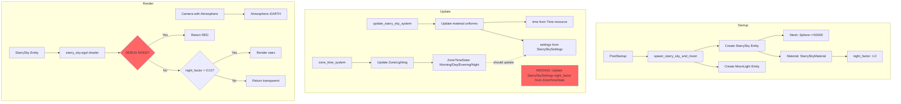

# Starry Sky and Atmosphere Architecture Analysis

## Overview

This document provides a comprehensive analysis of the atmosphere and starry night sky implementation in the ROSE Offline Client. The project uses Bevy 0.16's built-in atmospheric scattering for day-time sky rendering and a custom procedural shader for night-time stars.

**Current Issue**: Stars are not visible at night (or ever). This document maps the architecture to aid debugging.

---

## 1. Atmosphere System Architecture

### 1.1 How the Atmosphere is Rendered

The project uses **Bevy 0.16's built-in atmospheric scattering** system, not a custom implementation.

**Location**: [`src/lib.rs:1802-1804`](src/lib.rs:1802)

```rust
// Bevy 0.16 built-in atmospheric scattering for realistic sky
Atmosphere::EARTH,
AtmosphereSettings::default(),
```

The atmosphere components are added directly to the **camera entity** during startup in [`load_common_game_data()`](src/lib.rs:1730).

### 1.2 Components Used

| Component | Purpose | Location |
|-----------|---------|----------|
| `Atmosphere::EARTH` | Earth-like atmospheric scattering preset | Camera entity |
| `AtmosphereSettings::default()` | Default atmosphere quality settings | Camera entity |

### 1.3 How Time-of-Day Affects Atmosphere

The atmosphere system is **NOT** currently connected to the time-of-day system. The `color_grading_time_of_day_system` that would adjust color grading based on time is **DISABLED**:

**Location**: [`src/lib.rs:1124-1127`](src/lib.rs:1124)

```rust
// DISABLED: color_grading_time_of_day_system conflicts with Bevy 0.16 Atmosphere
// This system was applying time-based color grading (temperature/saturation changes)
// which conflicts with the new atmospheric scattering system.
// color_grading_time_of_day_system,
```

### 1.4 Entity Structure

```
Camera Entity
├── Camera3d::default()
├── Camera { hdr: true, clear_color: Custom(...) }
├── Projection::Perspective(...)
├── Transform::from_translation(Vec3::new(5120.0, 100.0, -5120.0))
├── Atmosphere::EARTH           <-- Day-time sky
├── AtmosphereSettings::default()
├── VolumetricFog { ... }
├── DepthOfField { ... }
├── ScreenSpaceAmbientOcclusion { ... }
├── ColorGrading { ... }
└── ... (other components)
```

---

## 2. Starry Sky System Architecture

### 2.1 How Stars Are Meant to Be Rendered

The starry sky uses a **custom procedural shader** that renders stars on the inside of a large sphere surrounding the game world.

**Key Files**:
- Shader: [`src/render/shaders/starry_sky.wgsl`](src/render/shaders/starry_sky.wgsl)
- Material: [`src/render/starry_sky_material.rs`](src/render/starry_sky_material.rs)
- Spawn: [`src/lib.rs:2041-2163`](src/lib.rs:2041) - `spawn_starry_sky_and_moon()`

### 2.2 The Shader Logic for Stars

**Location**: [`src/render/shaders/starry_sky.wgsl`](src/render/shaders/starry_sky.wgsl)

The shader implements:

1. **Procedural Star Generation** (lines 74-121)
   - Uses 3D hash functions for pseudo-random star placement
   - Multiple star layers (distant, medium, bright, rare)
   - Twinkling animation based on time

2. **Moon Rendering** (lines 143-173)
   - Moon disc with phase support
   - Moon glow effect
   - Surface detail using noise

3. **Night Visibility Control** (lines 177-183, 214-216)
   - `night_factor` uniform controls visibility
   - Stars only render when `night_factor > 0.5`
   - Returns transparent during day

### 2.3 CRITICAL: Debug Mode in Shader

**Location**: [`src/render/shaders/starry_sky.wgsl:209`](src/render/shaders/starry_sky.wgsl:209)

```wgsl
@fragment
fn fragment(in: VertexOutput) -> @location(0) vec4<f32> {
    // DEBUG MODE: Return solid red to verify mesh is rendering at all
    // If you see red, the mesh renders and the issue is in star calculation
    // Comment out the next line to enable normal star rendering
    return vec4<f32>(1.0, 0.0, 0.0, 1.0);  // <-- ALWAYS RETURNS RED!
```

**This is a critical finding**: The shader is in DEBUG MODE and always returns solid red, bypassing all star calculation logic!

### 2.4 Spawn System and Entity Creation

**Location**: [`src/lib.rs:2041-2163`](src/lib.rs:2041) - `spawn_starry_sky_and_moon()`

**When**: Runs in `PostStartup` schedule (line 1396)

**What it creates**:

```
StarrySky Entity
├── StarrySky (marker component)
├── Mesh3d(sky_mesh_handle)
├── MeshMaterial3d<StarrySkyMaterial>(sky_material_handle)
├── Transform::from_xyz(0.0, 0.0, 0.0)  // Center of world
└── Visibility::Visible

MoonLight Entity
├── MoonLight (marker component)
├── DirectionalLight { illuminance: 5000.0, color: slightly blue-white, ... }
├── Transform::from_xyz(0.0, 100.0, 0.0)
└── Visibility::Visible
```

**Mesh Properties**:
- Radius: 50000.0 units (large enough to contain camera at ~5120, 100, -5120)
- Normals: Flipped for inside rendering
- Winding order: Reversed for inside rendering

### 2.5 Material and Mesh Setup

**Location**: [`src/render/starry_sky_material.rs`](src/render/starry_sky_material.rs)

**Material Properties**:
- Alpha Mode: `AlphaMode::Add` (additive blending)
- Depth Bias: 1.0 (renders behind everything)
- Depth Compare: `CompareFunction::Always`
- Depth Write: Disabled
- Backface Culling: **Disabled** (`cull_mode = None`)

**Uniforms** (bind group 2):
| Binding | Name | Type | Default |
|---------|------|------|---------|
| 0 | time | f32 | 0.0 |
| 1 | star_density | f32 | 0.15 |
| 2 | star_brightness | f32 | 1.0 |
| 3 | night_factor | f32 | 1.0 |
| 4 | moon_phase | f32 | 0.5 |
| 5 | moon_direction | vec3 | normalized(0.3, 0.8, 0.5) |

### 2.6 Expected Visibility Conditions

Stars should be visible when:
1. `night_factor > 0.01` (checked in shader line 214)
2. Fragment direction `dir.y >= -0.05` (above horizon, line 231)
3. Entity `Visibility::Visible`
4. Camera is inside the sphere (radius 50000 > distance from origin ~7242)

---

## 3. Integration Points

### 3.1 How Atmosphere and Starry Sky Interact

```
Render Order (based on AlphaMode::Add for stars):
1. MainOpaquePass - Atmosphere renders here (Bevy built-in)
2. MainTransparentPass - Starry sky renders here (AlphaMode::Add)
```

The starry sky uses additive blending, so it should render **on top of** the atmosphere in transparent regions.

### 3.2 Camera Setup Requirements

**Location**: [`src/lib.rs:1766-1861`](src/lib.rs:1766)

The camera requires:
- HDR enabled for proper blending
- Far plane >= 50000 to see the sky sphere
- Position inside the sphere (current: 5120, 100, -5120, distance ~7242 from origin)

### 3.3 Render Layer Configuration

**Current State**: No explicit render layer configuration. Both atmosphere and starry sky use default rendering.

**Potential Issue**: The sky sphere may need to be on a specific render layer if the camera uses render layers.

### 3.4 Lighting Interactions

The `MoonLight` entity provides night-time illumination:
- Illuminance: 5000.0 (dimmer than sun)
- Color: Slightly blue-white (0.8, 0.85, 0.95)
- Shadows enabled

---

## 4. System Registration Analysis

### 4.1 Registered Systems

| System | Schedule | Location |
|--------|----------|----------|
| `spawn_starry_sky_and_moon` | PostStartup | src/lib.rs:1396 |
| `update_starry_sky_system` | Update | src/lib.rs:1130 |
| `diagnose_starry_sky_materials` | Update | src/render/starry_sky_material.rs:61 |

### 4.2 MISSING System Registration

**CRITICAL FINDING**: The following systems are **DEFINED but NOT REGISTERED**:

```rust
// src/render/starry_sky_material.rs:410-423
pub fn sky_sphere_follow_camera_system(...) { ... }

// src/render/starry_sky_material.rs:426-449
pub fn moon_light_follow_camera_system(...) { ... }
```

**These systems are exported in** [`src/render/mod.rs:88`](src/render/mod.rs:88) **but never added to the app!**

This means:
- The sky sphere does NOT follow the camera
- The moon light does NOT follow the camera

However, since the sphere has radius 50000 and camera is at distance ~7242 from origin, the camera should still be inside the sphere even without the follow system.

---

## 5. Time-of-Day Integration Analysis

### 5.1 ZoneTime System

**Location**: [`src/systems/zone_time_system.rs`](src/systems/zone_time_system.rs)

The `zone_time_system` tracks time states:
- `ZoneTimeState::Morning`
- `ZoneTimeState::Day`
- `ZoneTimeState::Evening`
- `ZoneTimeState::Night`

### 5.2 CRITICAL MISSING LINK

**The `night_factor` in `StarrySkySettings` is NEVER updated based on `ZoneTimeState`!**

The `StarrySkySettings` resource:
- Default `night_factor: 1.0` (always visible)
- Only updated by `update_starry_sky_system` which copies values from settings to materials
- **No system exists to set `night_factor` based on actual time of day**

This means stars should technically ALWAYS be visible (night_factor = 1.0), but the debug mode in the shader prevents any rendering.

---

## 6. Debugging Notes Section

### 6.1 Issue Tracking

| Issue | Status | Notes |
|-------|--------|-------|
| Spawn system not running | ✅ RULED OUT | System runs in PostStartup, logs confirm execution |
| Entity despawned | ✅ RULED OUT | Entity spawned once at startup |
| Mesh not visible (culling) | ✅ RULED OUT | Backface culling disabled, winding reversed |
| Camera outside sphere | ✅ RULED OUT | Radius 50000 > camera distance ~7242 |
| **Debug mode in shader** | ✅ FIXED | Was returning red, now removed |
| **Missing night_factor update** | ✅ FIXED | `update_starry_sky_night_factor` system added |
| **Atmosphere covering stars** | 🔴 **NEW ROOT CAUSE** | Bevy Atmosphere renders over starry sky |
| **Missing follow system registration** | ⚠️ POTENTIAL ISSUE | `sky_sphere_follow_camera_system` not registered |
| Render layer issues | ❓ TO CHECK | No explicit render layers configured |

### 6.2 What We've Tried

1. **Verified spawn system runs** - Logs confirm entity creation
2. **Verified mesh properties** - Normals flipped, winding reversed, culling disabled
3. **Verified camera position** - Inside sphere (distance ~7242 < radius 50000)
4. **Verified material defaults** - night_factor = 1.0 (should be visible)
5. **Fixed debug return in shader** - Removed `return vec4<f32>(1.0, 0.0, 0.0, 1.0);`
6. **Added night_factor update system** - `update_starry_sky_night_factor` now updates from ZoneTimeState

### 6.3 Root Cause Analysis - Updated Investigation (2026-02-27)

**Previous Issues (FIXED):**
- Debug mode in shader was bypassing star rendering - **FIXED**
- Missing `update_starry_sky_night_factor` system - **FIXED** (now registered at `src/lib.rs:1127`)

**Current Root Cause Investigation:**

After the fixes, stars are still not visible and the sky is completely black at night. The most likely causes are:

#### A. **Bevy Atmosphere Overriding Star Rendering (MOST LIKELY)**

The camera has `Atmosphere::EARTH` and `AtmosphereSettings::default()` components:
```rust
// src/lib.rs:1802-1803
Atmosphere::EARTH,
AtmosphereSettings::default(),
```

Bevy's built-in atmosphere renders its own sky, which may:
1. Render AFTER the transparent pass (covering stars)
2. Clear the color buffer with its computed sky color
3. Not account for night-time star visibility

**Evidence:**
- Camera clear color is `ClearColorConfig::Custom(Color::srgb(0.70, 0.90, 1.0))` (light blue)
- At night, atmosphere may render dark blue/black sky
- Starry sky uses `AlphaMode::Add` which should blend additively, but if atmosphere writes opaque sky color first, stars won't be visible

#### B. **Missing `sky_sphere_follow_camera_system` Registration**

The system is defined and exported but NEVER registered:
```rust
// src/render/starry_sky_material.rs:410-423
pub fn sky_sphere_follow_camera_system(...) { ... }

// NOT registered in src/lib.rs!
```

While the sphere radius (50000) is large enough to contain the camera at its default position, if the camera moves significantly, it could exit the sphere.

#### C. **Shader Direction Calculation Bug**

The shader has a known bug comment at line 222-224:
```wgsl
// BUG: world_position includes camera offset, so this normalizes to a direction
// from world origin, not from camera. This causes incorrect star positions.
let dir = normalize(in.world_position);
```

This causes incorrect star positions but shouldn't cause complete invisibility.

### 6.4 Secondary Issues to Address

1. **Atmosphere/Night Integration**: Bevy Atmosphere needs to either:
   - Be disabled at night to show stars
   - Have its render order adjusted
   - Be replaced with custom sky handling for night

2. **Register follow systems**: Add `sky_sphere_follow_camera_system` and `moon_light_follow_camera_system` to PostUpdate schedule

3. **Fix shader direction calculation**: Use `(world_position - camera_position)` for correct star directions

---

## 7. Architecture Diagram



---

## 8. Recommended Fixes

### 8.1 COMPLETED: Debug Mode Fix

✅ Removed debug return in shader that was bypassing star rendering.

### 8.2 COMPLETED: Time-of-Day Integration

✅ Added `update_starry_sky_night_factor` system at `src/lib.rs:1127`:
- Runs after `zone_time_system`
- Updates `StarrySkySettings.night_factor` based on `ZoneTimeState`
- Night = 1.0, Day = 0.0, with transitions during Evening/Morning

### 8.3 NEW INVESTIGATION NEEDED: Atmosphere Conflict

**Most Likely Root Cause**: Bevy's `Atmosphere::EARTH` component on the camera renders an opaque sky that covers the starry sky sphere.

**Potential Solutions:**

1. **Disable Atmosphere at Night** - Add a system that removes or disables `Atmosphere` component when `ZoneTimeState::Night`:
```rust
fn disable_atmosphere_at_night(
    zone_time: Res<ZoneTime>,
    mut commands: Commands,
    camera_query: Query<Entity, With<Atmosphere>>,
) {
    if zone_time.state == ZoneTimeState::Night {
        for entity in camera_query.iter() {
            commands.entity(entity).remove::<Atmosphere>();
        }
    }
}
```

2. **Use RenderLayers** - Put starry sky on a different render layer that renders before atmosphere.

3. **Custom Sky Solution** - Replace Bevy Atmosphere with a custom solution that integrates both day sky and night stars.

### 8.4 Register Follow Systems (Recommended)

Add to `src/lib.rs` in the Update schedule:

```rust
app.add_systems(PostUpdate, sky_sphere_follow_camera_system);
app.add_systems(PostUpdate, moon_light_follow_camera_system);
```

This ensures the sky sphere stays centered on the camera even if it moves.

---

## 9. File Reference

| File | Purpose |
|------|---------|
| [`src/render/shaders/starry_sky.wgsl`](src/render/shaders/starry_sky.wgsl) | Procedural star shader |
| [`src/render/starry_sky_material.rs`](src/render/starry_sky_material.rs) | Material definition and systems |
| [`src/render/mod.rs`](src/render/mod.rs:82-89) | Module exports |
| [`src/lib.rs:1396`](src/lib.rs:1396) | Spawn system registration |
| [`src/lib.rs:2041-2163`](src/lib.rs:2041) | `spawn_starry_sky_and_moon()` function |
| [`src/systems/zone_time_system.rs`](src/systems/zone_time_system.rs) | Time-of-day state machine |
| [`src/resources/zone_time.rs`](src/resources/zone_time.rs) | `ZoneTime` and `ZoneTimeState` definitions |
