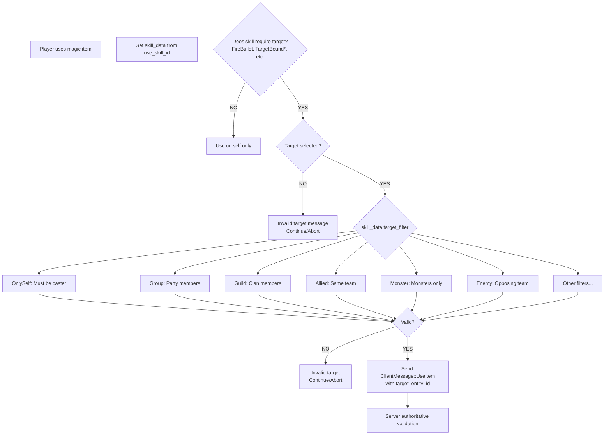

# Target Team Check Architecture for Item Usage

## Executive Summary

This document analyzes the target team validation system for item usage, focusing on **magic items** that can target other players (healing items, buff items, etc.). The current implementation has a `// TODO: Check target team` placeholder at [`player_command_system.rs:485`](../src/systems/player_command_system.rs:485) that needs to be implemented.

---

## Table of Contents

1. [Current State Analysis](#current-state-analysis)
2. [Team/Party Tracking System](#teamparty-tracking-system)
3. [Items Requiring Target Validation](#items-requiring-target-validation)
4. [Skill-Based Target Filter System](#skill-based-target-filter-system)
5. [Proposed Solution Architecture](#proposed-solution-architecture)
6. [Implementation Details](#implementation-details)
7. [Code Examples](#code-examples)
8. [Files Requiring Modification](#files-requiring-modification)

---

## Current State Analysis

### Item Use Flow (Client-Side)

```
┌─────────────────────────────────────────────────────────────────────────┐
│ 1. Player clicks magic item in inventory                                │
├─────────────────────────────────────────────────────────────────────────┤
│    → PlayerCommandEvent::UseItem(item_slot) sent                       │
└──────────────────────┬──────────────────────────────────────────────────┘
                       │
                       ▼
┌─────────────────────────────────────────────────────────────────────────┐
│ 2. player_command_system processes UseItem                              │
├─────────────────────────────────────────────────────────────────────────┤
│    - Gets ConsumableItem data from game_data                           │
│    - Checks if item class == ItemClass::MagicItem                      │
│    - Retrieves skill_data via consumable_item_data.use_skill_id        │
│    - Checks if skill_type requires target:                             │
│      * SkillType::FireBullet                                           │
│      * SkillType::TargetBoundDuration                                  │
│      * SkillType::TargetBound                                          │
│      * SkillType::TargetStateDuration                                  │
└──────────────────────┬──────────────────────────────────────────────────┘
                       │
                       ▼
┌─────────────────────────────────────────────────────────────────────────┐
│ 3. Target Selection (CURRENT - INCOMPLETE)                             │
├─────────────────────────────────────────────────────────────────────────┤
│    if let Some((target_client_entity, _)) =                            │
│        selected_target.selected.and_then(|e| query_team.get(e).ok()) {  │
│         // TODO: Check target team ⬅️ GAP                               │
│         use_item_target = Some(target_client_entity.id);               │
│    } else {                                                             │
│         chatbox_events.write("Invalid target")                         │
│         continue                                                        │
│    }                                                                   │
└──────────────────────┬──────────────────────────────────────────────────┘
                       │
                       ▼
┌─────────────────────────────────────────────────────────────────────────┐
│ 4. Server Request Sent                                                  │
├─────────────────────────────────────────────────────────────────────────┤
│    ClientMessage::UseItem {                                             │
│        item_slot,                                                       │
│        target_entity_id: use_item_target                               │
│    }                                                                    │
└─────────────────────────────────────────────────────────────────────────┘
```

### Key Observation

The **target team validation is currently NOT implemented** on the client side. The server will handle authoritative validation, but clients need:
1. Early rejection to prevent sending invalid requests
2. User feedback ("Invalid target" chatbox message)
3. Visual target highlighting restrictions

---

## Team/Party Tracking System

### Components Involved

| Component | Source | Description |
|-----------|--------|-------------|
| `Team` | `rose_game_common::components::Team` | Entity's team ID; `DEFAULT_NPC_TEAM_ID = 0` for NPCs |
| `Clan` | [`src/components/clan.rs`](../src/components/clan.rs) | Player's clan/guild membership with member list |
| `PartyInfo` | [`src/components/party_info.rs`](../src/components/party_info.rs) | Party membership with `contains_member()` check |

### Team Identification Logic

```rust
// From player_command_system.rs:29-63 (simplified)
query_player: Query<(..., &Team, Option<&Clan>, Option<&PartyInfo>)>
query_team: Query<(&ClientEntity, &Team)>

let (_, _, _, _, _, _, _, player_team, player_clan, player_party_info) = ...;
```

**Team Relationship Types:**

| Check | Code Pattern | Meaning |
|-------|--------------|--------|
| Same Team | `target_team.id == player_team.id` | Both on same faction/team |
| NPC Target | `target_team.id == Team::DEFAULT_NPC_TEAM_ID` | Target is an NPC/object |
| Enemy Team | `target_team.id != player_team.id && target_team.id != DEFAULT_NPC_TEAM_ID` | Hostile player/monster |

### Clan and Party Relationships

```rust
// Party check - from PlayerCommandSystem:296-307
SkillTargetFilter::Group => {
    target_is_alive && (
        target_is_caster || 
        player_party_info.map_or(false, |party_info| {
            party_info.contains_member(target_client_entity.id)
        })
    )
}

// Clan/Guild check - from PlayerCommandSystem:308-322
SkillTargetFilter::Guild => {
    target_is_alive && (
        target_is_caster || 
        target_character_info.map_or(false, |character_info| {
            player_clan.map_or(false, |clan| {
                clan.find_member(&character_info.name).is_some()
            })
        })
    )
}
```

---

## Items Requiring Target Validation

### Magic Item Classification

Magic items that require targets are identified by:

1. **Item Class**: `matches!(item_data.class, ItemClass::MagicItem)`
2. **Associated Skill Type**: 
   - `SkillType::FireBullet` - Projectile spells (e.g., fireball at target)
   - `SkillType::TargetBoundDuration` - Targeted buffs/debuffs with duration
   - `SkillType::TargetBound` - Instant effect on target
   - `SkillType::TargetStateDuration` - State-based effects on target

### Item Data Structure (from rose_data)

```rust
pub struct ConsumableItem {
    pub item_data: BaseItem,
    pub use_skill_id: Option<SkillId>,  // Points to associated skill
    pub apply_status_effect: Option<...>,
    pub effect_file_id: Option<FileId>,
    // ...
}
```

### Example Magic Items (Hypothetical)

| Item Type | Skill Type | Valid Targets |
|-----------|------------|---------------|
| Healing Scroll | TargetBoundDuration | Allied players, self |
| Buff Potion | TargetBound | Party members only |
| Curse Bottle | TargetStateDuration | Enemy characters |
| Resurrection Item | Resurrection | Dead allied characters |

---

## Skill-Based Target Filter System

### `SkillTargetFilter` Enum (from rose_data)

The skill system provides 13 target filter types:

```rust
enum SkillTargetFilter {
    OnlySelf,              // Must target self only
    Group,                 // Party members + self
    Guild,                 // Clan/guild members + self
    Allied,                // Same team (PvP friendly fire)
    Monster,               // Monsters only
    Enemy,                 // Opposing team + monsters
    EnemyCharacter,        // Hostile players only
    Character,             // Any player character
    CharacterOrMonster,    // Players or monsters
    DeadAlliedCharacter,   // Dead teammates (resurrection)
    EnemyMonster,          // Hostile monsters
    // ... possibly more
}
```

### Complete Target Validation Logic (from Skills System)

Located at [`player_command_system.rs:286-387`](../src/systems/player_command_system.rs:286-387):

```rust
let target_is_valid = match skill_data.target_filter {
    SkillTargetFilter::OnlySelf => {
        target_is_alive && target_is_caster
    }
    SkillTargetFilter::Group => {
        target_is_alive && (
            target_is_caster || 
            player_party_info.map_or(false, |party_info| {
                party_info.contains_member(target_client_entity.id)
            })
        )
    }
    SkillTargetFilter::Guild => {
        target_is_alive && (
            target_is_caster || 
            target_character_info.map_or(false, |character_info| {
                player_clan.map_or(false, |clan| {
                    clan.find_member(&character_info.name).is_some()
                })
            })
        )
    }
    SkillTargetFilter::Allied => {
        target_is_alive && target_team.id == player_team.id
    }
    SkillTargetFilter::Monster => {
        target_is_alive && 
            matches!(target_client_entity.entity_type, ClientEntityType::Monster)
    }
    SkillTargetFilter::Enemy => {
        target_is_alive && 
            target_team.id != Team::DEFAULT_NPC_TEAM_ID &&
            target_team.id != player_team.id
    }
    // ... (more filters)
};
```

---

## Proposed Solution Architecture

### Design Decision: Client Hint vs Server-Authoritative

**Recommendation**: Both, but primarily **Server-Authoritative with Client Hint**

| Aspect | Responsibility |
|--------|----------------|
| Client Validation | Prevent invalid requests, show "Invalid target", restrict highlighting |
| Server Validation | Authoritative check, prevent cheating/exploits |

### Architecture Diagram

```
┌───────────────────────────────────────────────────────────────────────┐
│                    MAGIC ITEM USE FLOW (Proposed)                     │
└───────────────────────────────────────────────────────────────────────┘

    ┌─────────────────┐
    │ Player Clicks   │
    │ Magic Item      │
    └────────┬────────┘
             │
             ▼
    ┌─────────────────────────┐
    │ Get Skill Data          │
    │ from use_skill_id       │
    └───────────┬─────────────┘
                │
                ▼
    ┌─────────────────────────────────────────┐
    │ Does skill require target?              │
    │ (FireBullet, TargetBound*, etc.)        │
    └───────────────┬─────────────────────────┘
                    │ YES
                    ▼
    ┌─────────────────────────────────────────┐
    │ Get selected target entity              │
    └───────────────┬─────────────────────────┘
                    │
        ┌───────────┴───────────┐
        │ NO TARGET SELECTED    │
        │ → "Invalid target"    │
        └───────────────────────┘
                │
                ▼ YES
    ┌─────────────────────────────────────────────────────────────┐
    │ APPLY SKILL TARGET FILTER (REUSE EXISTING LOGIC)           │
    │ match skill_data.target_filter {                           │
    │     OnlySelf, Group, Guild, Allied, Enemy, etc. → valid   │
    │ }                                                          │
    └───────────────┬─────────────────────────────────────────────┘
                    │
        ┌───────────┴───────────┐
        │ INVALID TARGET        │
        │ → "Invalid target"    │
        │ → continue (abort)    │
        └───────────────────────┘
                │
                ▼ VALID
    ┌─────────────────────────────────────────┐
    │ Send to server:                         │
    │ ClientMessage::UseItem {                │
    │     item_slot,                          │
    │     target_entity_id                    │
    │ }                                       │
    └───────────────┬─────────────────────────┘
                    │
                    ▼
        ┌─────────────────┐
        │ SERVER          │
        │ AUTHENTICATION  │
        └─────────────────┘
```

### Key Design Principles

1. **Reuse Existing Skill Validation**: Magic items use skills via `use_skill_id`, so reuse the same `SkillTargetFilter` validation.

2. **Client-Side is a Hint**: Server must do final authoritative validation to prevent:
   - Client manipulation/exploits
   - Race conditions (party/clan changes)
   - Desync scenarios

3. **Consistent User Experience**: Same "Invalid target" message and behavior as skills.

---

## Implementation Details

### Modified Code Section

**Location**: [`src/systems/player_command_system.rs:466-495`](../src/systems/player_command_system.rs:466-495)

#### Before (Current Incomplete Implementation)

```rust
// Check if consumable requires a target
if matches!(consumable_item_data.item_data.class, ItemClass::MagicItem) {
    if let Some(skill_data) = consumable_item_data
        .use_skill_id
        .and_then(|skill_id| game_data.skills.get_skill(skill_id))
    {
        if matches!(
            skill_data.skill_type,
            SkillType::FireBullet
                | SkillType::TargetBoundDuration
                | SkillType::TargetBound
                | SkillType::TargetStateDuration
        ) {
            if let Some((target_client_entity, _)) =
                selected_target.selected.and_then(|target_entity| {
                    query_team.get(target_entity).ok()
                })
            {
                // TODO: Check target team ⬅️ INCOMPLETE
                use_item_target = Some(target_client_entity.id);
            } else {
                chatbox_events.write(ChatboxEvent::System(
                    "Invalid target".to_string(),
                ));
                continue;
            }
        }
    }
}
```

#### After (Proposed Implementation)

```rust
// Check if consumable requires a target
if matches!(consumable_item_data.item_data.class, ItemClass::MagicItem) {
    if let Some(skill_data) = consumable_item_data
        .use_skill_id
        .and_then(|skill_id| game_data.skills.get_skill(skill_id))
    {
        if matches!(
            skill_data.skill_type,
            SkillType::FireBullet
                | SkillType::TargetBoundDuration
                | SkillType::TargetBound
                | SkillType::TargetStateDuration
        ) {
            // Validate target using the same logic as skills
            let is_valid_target = if let Some(target_entity) = selected_target.selected {
                if let Ok((target_entity_id, target_character_info, target_client_entity, 
                           target_command, target_team)) = query_skill_target.get(target_entity)
                {
                    let target_is_alive = !target_command.is_die();
                    let target_is_caster = target_entity_id == player_entity;
                    
                    match skill_data.target_filter {
                        SkillTargetFilter::OnlySelf => {
                            target_is_alive && target_is_caster
                        }
                        SkillTargetFilter::Group => {
                            target_is_alive && (
                                target_is_caster || 
                                player_party_info.as_ref().map_or(false, |party_info| {
                                    party_info.contains_member(target_client_entity.id)
                                })
                            )
                        }
                        SkillTargetFilter::Guild => {
                            target_is_alive && (
                                target_is_caster || 
                                target_character_info.as_ref().map_or(false, |character_info| {
                                    player_clan.as_ref().map_or(false, |clan| {
                                        clan.find_member(&character_info.name).is_some()
                                    })
                                })
                            )
                        }
                        SkillTargetFilter::Allied => {
                            target_is_alive && target_team.id == player_team.id
                        }
                        SkillTargetFilter::Monster => {
                            target_is_alive && 
                                matches!(target_client_entity.entity_type, ClientEntityType::Monster)
                        }
                        SkillTargetFilter::Enemy => {
                            target_is_alive && 
                                target_team.id != Team::DEFAULT_NPC_TEAM_ID &&
                                target_team.id != player_team.id
                        }
                        SkillTargetFilter::EnemyCharacter => {
                            target_is_alive && 
                                target_team.id != player_team.id &&
                                matches!(target_client_entity.entity_type, ClientEntityType::Character)
                        }
                        SkillTargetFilter::Character => {
                            target_is_alive && 
                                matches!(target_client_entity.entity_type, ClientEntityType::Character)
                        }
                        SkillTargetFilter::CharacterOrMonster => {
                            target_is_alive && 
                                matches!(target_client_entity.entity_type,
                                    ClientEntityType::Character | ClientEntityType::Monster)
                        }
                        SkillTargetFilter::DeadAlliedCharacter => {
                            !target_is_alive && 
                                target_team.id == player_team.id &&
                                matches!(target_client_entity.entity_type, ClientEntityType::Character)
                        }
                        SkillTargetFilter::EnemyMonster => {
                            target_is_alive && 
                                target_team.id != player_team.id &&
                                matches!(target_client_entity.entity_type, ClientEntityType::Monster)
                        }
                    }
                } else {
                    false
                }
            } else {
                false
            };
            
            if is_valid_target {
                use_item_target = selected_target.selected.and_then(|e| {
                    query_client_entity.get(e).ok().map(|ce| ce.id)
                });
            } else {
                chatbox_events.write(ChatboxEvent::System(
                    "Invalid target".to_string(),
                ));
                continue;
            }
        }
    }
}
```

### Refactored Alternative (DRY Approach)

To avoid code duplication with the skill validation system, extract the validation into a helper function:

```rust
// Add to player_command_system.rs or create new module
fn is_valid_skill_target(
    target_entity: Entity,
    player_entity: Entity,
    player_team: &Team,
    player_party_info: Option<&PartyInfo>,
    player_clan: Option<&Clan>,
    skill_data: &Skill,  // From rose_data
    query_skill_target: &Query<(...), _>,
) -> bool {
    // Implementation of the match statement above
}
```

---

## Code Examples

### Helper Function for Target Validation

```rust
use rose_data::{Skill, SkillTargetFilter};
use bevy::prelude::*;
use rose_game_common::components::{Team, ClientEntityType};

/// Validates if a target entity is valid for the given skill's target filter
pub fn validate_item_target(
    selected_entity: Option<Entity>,
    player_entity: Entity,
    player_team: &Team,
    player_party_info: Option<&PartyInfo>,
    player_clan: Option<&Clan>,
    skill_data: &Skill,
    query_skill_target: &Query<(Entity, Option<&CharacterInfo>, &ClientEntity, &Command, &Team)>,
) -> bool {
    let Some(target_entity) = selected_entity else { return false };
    
    let Ok((target_id, character_info, client_entity, command, target_team)) = 
        query_skill_target.get(target_entity) 
    else { 
        return false; 
    };
    
    let is_alive = !command.is_die();
    let is_caster = target_id == player_entity;
    
    match skill_data.target_filter {
        SkillTargetFilter::OnlySelf => is_alive && is_caster,
        SkillTargetFilter::Group => {
            is_alive && (is_caster || player_party_info
                .map_or(false, |p| p.contains_member(client_entity.id)))
        }
        SkillTargetFilter::Guild => {
            is_alive && (is_caster || character_info.as_ref()
                .and_then(|ci| player_clan.and_then(|c| c.find_member(&ci.name))).is_some())
        }
        SkillTargetFilter::Allied => is_alive && target_team.id == player_team.id,
        SkillTargetFilter::Monster => {
            is_alive && matches!(client_entity.entity_type, ClientEntityType::Monster)
        }
        SkillTargetFilter::Enemy => {
            is_alive && 
                target_team.id != Team::DEFAULT_NPC_TEAM_ID &&
                target_team.id != player_team.id
        }
        SkillTargetFilter::EnemyCharacter => {
            is_alive && 
                target_team.id != player_team.id &&
                matches!(client_entity.entity_type, ClientEntityType::Character)
        }
        SkillTargetFilter::Character => {
            is_alive && matches!(client_entity.entity_type, ClientEntityType::Character)
        }
        SkillTargetFilter::CharacterOrMonster => {
            is_alive && matches!(client_entity.entity_type,
                ClientEntityType::Character | ClientEntityType::Monster)
        }
        SkillTargetFilter::DeadAlliedCharacter => {
            !is_alive && 
                target_team.id == player_team.id &&
                matches!(client_entity.entity_type, ClientEntityType::Character)
        }
        SkillTargetFilter::EnemyMonster => {
            is_alive && 
                target_team.id != player_team.id &&
                matches!(client_entity.entity_type, ClientEntityType::Monster)
        }
    }
}
```

### Usage in Simplified Form

```rust
if validate_item_target(
    selected_target.selected,
    player_entity,
    player_team,
    player_party_info.as_ref(),
    player_clan.as_ref(),
    skill_data,
    &query_skill_target,
) {
    use_item_target = selected_target.selected.and_then(|e| 
        query_client_entity.get(e).ok().map(|ce| ce.id)
    );
} else {
    chatbox_events.write(ChatboxEvent::System("Invalid target".to_string()));
    continue;
}
```

---

## Files Requiring Modification

### Primary File

| File | Changes |
|------|---------|
| [`src/systems/player_command_system.rs`](../src/systems/player_command_system.rs) | Add target validation logic at line 485 (TODO location). May need to add helper function. |

### Possibly Required

| File | Purpose |
|------|--------|
| `src/lib.rs` or new file | If extracting helper module for shared validation |

### Server-Side (Not in this repository)

The server-side C++ code at `E:\cpp\client\src\game\item_use.cpp` should also validate:
- Target team matches item's requirements
- Target is still alive/dead as appropriate
- Distance checks if applicable

---

## Summary Table

| Aspect | Details |
|--------|---------|
| **Items Affected** | Magic items with `use_skill_id` pointing to skills with target filters |
| **Skill Types** | FireBullet, TargetBoundDuration, TargetBound, TargetStateDuration |
| **Validation Source** | Reuse skill's `target_filter` from associated skill data |
| **Client Role** | Hint/validation for UX - show "Invalid target" early |
| **Server Role** | Authoritative validation - must verify all client requests |
| **Code Location** | [`player_command_system.rs:466-495`](../src/systems/player_command_system.rs:466-495) |

---

## Mermaid Diagram: Target Filter Decision Tree



</content>