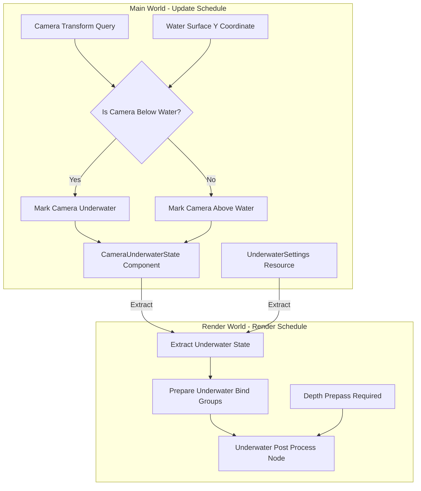

# Underwater Rendering Fix - Implementation Plan

## Problem Statement

When the camera goes underwater in the Rose Online client, the rendering is not realistic:
- The top layer appears as solid blue
- The area underneath is blank/empty
- No volumetric fog effect
- No light caustics
- No depth-based color absorption

## Current State Analysis

### Existing Water Surface Rendering

The current water surface rendering in [`src/render/water_material.rs`](src/render/water_material.rs) is well-implemented with:

| Feature | Status | Implementation |
|---------|--------|----------------|
| Texture array animation | ✅ Working | 25 frames with blending |
| Procedural wave normals | ✅ Working | `calculate_wave_normal()` in shader |
| Fresnel effect | ✅ Working | `fresnel_schlick()` function |
| Specular highlights | ✅ Working | Blinn-Phong specular |
| Subsurface scattering | ✅ Working | `calculate_sss()` function |
| Foam effects | ✅ Working | `calculate_foam()` and `calculate_edge_splash()` |
| Zone fog integration | ✅ Working | `apply_zone_fog()` function |

### What's Missing

The current implementation only handles the **water surface** as seen from above. There is no:
1. Detection of camera being underwater
2. Underwater post-processing effects
3. Depth-based fog for underwater views
4. Light caustics on underwater surfaces

## Proposed Solution Architecture



## Implementation Components

### 1. Underwater Detection System

**Purpose**: Detect when the camera is below the water surface and enable/disable underwater effects.

**Files to Create/Modify**:
- `src/render/underwater_effect.rs` (new)
- `src/render/mod.rs` (modify)

**Key Components**:

```rust
// Resource for underwater settings
#[derive(Resource, Clone, ExtractResource)]
pub struct UnderwaterSettings {
    // Fog parameters
    pub fog_density: f32,
    pub fog_color: Color,
    pub max_visibility: f32,
    
    // Light absorption coefficients per channel
    // Based on real-world water absorption:
    // Red: ~0.5 m^-1, Green: ~0.05 m^-1, Blue: ~0.01 m^-1
    pub absorption_coefficients: Vec3,
    
    // Caustics settings
    pub caustics_intensity: f32,
    pub caustics_scale: f32,
    pub caustics_speed: f32,
    
    // Effect enabled flag
    pub enabled: bool,
}

// Component to track camera underwater state
#[derive(Component, Default)]
pub struct CameraUnderwaterState {
    pub is_underwater: bool,
    pub water_surface_y: f32,
    pub depth_below_surface: f32,
}
```

**Detection System**:

```rust
fn detect_underwater_camera(
    camera_query: Query<&GlobalTransform, With<Camera3d>>,
    water_query: Query<&GlobalTransform, With<WaterMesh>>,
    mut underwater_state: Query<&mut CameraUnderwaterState>,
    water_settings: Res<WaterSettings>,
) {
    // Get water surface Y coordinate
    // Water is typically a flat plane, so we use its Y position
    let water_y = water_query.iter()
        .next()
        .map(|t| t.translation().y)
        .unwrap_or(0.0);
    
    for (transform, mut state) in camera_query.iter().zip(underwater_state.iter_mut()) {
        let camera_y = transform.translation().y;
        state.is_underwater = camera_y < water_y;
        state.water_surface_y = water_y;
        state.depth_below_surface = (water_y - camera_y).max(0.0);
    }
}
```

### 2. Underwater Post-Processing Shader

**Purpose**: Apply underwater visual effects as a screen-space post-processing pass.

**File**: `src/render/shaders/underwater_effect.wgsl` (new)

**Key Shader Functions**:

```wgsl
// Depth-based exponential fog
// Uses Beer-Lambert law: transmittance = e^(-density * depth)
fn calculate_underwater_fog(
    depth: f32,
    view_dir: vec3<f32>,
    density: f32,
    fog_color: vec3<f32>
) -> vec3<f32> {
    // Exponential fog based on depth
    let fog_factor = 1.0 - exp(-density * depth);
    return mix(vec3<f32>(1.0), fog_color, saturate(fog_factor));
}

// Light absorption per color channel
// Simulates how water absorbs different wavelengths at different rates
// Red is absorbed fastest, blue penetrates deepest
fn apply_light_absorption(
    color: vec3<f32>,
    depth: f32,
    absorption: vec3<f32>  // R, G, B absorption coefficients
) -> vec3<f32> {
    // Beer-Lambert law for each channel
    let transmittance = exp(-absorption * depth);
    return color * transmittance;
}

// Animated caustics pattern
// Uses procedural noise to simulate light patterns from water surface
fn calculate_caustics(
    world_pos: vec3<f32>,
    normal: vec3<f32>,
    time: f32,
    scale: f32,
    speed: f32
) -> f32 {
    // Project position onto plane and animate
    let uv = world_pos.xz * scale;
    let animated_uv = uv + vec2<f32>(time * speed, time * speed * 0.7);
    
    // Use gradient noise for organic caustic patterns
    let noise1 = gradient_noise(animated_uv);
    let noise2 = gradient_noise(animated_uv * 2.0 + 100.0);
    
    // Combine for caustic intensity
    let caustic = (noise1 * noise2) * 2.0;
    return saturate(caustic);
}

// God rays / light shafts from surface
// Approximates volumetric light scattering from above
fn calculate_god_rays(
    screen_pos: vec2<f32>,
    depth: f32,
    time: f32,
    light_dir: vec3<f32>
) -> f32 {
    // Simple god ray approximation using radial blur from light source
    // This is a screen-space approximation
    let ray_intensity = 0.0;
    // Implementation details in full shader
    return ray_intensity;
}
```

### 3. Render Graph Integration

**Purpose**: Add underwater post-processing as a render graph node after the main 3D pass.

**Approach**: Create a fullscreen quad pass that:
1. Reads the scene color texture
2. Reads the depth texture (requires `DepthPrepass`)
3. Applies underwater effects when camera is underwater
4. Outputs modified color

**Node Structure**:

```rust
pub struct UnderwaterEffectNode {
    query: QueryState<
        (
            &'static ViewTarget,
            &'static ViewDepthTexture,
            &'static ExtractedUnderwaterState,
        ),
        With<ExtractedView>,
    >,
}

impl Node for UnderwaterEffectNode {
    fn run(
        &self,
        graph: &mut RenderGraphContext,
        render_context: &mut RenderContext,
        world: &World,
    ) -> Result<(), NodeRunError> {
        // Get underwater state
        // If not underwater, skip processing
        // Otherwise, apply underwater post-process
    }
}
```

### 4. Depth-Based Color Absorption

**Physical Basis**:
- Water absorbs light at different rates depending on wavelength
- Red light: absorbed within ~2 meters
- Green light: absorbed within ~20 meters  
- Blue light: absorbed within ~100 meters

**Implementation**:

```wgsl
// Realistic water absorption coefficients
const WATER_ABSORPTION_RED: f32 = 0.5;    // m^-1
const WATER_ABSORPTION_GREEN: f32 = 0.05; // m^-1
const WATER_ABSORPTION_BLUE: f32 = 0.01;  // m^-1

fn underwater_color_absorption(color: vec3<f32>, depth_meters: f32) -> vec3<f32> {
    let absorption = vec3<f32>(
        WATER_ABSORPTION_RED,
        WATER_ABSORPTION_GREEN,
        WATER_ABSORPTION_BLUE
    );
    
    // Beer-Lambert law: I = I0 * e^(-a * d)
    let transmittance = exp(-absorption * depth_meters);
    
    return color * transmittance;
}
```

### 5. Light Caustics System

**Purpose**: Create animated light patterns on underwater surfaces simulating sunlight refracting through the water surface.

**Implementation Options**:

| Approach | Complexity | Quality | Performance |
|----------|------------|---------|-------------|
| Animated texture | Low | Medium | High |
| Procedural noise | Medium | High | Medium |
| Full caustics calculation | High | Very High | Low |

**Recommended**: Procedural noise approach using the existing gradient noise functions from the water shader.

```wgsl
fn underwater_caustics(
    world_position: vec3<f32>,
    surface_normal: vec3<f32>,
    time: f32,
    settings: UnderwaterSettings
) -> f32 {
    // Only apply to surfaces facing upward
    let up_factor = saturate(surface_normal.y);
    if (up_factor < 0.1) { return 0.0; }
    
    // Calculate caustic pattern
    let scale = settings.caustics_scale;
    let speed = settings.caustics_speed;
    
    let uv = world_position.xz * scale;
    let t = time * speed;
    
    // Multiple octaves of noise for detail
    let caustic1 = gradient_noise(uv + t * 0.1);
    let caustic2 = gradient_noise(uv * 2.0 - t * 0.15) * 0.5;
    let caustic3 = gradient_noise(uv * 4.0 + t * 0.08) * 0.25;
    
    let combined = caustic1 + caustic2 + caustic3;
    
    // Create sharp caustic patterns using threshold
    let sharp_caustic = smoothstep(0.4, 0.6, combined);
    
    return sharp_caustic * settings.caustics_intensity * up_factor;
}
```

## Implementation Steps

### Phase 1: Basic Underwater Detection
1. Create `UnderwaterSettings` resource
2. Create `CameraUnderwaterState` component
3. Implement detection system to check camera Y vs water Y
4. Add system to Update schedule

### Phase 2: Post-Processing Framework
1. Create underwater post-process shader stub
2. Create `UnderwaterEffectNode` for render graph
3. Add node to render graph after main 3D pass
4. Require `DepthPrepass` component on camera

### Phase 3: Underwater Fog
1. Implement exponential depth fog in shader
2. Add fog color/density uniforms
3. Blend fog based on depth buffer
4. Test with varying depths

### Phase 4: Light Absorption
1. Implement per-channel absorption
2. Add depth-based color shift
3. Tune absorption coefficients
4. Add distance-based absorption

### Phase 5: Caustics
1. Add caustics calculation to shader
2. Create caustics intensity uniform
3. Apply caustics to underwater surfaces
4. Animate caustics with time

### Phase 6: Integration and Polish
1. Integrate with existing zone lighting
2. Add smooth transition at water surface
3. Performance optimization
4. Quality settings for different hardware

## Files to Create

| File | Purpose |
|------|---------|
| `src/render/underwater_effect.rs` | Main underwater effect implementation |
| `src/render/shaders/underwater_effect.wgsl` | Underwater post-process shader |

## Files to Modify

| File | Changes |
|------|---------|
| `src/render/mod.rs` | Add underwater module exports |
| `src/lib.rs` | Register underwater plugin/resources |
| `src/render/water_material.rs` | Add water surface Y tracking |

## Required Camera Components

The camera needs these components for underwater effects:

```rust
commands.spawn((
    Camera3d::default(),
    DepthPrepass,  // Required for depth-based effects
    CameraUnderwaterState::default(),
    // ... other camera components
));
```

## Uniform Buffer Layout

```rust
#[derive(ShaderType, Clone)]
struct UnderwaterUniforms {
    // Is underwater flag (0.0 or 1.0)
    is_underwater: f32,
    // Water surface Y coordinate
    water_surface_y: f32,
    // Fog density
    fog_density: f32,
    // Maximum visibility distance
    max_visibility: f32,
    
    // Fog color (RGBA)
    fog_color: Vec4,
    
    // Light absorption coefficients (RGB)
    absorption: Vec3,
    // Caustics settings
    caustics_intensity: f32,
    caustics_scale: f32,
    caustics_speed: f32,
    // Time for animation
    time: f32,
}
```

## Performance Considerations

1. **Early-out when not underwater**: Skip all processing if camera is above water
2. **Depth prepass reuse**: Leverage existing depth texture from other effects
3. **Caustics LOD**: Reduce caustics detail at distance
4. **Resolution scaling**: Option to render underwater effects at lower resolution

## Testing Checklist

- [ ] Camera transitions smoothly at water surface
- [ ] Fog density increases with depth
- [ ] Colors shift to blue at depth
- [ ] Caustics animate on underwater surfaces
- [ ] Performance is acceptable
- [ ] Works with existing zone lighting
- [ ] No visual artifacts at water boundary

## Alternative Approaches Considered

### Option A: Modify Water Material Directly
**Rejected**: Would require rendering water from both sides and complicate the existing surface shader.

### Option B: Bevy VolumetricFog Integration
**Considered**: Bevy 0.16.1 has built-in `VolumetricFog` and `FogVolume` components. However, these are designed for atmospheric fog and would need significant customization for underwater effects.

### Option C: Screen-Space Post-Process (Recommended)
**Selected**: Clean separation from water surface rendering, leverages depth buffer, easy to enable/disable.

## References

- Bevy 0.16.1 Volumetric Fog Example: `examples/3d/volumetric_fog.rs`
- Bevy Depth Prepass: `crates/bevy_core_pipeline/src/prepass/mod.rs`
- Water absorption coefficients based on real-world measurements
- Crest Ocean System underwater rendering techniques

## Estimated Complexity

| Component | Difficulty |
|-----------|------------|
| Underwater detection | Low |
| Post-process framework | Medium |
| Depth fog | Low |
| Light absorption | Low |
| Caustics | Medium |
| Integration | Medium |

**Overall**: Medium difficulty, approximately 400-600 lines of new code.
