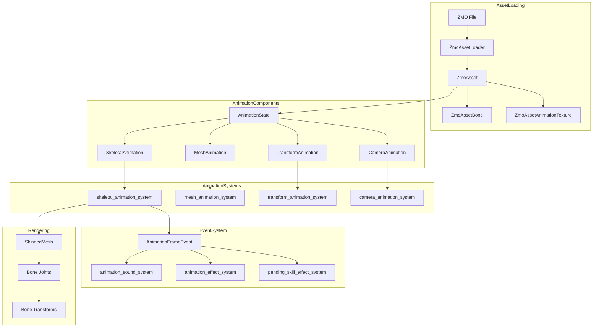

# Animation System Analysis for Bevy 0.17-0.18 Upgrade

## Executive Summary

The ROSE Offline Client uses a **fully custom animation system** that does not rely on Bevy's built-in animation types (`AnimationTarget`, `AnimationPlayer`, `AnimationGraph`). As a result, **most Bevy 0.17-0.18 animation breaking changes do not affect this project**.

## Animation System Architecture

### Custom Animation Types

The project implements its own animation system with the following components:

| Type | File | Purpose |
|------|------|---------|
| [`ZmoAsset`](../src/animation/zmo_asset_loader.rs:37) | `zmo_asset_loader.rs` | Custom animation asset format (ROSE ZMO files) |
| [`AnimationState`](../src/animation/animation_state.rs:24) | `animation_state.rs` | Core animation playback state tracking |
| [`SkeletalAnimation`](../src/animation/skeletal_animation.rs:20) | `skeletal_animation.rs` | Wrapper for skeletal mesh animation |
| [`MeshAnimation`](../src/animation/mesh_animation.rs:14) | `mesh_animation.rs` | Wrapper for mesh morph target animation |
| [`TransformAnimation`](../src/animation/transform_animation.rs:13) | `transform_animation.rs` | Wrapper for transform-based animation |
| [`CameraAnimation`](../src/animation/camera_animation.rs:14) | `camera_animation.rs` | Wrapper for camera animation |

### Animation Event System

The project uses a custom event system:

| Type | File | Purpose |
|------|------|---------|
| [`AnimationFrameEvent`](../src/animation/animation_state.rs:12) | `animation_state.rs` | Custom Bevy Event for animation frame triggers |
| `AnimationEventFlags` | `rose_data` crate | Bitflags for event types (footstep, attack, skill, etc.) |

### Skinned Mesh Support

The project uses Bevy's [`SkinnedMesh`](../src/model_loader.rs:13) component but with custom animation:

- [`SkinningTarget`](../src/components/skinning_target.rs:13) - Marker for deferred SkinnedMesh insertion
- [`SkinnedMeshFixPlugin`](../src/render/skinned_mesh_fix.rs:23) - Custom plugin for proper skinning support
- [`DummyBoneOffset`](../src/components/dummy_bone_offset.rs) - Tracks bone offset for skeleton

## Bevy 0.17 Animation Changes - Impact Analysis

### ✅ No Impact: AnimationGraph AssetId Changes

**Bevy 0.17 Change**: `AnimationGraph` no longer supports raw AssetIds (must use asset paths)

**Project Status**: Not affected - the project does not use `AnimationGraph`

```
Search Results: 0 matches for "AnimationGraph" in src/
```

### ✅ No Impact: ObserverState/Observer Merger

**Bevy 0.17 Change**: `ObserverState` and `Observer` components merged

**Project Status**: Not affected - the project does not use these components

```
Search Results: 0 matches for "ObserverState" or "Observer" in src/
```

### ✅ No Impact: AnimationEvent Trait

**Bevy 0.17 Change**: Animation events must derive `AnimationEvent` trait

**Project Status**: Not affected - the project uses custom `AnimationFrameEvent` which is a standard Bevy Event, not a Bevy animation event

```rust
// src/animation/animation_state.rs:11-15
#[derive(Event)]
pub struct AnimationFrameEvent {
    pub entity: Entity,
    pub flags: AnimationEventFlags,
}
```

## Bevy 0.18 Animation Changes - Impact Analysis

### ✅ No Impact: AnimationTarget Split

**Bevy 0.18 Change**: `AnimationTarget` component split into `AnimationTargetId` and `AnimatedBy` components

**Project Status**: Not affected - the project does not use `AnimationTarget`

```
Search Results: 0 matches for "AnimationTarget" in src/
```

### ✅ No Impact: AnimationEventTrigger Rename

**Bevy 0.18 Change**: `AnimationEventTrigger::animation_player` renamed to `AnimationEventTrigger::target`

**Project Status**: Not affected - the project does not use `AnimationEventTrigger`

```
Search Results: 0 matches for "AnimationEventTrigger" in src/
```

## Animation-Related Types Used

### Bevy Types (No Changes Needed)

| Type | Usage Location | Notes |
|------|----------------|-------|
| `SkinnedMesh` | Multiple files | Continue using as-is |
| `SkinnedMeshInverseBindposes` | `model_loader.rs` | Continue using as-is |
| `Assets<ZmoAsset>` | Animation systems | Custom asset, no changes |

### Custom Types (No Bevy Migration Needed)

| Type | Purpose |
|------|---------|
| `ZmoAsset` | Animation data loaded from ZMO files |
| `ZmoAssetBone` | Per-bone animation data (translation, rotation, scale) |
| `ZmoAssetAnimationTexture` | Texture-based animation for mesh morphing |
| `ZmoAssetLoader` | Asset loader for ZMO files |
| `ZmoTextureAssetLoader` | Asset loader for texture-based animations |

## Animation System Flow



## Files Analyzed

| File | Lines | Purpose |
|------|-------|---------|
| `src/animation/mod.rs` | 65 | Plugin registration, system scheduling |
| `src/animation/animation_state.rs` | 235 | Core animation state machine |
| `src/animation/skeletal_animation.rs` | 153 | Skeletal mesh animation system |
| `src/animation/mesh_animation.rs` | 64 | Mesh morph target animation |
| `src/animation/transform_animation.rs` | 88 | Transform-based animation |
| `src/animation/camera_animation.rs` | 107 | Camera animation system |
| `src/animation/zmo_asset_loader.rs` | 402 | ZMO asset loader implementation |
| `src/animation/zmo_asset_loader_fixed.rs` | 394 | Alternative ZMO loader (backup) |
| `src/model_loader.rs` | 1569 | Model spawning with skeleton setup |

## Systems Using Animation Events

The following systems react to `AnimationFrameEvent`:

1. **`animation_sound_system.rs`** - Plays sounds on animation events:
   - Footstep sounds
   - Weapon attack sounds
   - Skill sounds
   - Vehicle sounds

2. **`animation_effect_system.rs`** - Spawns effects on animation events:
   - Weapon attack effects
   - Skill bullet spawning
   - Skill hit effects
   - Casting effects

3. **`pending_skill_effect_system.rs`** - Applies skill effects on animation events:
   - Pending skill effect application

## Recommendations

### No Changes Required for Animation Migration

The custom animation system is isolated from Bevy's built-in animation types. The upgrade to Bevy 0.17-0.18 should not require any changes to the animation system.

### Continue Using Custom System

The custom animation system provides:
- Direct control over animation playback
- Custom event system tailored to ROSE game mechanics
- Support for ROSE-specific ZMO animation format
- No dependency on Bevy's animation graph complexity

### Potential Future Improvements

While not required for the upgrade, consider:

1. **Documentation**: Add more inline documentation to animation systems
2. **Testing**: Add unit tests for animation state machine
3. **Optimization**: Profile animation systems for performance bottlenecks

## Conclusion

**The ROSE Offline Client's animation system is fully decoupled from Bevy's built-in animation types.** The Bevy 0.17-0.18 animation breaking changes do not affect this project. No code changes are required for the animation system during the upgrade.

### Summary Table

| Bevy Version | Breaking Change | Impact |
|--------------|-----------------|--------|
| 0.17 | AnimationGraph AssetId removal | ✅ None |
| 0.17 | ObserverState/Observer merger | ✅ None |
| 0.17 | AnimationEvent trait requirement | ✅ None |
| 0.18 | AnimationTarget split | ✅ None |
| 0.18 | AnimationEventTrigger rename | ✅ None |
