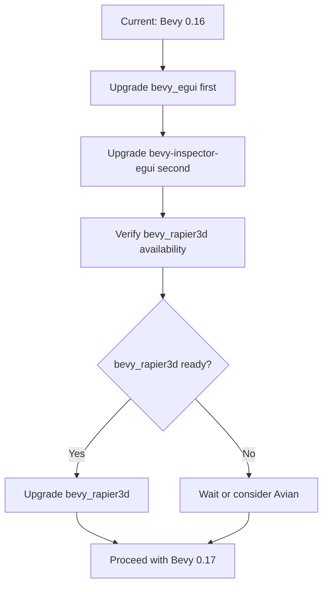

# Third-Party Dependencies Analysis for Bevy 0.17-0.18 Upgrade

## Executive Summary

This document analyzes the compatibility of ROSE Offline Client's third-party dependencies with Bevy 0.17 and 0.18. The current project uses Bevy 0.16 with the following dependencies:

- `bevy_egui = "0.34"`
- `bevy-inspector-egui = "0.33"`
- `bevy_rapier3d = "0.31"`

## Version Compatibility Matrix

### Complete Compatibility Table

| Bevy Version | bevy_egui | bevy-inspector-egui | bevy_rapier3d |
|--------------|-----------|---------------------|---------------|
| 0.14 | 0.28-0.30 | 0.25-0.27 | 0.27 |
| 0.15 | 0.31-0.33 | 0.28-0.30 | 0.28-0.29 |
| **0.16** | **0.34-0.36** | **0.31-0.33** | **0.30-0.31** |
| 0.17 | 0.37-0.38 | 0.34-0.35 | 0.32* |
| 0.18 | 0.39+ | 0.36+ | TBD |

*Note: bevy_rapier3d 0.32 for Bevy 0.17 support may still be in development or recently released. Verify on crates.io.

---

## Detailed Dependency Analysis

### 1. bevy_egui

**Current Version:** 0.34  
**Target Versions:**
- Bevy 0.17 → bevy_egui 0.37-0.38
- Bevy 0.18 → bevy_egui 0.39+

**Source:** [GitHub - mvlabat/bevy_egui](https://github.com/mvlabat/bevy_egui)

#### Version History (from CHANGELOG)

| Version | Release Date | Key Changes |
|---------|--------------|-------------|
| 0.38.1 | Latest | Fix spurious panic when closing a window |
| 0.37.0 | Oct 1, 2025 | **Bevy 0.17 support**, Bindless texture support, IME fix |
| 0.36.0 | Aug 4, 2025 | Egui 0.32 update, configurable render order |
| 0.35.0 | Jun 30, 2025 | Bevy picking support for meshes, multi-pass deprecation |
| 0.34.x | Current | Bevy 0.16 support |

#### Breaking Changes to Watch

1. **v0.35.0+ Breaking Change:** Multi-pass mode deprecation
   - The option to disable multi-pass mode is now deprecated
   - May affect custom rendering pipelines

2. **v0.37.0+ Changes:**
   - IME support fixes may affect text input handling
   - Bindless texture support changes rendering behavior

#### Upgrade Path

```
Bevy 0.16 → bevy_egui 0.34 (current)
Bevy 0.17 → bevy_egui 0.37 or 0.38
Bevy 0.18 → bevy_egui 0.39+ (verify latest)
```

---

### 2. bevy-inspector-egui

**Current Version:** 0.33  
**Target Versions:**
- Bevy 0.17 → bevy-inspector-egui 0.34-0.35
- Bevy 0.18 → bevy-inspector-egui 0.36+

**Source:** [GitHub - jakobhellermann/bevy-inspector-egui](https://github.com/jakobhellermann/bevy-inspector-egui)

#### Official Support Table

| bevy | bevy-inspector-egui |
|------|---------------------|
| 0.18 | 0.36 |
| 0.17 | 0.35 |
| 0.17 | 0.34 |
| 0.16 | 0.33 |
| 0.16 | 0.32 |
| 0.16 | 0.31 |
| 0.15 | 0.30 |
| 0.15 | 0.29 |
| 0.15 | 0.28 |
| 0.14 | 0.27 |

#### Key Notes

- Version 0.34 and 0.35 both support Bevy 0.17
- Version 0.36 supports Bevy 0.18
- The plugin API has remained relatively stable across versions

#### Upgrade Path

```
Bevy 0.16 → bevy-inspector-egui 0.33 (current)
Bevy 0.17 → bevy-inspector-egui 0.35 (recommended)
Bevy 0.18 → bevy-inspector-egui 0.36
```

---

### 3. bevy_rapier3d

**Current Version:** 0.31  
**Target Versions:**
- Bevy 0.17 → bevy_rapier3d 0.32 (verify availability)
- Bevy 0.18 → TBD

**Source:** [GitHub - dimforge/bevy_rapier](https://github.com/dimforge/bevy_rapier)

#### Version History (Estimated)

| Bevy Version | bevy_rapier3d | Status |
|--------------|---------------|--------|
| 0.14 | 0.27 | Released |
| 0.15 | 0.28-0.29 | Released |
| 0.16 | 0.30-0.31 | Released |
| 0.17 | 0.32? | **Verify on crates.io** |
| 0.18 | TBD | Not yet released |

#### From bevy-tnua Compatibility Table

The bevy-tnua project tracks bevy_rapier versions:

| bevy | bevy_rapier |
|------|-------------|
| 0.16 | 0.30 |
| 0.15 | 0.29 |
| 0.14 | 0.27 |

#### ⚠️ Potential Blocking Issue

**bevy_rapier3d may lag behind Bevy releases.** Based on historical patterns:
- Rapier updates typically come 2-4 weeks after Bevy releases
- Check [crates.io/crates/bevy_rapier3d](https://crates.io/crates/bevy_rapier3d) for latest version
- Check [GitHub issues](https://github.com/dimforge/bevy_rapier/issues) for Bevy 0.17/0.18 support progress

#### Alternative: Avian Physics

If bevy_rapier3d is blocking, consider **Avian** (formerly bevy_xpbd):
- [avianphysics/avian](https://github.com/avianphysics/avian)
- Avian 0.3 supports Bevy 0.16
- Avian typically has faster Bevy version support

#### Upgrade Path

```
Bevy 0.16 → bevy_rapier3d 0.31 (current)
Bevy 0.17 → bevy_rapier3d 0.32+ (VERIFY AVAILABILITY)
Bevy 0.18 → bevy_rapier3d TBD (check crates.io)
```

---

## Upgrade Order Recommendations

### Recommended Upgrade Sequence



### Step-by-Step Upgrade Plan

#### Phase 1: Preparation
1. Check latest versions on crates.io
2. Review CHANGELOGs for breaking changes
3. Create backup/branch for upgrade work

#### Phase 2: Dependency Updates (Bevy 0.17)

```toml
# Target versions for Bevy 0.17
[dependencies]
bevy = "0.17"
bevy_egui = "0.37"  # or 0.38
bevy-inspector-egui = "0.35"
bevy_rapier3d = "0.32"  # VERIFY FIRST
```

#### Phase 3: Dependency Updates (Bevy 0.18)

```toml
# Target versions for Bevy 0.18
[dependencies]
bevy = "0.18"
bevy_egui = "0.39"  # or latest
bevy-inspector-egui = "0.36"
bevy_rapier3d = "?"  # CHECK CRATES.IO
```

---

## Breaking Changes Summary

### bevy_egui Breaking Changes

| Version | Breaking Change | Impact |
|---------|-----------------|--------|
| 0.35.0+ | Multi-pass mode deprecation | Custom rendering may need updates |
| 0.37.0+ | Bindless texture support | May affect material handling |

### bevy-inspector-egui Breaking Changes

- Generally stable API across versions
- Check for `InspectorOptions` derive macro changes
- Verify `Reflect` trait requirements

### bevy_rapier3d Breaking Changes

- Check CHANGELOG for collision event changes
- Verify `RapierContext` API stability
- Watch for system set naming changes

---

## Risk Assessment

### Low Risk
- ✅ bevy_egui: Active development, quick Bevy support
- ✅ bevy-inspector-egui: Active development, quick Bevy support

### Medium Risk
- ⚠️ bevy_rapier3d: May lag behind Bevy releases by 2-4 weeks

### Mitigation Strategies

1. **For bevy_rapier3d delays:**
   - Wait for official release
   - Consider Avian physics as alternative
   - Use git dependency if PR is ready but not released

2. **For all dependencies:**
   - Pin exact versions in Cargo.toml
   - Test thoroughly after each upgrade
   - Keep rollback capability

---

## Verification Checklist

Before upgrading, verify:

- [ ] Check crates.io for latest bevy_egui version
- [ ] Check crates.io for latest bevy-inspector-egui version
- [ ] Check crates.io for latest bevy_rapier3d version
- [ ] Review GitHub issues for known problems
- [ ] Test in isolated environment first
- [ ] Have rollback plan ready

---

## Quick Reference Links

- [bevy_egui on crates.io](https://crates.io/crates/bevy_egui)
- [bevy_egui GitHub](https://github.com/mvlabat/bevy_egui)
- [bevy-inspector-egui on crates.io](https://crates.io/crates/bevy-inspector-egui)
- [bevy-inspector-egui GitHub](https://github.com/jakobhellermann/bevy-inspector-egui)
- [bevy_rapier3d on crates.io](https://crates.io/crates/bevy_rapier3d)
- [bevy_rapier GitHub](https://github.com/dimforge/bevy_rapier)
- [Avian Physics GitHub](https://github.com/avianphysics/avian)

---

## Conclusion

**Overall Assessment:** The upgrade to Bevy 0.17 and 0.18 should be straightforward for `bevy_egui` and `bevy-inspector-egui`, which have active maintainers and quick release cycles.

**Primary Concern:** `bevy_rapier3d` may be a blocking dependency if the maintainers have not yet released Bevy 0.17/0.18 compatible versions. Always verify the latest version on crates.io before proceeding with the Bevy upgrade.

**Recommendation:** 
1. Upgrade bevy_egui and bevy-inspector-egui first
2. Verify bevy_rapier3d availability
3. If blocked, consider waiting or evaluating Avian physics
4. Proceed with full Bevy upgrade once all dependencies are ready
