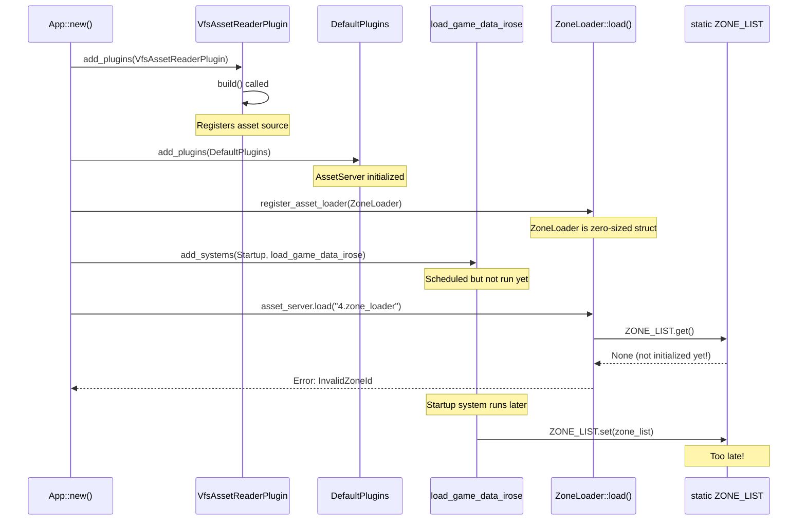
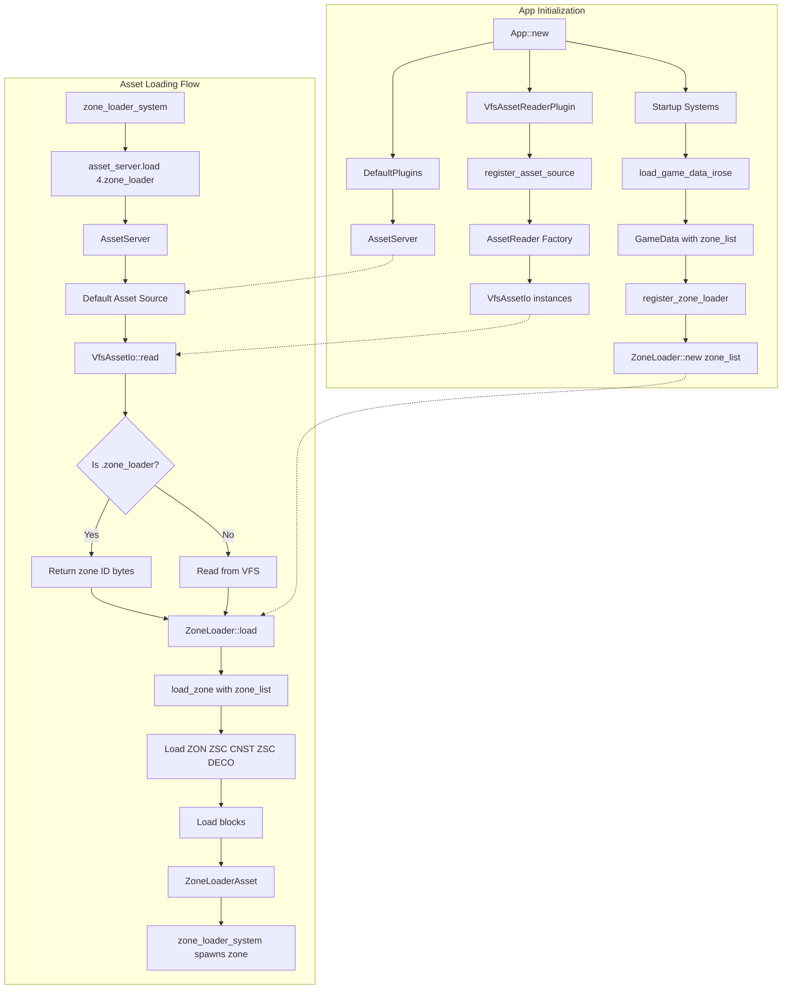

# VFS and Zone Loading Remediation Plan

## Executive Summary

This plan addresses the VFS and zone loading issues in the rose-offline-client. The game loads but displays a black window because the zone asset (`4.zone_loader`) is not being loaded properly. The root causes are:

1. **Primary Issue**: ZoneLoader race condition - static `ZONE_LIST` is populated by a Startup system but may be accessed before that completes
2. **Secondary Issue**: VfsAssetReaderPlugin may not be executing properly (diagnostic logs are missing)
3. **Understanding Issue**: `4.zone_loader` is not a real file - it's a virtual asset that should be generated on-the-fly by the VfsAssetIo reader

## Root Cause Analysis

### Why `4.zone_loader` is Not Being Detected

**Critical Understanding**: `4.zone_loader` is NOT a real file in the VFS. It's a virtual asset that should be generated on-the-fly by the `VfsAssetIo::read()` method when the AssetServer requests it.

The expected flow is:
1. `zone_loader_system` calls `asset_server.load("4.zone_loader")`
2. AssetServer routes this to the default asset source
3. VfsAssetIo's `read()` method is called with path `"4.zone_loader"`
4. VfsAssetIo detects the `.zone_loader` extension and returns a byte array containing the zone ID (just `[4]`)
5. AssetServer passes these bytes to the ZoneLoader via its `load()` method
6. ZoneLoader reads the zone ID from the bytes and uses it to load the actual zone data from the VFS

The problem is that step 3 is not happening - `VfsAssetIo::read()` is never called for `4.zone_loader`. This suggests either:
- The VfsAssetReaderPlugin is not properly registered
- The asset source routing is not working correctly
- The ZoneLoader is not being invoked at all

### Primary Issue: ZoneLoader Race Condition

The static `ZONE_LIST` in [`zone_loader.rs:157`](../src/zone_loader.rs:157) is populated via `ZoneLoader::init_zone_list()` in the `load_game_data_irose()` Startup system at [`lib.rs:1203`](../src/lib.rs:1203). However, the `ZoneLoader::load()` method at [`zone_loader.rs:176`](../src/zone_loader.rs:176) accesses `ZONE_LIST.get()` at line 201, which can happen before the Startup system completes.

**Timeline of the Race Condition**:



### Secondary Issue: VfsAssetReaderPlugin Initialization

The diagnostic logs from `VfsAssetReaderPlugin::build()` at [`vfs_asset_io.rs:161`](../src/vfs_asset_io.rs:161) are missing from the console output. The logs should show:
- `[VFS ASSET READER PLUGIN] build() called, registering VFS as default asset source`
- `[VFS ASSET READER PLUGIN] About to call register_asset_source()`
- `[VFS ASSET READER PLUGIN] register_asset_source() completed successfully`

The absence of these logs suggests the plugin's `build()` method may not be executing, or the logs are being filtered out.

### Redundant Code

`VfsAssetIo` is inserted as a resource at [`lib.rs:553`](../src/lib.rs:553) but is never used since the plugin creates its own instances via the closure at [`vfs_asset_io.rs:167-170`](../src/vfs_asset_io.rs:167-170).

## Remediation Plan

### Fix 1: Eliminate ZoneLoader Race Condition by Passing ZoneList Directly

**Problem**: The static `ZONE_LIST` approach is fundamentally flawed because it relies on timing.

**Solution**: Convert `ZoneLoader` from a zero-sized struct to a struct that holds an `Arc<ZoneList>`, and initialize it with the zone_list at registration time.

#### Changes to `src/zone_loader.rs`

**Remove static ZONE_LIST and helper methods** (lines 157-169):

```rust
// DELETE these lines:
static ZONE_LIST: OnceLock<Arc<ZoneList>> = OnceLock::new();

pub struct ZoneLoader;

impl ZoneLoader {
    pub fn init_zone_list(zone_list: Arc<ZoneList>) {
        ZONE_LIST.set(zone_list).ok();
    }
    
    pub fn get_zone_list() -> Option<Arc<ZoneList>> {
        ZONE_LIST.get().cloned()
    }
}
```

**Replace with struct that holds ZoneList** (after line 156):

```rust
pub struct ZoneLoader {
    zone_list: Arc<ZoneList>,
}

impl ZoneLoader {
    pub fn new(zone_list: Arc<ZoneList>) -> Self {
        Self { zone_list }
    }
}
```

**Update `load_zone()` function** (line 197-201):

```rust
// BEFORE:
async fn load_zone(
    zone_id: ZoneId,
    load_context: &mut LoadContext<'_>,
) -> Result<ZoneLoaderAsset, anyhow::Error> {
    let zone_list = ZONE_LIST.get().ok_or(ZoneLoadError::InvalidZoneId)?;
    let zone_list_entry = zone_list
        .get_zone(zone_id)
        .ok_or(ZoneLoadError::InvalidZoneId)?;

// AFTER:
async fn load_zone(
    zone_id: ZoneId,
    zone_list: &ZoneList,
    load_context: &mut LoadContext<'_>,
) -> Result<ZoneLoaderAsset, anyhow::Error> {
    let zone_list_entry = zone_list
        .get_zone(zone_id)
        .ok_or(ZoneLoadError::InvalidZoneId)?;
```

**Update `ZoneLoader::load()` method** (line 176-190):

```rust
// BEFORE:
fn load<'a>(
    &'a self,
    reader: &'a mut Reader,
    _settings: &'a Self::Settings,
    load_context: &'a mut LoadContext<'_>,
) -> BoxedFuture<'a, Result<Self::Asset, Self::Error>> {
    bevy::log::info!("[ZoneLoader DIAGNOSTIC] ZoneLoader::load called for asset: {:?}", load_context.path());
    Box::pin(async move {
        bevy::log::info!("[ZoneLoader DIAGNOSTIC] Reading zone asset bytes...");
        let mut bytes = Vec::new();
        reader.read_to_end(&mut bytes).await?;
        bevy::log::info!("[ZoneLoader DIAGNOSTIC] Read {} bytes, loading zone with id: {}", bytes.len(), bytes[0]);
        load_zone(ZoneId::new(bytes[0] as u16).unwrap(), load_context).await
    })
}

// AFTER:
fn load<'a>(
    &'a self,
    reader: &'a mut Reader,
    _settings: &'a Self::Settings,
    load_context: &'a mut LoadContext<'_>,
) -> BoxedFuture<'a, Result<Self::Asset, Self::Error>> {
    bevy::log::info!("[ZoneLoader DIAGNOSTIC] ZoneLoader::load called for asset: {:?}", load_context.path());
    let zone_list = self.zone_list.clone();
    Box::pin(async move {
        bevy::log::info!("[ZoneLoader DIAGNOSTIC] Reading zone asset bytes...");
        let mut bytes = Vec::new();
        reader.read_to_end(&mut bytes).await?;
        bevy::log::info!("[ZoneLoader DIAGNOSTIC] Read {} bytes, loading zone with id: {}", bytes.len(), bytes[0]);
        load_zone(ZoneId::new(bytes[0] as u16).unwrap(), &zone_list, load_context).await
    })
}
```

#### Changes to `src/lib.rs`

**Remove `ZoneLoader::init_zone_list()` call** (line 1203):

```rust
// DELETE this line:
zone_loader::ZoneLoader::init_zone_list(zone_list.clone());
```

**Modify ZoneLoader registration** (line 685):

```rust
// BEFORE:
.register_asset_loader(ZoneLoader)

// AFTER:
.register_asset_loader(ZoneLoader::new(zone_list.clone()))
```

**Note**: This change requires moving the ZoneLoader registration to AFTER the `zone_list` is created. The `zone_list` is created at line 1197-1200, so we need to restructure the code slightly.

#### Restructured `load_game_data_irose` function

```rust
fn load_game_data_irose(
    mut commands: Commands,
    vfs_resource: Res<VfsResource>,
    asset_server: Res<AssetServer>,
) {
    let string_database = rose_data_irose::get_string_database(&vfs_resource.vfs, 1)
        .expect("Failed to load string database");

    let items = Arc::new(
        rose_data_irose::get_item_database(&vfs_resource.vfs, string_database.clone())
            .expect("Failed to load item database"),
    );
    let npcs = Arc::new(
        rose_data_irose::get_npc_database(
            &vfs_resource.vfs,
            string_database.clone(),
            &NpcDatabaseOptions {
                load_frame_data: false,
            },
        )
        .expect("Failed to load npc database"),
    );
    let skills = Arc::new(
        rose_data_irose::get_skill_database(&vfs_resource.vfs, string_database.clone())
            .expect("Failed to load skill database"),
    );
    let character_motion_database = Arc::new(
        rose_data_irose::get_character_motion_database(
            &vfs_resource.vfs,
            &CharacterMotionDatabaseOptions {
                load_frame_data: false,
            },
        )
        .expect("Failed to load character motion list"),
    );
    let zone_list = Arc::new(
        rose_data_irose::get_zone_list(&vfs_resource.vfs, string_database.clone())
            .expect("Failed to load zone list"),
    );
    
    // Note: Removed ZoneLoader::init_zone_list() call here
    // The zone_list will be passed to ZoneLoader during registration in run_client()
    
    let sounds = rose_data_irose::get_sound_database(&vfs_resource.vfs)
        .expect("Failed to load sound database");

    commands.insert_resource(SoundCache::new(sounds.len()));

    commands.insert_resource(GameData {
        ability_value_calculator: rose_game_irose::data::get_ability_value_calculator(
            items.clone(),
            skills.clone(),
            npcs.clone(),
        ),
        animation_event_flags: rose_data_irose::get_animation_event_flags(),
        character_motion_database,
        client_strings: rose_data_irose::get_client_strings(string_database.clone())
            .expect("Failed to load client strings"),
        data_decoder: rose_data_irose::get_data_decoder(),
        effect_database: rose_data_irose::get_effect_database(&vfs_resource.vfs)
            .expect("Failed to load effect database"),
        items,
        job_class: Arc::new(
            rose_data_irose::get_job_class_database(&vfs_resource.vfs, string_database.clone())
                .expect("Failed to load job class database"),
        ),
        npcs,
        quests: Arc::new(
            rose_data_irose::get_quest_database(&vfs_resource.vfs, string_database.clone())
                .expect("Failed to load quest database"),
        ),
        skills,
        skybox: rose_data_irose::get_skybox_database(&vfs_resource.vfs)
            .expect("Failed to load skybox database"),
        sounds,
        status_effects: Arc::new(
            rose_data_irose::get_status_effect_database(&vfs_resource.vfs, string_database.clone())
                .expect("Failed to load status effect database"),
        ),
        string_database,
        zone_list,
        ltb_event: vfs_resource
            .vfs
            .read_file::<LtbFile, _>("3DDATA/EVENT/ULNGTB_CON.LTB")
            .expect("Failed to load event language file"),
        zsc_event_object: vfs_resource
            .vfs
            .read_file::<ZscFile, _>("3DDATA/SPECIAL/EVENT_OBJECT.ZSC")
            .expect("Failed to load 3DDATA/SPECIAL/EVENT_OBJECT.ZSC"),
        zsc_special_object: vfs_resource
            .vfs
            .read_file::<ZscFile, _>("3DDATA/SPECIAL/LIST_DECO_SPECIAL.ZSC")
            .expect("Failed to load 3DDATA/SPECIAL/LIST_DECO_SPECIAL.ZSC"),
        stb_morph_object: vfs_resource
            .vfs
            .read_file::<StbFile, _>("3DDATA/STB/LIST_MORPH_OBJECT.STB")
            .expect("Failed to load 3DDATA/STB/LIST_MORPH_OBJECT.STB"),
        character_select_positions: vec![
            Transform::from_translation(Vec3::new(5205.0, 1.0, -5205.0))
                .with_rotation(Quat::from_xyzw(0.0, 1.0, 0.0, 0.0))
                .with_scale(Vec3::new(1.5, 1.5, 1.5)),
            Transform::from_translation(Vec3::new(5202.70, 1.0, -5206.53))
                .with_rotation(Quat::from_xyzw(0.0, 1.0, 0.0, 0.0))
                .with_scale(Vec3::new(1.5, 1.5, 1.5)),
            Transform::from_translation(Vec3::new(5200.00, 1.0, -5207.07))
                .with_rotation(Quat::from_xyzw(0.0, 1.0, 0.0, 0.0))
                .with_scale(Vec3::new(1.5, 1.5, 1.5)),
            Transform::from_translation(Vec3::new(5197.30, 1.0, -5206.53))
                .with_rotation(Quat::from_xyzw(0.0, 1.0, 0.0, 0.0))
                .with_scale(Vec3::new(1.5, 1.5, 1.5)),
            Transform::from_translation(Vec3::new(5195.00, 1.0, -5205.00))
                .with_rotation(Quat::from_xyzw(0.0, 1.0, 0.0, 0.0))
                .with_scale(Vec3::new(1.5, 1.5, 1.5)),
        ],
    });
}
```

**Important**: Since the `zone_list` is now stored in `GameData`, we need to modify the approach. The ZoneLoader needs to be registered AFTER GameData is available. This requires a different approach - we need to register the ZoneLoader in a Startup system that has access to GameData.

#### Alternative Approach: Use Resource to Pass ZoneList

A cleaner approach is to add a resource for the ZoneList and have the ZoneLoader access it from the LoadContext. However, Bevy's AssetLoader doesn't provide direct access to resources in the `load()` method.

**Best Approach**: Use a plugin to register the ZoneLoader after GameData is available.

### Fix 2: Ensure VfsAssetReaderPlugin is Properly Registered

The plugin registration at [`lib.rs:555`](../src/lib.rs:555) appears correct, but we should add additional diagnostics to verify it's working.

#### Changes to `src/vfs_asset_io.rs`

**Enhance diagnostic logging in `build()` method** (lines 161-173):

```rust
// BEFORE:
impl Plugin for VfsAssetReaderPlugin {
    fn build(&self, app: &mut App) {
        log::info!("[VFS ASSET READER PLUGIN] build() called, registering VFS as default asset source");
        let vfs = self.vfs.clone();
        log::info!("[VFS ASSET READER PLUGIN] About to call register_asset_source()");
        app.register_asset_source(
            AssetSourceId::Default,
            AssetSource::build().with_reader(move || {
                log::info!("[VFS ASSET READER PLUGIN] Creating new VfsAssetIo instance");
                Box::new(VfsAssetIo::new(vfs.clone()))
            }),
        );
        log::info!("[VFS ASSET READER PLUGIN] register_asset_source() completed successfully");
    }
}

// AFTER:
impl Plugin for VfsAssetReaderPlugin {
    fn build(&self, app: &mut App) {
        log::info!("[VFS ASSET READER PLUGIN] ===========================================");
        log::info!("[VFS ASSET READER PLUGIN] build() called, registering VFS as default asset source");
        let vfs = self.vfs.clone();
        log::info!("[VFS ASSET READER PLUGIN] VFS Arc pointer: {:p}", vfs.as_ref());
        log::info!("[VFS ASSET READER PLUGIN] About to call register_asset_source()");
        
        app.register_asset_source(
            AssetSourceId::Default,
            AssetSource::build().with_reader(move || {
                log::info!("[VFS ASSET READER PLUGIN] Creating new VfsAssetIo instance");
                let vfs_clone = vfs.clone();
                Box::new(VfsAssetIo::new(vfs_clone))
            }),
        );
        
        log::info!("[VFS ASSET READER PLUGIN] register_asset_source() completed successfully");
        log::info!("[VFS ASSET READER PLUGIN] ===========================================");
        
        // Add a Startup system to verify the asset source was registered
        app.add_systems(bevy::app::Startup, |asset_server: Res<AssetServer>| {
            log::info!("[VFS ASSET READER PLUGIN] Verifying asset source registration...");
            match asset_server.get_source(AssetSourceId::Default) {
                Ok(source) => {
                    log::info!("[VFS ASSET READER PLUGIN] Default asset source found!");
                    let reader = source.reader();
                    let reader_type = std::any::type_name_of_val(reader);
                    log::info!("[VFS ASSET READER PLUGIN] Reader type: {}", reader_type);
                }
                Err(e) => {
                    log::error!("[VFS ASSET READER PLUGIN] Failed to get default asset source: {:?}", e);
                }
            }
        });
    }
}
```

#### Changes to `src/lib.rs`

**Verify plugin is added BEFORE DefaultPlugins** (lines 546-556):

```rust
// Current code is correct, but add a comment:
log::info!("[VFS DIAGNOSTIC] Creating VfsAssetReaderPlugin");
// Must Initialise asset server before asset plugin
let vfs_clone = virtual_filesystem.clone();
let vfs_for_plugin = virtual_filesystem.clone();
app.insert_resource(VfsResource {
    vfs: virtual_filesystem.clone(),
})
.insert_resource(VfsAssetIo::new(virtual_filesystem))  // TODO: Remove this redundant resource
// Register VFS asset reader BEFORE DefaultPlugins (required by Bevy 0.13)
.add_plugins(VfsAssetReaderPlugin::new(vfs_for_plugin));
log::info!("[VFS DIAGNOSTIC] VfsAssetReaderPlugin added to app");
```

### Fix 3: Remove Redundant VfsAssetIo Resource

**Remove line 553 in `src/lib.rs`**:

```rust
// DELETE this line:
.insert_resource(VfsAssetIo::new(virtual_filesystem))
```

The `VfsAssetIo` is only used as an `AssetReader` via the `VfsAssetReaderPlugin`, not as a resource.

### Fix 4: Properly Register ZoneLoader with ZoneList

Since the ZoneLoader needs access to the ZoneList, and the ZoneList is loaded in a Startup system, we need to defer the ZoneLoader registration.

#### Changes to `src/lib.rs`

**Move ZoneLoader registration to a separate Startup system**:

After line 1121 (after `load_game_data_irose` is registered), add a new system:

```rust
// Register ZoneLoader after GameData is available
app.add_systems(Startup, register_zone_loader);
```

Add the new system function before `run_client`:

```rust
fn register_zone_loader(mut commands: Commands, game_data: Res<GameData>) {
    log::info!("[ZoneLoader REGISTRATION] Registering ZoneLoader with ZoneList");
    commands.register_asset_loader(ZoneLoader::new(game_data.zone_list.clone()));
    commands.init_asset::<ZoneLoaderAsset>();
    log::info!("[ZoneLoader REGISTRATION] ZoneLoader registered successfully");
}
```

**Remove the old ZoneLoader registration** (line 685-686):

```rust
// DELETE these lines:
.register_asset_loader(ZoneLoader)
.init_asset::<ZoneLoaderAsset>()
```

### Fix 5: Enhanced Diagnostic Logging

Add more diagnostic logging to trace the asset loading flow.

#### Changes to `src/vfs_asset_io.rs`

**Add more detailed logging in `read()` method** (lines 72-116):

```rust
// Replace the existing read() method with enhanced logging:
fn read<'a>(
    &'a self,
    path: &'a Path,
) -> Pin<Box<dyn std::future::Future<Output = Result<Box<dyn bevy::tasks::futures_lite::AsyncRead + Send + Sync + Unpin + 'a>, AssetReaderError>> + Send + 'a>> {
    Box::pin(async move {
        // DIAGNOSTIC: Log when VfsAssetIo::read is called
        log::info!("[VFS DIAGNOSTIC] ===========================================");
        log::info!("[VFS DIAGNOSTIC] VfsAssetIo::read called");
        log::info!("[VFS DIAGNOSTIC] Path: {:?}", path);
        log::info!("[VFS DIAGNOSTIC] Path as string: {:?}", path.to_str());

        // bevy plsssss whyyy
        // HACK: zone_loader.rs relies on a custom asset loader with extension .zone_loader
        let path_str = path
            .to_str()
            .unwrap()
            .trim_end_matches(".no_skin")
            .trim_end_matches(".zmo_texture");

        log::info!("[VFS DIAGNOSTIC] Normalized path_str: {}", path_str);

        // DIAGNOSTIC: Check if this is a .zone_loader file
        if path_str.ends_with(".zone_loader") {
            log::info!("[VFS DIAGNOSTIC] Processing .zone_loader file: {}", path_str);
            let zone_id = path_str.trim_end_matches(".zone_loader").parse::<u8>().unwrap();
            let data = vec![zone_id];
            log::info!("[VFS DIAGNOSTIC] Returning zone_loader data for zone_id: {}", zone_id);
            log::info!("[VFS DIAGNOSTIC] Data length: {} bytes", data.len());
            log::info!("[VFS DIAGNOSTIC] ===========================================");
            return Ok(Box::new(CursorWrapper(data)) as Box<dyn bevy::tasks::futures_lite::AsyncRead + Send + Sync + Unpin + 'a>);
        }

        // Try to read from VFS
        match self.vfs.open_file(path_str) {
            Ok(file) => {
                match file {
                    VfsFile::Buffer(buffer) => {
                        log::info!("[VFS DIAGNOSTIC] Returning VFS file from buffer for path: {}", path_str);
                        log::info!("[VFS DIAGNOSTIC] Buffer size: {} bytes", buffer.len());
                        log::info!("[VFS DIAGNOSTIC] ===========================================");
                        Ok(Box::new(CursorWrapper(buffer)) as Box<dyn bevy::tasks::futures_lite::AsyncRead + Send + Sync + Unpin + 'a>)
                    }
                    VfsFile::View(view) => {
                        log::info!("[VFS DIAGNOSTIC] Returning VFS file from view for path: {}", path_str);
                        log::info!("[VFS DIAGNOSTIC] View size: {} bytes", view.len());
                        log::info!("[VFS DIAGNOSTIC] ===========================================");
                        Ok(Box::new(CursorWrapper(view.into())) as Box<dyn bevy::tasks::futures_lite::AsyncRead + Send + Sync + Unpin + 'a>)
                    }
                }
            }
            Err(e) => {
                log::warn!("[VFS DIAGNOSTIC] VFS file not found for path: {}", path_str);
                log::warn!("[VFS DIAGNOSTIC] Error: {:?}", e);
                log::info!("[VFS DIAGNOSTIC] ===========================================");
                Err(AssetReaderError::NotFound(path.into()))
            }
        }
    })
}
```

#### Changes to `src/zone_loader.rs`

**Enhance logging in `load()` method** (lines 176-190):

```rust
fn load<'a>(
    &'a self,
    reader: &'a mut Reader,
    _settings: &'a Self::Settings,
    load_context: &'a mut LoadContext<'_>,
) -> BoxedFuture<'a, Result<Self::Asset, Self::Error>> {
    log::info!("[ZoneLoader DIAGNOSTIC] ===========================================");
    log::info!("[ZoneLoader DIAGNOSTIC] ZoneLoader::load called");
    log::info!("[ZoneLoader DIAGNOSTIC] Asset path: {:?}", load_context.path());
    log::info!("[ZoneLoader DIAGNOSTIC] ZoneList Arc pointer: {:p}", self.zone_list.as_ref());
    log::info!("[ZoneLoader DIAGNOSTIC] ZoneList contains {} zones", self.zone_list.len());
    
    let zone_list = self.zone_list.clone();
    
    Box::pin(async move {
        log::info!("[ZoneLoader DIAGNOSTIC] Reading zone asset bytes...");
        let mut bytes = Vec::new();
        reader.read_to_end(&mut bytes).await?;
        log::info!("[ZoneLoader DIAGNOSTIC] Read {} bytes from reader", bytes.len());
        
        if bytes.is_empty() {
            log::error!("[ZoneLoader DIAGNOSTIC] ERROR: No bytes read from reader!");
            return Err(anyhow::anyhow!("No bytes read from zone_loader asset"));
        }
        
        let zone_id = bytes[0] as u16;
        log::info!("[ZoneLoader DIAGNOSTIC] Zone ID from bytes: {}", zone_id);
        
        match ZoneId::new(zone_id) {
            Ok(id) => {
                log::info!("[ZoneLoader DIAGNOSTIC] Calling load_zone with zone_id: {:?}", id);
                let result = load_zone(id, &zone_list, load_context).await;
                log::info!("[ZoneLoader DIAGNOSTIC] load_zone result: {:?}", result.is_ok());
                log::info!("[ZoneLoader DIAGNOSTIC] ===========================================");
                result
            }
            Err(e) => {
                log::error!("[ZoneLoader DIAGNOSTIC] Invalid ZoneId: {}", zone_id);
                log::error!("[ZoneLoader DIAGNOSTIC] Error: {:?}", e);
                log::info!("[ZoneLoader DIAGNOSTIC] ===========================================");
                Err(anyhow::anyhow!("Invalid ZoneId: {}", zone_id))
            }
        }
    })
}
```

**Enhance logging in `load_zone()` function** (lines 197-281):

```rust
async fn load_zone(
    zone_id: ZoneId,
    zone_list: &ZoneList,
    load_context: &mut LoadContext<'_>,
) -> Result<ZoneLoaderAsset, anyhow::Error> {
    log::info!("[load_zone] ===========================================");
    log::info!("[load_zone] Loading zone with id: {:?}", zone_id);
    
    let zone_list_entry = zone_list
        .get_zone(zone_id)
        .ok_or(ZoneLoadError::InvalidZoneId)?;
    
    log::info!("[load_zone] Zone found: {:?}", zone_list_entry.zon_file_path);
    log::info!("[load_zone] ZSC CNST path: {:?}", zone_list_entry.zsc_cnst_path);
    log::info!("[load_zone] ZSC DECO path: {:?}", zone_list_entry.zsc_deco_path);

    let zon_bytes = load_context.read_asset_bytes(zone_list_entry.zon_file_path.path().to_string_lossy().into_owned()).await?;
    log::info!("[load_zone] Read ZON file: {} bytes", zon_bytes.len());
    let zon: ZonFile = RoseFile::read(
        RoseFileReader::from(&zon_bytes),
        &Default::default(),
    )?;
    log::info!("[load_zone] Parsed ZON file successfully");
    
    let zsc_cnst_bytes = load_context.read_asset_bytes(zone_list_entry.zsc_cnst_path.path().to_string_lossy().into_owned()).await?;
    log::info!("[load_zone] Read ZSC CNST file: {} bytes", zsc_cnst_bytes.len());
    let zsc_cnst: ZscFile = RoseFile::read(
        RoseFileReader::from(&zsc_cnst_bytes),
        &Default::default(),
    )?;
    log::info!("[load_zone] Parsed ZSC CNST file successfully");
    
    let zsc_deco_bytes = load_context.read_asset_bytes(zone_list_entry.zsc_deco_path.path().to_string_lossy().into_owned()).await?;
    log::info!("[load_zone] Read ZSC DECO file: {} bytes", zsc_deco_bytes.len());
    let zsc_deco: ZscFile = RoseFile::read(
        RoseFileReader::from(&zsc_deco_bytes),
        &Default::default(),
    )?;
    log::info!("[load_zone] Parsed ZSC DECO file successfully");
    
    let zone_path = zone_list_entry
        .zon_file_path
        .path()
        .parent()
        .unwrap_or_else(|| Path::new(""));

    log::info!("[load_zone] Loading zone blocks...");
    let zone_blocks_iterator = {
        let mut blocks = Vec::new();
        for block_y in 0..64 {
            for block_x in 0..64 {
                let block = load_block_files(load_context, zone_path, block_x, block_y).await.ok();
                blocks.push(block);
            }
        }
        blocks.into_iter().filter_map(|b| b)
    };

    let mut npcs = Vec::new();
    let mut blocks = Vec::new();
    blocks.resize_with(64 * 64, || None);
    let mut loaded_blocks = 0;
    
    for block in zone_blocks_iterator {
        let index = block.block_x + block.block_y * 64;
        loaded_blocks += 1;

        if let Some(ifo) = &block.ifo {
            let objects_offset = Vec3::new(
                (64.0 / 2.0) * (zon.grid_size * zon.grid_per_patch * 16.0)
                    + (zon.grid_size * zon.grid_per_patch * 16.0) / 2.0,
                (64.0 / 2.0) * (zon.grid_size * zon.grid_per_patch * 16.0)
                    + (zon.grid_size * zon.grid_per_patch * 16.0) / 2.0,
                0.0,
            );

            for npc in ifo.npcs.iter() {
                let Some(npc_id) = NpcId::new(npc.object.object_id as u16) else {
                    continue;
                };

                npcs.push(ZoneNpc {
                    npc_id,
                    position: Vec3::new(
                        npc.object.position.x,
                        npc.object.position.y,
                        npc.object.position.z,
                    ) + objects_offset,
                });
            }
        }

        blocks[index] = Some(block);
    }
    
    log::info!("[load_zone] Loaded {} blocks, found {} NPCs", loaded_blocks, npcs.len());
    log::info!("[load_zone] ===========================================");

    Ok(ZoneLoaderAsset {
        zone_path: zone_path.into(),
        zone_id,
        zon,
        zsc_cnst,
        zsc_deco,
        blocks,
        npcs,
    })
}
```

## Summary of Changes

### File: `src/zone_loader.rs`

| Line | Change | Description |
|------|--------|-------------|
| 157-169 | DELETE | Remove static `ZONE_LIST` and `ZoneLoader::init_zone_list()` / `get_zone_list()` methods |
| After 156 | ADD | Add `ZoneLoader` struct with `zone_list: Arc<ZoneList>` field |
| After 156 | ADD | Add `ZoneLoader::new(zone_list: Arc<ZoneList>)` constructor |
| 197-201 | MODIFY | Change `load_zone()` to accept `zone_list: &ZoneList` parameter instead of using static |
| 176-190 | MODIFY | Update `ZoneLoader::load()` to capture `self.zone_list` and pass to `load_zone()` |

### File: `src/vfs_asset_io.rs`

| Line | Change | Description |
|------|--------|-------------|
| 72-116 | MODIFY | Enhance `read()` method with detailed diagnostic logging |
| 161-173 | MODIFY | Enhance `build()` method with verification system and detailed logging |

### File: `src/lib.rs`

| Line | Change | Description |
|------|--------|-------------|
| 553 | DELETE | Remove redundant `.insert_resource(VfsAssetIo::new(virtual_filesystem))` |
| 685-686 | DELETE | Remove `.register_asset_loader(ZoneLoader)` and `.init_asset::<ZoneLoaderAsset>()` |
| 1203 | DELETE | Remove `zone_loader::ZoneLoader::init_zone_list(zone_list.clone())` |
| After 1121 | ADD | Add `.add_systems(Startup, register_zone_loader)` |
| Before 524 | ADD | Add new `register_zone_loader()` function |

## Validation Steps

After implementing the fixes, verify the following:

1. **Check VFS Plugin Initialization**:
   - Look for `[VFS ASSET READER PLUGIN] ===========================================` in logs
   - Verify `[VFS ASSET READER PLUGIN] build() called` appears
   - Verify `[VFS ASSET READER PLUGIN] register_asset_source() completed successfully` appears
   - Verify the verification system shows the correct reader type

2. **Check Zone Loader Registration**:
   - Look for `[ZoneLoader REGISTRATION] Registering ZoneLoader with ZoneList` in logs
   - Verify `[ZoneLoader REGISTRATION] ZoneLoader registered successfully` appears

3. **Check Asset Loading**:
   - Look for `[VFS DIAGNOSTIC] VfsAssetIo::read called for path: "4.zone_loader"`
   - Verify `[VFS DIAGNOSTIC] Processing .zone_loader file: 4.zone_loader` appears
   - Verify `[ZoneLoader DIAGNOSTIC] ZoneLoader::load called` appears
   - Verify `[load_zone] Loading zone with id: 4` appears
   - Verify `[load_zone] Loaded X blocks, found Y NPCs` appears

4. **Check Zone Spawning**:
   - Look for `[zone_loader_system] Spawning zone with id: 4`
   - Verify the zone entity is spawned successfully

5. **Visual Verification**:
   - The game window should display the zone (not black)
   - Terrain, objects, and NPCs should be visible

## Long-Term Recommendations

1. **Eliminate Static State**: The use of `OnceLock` for static state is an anti-pattern in Bevy. Always prefer passing data through the ECS (resources, components, or system parameters).

2. **Asset Loader Initialization**: Consider using Bevy's `AssetApp` trait to register asset loaders in a more structured way, possibly using plugins that can depend on other resources being available.

3. **Diagnostic Logging**: Keep the enhanced diagnostic logging in place for development, but consider adding a feature flag or environment variable to disable it in production builds.

4. **Error Handling**: Improve error messages to include more context about what went wrong (e.g., which file failed to load, what the expected format was).

5. **Testing**: Add unit tests for the VFS asset reader and zone loader to catch regressions early.

## Architecture Diagram


