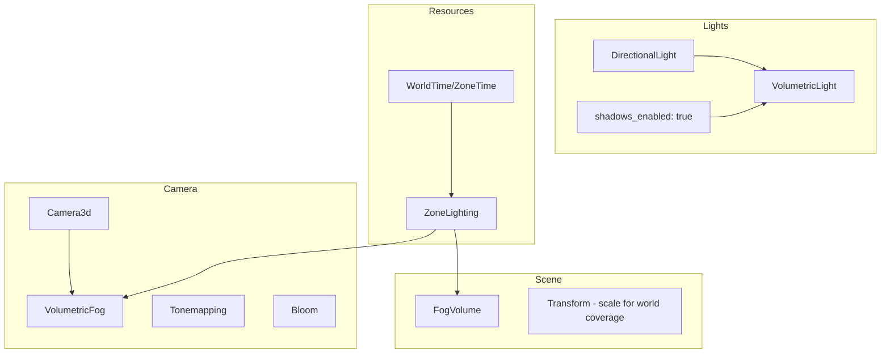

# Volumetric Lighting and Fog Upgrade Plan

## Executive Summary

This plan outlines the implementation of Bevy 0.15.4's volumetric fog and lighting system (light shafts/god rays) into the ROSE Offline Client. The upgrade will replace/augment the current custom shader-based fog with Bevy's native volumetric fog system, creating atmospheric light shafts that interact with directional lights.

## Current State Analysis

### Existing Lighting System

The game currently uses a custom lighting system in [`zone_lighting.rs`](src/render/zone_lighting.rs):

- **Custom ZoneLighting Resource**: Manages fog color, density, height-based fog, and time-of-day transitions
- **Custom Shader Implementation**: [`zone_lighting.wgsl`](src/render/shaders/zone_lighting.wgsl) implements fog in screen space
- **DirectionalLight**: Single directional light with shadow maps enabled
- **AmbientLight**: Global ambient light resource

### Current Camera Configuration

From [`lib.rs`](src/lib.rs:1528-1558):
```rust
Camera3d::default()
Camera { hdr: true, ... }
Tonemapping::TonyMcMapface
Bloom::NATURAL
DepthOfField { mode: Bokeh, ... }
```

### Limitations of Current Approach

1. No light shafts/god rays effect
2. Fog doesn't interact with light shadow maps
3. No volumetric scattering simulation
4. Limited atmospheric depth perception

## Proposed Solution

### Components to Add

#### 1. VolumetricFog Component - Camera Attachment

Add to camera entity in [`lib.rs`](src/lib.rs):

```rust
VolumetricFog {
    ambient_color: Color::WHITE,
    ambient_intensity: 0.1,  // Adjust based on environment map
    jitter: 0.0,             // Can increase with TAA
    step_count: 64,          // Balance quality vs performance
}
```

#### 2. VolumetricLight Component - Light Attachment

Add to directional light in [`zone_lighting.rs`](src/render/zone_lighting.rs:93-106):

```rust
commands.spawn((
    DirectionalLight {
        illuminance: 15000.0,
        shadows_enabled: true,  // REQUIRED for volumetric lights
        ..default()
    },
    default_light_transform(),
    CascadeShadowConfig { ... },
    VolumetricLight,  // ADD THIS
));
```

#### 3. FogVolume Entity - Scene Spawn

Create fog volumes in the scene:

```rust
commands.spawn((
    FogVolume {
        fog_color: Color::srgb(0.7, 0.8, 1.0),  // Link to ZoneLighting
        density_factor: 0.1,
        absorption: 0.3,
        scattering: 0.3,
        scattering_asymmetry: 0.5,  // Controls light shaft prominence
        light_tint: Color::WHITE,
        light_intensity: 1.0,
        density_texture: None,  // Optional: for animated fog
        density_texture_offset: Vec3::ZERO,
    },
    Transform::from_scale(Vec3::splat(1000.0)),  // Cover game world
));
```

### Integration Architecture



## Implementation Steps

### Phase 1: Core Components

1. **Add VolumetricLight to DirectionalLight**
   - File: [`src/render/zone_lighting.rs`](src/render/zone_lighting.rs)
   - Import `VolumetricLight` from `bevy::pbr`
   - Add component to existing directional light spawn

2. **Add VolumetricFog to Camera**
   - File: [`src/lib.rs`](src/lib.rs)
   - Import `VolumetricFog` from `bevy::pbr`
   - Add component to camera spawn in `load_common_game_data`

3. **Spawn FogVolume Entity**
   - File: [`src/render/zone_lighting.rs`](src/render/zone_lighting.rs)
   - Import `FogVolume` from `bevy::pbr`
   - Create system to spawn fog volume on zone load

### Phase 2: ZoneLighting Integration

4. **Extend ZoneLighting Resource**
   - Add volumetric fog parameters:
     - `volumetric_fog_enabled: bool`
     - `volumetric_density_factor: f32`
     - `volumetric_absorption: f32`
     - `volumetric_scattering: f32`
     - `volumetric_scattering_asymmetry: f32`

5. **Create FogVolume Update System**
   - Sync ZoneLighting parameters to FogVolume component
   - Support time-of-day color transitions

### Phase 3: UI Controls

6. **Add Debug UI Controls**
   - File: [`src/ui/ui_debug_zone_lighting_system.rs`](src/ui/ui_debug_zone_lighting_system.rs)
   - Add volumetric fog controls to existing debug window
   - Controls for: enabled, density, absorption, scattering, asymmetry

### Phase 4: Optional Enhancements

7. **Temporal Anti-Aliasing Integration** (Optional)
   - Add `TemporalAntiAliasPlugin` for improved quality
   - Enable `jitter` in VolumetricFog

8. **Animated Fog Textures** (Optional)
   - Load 3D noise texture for moving fog effect
   - Implement scrolling fog system like Bevy's scrolling_fog example

## File Changes Summary

| File | Changes |
|------|---------|
| [`src/render/zone_lighting.rs`](src/render/zone_lighting.rs) | Add VolumetricLight, FogVolume spawn system, update ZoneLighting resource |
| [`src/lib.rs`](src/lib.rs) | Add VolumetricFog to camera, import pbr components |
| [`src/ui/ui_debug_zone_lighting_system.rs`](src/ui/ui_debug_zone_lighting_system.rs) | Add volumetric fog debug controls |
| [`src/systems/zone_time_system.rs`](src/systems/zone_time_system.rs) | Integrate volumetric fog with time-of-day transitions |

## Performance Considerations

### Impact Factors

1. **step_count**: Higher values = better quality, lower performance
   - Default: 64 steps
   - Recommended range: 32-128

2. **Number of VolumetricLight entities**: Scales linearly
   - Limit to 1-2 directional lights for best performance

3. **FogVolume scale**: Larger volumes = more raymarching
   - Consider multiple smaller volumes vs one large volume

4. **MSAA**: Volumetric fog works with MSAA but requires separate pipeline
   - Consider TAA + jitter for better quality/performance balance

### Recommended Settings

```rust
// High Quality
VolumetricFog { step_count: 128, jitter: 0.5 }
FogVolume { density_factor: 0.1, absorption: 0.3, scattering: 0.3 }

// Balanced
VolumetricFog { step_count: 64, jitter: 0.0 }
FogVolume { density_factor: 0.1, absorption: 0.3, scattering: 0.3 }

// Performance
VolumetricFog { step_count: 32, jitter: 0.0 }
FogVolume { density_factor: 0.05, absorption: 0.2, scattering: 0.2 }
```

## Compatibility Notes

### Bevy 0.15.4 Requirements

- `VolumetricFogPlugin` is included in `DefaultPlugins` (auto-added)
- Shadows MUST be enabled on lights for volumetric effects
- HDR recommended for best visual results

### Existing Custom Fog

The current custom fog in [`zone_lighting.wgsl`](src/render/shaders/zone_lighting.wgsl) can:
- **Coexist**: Use for distance-based alpha fog while volumetric handles light shafts
- **Be replaced**: Migrate all fog functionality to FogVolume

Recommendation: **Coexist** initially - keep alpha fog for distant objects, add volumetric for atmospheric light shafts.

## Testing Plan

1. **Visual Verification**
   - Load a zone with directional light
   - Verify light shafts appear when looking toward sun
   - Check fog density at various distances

2. **Performance Testing**
   - Monitor frame time with/without volumetric fog
   - Test various step_count values
   - Verify no regression in existing rendering

3. **Integration Testing**
   - Time-of-day transitions affect fog color
   - Debug UI controls work correctly
   - Zone loading/unloading handles FogVolume properly

## Approved Implementation Approach

**User Selection**: Coexist with existing fog + 60fps target + static fog + time-of-day integration

### Final Configuration

| Setting | Value | Rationale |
|---------|-------|-----------|
| Fog Mode | Coexist | Keep existing alpha fog for distance, add volumetric for light shafts |
| Performance | 60 fps | step_count: 64, balanced quality/performance |
| Animation | Static | No noise textures, simpler implementation |
| Time Integration | Yes | Fog color/intensity changes with day/night cycle |

### Implementation Priority

1. **Phase 1** (Core): Add VolumetricLight + VolumetricFog + FogVolume
2. **Phase 2** (Integration): Connect to ZoneLighting resource
3. **Phase 3** (Time): Integrate with zone_time_system for day/night transitions
4. **Phase 4** (UI): Add debug controls in ui_debug_zone_lighting_system

## References

- [Bevy 0.15.4 Volumetric Fog Example](C:/Users/vicha/RustroverProjects/bevy-collection/bevy-0.15.4/examples/3d/volumetric_fog.rs)
- [Bevy 0.15.4 Scrolling Fog Example](C:/Users/vicha/RustroverProjects/bevy-collection/bevy-0.15.4/examples/3d/scrolling_fog.rs)
- [Bevy 0.15.4 Volumetric Fog Source](C:/Users/vicha/RustroverProjects/bevy-collection/bevy-0.15.4/crates/bevy_pbr/src/volumetric_fog/mod.rs)
