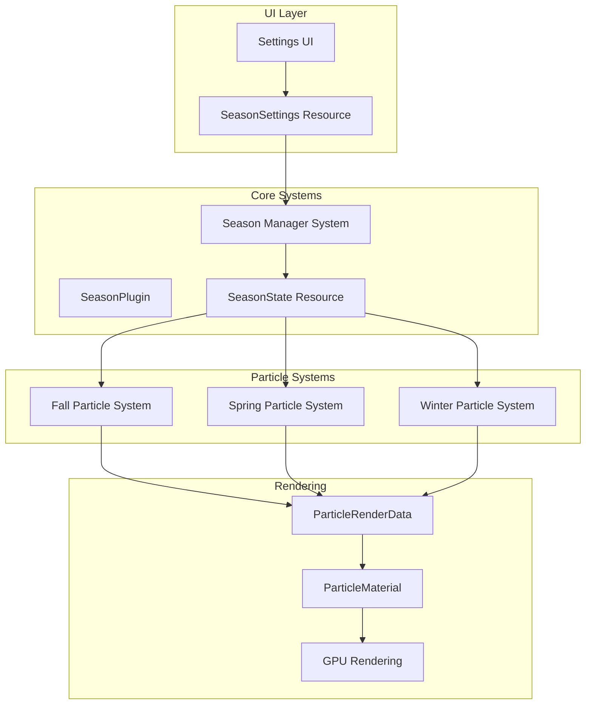
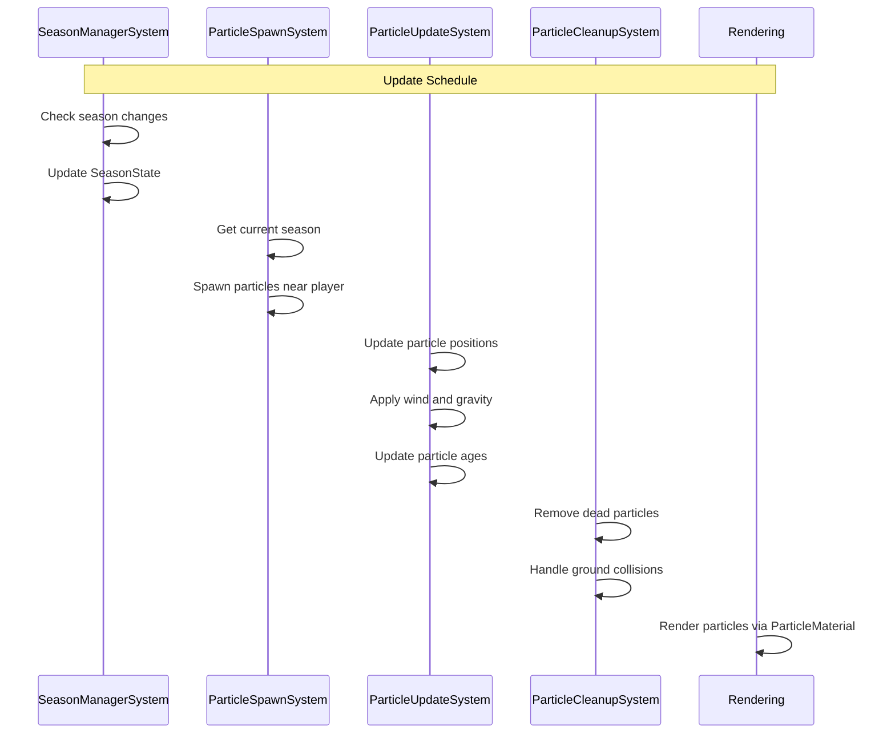
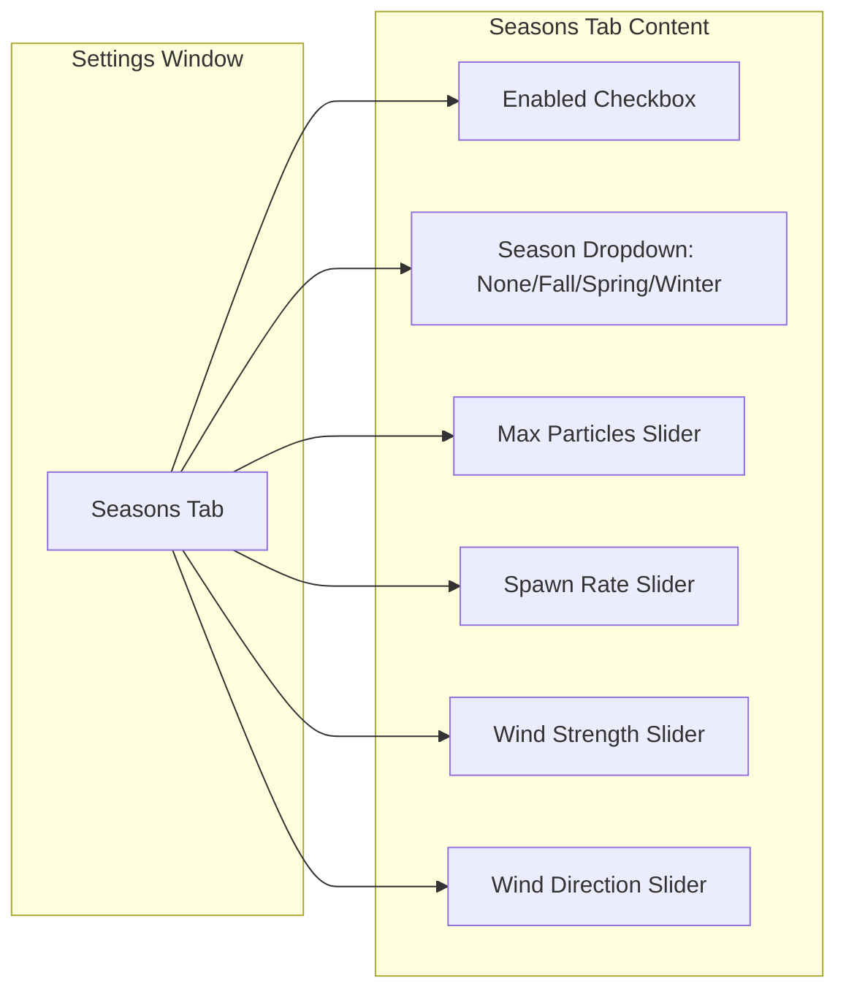
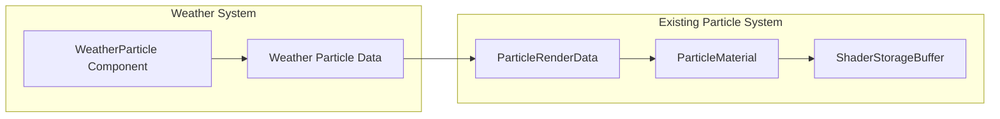

# Weather Season System Architecture

## Overview

This document describes the architecture for implementing a weather season system in the Bevy 0.15.4 game client. The system supports three seasons - Fall, Spring, and Winter - each with unique particle effects and visual characteristics.

## Design Goals

1. **Modularity**: Each season is self-contained with its own particle configuration
2. **Performance**: Efficient particle spawning and culling
3. **UI Integration**: Easy switching between seasons via settings UI
4. **Extensibility**: Simple to add new seasons or modify existing ones

---

## Architecture Diagram



---

## Component Structures

### 1. Season Enum

Location: `src/components/season.rs`

```rust
/// Available seasons in the game
#[derive(Debug, Clone, Copy, PartialEq, Eq, Hash, Reflect, Default)]
pub enum Season {
    #[default]
    None,
    Fall,
    Spring,
    Winter,
}
```

### 2. WeatherParticle Component

Location: `src/components/season.rs`

```rust
/// Component attached to weather particle entities
#[derive(Component, Reflect, Debug, Clone)]
#[reflect(Component)]
pub struct WeatherParticle {
    /// Current age of the particle in seconds
    pub age: f32,
    /// Maximum lifetime in seconds
    pub lifetime: f32,
    /// Current velocity in world units per second
    pub velocity: Vec3,
    /// Base size of the particle
    pub base_size: Vec2,
    /// Current rotation in radians
    pub rotation: f32,
    /// Rotation speed in radians per second
    pub rotation_speed: f32,
    /// Wobble phase for organic movement
    pub wobble_phase: f32,
    /// Which season this particle belongs to
    pub season: Season,
}
```

### 3. SeasonMarker Component

Location: `src/components/season.rs`

```rust
/// Marker component for season-specific entities that should be cleaned up on season change
#[derive(Component, Debug, Clone, Copy)]
pub struct SeasonMarker {
    pub season: Season,
}
```

---

## Resource Structures

### 1. SeasonSettings Resource

Location: `src/resources/season_settings.rs`

```rust
/// Resource for season configuration settings
#[derive(Resource, Reflect, Debug, Clone, Serialize, Deserialize)]
#[reflect(Resource, Default, Serialize, Deserialize)]
pub struct SeasonSettings {
    /// Currently active season
    pub current_season: Season,
    /// Whether weather effects are enabled
    pub enabled: bool,
    /// Maximum number of particles per season
    pub max_particles: usize,
    /// Particle spawn rate per second
    pub spawn_rate: f32,
    /// Wind strength affecting particle drift
    pub wind_strength: f32,
    /// Wind direction in radians
    pub wind_direction: f32,
    /// Player proximity radius for particle spawning
    pub spawn_radius: f32,
    /// Height above player to spawn particles
    pub spawn_height: f32,
}
```

### 2. FallSettings Resource

Location: `src/resources/season_settings.rs`

```rust
/// Fall-specific particle settings
#[derive(Resource, Reflect, Debug, Clone)]
#[reflect(Resource, Default)]
pub struct FallSettings {
    /// Leaf colors as RGBA colors
    pub leaf_colors: Vec<LinearRgba>,
    /// Minimum leaf size
    pub min_leaf_size: f32,
    /// Maximum leaf size
    pub max_leaf_size: f32,
    /// Minimum fall speed
    pub min_fall_speed: f32,
    /// Maximum fall speed
    pub max_fall_speed: f32,
    /// Horizontal drift amount
    pub drift_amount: f32,
    /// Wobble frequency for swaying motion
    pub wobble_frequency: f32,
    /// Wobble amplitude
    pub wobble_amplitude: f32,
    /// Rotation speed range
    pub rotation_speed_range: Range<f32>,
}
```

### 3. SpringSettings Resource

Location: `src/resources/season_settings.rs`

```rust
/// Spring-specific particle and effect settings
#[derive(Resource, Reflect, Debug, Clone)]
#[reflect(Resource, Default)]
pub struct SpringSettings {
    // Rain settings
    /// Rain drop color
    pub rain_color: LinearRgba,
    /// Rain drop size
    pub rain_drop_size: Vec2,
    /// Rain fall speed
    pub rain_fall_speed: f32,
    /// Rain streak length
    pub rain_streak_length: f32,
    /// Rain splash probability on ground hit
    pub splash_probability: f32,
    
    // Flower settings
    /// Flower spawn probability near player
    pub flower_spawn_probability: f32,
    /// Maximum flowers to spawn
    pub max_flowers: usize,
    /// Flower colors
    pub flower_colors: Vec<LinearRgba>,
    /// Flower lifetime in seconds
    pub flower_lifetime: Range<f32>,
}
```

### 4. WinterSettings Resource

Location: `src/resources/season_settings.rs`

```rust
/// Winter-specific particle settings
#[derive(Resource, Reflect, Debug, Clone)]
#[reflect(Resource, Default)]
pub struct WinterSettings {
    /// Snowflake color
    pub snow_color: LinearRgba,
    /// Minimum snowflake size
    pub min_snow_size: f32,
    /// Maximum snowflake size
    pub max_snow_size: f32,
    /// Minimum fall speed
    pub min_fall_speed: f32,
    /// Maximum fall speed
    pub max_fall_speed: f32,
    /// Horizontal drift amount
    pub drift_amount: f32,
    /// Turbulence strength for swirling motion
    pub turbulence_strength: f32,
    /// Turbulence scale
    pub turbulence_scale: f32,
    /// Snow accumulation on ground - visual only
    pub ground_tint_strength: f32,
}
```

---

## System Scheduling and Ordering

### System Sets

Location: `src/lib.rs` or `src/systems/season_plugin.rs`

```rust
#[derive(Debug, Hash, PartialEq, Eq, Clone, SystemSet)]
pub enum SeasonSystemSets {
    /// Season state management - runs first
    SeasonManagement,
    /// Particle spawning systems
    ParticleSpawning,
    /// Particle update systems
    ParticleUpdate,
    /// Particle cleanup systems - runs last
    ParticleCleanup,
}
```

### System Configuration

```rust
app.configure_sets(
    Update,
    (
        SeasonSystemSets::SeasonManagement,
        SeasonSystemSets::ParticleSpawning.after(SeasonSystemSets::SeasonManagement),
        SeasonSystemSets::ParticleUpdate.after(SeasonSystemSets::ParticleSpawning),
        SeasonSystemSets::ParticleCleanup.after(SeasonSystemSets::ParticleUpdate),
    )
        .chain(),
);
```

### System Registration Order



---

## UI Integration

### Settings Page Addition

Location: `src/ui/ui_settings_system.rs`

Add a new `SettingsPage` variant:

```rust
#[derive(Copy, Clone, PartialEq, Debug)]
enum SettingsPage {
    Sound,
    DepthOfField,
    VolumetricFog,
    Water,
    Fish,
    Birds,
    Seasons,  // NEW
}
```

### UI Layout



### UI Implementation Pattern

Following the existing pattern in [`ui_settings_system.rs`](src/ui/ui_settings_system.rs:405):

```rust
SettingsPage::Seasons => {
    egui::Grid::new("season_settings")
        .num_columns(2)
        .show(ui, |ui| {
            ui.label("Weather Effects:");
            ui.checkbox(&mut season_settings.enabled, "Enabled");
            ui.end_row();
            
            ui.label("Season:");
            egui::ComboBox::from_label("")
                .selected_text(format!("{:?}", season_settings.current_season))
                .show_ui(ui, |ui| {
                    ui.selectable_value(&mut season_settings.current_season, Season::None, "None");
                    ui.selectable_value(&mut season_settings.current_season, Season::Fall, "Fall");
                    ui.selectable_value(&mut season_settings.current_season, Season::Spring, "Spring");
                    ui.selectable_value(&mut season_settings.current_season, Season::Winter, "Winter");
                });
            ui.end_row();
            
            ui.label("Max Particles:");
            ui.add(egui::Slider::new(&mut season_settings.max_particles, 100..=5000).show_value(true));
            ui.end_row();
            
            ui.label("Spawn Rate:");
            ui.add(egui::Slider::new(&mut season_settings.spawn_rate, 1.0..=100.0).show_value(true));
            ui.end_row();
            
            ui.label("Wind Strength:");
            ui.add(egui::Slider::new(&mut season_settings.wind_strength, 0.0..=10.0).show_value(true));
            ui.end_row();
            
            ui.label("Wind Direction:");
            ui.add(egui::Slider::new(&mut season_settings.wind_direction, 0.0..=std::f32::consts::TAU).show_value(true));
            ui.end_row();
        });
    
    ui.separator();
    ui.label("Tip: Season changes apply immediately. Disable weather effects for best performance.");
}
```

---

## Particle Effect Specifications

### Fall - Falling Leaves

**Visual Characteristics:**
- Leaf-shaped particles with warm autumn colors
- Gentle swaying motion with wobble
- Slow descent with horizontal drift
- Rotation around multiple axes

**Particle Parameters:**

| Parameter | Value | Description |
|-----------|-------|-------------|
| Size | 0.3 - 0.8 units | Leaf size variation |
| Lifetime | 8 - 15 seconds | Time before despawn |
| Fall Speed | 1.0 - 3.0 units/sec | Vertical descent rate |
| Drift | 2.0 - 5.0 units/sec | Horizontal wind effect |
| Wobble Freq | 0.5 - 1.5 Hz | Swaying frequency |
| Wobble Amp | 0.5 - 1.5 units | Swaying amplitude |
| Rotation | 0.5 - 2.0 rad/sec | Spinning speed |

**Colors:**
```rust
vec![
    LinearRgba::new(0.8, 0.2, 0.1, 1.0),  // Red
    LinearRgba::new(0.9, 0.4, 0.1, 1.0),  // Orange
    LinearRgba::new(0.9, 0.6, 0.2, 1.0),  // Light orange
    LinearRgba::new(0.7, 0.5, 0.2, 1.0),  // Brown
    LinearRgba::new(0.8, 0.7, 0.2, 1.0),  // Gold
]
```

### Spring - Rain and Flowers

**Rain Visual Characteristics:**
- Thin elongated droplets
- Fast vertical descent
- Slight angle based on wind
- Splash effect on ground contact

**Rain Parameters:**

| Parameter | Value | Description |
|-----------|-------|-------------|
| Size | (0.05, 0.3) units | Drop width and length |
| Lifetime | 1.0 - 2.0 seconds | Time before despawn |
| Fall Speed | 15.0 - 25.0 units/sec | Fast vertical descent |
| Streak Length | 0.5 - 1.0 units | Motion blur effect |
| Splash Chance | 10% | Probability of splash |

**Flower Parameters:**

| Parameter | Value | Description |
|-----------|-------|-------------|
| Spawn Prob | 0.01 per frame | Chance to spawn near player |
| Max Flowers | 100 | Maximum simultaneous flowers |
| Lifetime | 30 - 60 seconds | Time before fading |
| Size | 0.2 - 0.4 units | Flower size |

**Flower Colors:**
```rust
vec![
    LinearRgba::new(1.0, 0.8, 0.9, 1.0),  // Pink
    LinearRgba::new(1.0, 1.0, 0.8, 1.0),  // Light yellow
    LinearRgba::new(0.9, 0.9, 1.0, 1.0),  // Light purple
    LinearRgba::new(1.0, 1.0, 1.0, 1.0),  // White
]
```

### Winter - Snow

**Visual Characteristics:**
- Soft round snowflakes
- Slow, gentle descent
- Turbulent swirling motion
- Accumulation tint on ground

**Snow Parameters:**

| Parameter | Value | Description |
|-----------|-------|-------------|
| Size | 0.1 - 0.4 units | Snowflake size |
| Lifetime | 10 - 20 seconds | Time before despawn |
| Fall Speed | 0.5 - 2.0 units/sec | Slow descent |
| Drift | 1.0 - 3.0 units/sec | Horizontal movement |
| Turbulence | 0.5 - 1.5 units | Swirling amplitude |
| Turb Scale | 2.0 - 5.0 | Noise frequency |

**Color:**
```rust
LinearRgba::new(0.95, 0.95, 1.0, 0.9)  // Slightly blue-white
```

---

## File Organization Plan

### New Files to Create

```
src/
├── components/
│   └── season.rs              # Season enum, WeatherParticle, SeasonMarker
│
├── resources/
│   └── season_settings.rs     # SeasonSettings, FallSettings, SpringSettings, WinterSettings
│
├── systems/
│   └── season/
│       ├── mod.rs             # SeasonPlugin definition
│       ├── season_manager.rs  # Season state management
│       ├── fall_system.rs     # Fall leaf particle system
│       ├── spring_system.rs   # Spring rain and flower system
│       ├── winter_system.rs   # Winter snow particle system
│       └── particle_spawner.rs # Shared particle spawning utilities
│
└── render/
    └── shaders/
        └── weather_particle.wgsl  # Optional: custom weather shader
```

### Files to Modify

1. **`src/components/mod.rs`** - Add `mod season;` and export
2. **`src/resources/mod.rs`** - Add `mod season_settings;` and export
3. **`src/ui/ui_settings_system.rs`** - Add Seasons settings page
4. **`src/lib.rs`** - Register SeasonPlugin and resources

---

## Integration with Existing Systems

### Particle Material Integration

The weather system integrates with the existing [`ParticleMaterial`](src/render/particle_material.rs:16) system:



**Integration Points:**

1. **ParticleRenderData**: Weather particles populate the same [`ParticleRenderData`](src/render/particle_render_data.rs:17) structure used by existing particle effects

2. **Storage Buffers**: Use the same storage buffer pattern for positions, sizes, colors, and textures

3. **Billboard Types**: Use [`ParticleRenderBillboardType::Full`](src/render/particle_render_data.rs:13) for camera-facing particles

### Camera and Player Tracking

Weather particles spawn around the player camera position:

```rust
fn get_spawn_position(
    camera_transform: &GlobalTransform,
    settings: &SeasonSettings,
    rng: &mut impl Rng,
) -> Vec3 {
    let camera_pos = camera_transform.translation();
    
    // Random position in a cylinder above the camera
    let angle = rng.gen::<f32>() * std::f32::consts::TAU;
    let radius = rng.gen::<f32>() * settings.spawn_radius;
    let height = settings.spawn_height;
    
    Vec3::new(
        camera_pos.x + radius * angle.cos(),
        camera_pos.y + height,
        camera_pos.z + radius * angle.sin(),
    )
}
```

---

## Performance Considerations

### Particle Pooling

Implement object pooling to avoid allocation overhead:

```rust
#[derive(Resource)]
pub struct ParticlePool {
    particles: Vec<Entity>,
    active_count: usize,
    max_particles: usize,
}
```

### Level of Detail

Reduce particle count based on performance:

```rust
fn get_effective_spawn_rate(
    settings: &SeasonSettings,
    diagnostics: &Res<FrameDiagnostics>,
) -> f32 {
    let fps = diagnostics.fps as f32;
    
    if fps < 30.0 {
        settings.spawn_rate * 0.5  // Reduce at low FPS
    } else if fps < 45.0 {
        settings.spawn_rate * 0.75
    } else {
        settings.spawn_rate
    }
}
```

### Spatial Culling

Only spawn particles within view distance:

```rust
fn is_in_view_range(
    particle_pos: Vec3,
    camera_pos: Vec3,
    view_distance: f32,
) -> bool {
    particle_pos.distance_squared(camera_pos) < view_distance * view_distance
}
```

---

## Implementation Checklist

### Phase 1: Core Infrastructure
- [ ] Create `src/components/season.rs` with Season enum and WeatherParticle
- [ ] Create `src/resources/season_settings.rs` with all settings resources
- [ ] Create `src/systems/season/mod.rs` with SeasonPlugin
- [ ] Register components and resources in `lib.rs`

### Phase 2: Season Implementation
- [ ] Implement `fall_system.rs` with leaf particle spawning
- [ ] Implement `spring_system.rs` with rain and flowers
- [ ] Implement `winter_system.rs` with snow particles
- [ ] Create shared `particle_spawner.rs` utilities

### Phase 3: UI Integration
- [ ] Add Seasons page to `ui_settings_system.rs`
- [ ] Add season settings tab with all controls
- [ ] Connect UI to SeasonSettings resource

### Phase 4: Polish and Optimization
- [ ] Implement particle pooling
- [ ] Add LOD system for performance
- [ ] Test all season transitions
- [ ] Profile and optimize

---

## Testing Strategy

### Unit Tests

```rust
#[cfg(test)]
mod tests {
    use super::*;
    
    #[test]
    fn test_season_default() {
        assert_eq!(Season::default(), Season::None);
    }
    
    #[test]
    fn test_particle_lifetime() {
        let particle = WeatherParticle::new(Season::Fall);
        assert!(particle.lifetime > 0.0);
        assert!(particle.age == 0.0);
    }
    
    #[test]
    fn test_settings_serialization() {
        let settings = SeasonSettings::default();
        let json = serde_json::to_string(&settings).unwrap();
        let decoded: SeasonSettings = serde_json::from_str(&json).unwrap();
        assert_eq!(settings.current_season, decoded.current_season);
    }
}
```

### Integration Tests

1. **Season Switching**: Verify particles despawn on season change
2. **Particle Limits**: Ensure max_particles is respected
3. **UI Responsiveness**: Settings changes apply immediately
4. **Performance**: Maintain 60 FPS with max particles

---

## Future Extensions

### Potential Enhancements

1. **Dynamic Weather**: Blend between seasons based on game time
2. **Zone-Specific Weather**: Different seasons per zone
3. **Sound Integration**: Rain sounds, wind sounds per season
4. **Ground Effects**: Snow accumulation, wet ground shaders
5. **NPC Reactions**: NPCs react to weather changes

### Configuration File Support

```toml
# seasons.toml
[seasons.default]
enabled = true
max_particles = 1000

[seasons.fall]
leaf_colors = ["#CC3311", "#EE7733", "#EEBB44"]
fall_speed = { min = 1.0, max = 3.0 }

[seasons.spring]
rain_intensity = 0.8
flower_density = 0.5

[seasons.winter]
snow_intensity = 1.0
ground_tint = "#EEF0FF"
```

---

## Summary

This architecture provides a modular, performant weather season system that:

1. **Follows existing patterns** established by Bird and Fish systems
2. **Integrates cleanly** with the existing particle rendering pipeline
3. **Provides UI controls** consistent with other settings pages
4. **Supports easy extension** for new seasons or effects
5. **Maintains performance** through pooling and LOD systems

The implementation should proceed in phases, starting with core infrastructure, then individual seasons, followed by UI integration and optimization.
