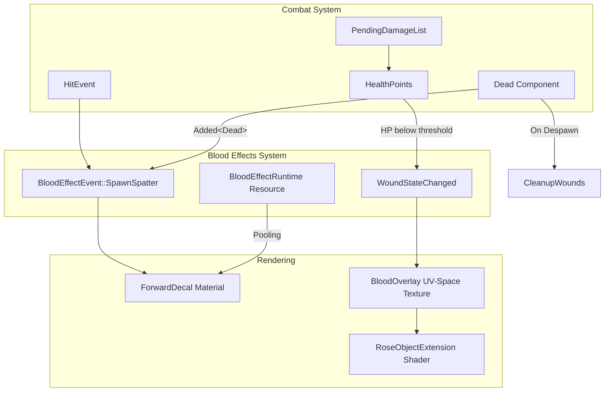

# Blood Effects System Design

## Overview

This document describes the blood effects system implemented in the Rose Online client using Bevy 0.18.1. The system provides:
- **Blood Spatter**: Forward decals spawned on terrain when entities take damage or are killed
- **Gash Wounds**: UV-space blood overlay stains appearing on entities when HP drops below the wound visibility threshold (default 50%)
- **Persistent Wounds**: Wounds remain visible on entities until they despawn

## Architecture Analysis

### Existing Systems Integration Points



### Key Integration Points

| System | File | Integration |
|--------|------|-------------|
| Damage Events | [`hit_event.rs`](src/events/hit_event.rs) | `HitEvent` carries a `BloodImpactProfile`; `hit_event_system` emits blood events via `emit_blood_and_wounds` in [`damage_effects.rs`](src/systems/damage_effects.rs) |
| HP Tracking | [`ability_values.rs`](src/bundles/ability_values.rs) | `HealthPoints`/`AbilityValues` (from `rose_game_common::components`) read by `wound_visibility_system` |
| Death Tracking | [`dead.rs`](src/components/dead.rs) | `Dead` component (`Added<Dead>`) triggers kill spatter |
| Effect Spawning | [`spawn_effect_event.rs`](src/events/spawn_effect_event.rs) | Pattern for effect events |
| Particle Rendering | [`particle_material.rs`](src/render/particle_material.rs) | Storage buffer approach for particles (used by effect particles, not blood) |

## Bevy 0.18.1 Decal Support

Bevy 0.18.1 provides two decal implementations:

### Forward Decals (Recommended for Blood Spatter)

```rust
// From bevy_pbr::decal
commands.spawn((
    Name::new("BloodDecal"),
    ForwardDecal,
    MeshMaterial3d(decal_materials.add(ForwardDecalMaterial {
        base: StandardMaterial {
            base_color_texture: Some(blood_texture.clone()),
            alpha_mode: AlphaMode::Blend,
            ..default()
        },
        extension: ForwardDecalMaterialExt {
            depth_fade_factor: 1.0,
        },
    })),
    Transform::from_xyz(x, y + 0.1, z)
        .looking_at(Vec3::ZERO, Vec3::Y)
        .with_scale(Vec3::new(size, size, 0.1)),
));

// Camera requirement
commands.spawn((
    Camera3d::default(),
    DepthPrepass, // Required for forward decals
    ..default()
));
```

**Advantages:**
- Works on all platforms (no bindless requirement)
- Simple material extension
- Good for flat terrain surfaces

**Limitations:**
- Requires `DepthPrepass` on camera
- Can distort at steep angles

### Clustered Decals (Alternative)

Clustered decals are the highest-quality decal type in Bevy, but they require bindless textures, so per Bevy 0.18.1 docs they cannot be used on WebGL 2 or WebGPU. Not recommended for this use case due to platform limitations.

## Component Design

### Blood Spatter Components

```rust
// src/components/blood_effect.rs

/// Marker for blood spatter decal entities
#[derive(Component, Reflect, Clone, Debug)]
#[reflect(Component)]
pub struct BloodSpatter {
    /// Time remaining before this spatter fades out completely (in seconds).
    pub lifetime: f32,
    /// Total lifetime assigned when spawned (in seconds).
    pub total_lifetime: f32,
    /// Current alpha transparency value (0.0 = invisible, 1.0 = fully opaque).
    pub alpha: f32,
    /// Initial alpha value used as the fade baseline.
    pub base_alpha: f32,
    /// Size of the decal in world units.
    pub size: f32,
    /// Color while blood is fresh.
    pub wet_color: Color,
    /// Color after drying.
    pub dry_color: Color,
    /// Whether this pooled spatter is currently active/visible.
    pub active: bool,
}

/// Marker set when a kill-triggered blood spatter was already emitted from
/// combat resolution. Used to avoid duplicate death-triggered spatters.
#[derive(Component, Reflect, Clone, Debug, Default)]
#[reflect(Component)]
pub struct DeathBloodHandled;

/// Configuration for blood spatter appearance
#[derive(Component, Reflect, Clone, Debug)]
#[reflect(Component)]
pub struct BloodSpatterConfig {
    /// Minimum spatter size
    pub min_size: f32,
    /// Maximum spatter size
    pub max_size: f32,
    /// Number of spatter decals to spawn on death
    pub spatter_count: usize,
    /// How long spatters persist before fading
    pub spatter_lifetime: f32,
    /// Maximum distance from death position for spatters
    pub spatter_radius: f32,
}

impl Default for BloodSpatterConfig {
    fn default() -> Self {
        Self {
            min_size: 0.3,
            max_size: 1.5,
            spatter_count: 5,
            spatter_lifetime: 30.0,
            spatter_radius: 2.0,
        }
    }
}
```

### Gash Wound Components

```rust
// src/components/blood_effect.rs (continued)

/// Tracks wound state for an entity
#[derive(Component, Reflect, Clone, Debug)]
#[reflect(Component)]
pub struct GashWounds {
    /// Number of wound visuals currently attached to this entity.
    pub wound_count: usize,
    /// Whether wounds are currently visible (HP < threshold).
    pub wounds_visible: bool,
    /// The parent entity that owns these wounds (for cleanup tracking).
    pub parent_entity: Entity,
}

/// Marker component for wound visual child entities
#[derive(Component, Reflect, Clone, Debug)]
#[reflect(Component)]
pub struct WoundVisual {
    /// The parent entity this wound visual is attached to.
    pub parent_entity: Entity,
    /// Wound visual size scalar.
    pub size: f32,
    /// Whether this wound visual is currently active.
    pub active: bool,
}
```

### Blood Overlay Components

Wounds are not spawned as separate mesh quads. Instead, blood is painted into UV-space overlay textures sampled by the [`RoseObjectExtension`](src/render/object_material_extension.rs) material extension, so the blood deforms with skeletal animation.

```rust
// src/components/blood_overlay.rs

/// UV-space blood stain position.
#[derive(Clone, Debug, Reflect)]
pub struct BloodStain {
    /// UV space position (center of stain) in [0, 1] range.
    pub uv_center: Vec2,
    /// UV space size of the stain (width, height).
    pub uv_size: Vec2,
    /// Rotation in UV space (radians).
    pub rotation: f32,
    /// Alpha intensity of the stain (0.0 = invisible, 1.0 = fully opaque).
    pub alpha: f32,
    /// Which blood texture variant to use (0-7 for different stain shapes).
    pub texture_variant: usize,
    /// Whether this stain is currently visible.
    pub visible: bool,
    /// The material entity this stain belongs to.
    /// When None, the stain applies to all materials (legacy behavior).
    pub material_entity: Option<Entity>,
}

/// Component that tracks blood overlay state for an entity.
#[derive(Component, Reflect, Clone, Debug)]
#[reflect(Component)]
pub struct BloodOverlay {
    /// List of blood stains on this entity.
    pub stains: Vec<BloodStain>,
    /// Whether the overlay texture needs to be regenerated.
    pub texture_dirty: bool,
    /// Whether this entity currently has visible blood.
    pub is_bloodied: bool,
    /// Maximum number of stains before old ones are removed.
    pub max_stains: usize,
    /// Per-material dirty flags. When a material entity is present here,
    /// its overlay texture needs regeneration.
    pub material_dirty: HashMap<Entity, bool>,
}
```

## Event Design

Events are declared with `#[derive(Message)]` and written/read via `MessageWriter`/`MessageReader` (Bevy 0.18.1 naming).

```rust
// src/events/blood_effect_event.rs

/// Blood impact profile used to tune layered blood behavior.
#[derive(Reflect, Clone, Copy, Debug, Default)]
pub enum BloodImpactProfile {
    #[default]
    Slash,
    Pierce,
    Blunt,
    SkillMagic,
    Projectile,
}

/// Event triggered when blood effects should spawn
#[derive(Message, Reflect, Clone, Debug)]
pub enum BloodEffectEvent {
    /// Spawn blood spatter on terrain at position
    SpawnSpatter {
        position: Vec3,
        normal: Vec3,
        impact_direction: Vec3,
        damage_amount: u32,
        is_kill: bool,
        profile: BloodImpactProfile,
    },
    /// Show gash wound on entity
    ShowWound {
        entity: Entity,
        wound_position: Vec3,
        wound_normal: Vec3,
    },
    /// Update wound visibility based on HP
    UpdateWoundVisibility {
        entity: Entity,
        health_percent: f32,
    },
    /// Clean up all wounds for an entity
    CleanupWounds { entity: Entity },
}
```

Constructors exist for the common cases: `BloodEffectEvent::kill_spatter_with_profile(...)`, `hit_spatter_with_profile(...)`, and `show_wound(entity, position, normal)`.

## Resource Design

```rust
// src/resources/blood_effect_runtime.rs

/// Runtime state for blood effects, including entity pooling.
#[derive(Resource, Default, Debug)]
pub struct BloodEffectRuntime {
    pub spatter_pool: Vec<Entity>,
    pub wound_pool: Vec<Entity>,
}

/// Lightweight diagnostics counters for blood effects.
#[derive(Resource, Default, Debug)]
pub struct BloodEffectDiagnostics {
    pub spatter_events: u64,
    pub active_spatters_spawned: u64,
    pub pooled_spatters_reused: u64,
    pub pooled_spatters_returned: u64,
    pub wound_visuals_spawned: u64,
    pub wound_visuals_reused: u64,
    pub mist_spawned: u64,
    pub droplets_spawned: u64,
    pub accum_time_secs: f32,
}
```

Spatter entities are pooled in `BloodEffectRuntime::spatter_pool`. When the `max_spatters` limit is reached, the oldest active spatter (lowest `lifetime`) is returned to the pool instead of despawning. Blood/wound textures are generated procedurally once and cached in the [`BloodDecalAtlas`](src/resources/blood_decal_atlas.rs) resource (`spatter_textures`, `wound_textures`).

## System Design

### Blood Spatter Spawning System

```rust
// src/systems/blood_spatter_system.rs

/// System that listens for entities being marked as Dead and spawns blood spatter events.
pub fn blood_spatter_on_death_system(
    mut blood_events: MessageWriter<BloodEffectEvent>,
    query_dead: Query<
        &GlobalTransform,
        (Added<Dead>, With<ModelHeight>, Without<DeathBloodHandled>),
    >,
    config: Res<BloodEffectConfig>,
) {
    if !config.enable_blood {
        return;
    }

    for transform in query_dead.iter() {
        let position = transform.translation();

        // Spawn blood spatter at feet position
        blood_events.write(BloodEffectEvent::kill_spatter_with_profile(
            position,
            Vec3::Y,
            0, // Final blow damage already applied
            Vec3::Y,
            BloodImpactProfile::Slash,
        ));
    }
}
```

```rust
/// System that processes blood effect events and spawns spatter decals.
///
/// Handles `BloodEffectEvent::SpawnSpatter` by creating forward decal entities
/// (or reusing pooled ones). Spatter count/size/alpha are scaled by impact
/// profile multipliers, damage amount, and distance-based LOD.
pub fn blood_spatter_spawn_system(
    mut commands: Commands,
    mut blood_events: MessageReader<BloodEffectEvent>,
    config: Res<BloodEffectConfig>,
    query_spatters: Query<
        (
            Entity,
            &BloodSpatter,
            &MeshMaterial3d<ForwardDecalMaterial<StandardMaterial>>,
        ),
        With<BloodSpatter>,
    >,
    query_transform: Query<&GlobalTransform>,
    client_entity_list: Res<ClientEntityList>,
    atlas: Res<BloodDecalAtlas>,
    mut decal_materials: ResMut<Assets<ForwardDecalMaterial<StandardMaterial>>>,
    mut runtime: ResMut<BloodEffectRuntime>,
    mut diagnostics: ResMut<BloodEffectDiagnostics>,
) {
    // ...
    for event in blood_events.read() {
        if let BloodEffectEvent::SpawnSpatter { position, normal, impact_direction, damage_amount, is_kill, profile } = event {
            // spatter count = base count (kill vs hit) * profile multiplier * LOD scale
            // per-spatter: biased directional distribution from impact vector,
            // random size within range, alpha from damage amount and profile
            // spawn or reuse from runtime.spatter_pool
        }
    }
}
```

The spatter transform aligns the decal to the surface normal with a random spin:

```rust
fn build_spatter_transform(position: Vec3, normal: Vec3, size: f32, rotation: f32) -> Transform {
    let surface_normal = normalize_or(normal, Vec3::Y);
    let align_to_surface = Quat::from_rotation_arc(Vec3::Y, surface_normal);
    let spin_on_surface = Quat::from_axis_angle(surface_normal, rotation);

    Transform::from_translation(position + surface_normal * 0.01)
        .with_rotation(spin_on_surface * align_to_surface)
        .with_scale(Vec3::new(size, size, 1.0))
}
```

Blood textures are generated procedurally (8 spatter variants + wound texture) by `initialize_blood_decal_atlas_system` / `create_blood_texture_variant` at startup.

### Wound Visibility System

```rust
// src/systems/gash_wound_system.rs

/// System that monitors HP and shows/hides wounds based on health percentage.
pub fn wound_visibility_system(
    mut commands: Commands,
    mut query: Query<
        (
            Entity,
            &HealthPoints,
            &AbilityValues,
            Option<&mut GashWounds>,
            Option<&ModelHeight>,
        ),
        Without<Dead>,
    >,
    mut blood_events: MessageWriter<BloodEffectEvent>,
    config: Res<BloodEffectConfig>,
) {
    if !config.enable_blood || !config.show_wounds {
        return;
    }

    for (entity, hp, ability_values, wounds, model_height) in query.iter_mut() {
        let max_hp = ability_values.get_max_health();
        if max_hp <= 0 {
            continue;
        }

        let health_percent = hp.hp as f32 / max_hp as f32;
        let should_show_wounds = health_percent < config.wound_visibility_threshold;

        if let Some(mut wounds) = wounds {
            if wounds.wounds_visible != should_show_wounds {
                wounds.wounds_visible = should_show_wounds;
                // Emit show_wound events up to config.max_wounds_per_entity
            }
        } else if should_show_wounds {
            // First time showing wounds - create component and BloodOverlay
            commands.entity(entity).insert(BloodOverlay::new());
            // Emit seeded show_wound events, then insert GashWounds
        }
    }
}
```

`wound_spawn_system` (same file) consumes `ShowWound` events and paints `BloodStain`s into the entity's `BloodOverlay` component. For entities with a `CharacterModel` component, the accurate `project_world_to_uv()` function (triangle-ray intersection with skinned mesh vertex transformation) finds the UV coordinates and material index; otherwise a cylindrical `world_pos_to_uv()` approximation is used. `blood_overlay_generate_system` (`src/systems/blood_overlay_system.rs`) regenerates per-material overlay textures and binds them to `RoseObjectExtension` (`blood_overlay_texture`, `blood_params`).

### Blood Spatter Fade System

```rust
// src/systems/blood_spatter_system.rs (continued)

/// System that fades out blood spatters over time and removes expired ones.
pub fn blood_spatter_fade_system(
    mut commands: Commands,
    mut query: Query<
        (
            Entity,
            &mut BloodSpatter,
            &MeshMaterial3d<ForwardDecalMaterial<StandardMaterial>>,
        ),
        With<ForwardDecal>,
    >,
    time: Res<Time>,
    config: Res<BloodEffectConfig>,
    mut decal_materials: ResMut<Assets<ForwardDecalMaterial<StandardMaterial>>>,
    mut runtime: ResMut<BloodEffectRuntime>,
    mut diagnostics: ResMut<BloodEffectDiagnostics>,
) {
    let delta = time.delta_secs();
    for (entity, mut spatter, material_handle) in query.iter_mut() {
        if !spatter.active {
            continue;
        }

        spatter.lifetime -= delta;

        if spatter.lifetime <= 0.0 {
            spatter.active = false;
            commands.entity(entity).insert(Visibility::Hidden);
            runtime.spatter_pool.push(entity);
            continue;
        }

        // Alpha fades from base_alpha starting at config.fade_start_fraction,
        // and the color interpolates from wet_color to dry_color over time.
        if let Some(material) = decal_materials.get_mut(&material_handle.0) {
            material.base.base_color = color;
        }
    }
}
```

### Wound Cleanup System

```rust
// src/systems/gash_wound_system.rs (continued)

/// System that cleans up wound visuals when their parent entity despawns.
pub fn wound_cleanup_system(
    mut commands: Commands,
    query_wound_visuals: Query<(Entity, &WoundVisual)>,
    query_parents: Query<(), Without<Dead>>,
) {
    for (wound_entity, wound_visual) in query_wound_visuals.iter() {
        // If parent entity no longer exists, clean up the wound
        if query_parents.get(wound_visual.parent_entity).is_err() {
            commands.entity(wound_entity).despawn();
        }
    }
}
```

## Shader Approach

### Blood Spatter Decals

Blood spatter uses Bevy's built-in forward decal rendering (`bevy_pbr::decal`). No custom decal shader is used — the `ForwardDecalMaterial<StandardMaterial>` base handles depth fade (via `ForwardDecalMaterialExt.depth_fade_factor`) and alpha blending. Bevy's `bevy_pbr::decal::forward::get_forward_decal_info` is available for custom decal shaders that need the decal info (depth fade, etc.).

### Blood Overlay Shader

Wound blood is rendered in UV space by the `RoseObjectExtension` material extension shader (`src/render/shaders/rose_object_extension.wgsl`). The extension samples the per-material blood overlay texture and blends it with the lit, lightmapped color:

```wgsl
// src/render/shaders/rose_object_extension.wgsl (excerpt)

var blood_overlay_texture: texture_2d<f32>;
var blood_overlay_sampler: sampler;
var<uniform> blood_params: vec4<f32>;

// Apply UV-space blood overlay on top of the lit+lightmapped color.
let blood_sample = textureSample(blood_overlay_texture, blood_overlay_sampler, in.uv);
let blood_alpha = clamp(blood_sample.a * blood_params.x, 0.0, 1.0);
blood_blended_rgb = mix(lit_color.rgb, blood_sample.rgb, blood_alpha);
```

Overlay textures are generated procedurally (512x512) from the entity's `BloodOverlay` stains by `blood_overlay_generate_system` and bound per material entity.

## File Structure

```
src/
├── blood_effect_plugin.rs        # BloodEffectPlugin: registers config, runtime,
│                                 #   event, and the three sub-plugins
├── components/
│   ├── blood_effect.rs           # BloodSpatter, BloodSpatterConfig, DeathBloodHandled,
│   │                             #   GashWounds, WoundVisual
│   ├── blood_overlay.rs          # BloodOverlay, BloodStain (UV-space wounds)
│   └── mod.rs
├── events/
│   ├── blood_effect_event.rs     # BloodEffectEvent, BloodImpactProfile
│   └── mod.rs
├── resources/
│   ├── blood_decal_atlas.rs      # BloodDecalAtlas (procedural spatter/wound textures)
│   ├── blood_effect_config.rs    # BloodEffectConfig
│   ├── blood_effect_runtime.rs   # BloodEffectRuntime, BloodEffectDiagnostics
│   ├── blood_overlay_atlas.rs    # BloodOverlayAtlas (wound stain variants)
│   └── mod.rs
├── systems/
│   ├── blood_spatter_system.rs   # initialize_blood_decal_atlas_system,
│   │                             #   blood_spatter_on_death_system,
│   │                             #   blood_spatter_spawn_system,
│   │                             #   blood_spatter_fade_system
│   ├── blood_overlay_system.rs   # blood_overlay_generate_system, BloodOverlayPlugin
│   ├── gash_wound_system.rs      # wound_visibility_system, wound_spawn_system,
│   │                             #   wound_cleanup_system, GashWoundPlugin
│   └── mod.rs
├── render/
│   ├── object_material_extension.rs # RoseObjectExtension (blood_overlay_texture, blood_params)
│   └── shaders/
│       └── rose_object_extension.wgsl # Blood overlay sampling in the material shader
└── lib.rs                       # pub mod blood_effect_plugin; BloodEffectPlugin registered
```

## Implementation Status

All phases below are implemented.

### Phase 1: Core Infrastructure
1. Component definitions (`components/blood_effect.rs`, `components/blood_overlay.rs`)
2. Event definitions (`events/blood_effect_event.rs`)
3. Resources (`resources/blood_effect_config.rs`, `resources/blood_effect_runtime.rs`, `resources/blood_decal_atlas.rs`, `resources/blood_overlay_atlas.rs`)
4. Plugin registration (`blood_effect_plugin.rs`, registered in `lib.rs`)

### Phase 2: Blood Spatter System
1. `blood_spatter_on_death_system` (kill triggers)
2. `blood_spatter_spawn_system` (event processing with pooling/LOD/profile scaling)
3. `blood_spatter_fade_system` (fade + wet-to-dry color + pooling)
4. Procedural blood textures generated at startup (`initialize_blood_decal_atlas_system`)

### Phase 3: Gash Wounds System
1. `wound_visibility_system` (HP threshold monitoring)
2. `wound_spawn_system` (UV-space stain placement via `project_world_to_uv` / `world_pos_to_uv`)
3. `blood_overlay_generate_system` (per-material overlay texture generation)
4. Test with damage below the wound visibility threshold

### Phase 4: Polish and Optimization
1. Object pooling via `BloodEffectRuntime` (spatter pool, LRU eviction at `max_spatters`)
2. Configuration options (`BloodEffectConfig`: enable/disable, intensity, LOD distances, per-frame spawn budget)
3. Performance: distance-based LOD scaling, spawn budget per frame
4. Wound texture variations (procedural variants, `BloodOverlayAtlas`)
5. `wound_cleanup_system` on despawn

## Performance Considerations

### Object Pooling
- Pool spatter entities to avoid spawn/despawn overhead
- Maximum limit on active spatters (e.g., 100)
- LRU eviction when limit reached

### Level of Detail
- Spatter count and size are scaled down with distance from the player (`distance_lod_scale`, `lod_near_distance`/`lod_far_distance`)
- Spatter count is capped per frame by `max_spatters_per_frame`
- Wound count is capped per entity by `max_wounds_per_entity`

### Memory Management
- Share blood textures across all spatters (`BloodDecalAtlas` caches procedural textures)
- Use a texture atlas for wound variations (`BloodOverlayAtlas`)
- Limit wound visuals per entity (`max_wounds_per_entity`, default 4, seeded 3)

## Configuration

```rust
// src/resources/blood_effect_config.rs

#[derive(Resource, Reflect, Clone, Debug)]
#[reflect(Resource)]
pub struct BloodEffectConfig {
    /// Whether blood effects are enabled globally.
    pub enable_blood: bool,
    /// Maximum number of blood spatters allowed in the scene at once.
    /// When this limit is reached, oldest spatters are removed (LRU eviction).
    pub max_spatters: usize,
    /// How long blood spatters persist before fading out (in seconds).
    pub spatter_lifetime: f32,
    /// Blood intensity multiplier (0.0 - 1.0).
    pub intensity: f32,
    /// Whether to show gash wounds on damaged entities.
    pub show_wounds: bool,
    /// HP percentage threshold below which wounds become visible (default 0.5).
    pub wound_visibility_threshold: f32,
    /// Base color tint for blood effects.
    pub blood_color: Color,
    /// Dried blood tint used for wet-to-dry evolution.
    pub dry_blood_color: Color,
    /// Minimum size for blood spatters in world units.
    pub min_spatter_size: f32,
    /// Maximum size for blood spatters in world units.
    pub max_spatter_size: f32,
    /// Number of spatter decals to spawn on a killing blow.
    pub spatter_count_on_kill: usize,
    /// Number of spatter decals to spawn on a non-lethal hit.
    pub spatter_count_on_hit: usize,
    /// Maximum radius around death position for spatter placement.
    pub spatter_radius: f32,
    /// Global quality scalar for blood visuals (0.0 - 1.0).
    pub quality_scale: f32,
    /// Maximum number of spatter decals spawned in a single frame.
    pub max_spatters_per_frame: usize,
    /// Fraction of lifetime at which alpha fade begins (0.0 - 1.0).
    pub fade_start_fraction: f32,
    /// Depth fade factor for forward decal blending.
    pub decal_depth_fade_factor: f32,
    /// Minimum wound overlay size in local units.
    pub wound_min_size: f32,
    /// Maximum wound overlay size in local units.
    pub wound_max_size: f32,
    /// Maximum wound overlays to show on a single entity.
    pub max_wounds_per_entity: usize,
    /// Distance from the player where full blood quality is used.
    pub lod_near_distance: f32,
    /// Distance from the player where blood is strongly reduced.
    pub lod_far_distance: f32,
    /// Enable layered blood rendering (mist + droplets + decals).
    pub enable_layered_effects: bool,
    /// Enable lightweight diagnostics logging counters.
    pub enable_diagnostics: bool,
}

impl Default for BloodEffectConfig {
    fn default() -> Self {
        Self {
            enable_blood: true,
            max_spatters: 100,
            spatter_lifetime: 30.0,
            intensity: 1.5,
            show_wounds: true,
            wound_visibility_threshold: 0.5,
            blood_color: Color::srgb(0.6, 0.0, 0.0),
            dry_blood_color: Color::srgb(0.28, 0.06, 0.04),
            min_spatter_size: 0.3,
            max_spatter_size: 1.5,
            spatter_count_on_kill: 5,
            spatter_count_on_hit: 1,
            spatter_radius: 2.0,
            quality_scale: 1.0,
            max_spatters_per_frame: 24,
            fade_start_fraction: 0.7,
            decal_depth_fade_factor: 0.65,
            wound_min_size: 0.12,
            wound_max_size: 0.28,
            max_wounds_per_entity: 4,
            lod_near_distance: 40.0,
            lod_far_distance: 140.0,
            enable_layered_effects: true,
            enable_diagnostics: false,
        }
    }
}
```

## Integration with Existing Systems

### Hit Event Integration

Blood effects are emitted from combat resolution via `emit_blood_and_wounds` in `src/systems/damage_effects.rs`, called by both `hit_event_system` (`src/systems/hit_event_system.rs`) and `pending_damage_system`:

```rust
// src/systems/damage_effects.rs

pub fn emit_blood_and_wounds(
    blood_effect_events: &mut MessageWriter<BloodEffectEvent>,
    blood_config: &BloodEffectConfig,
    defender_pos: Vec3,
    damage_amount: u32,
    is_killed: bool,
    impact_direction: Vec3,
    blood_profile: BloodImpactProfile,
    entity: Entity,
) {
    if is_killed {
        blood_effect_events.write(BloodEffectEvent::kill_spatter_with_profile(
            defender_pos, Vec3::Y, damage_amount, impact_direction, blood_profile,
        ));
    } else {
        blood_effect_events.write(BloodEffectEvent::hit_spatter_with_profile(
            defender_pos, Vec3::Y, damage_amount, impact_direction, blood_profile,
        ));
    }

    if blood_config.enable_blood && blood_config.show_wounds {
        let wound_events = if is_killed { 3 } else { 2 };
        for _ in 0..wound_events {
            let (wound_position, wound_normal) = random_local_wound_pose();
            blood_effect_events.write(BloodEffectEvent::show_wound(
                entity, wound_position, wound_normal,
            ));
        }
    }
}
```

### Death Tracking Integration

The `Dead` component is inserted in `hit_event_system.rs` and `pending_damage_system.rs` when HP reaches zero. `blood_spatter_on_death_system` (in `blood_spatter_system.rs`) reacts to `Added<Dead>` (with `With<ModelHeight>`, `Without<DeathBloodHandled>`) and emits a kill spatter. `DeathBloodHandled` prevents duplicate spatters when combat resolution already emitted one.

## Testing Plan

No automated tests currently exist for the blood effects modules; the following is the intended test plan.

1. **Unit Tests**
   - Test HP threshold detection
   - Test wound visibility state changes
   - Test spatter position calculation

2. **Integration Tests**
   - Test blood spawn on monster kill
   - Test wound appearance at the wound visibility threshold (default 50% HP)
   - Test wound persistence until despawn

3. **Performance Tests**
   - Spawn 100 monsters, kill all, verify spatter limit
   - Monitor frame time with many blood effects
   - Test memory usage with object pooling

## Summary

The implemented blood effects system:
- Integrates with existing combat/damage systems (`hit_event_system`, `pending_damage_system`)
- Uses Bevy 0.18.1's Forward Decal feature for terrain blood
- Paints UV-space blood overlay onto model textures for wounds (deforms with skeletal animation)
- Maintains performance through pooling (LRU eviction) and limits
- Allows configuration for different preferences (`BloodEffectConfig`)
