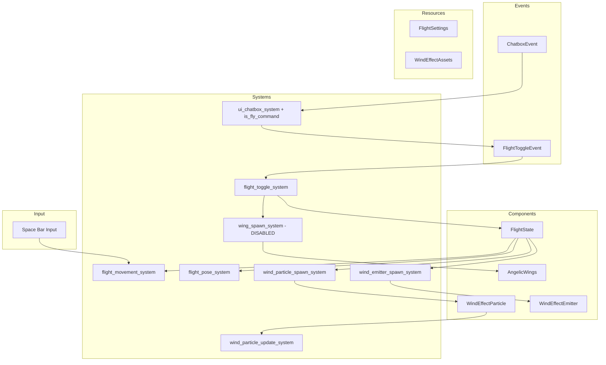

# Flying System Architecture Design

## Overview

This document describes the architecture for the player flying system triggered by the `/fly` chat command. When activated, the player can fly by holding the Space bar, moving in the direction the camera is facing (with vertical control from camera pitch and a 15% upward bias), instead of the direction they are facing.

**Status**: The design has been implemented, with deviations:
- `/fly` command detection is implemented (Option A below), flight movement, wind particle effects, and a visual flight pose are active
- Angelic wing model spawning is currently **DISABLED** — `wing_spawn_system` only logs; `AngelicWings` is defined and exported but no system spawns or animates wing entities
- There is no procedural wing mesh; only a simplified `create_wing_material` helper exists in `src/render/wing_material.rs`
- Flight movement is **camera-directed** (not facing-direction), is client-authoritative, and bypasses the `Command` system entirely
- Bevy 0.18 API names apply (`Message`/`MessageReader`/`MessageWriter`/`add_message`, renamed from `Event`/`EventReader`/`EventWriter`/`add_event`)

## Design Goals

1. **Chat Command Trigger**: Flying is initiated by typing `/fly` in the chat
2. **Flight Controls**: Space bar makes the character fly forward in the direction the camera is facing
3. **Angelic Wings**: Big, high-quality angelic wings appear when flight is initiated — **not yet implemented** (wing spawning disabled)
4. **Wing Animation**: Wings should animate/move while flying — **not yet implemented**; instead a character model flight pose (`flight_pose_system`) is applied
5. **Wind Effects**: Particle-based wind effects while flying — **implemented**

## Architecture Diagram



## Components

### FlightState Component

Location: `src/components/flight.rs` (module `flight_state.rs` was never created)

```rust
/// Represents the current flight state of a character
#[derive(Component, Default, Reflect)]
#[reflect(Component)]
pub struct FlightState {
    /// Whether the character is currently in flying mode
    pub is_flying: bool,
    /// Whether the character is actively thrusting forward (Space bar held)
    pub is_thrusting: bool,
    /// Current flight speed
    pub current_speed: f32,
    /// Last flight direction (normalized) - used for momentum when stopping thrust
    pub last_flight_direction: Vec3,
    /// Entity ID of the left wing
    pub wing_entity_left: Option<Entity>,
    /// Entity ID of the right wing
    pub wing_entity_right: Option<Entity>,
    /// Entity ID of the wind effect emitter
    pub wind_emitter_entity: Option<Entity>,
    /// Original rotation before flight pose was applied (for restoration when flight ends)
    pub original_rotation: Option<Quat>,
    /// Current flight pose blend factor (0.0 = no pose, 1.0 = full pose)
    pub pose_blend: f32,
}
```

### AngelicWings Component

Location: `src/components/angelic_wings.rs`

```rust
/// Component attached to wing entities for rendering and animation
#[derive(Component, Reflect)]
#[reflect(Component)]
pub struct AngelicWings {
    /// Which side this wing is on (left or right)
    pub side: WingSide,
    /// Current flap animation phase - 0 to 2*PI
    pub flap_phase: f32,
    /// Wing spread amount - 0.0 = folded, 1.0 = fully spread
    pub spread_amount: f32,
    /// Glow intensity for the ethereal effect
    pub glow_intensity: f32,
    /// Whether the wing is currently spreading
    pub is_spreading: bool,
}

/// Which side of the character a wing is attached to
#[derive(Clone, Copy, PartialEq, Eq, Debug, Reflect)]
pub enum WingSide {
    Left,
    Right,
}
```

Note: there is no `WingPart` marker component — `AngelicWings` stores the side directly. The component is exported from `src/components/mod.rs` but is currently **unused** (no system spawns wing entities).

### WindEffectParticle Component

Location: `src/components/wind_effect.rs`

```rust
/// Component for individual wind particles during flight
#[derive(Component, Reflect)]
#[reflect(Component)]
pub struct WindEffectParticle {
    /// Current velocity of the particle
    pub velocity: Vec3,
    /// Lifetime timer for the particle
    pub lifetime: Timer,
    /// Initial alpha value for fading calculations
    pub initial_alpha: f32,
}

/// Component for the wind effect emitter attached to flying characters
#[derive(Component, Reflect)]
#[reflect(Component)]
pub struct WindEffectEmitter {
    /// Timer for controlling particle spawn rate
    pub spawn_timer: Timer,
}

impl Default for WindEffectEmitter {
    fn default() -> Self {
        Self {
            spawn_timer: Timer::from_seconds(0.033, TimerMode::Repeating),
        }
    }
}
```

Note: the same file also houses the vegetation wind-sway types (`WindSway`, `WindSwaySettings`, `wind_sway_system`, `VegetationSwayPlugin`), which are unrelated to flying.

## Resources

### FlightSettings Resource

Location: `src/resources/flight_settings.rs`

```rust
/// Resource holding global flight system settings
#[derive(Resource, Reflect, Clone)]
#[reflect(Resource)]
pub struct FlightSettings {
    /// Maximum flight speed
    pub max_speed: f32,
    /// Acceleration when starting to fly
    pub acceleration: f32,
    /// Deceleration when stopping
    pub deceleration: f32,
    /// Speed of wing flapping animation
    pub wing_flap_speed: f32,
    /// Duration for wings to fully spread (seconds)
    pub wing_spread_duration: f32,
    /// Wind particle spawn rate (particles per second)
    pub wind_particle_spawn_rate: f32,
}

impl Default for FlightSettings {
    fn default() -> Self {
        Self {
            max_speed: 15.0,
            acceleration: 8.0,
            deceleration: 5.0,
            wing_flap_speed: 3.0,
            wing_spread_duration: 0.5,
            wind_particle_spawn_rate: 30.0,
        }
    }
}
```

Registered via `.init_resource::<FlightSettings>()` in `src/lib.rs:1351`. Speeds are in meters/second and are scaled to centimeters (`* 100.0`) in the movement system.

### WingAssets Resource — not created

The proposed `src/resources/wing_assets.rs` resource was never created. The shared-asset resource that exists is `WindEffectAssets` (wind particle mesh + material), defined inside `src/systems/wind_effect_system.rs`:

```rust
/// Resource holding the shared mesh and material handles for wind particles
#[derive(Resource)]
pub struct WindEffectAssets {
    pub mesh: Handle<Mesh>,
    pub material: Handle<StandardMaterial>,
}
```

Wing material helpers instead live in `src/render/wing_material.rs` (`create_wing_material`, `WingMaterial` type alias, `WingMaterialPlugin`).

## Events

### FlightToggleEvent

Location: `src/events/flight_event.rs` (module `flight_toggle_event.rs` was never created)

```rust
/// Message sent when flight mode should be toggled for an entity
#[derive(Message, Clone, Debug)]
pub struct FlightToggleEvent {
    /// The entity to toggle flight for
    pub entity: Entity,
}
```

There is no `force_state` field — the event always toggles. It is registered with `.add_message::<FlightToggleEvent>()` in `src/lib.rs:974`.

## Systems

The proposed single-file `src/systems/flight_system.rs` was never created. Each system lives in its own file:

| System | Location |
|--------|----------|
| `is_fly_command` helper + `flight_command_system` | `src/systems/flight_command_system.rs` |
| `ensure_flight_state_system`, `flight_toggle_system` | `src/systems/flight_toggle_system.rs` |
| `flight_movement_system` | `src/systems/flight_movement_system.rs` |
| `flight_pose_system`, `flight_pose_blend_update_system` | `src/systems/flight_pose_system.rs` |
| `wing_spawn_system` (disabled) | `src/systems/wing_spawn_system.rs` |
| `wind_emitter_spawn_system`, `wind_particle_spawn_system`, `wind_particle_update_system` | `src/systems/wind_effect_system.rs` |

### 1. Chat Command Detection

**Purpose**: Intercepts chat messages and detects `/fly` command

**Implementation**: Option A was implemented. The chat system in [`ui_chatbox_system.rs`](src/ui/ui_chatbox_system.rs:408) checks the textbox text with `is_fly_command` (defined in `src/systems/flight_command_system.rs`) **before** sending anything to the server:

```rust
// In ui_chatbox_system.rs, before sending ClientMessage::Chat
if is_fly_command(&ui_state_chatbox.textbox_text) {
    // Get the player entity and send flight toggle event
    if let Ok(player_entity) = player_query.single() {
        flight_toggle_events.write(FlightToggleEvent {
            entity: player_entity,
        });
    }
    // Clear the textbox without sending to server
    ui_state_chatbox.textbox_text.clear();
} else if is_boat_command(&ui_state_chatbox.textbox_text) {
    // ...
} else {
    // Existing code to send chat message
    game_connection
        .client_message_tx
        .send(ClientMessage::Chat { text: ... });
}
```

The normal chat send via `ClientMessage::Chat` happens at `src/ui/ui_chatbox_system.rs:469` (and at `:434` for `/ping`).

**Helper** (`src/systems/flight_command_system.rs`):
```rust
/// Checks if a chat message is a flight command (case-insensitive)
/// Returns true if the message is a "/fly" command and should be consumed
pub fn is_fly_command(message: &str) -> bool {
    let trimmed = message.trim();
    trimmed.eq_ignore_ascii_case("/fly")
}
```

**Additional facts**:
- `flight_command_system` exists as a stub for alternative command input methods (it does nothing today).
- `src/systems/chat_command_system.rs` also recognizes `/fly` as a client-side-only command via `ParsedChatInput::is_client_command()`.
- `/fly` is listed in the chatbox help overlay (`ui_chatbox_system.rs:298`).

### 2. Flight Toggle System

Location: `src/systems/flight_toggle_system.rs`

**Purpose**: Handles toggling flight mode on/off

**Responsibilities**:
- Listen for `FlightToggleEvent` (via `MessageReader`, Bevy 0.18)
- Toggle `FlightState::is_flying`
- Despawn wing entities and wind emitter on exit (stored as `Entity` handles on `FlightState`)
- Reset `current_speed`/`is_thrusting` on toggle

```rust
pub fn flight_toggle_system(
    mut commands: Commands,
    mut events: MessageReader<FlightToggleEvent>,
    mut query: Query<(Entity, &mut FlightState), With<PlayerCharacter>>,
)
```

There is also `ensure_flight_state_system`, which inserts `FlightState::default()` on any `PlayerCharacter` missing it and runs **before** `flight_toggle_system` (`src/lib.rs:1413-1414`). Wing *spawning* is not done here — that is the (disabled) wing spawn system.

### 3. Flight Movement System

Location: `src/systems/flight_movement_system.rs`

**Purpose**: Handles movement while flying

**Responsibilities**:
- Check for Space bar input when `FlightState::is_flying` is true
- Move character in the **camera's** view direction (not facing direction), including vertical movement from camera pitch plus a 15% upward bias
- Apply acceleration/deceleration to `FlightState::current_speed`
- Enforce a minimum height of 1 meter above terrain
- On thrust release: glide with momentum, then hover in place (no descent)
- Move `Position` locally (client-authoritative) and report to the server via `ClientMessage::MoveCollision`
- Cancel ground movement with `NextCommand::with_stop()` so run animation/speed never apply
- Update `FacingDirection::desired` from the horizontal flight direction

```rust
pub fn flight_movement_system(
    keyboard: Res<ButtonInput<KeyCode>>,
    flight_settings: Res<FlightSettings>,
    time: Res<Time>,
    camera_query: Query<&Transform, With<OrbitCamera>>,
    current_zone: Option<Res<CurrentZone>>,
    zone_loader_assets: Res<Assets<ZoneLoaderAsset>>,
    mut commands: Commands,
    game_connection: Option<Res<GameConnection>>,
    mut query: Query<
        (Entity, &mut FlightState, &mut FacingDirection, &mut Position),
        With<PlayerCharacter>,
    >,
)
```

**Key Integration Points**:
- Reads [`FacingDirection`](src/components/facing_direction.rs:7) only as fallback when the camera transform is unavailable; the camera direction is the primary input
- Updates [`Position`](src/components/position.rs) directly (cm space, `* 100.0` conversion)
- Does **not** use `Command::Move` — flight bypasses the Command system (see "Command System Integration" below)
- The collision system (`collision_system.rs:313`) checks `FlightState::is_flying` to skip ground collision while flying, and `game_keyboard_input_system.rs:80` disables WASD ground movement while flying

### 4. Wing Spawn System — DISABLED

Location: `src/systems/wing_spawn_system.rs`

**Purpose**: (Planned) spawn angelic wing entities attached to character

**Current behavior**: Wing model spawning is disabled. `wing_spawn_system` only reads `FlightToggleEvent`s and logs:

```rust
pub fn wing_spawn_system(
    mut flight_events: MessageReader<FlightToggleEvent>,
    player_query: Query<Entity, With<PlayerCharacter>>,
) {
    for event in flight_events.read() {
        if player_query.contains(event.entity) {
            log::info!(
                "[WingSpawn] Flight toggled for entity {:?} - wing spawning disabled",
                event.entity
            );
        }
    }
}
```

`WingSpawnPlugin` exists and adds `WingMaterialPlugin` (`src/render/wing_material.rs`). When wings are re-enabled, the original plan was to attach via `commands.entity(character_entity).add_child(wing_entity)`; the bird system still demonstrates this pattern (see [`bird_system.rs`](src/systems/bird_system.rs:254) for `add_child` usage).

### 5. Flight Pose System (replaces the planned Wing Animation System)

Location: `src/systems/flight_pose_system.rs`

**Purpose**: Applies a visual-only flight pose to the character model while flying (the planned `wing_animation_system` was never implemented)

**Responsibilities**:
- Forward lean (pitch) on the body
- Toe-down rotation on the feet
- Ragdoll "hanging from wings" pose: body lowered, arms dangling, legs hanging, head tilted up
- Pose only activates when airborne (`current_speed > 0.1`), blends in/out at 5.0/sec
- Rotations are applied to `CharacterModel` part entities (Body, Hands, Feet, Head) so movement is unaffected

```rust
pub fn flight_pose_system(
    time: Res<Time>,
    player_query: Query<(&FlightState, &FacingDirection, &CharacterModel), With<PlayerCharacter>>,
    mut body_transforms: Query<&mut Transform, (With<CharacterModel>, Without<PlayerCharacter>)>,
)
```

`flight_pose_blend_update_system` tracks `FlightState::pose_blend`. Both run after `flight_toggle_system` and `character_model_update_system` (`src/lib.rs:1416-1423`).

### 6. Wind Effect Systems

Location: `src/systems/wind_effect_system.rs`

**Purpose**: Spawns and updates wind particles during flight

**Responsibilities** (`wind_effect_system.rs`):
- `wind_emitter_spawn_system`: spawns a `WindEffectEmitter` child entity when flight starts, despawns it when flight ends
- `wind_particle_spawn_system`: spawns capsule-shaped streak particles around the character's torso, streaking backward opposite the facing direction; 2.5x more particles when thrusting; capped at `MAX_WIND_PARTICLES = 200`
- `wind_particle_update_system`: moves particles along velocity, fades/shrinks them over lifetime, despawns expired ones

**Pattern Reference**: particle spawning mirrors [`dirt_dash_system.rs`](src/systems/dirt_dash_system.rs:65) (`dirt_dash_spawn_system`).

```rust
pub fn wind_emitter_spawn_system(
    mut commands: Commands,
    mut flight_states: Query<(Entity, &mut FlightState), With<PlayerCharacter>>,
)

pub fn wind_particle_spawn_system(
    time: Res<Time>,
    settings: Res<FlightSettings>,
    assets: Res<WindEffectAssets>,
    mut commands: Commands,
    flight_query: Query<(&FlightState, &Position, &FacingDirection), With<PlayerCharacter>>,
    mut emitter_query: Query<&mut WindEffectEmitter>,
    particle_count: Query<(), With<WindEffectParticle>>,
)

pub fn wind_particle_update_system(
    time: Res<Time>,
    mut commands: Commands,
    mut query: Query<(Entity, &mut WindEffectParticle, &mut Transform)>,
)
```

`WindEffectPlugin` registers all three plus `setup_wind_effect_assets` (Startup).

## Wing Mesh Generation — not implemented

The proposed procedural wing mesh (`create_angel_wing_mesh`, `src/render/wing_mesh.rs`) was never created. Wing meshes cannot be generated procedurally at runtime because wing spawning is disabled. The bird system's mesh builders exist as a reference: [`create_bird_body_mesh`](src/systems/bird_system.rs:303) and [`create_bird_wing_mesh`](src/systems/bird_system.rs:449) (there is no single `create_bird_mesh` function).

**Material approach (as implemented in `src/render/wing_material.rs`)** — simplified `StandardMaterial`, no shader:

```rust
pub fn create_wing_material(
    materials: &mut ResMut<Assets<StandardMaterial>>,
) -> Handle<StandardMaterial> {
    materials.add(StandardMaterial {
        base_color: Color::srgba(0.95, 0.95, 1.0, 0.85),
        alpha_mode: bevy::render::alpha::AlphaMode::Blend,
        unlit: false,
        cull_mode: None, // Double-sided
        perceptual_roughness: 0.3,
        metallic: 0.1,
        ..Default::default()
    })
}
```

There is no emissive/glow texture and no feather texture — `base_color_texture`, `emissive`, and `emissive_texture` from the original design were dropped to avoid shader compilation issues.

## Integration Points

### Character Model Integration

[`CharacterModelPart`](src/components/character_model.rs:10) has an existing `Back` variant (`character_model.rs:18`) that could hold wings, and [`CharacterModel`](src/components/character_model.rs:30) maps parts to entities. As implemented:
- Wings are **not** spawned, so no slot/attachment decision was finalized
- The flight pose system directly animates `CharacterModel` part entities (Body, Hands, Feet, Head)

### Command System Integration

Flight **bypasses** the Command system entirely (option 3). The original recommendation to add `MoveMode::Fly` and use `Command::Move` was not adopted. Instead:
- The local `Position` is written directly (client-authoritative)
- `NextCommand::with_stop()` is inserted every frame to cancel any ground move command (`src/components/command.rs:62` defines the `Command` enum; `NextCommand` wraps it at `:219`)
- Movement intent is reported to the server via `ClientMessage::MoveCollision` (`src/systems/flight_movement_system.rs:125`)
- The `command_system` (`src/systems/command_system.rs:692`) and `collision_system` (`src/systems/collision_system.rs:313`) both special-case `FlightState::is_flying`

### Input System Integration

Space bar input follows the pattern from [`ui_hotbar_system.rs`](src/ui/ui_hotbar_system.rs:228):

```rust
// Check if egui wants keyboard input first
let use_hotbar_index = if !egui_context.ctx_mut().unwrap().wants_keyboard_input() {
    if keyboard_input.just_pressed(KeyCode::F1) { ... }
};
```

The flight movement system uses `keyboard.pressed(KeyCode::Space)` directly (flight is uninterruptible by egui), and `game_keyboard_input_system.rs:80` disables WASD ground movement while flying.

## File Structure

### Implementation Files

| File | Contents |
|------|----------|
| `src/components/flight.rs` | FlightState component |
| `src/components/angelic_wings.rs` | AngelicWings component, WingSide enum (currently unused) |
| `src/components/wind_effect.rs` | WindEffectParticle, WindEffectEmitter, WindSway, WindSwaySettings, VegetationSwayPlugin |
| `src/resources/flight_settings.rs` | FlightSettings resource |
| `src/events/flight_event.rs` | FlightToggleEvent |
| `src/systems/flight_command_system.rs` | is_fly_command helper, flight_command_system stub |
| `src/systems/flight_toggle_system.rs` | ensure_flight_state_system, flight_toggle_system |
| `src/systems/flight_movement_system.rs` | flight_movement_system |
| `src/systems/flight_pose_system.rs` | flight_pose_system, flight_pose_blend_update_system |
| `src/systems/wing_spawn_system.rs` | wing_spawn_system (disabled), WingSpawnPlugin |
| `src/systems/wind_effect_system.rs` | wind emitter/particle systems, WindEffectPlugin, WindEffectAssets |
| `src/render/wing_material.rs` | create_wing_material, WingMaterial, WingMaterialPlugin |

### Modified Files

| File | Changes |
|------|---------|
| `src/components/mod.rs` | Module declarations and exports (`flight`, `angelic_wings`, `wind_effect`) |
| `src/resources/mod.rs` | Module declaration and export (`flight_settings`) |
| `src/events/mod.rs` | Module declaration and export (`flight_event`) |
| `src/systems/mod.rs` | Module declarations and exports for all flight systems |
| `src/ui/ui_chatbox_system.rs` | `/fly` command detection via `is_fly_command` |
| `src/lib.rs` | Register `FlightToggleEvent` message, init `FlightSettings`, add `WingSpawnPlugin`/`WindEffectPlugin`/`VegetationSwayPlugin`, add flight systems with ordering |

## Plugin Structure

There is no `FlightPlugin`. The pieces are registered as follows in `src/lib.rs`:

```rust
// lib.rs:974 - events (Bevy 0.18: add_message, formerly add_event)
app.add_message::<FlightToggleEvent>()

// lib.rs:1351 - resources
app.init_resource::<FlightSettings>()

// lib.rs:937-941 - plugins
app.add_plugins((
    WingSpawnPlugin,     // adds WingMaterialPlugin internally
    WindEffectPlugin,
    VegetationSwayPlugin,
));

// lib.rs:1412-1423 - systems
app.add_systems(
    Update,
    (
        ensure_flight_state_system,
        flight_toggle_system.after(ensure_flight_state_system),
        flight_movement_system.after(flight_toggle_system),
        flight_pose_blend_update_system.after(flight_toggle_system),
        flight_pose_system
            .after(facing_direction_system)
            .after(flight_toggle_system)
            .after(character_model_update_system),
    )
        .run_if(in_state(AppState::Game)),
);
```

Note: Bevy 0.18 renamed `Event`/`EventReader`/`EventWriter`/`add_event` to `Message`/`MessageReader`/`MessageWriter`/`add_message`. Reflection registration for `WindEffectParticle`/`WindEffectEmitter` happens inside `VegetationSwayPlugin` (`src/components/wind_effect.rs:192`); the flight types use `#[reflect(Component)]`/`#[reflect(Resource)]` derives.

## Performance Considerations

1. **Particle Limits**: A hard cap of `MAX_WIND_PARTICLES = 200` particles total is enforced in `wind_particle_spawn_system` (`src/systems/wind_effect_system.rs:115`) — not a per-flyer setting
2. **Wing LOD**: Consider simpler wing mesh for distant characters — n/a while wings are disabled
3. **Effect Culling**: Wind particles spawn only while flying and moving (`current_speed >= 0.1`); particles are globally capped
4. **Asset Sharing**: All wind particles share the same `WindEffectAssets` mesh/material; the wing material would likewise be shared

## Visual Effects

### Wing Glow Effect — not implemented

Emissive blue-white glow with pulsing intensity was planned but dropped; `create_wing_material` uses a static semi-transparent white `StandardMaterial`.

### Wind Streak Particles — implemented

- Thin capsule meshes (radius 0.1, half-length 0.9), rotated to align with velocity
- Light-blue semi-transparent material with soft blue emissive
- Elongated scale (3x along velocity), shrink and fade over lifetime, slight deceleration
- Spawned around the character's torso, streaking backward opposite the facing direction
- More and faster particles while thrusting (2.5x rate, 3 per burst)

### Optional Enhancements

- Dust/dirt particles when taking off from ground — not implemented
- Trail effect — [`trail_effect.rs`](src/render/trail_effect.rs) exists and could be reused
- Sound effects for wing flapping and wind — not implemented

## Implementation Order

1. **Phase 1: Core Infrastructure** — DONE
   - `FlightState` component, `FlightToggleEvent`, `FlightSettings` resource
   - `is_fly_command` detection + `/fly` handling in chatbox
   - `ensure_flight_state_system` + `flight_toggle_system`
   - Result: `/fly` command toggles flight state

2. **Phase 2: Movement** — DONE
   - `flight_movement_system` (camera-directed, client-authoritative, `MoveCollision`)
   - Integrates with `Position` and `FacingDirection`
   - Result: Space bar moves character forward (with vertical control) when flying

3. **Phase 3: Wing Visuals** — PARTIAL (wing mesh/material created, spawning DISABLED)
   - `src/render/wing_material.rs` material helper created
   - `wing_spawn_system` is disabled (logs only); `AngelicWings` unused
   - `flight_pose_system` provides the character pose instead of wing animation

4. **Phase 4: Wind Effects** — DONE
   - Wind particle components, emitter spawn/despawn, spawn/update systems
   - Result: Wind particles appear when flying forward

5. **Phase 5: Polish** — PARTIAL
   - Chat feedback via info! logs
   - Tuning constants in `FlightSettings`
   - Glow effects, wing visuals, and sound remain unimplemented

## Questions for Clarification

1. **Flight Duration**: Should flight have a limited duration or be unlimited? (Currently unlimited)
2. **Collision**: Should flying characters collide with terrain/objects? (Currently only a 1m minimum terrain height; ground collision is skipped while flying)
3. **Multiplayer**: Should flight state sync with other clients? (Position is reported via `ClientMessage::MoveCollision`)
4. **Animation Override**: Should flight override character animations? (Currently a flight pose is applied; the planned wing animation is absent)
5. **Wing Design**: Any specific wing design preferences beyond "angelic"?
