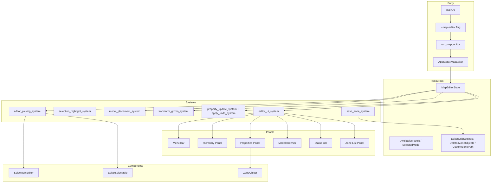

# Map Editor System Architecture

## Overview

This document describes the architecture of the live map editor for the Rose Online client. The editor is fully implemented and allows real-time editing of zone objects, terrain, and entity properties through an egui-based interface. It is selected with the `--map-editor` CLI flag and is wired into the client as a separate `AppState` with its own plugin (`MapEditorPlugin`).

## Table of Contents

1. [Command Line Argument Parsing](#1-command-line-argument-parsing)
2. [MapEditorState Resource Design](#2-mapeditorstate-resource-design)
3. [Entity Selection System](#3-entity-selection-system)
4. [egui Panel Design](#4-egui-panel-design)
5. [Property Editing System](#5-property-editing-system)
6. [Model Management System](#6-model-management-system)
7. [Map Serialization and Saving](#7-map-serialization-and-saving)
8. [Implementation Status](#8-implementation-status)

---

## 1. Command Line Argument Parsing

### Approach

The `--map-editor` flag is defined in [`src/main.rs`](src/main.rs:65) following the same pattern used for `--zone-viewer` and `--model-viewer`:

```rust
clap::Arg::new("map-editor")
    .long("map-editor")
    .help("Run map editor mode"),
```

Mode selection in `main()`:

```rust
let mode = if matches.is_present("model-viewer") {
    "ModelViewer"
} else if matches.is_present("zone-viewer") {
    "ZoneViewer"
} else if matches.is_present("map-editor") {
    "MapEditor"
} else {
    "Game"
};
```

The dispatch at the end of `main()` calls `run_map_editor` with the optional `--zone` value ([`src/main.rs`](src/main.rs:304)):

```rust
} else if matches.is_present("map-editor") {
    run_map_editor(
        &config,
        matches
            .value_of("zone")
            .and_then(|str| str.parse::<u16>().ok())
            .and_then(ZoneId::new),
    );
}
```

### Entry Point

`run_map_editor()` is defined in [`src/lib.rs`](src/lib.rs:646) and launches the client in `AppState::MapEditor`, loading the given zone (or zone 1 by default) through a `LoadZoneEvent` message:

```rust
pub fn run_map_editor(config: &Config, zone_id: Option<ZoneId>) {
    run_client(
        config,
        AppState::MapEditor,
        SystemsConfig {
            add_custom_systems: Some(Box::new(move |app| {
                app.world_mut().write_message(LoadZoneEvent::new(
                    zone_id.unwrap_or_else(|| ZoneId::new(1).unwrap()),
                ));
            })),
            ..Default::default()
        },
    );
}
```

### AppState Extension

`MapEditor` is a state variant in [`src/resources/app_state.rs`](src/resources/app_state.rs:11):

```rust
#[derive(Debug, Default, Copy, Clone, Eq, PartialEq, Hash, States)]
pub enum AppState {
    #[default]
    GameLogin,
    GameCharacterSelect,
    Game,
    ModelViewer,
    ZoneViewer,
    MapEditor,
}
```

State transitions into/out of the editor run `map_editor_enter_system` / `map_editor_exit_system` ([`src/lib.rs`](src/lib.rs:1251)), which enable the editor, open the zone list panel, and configure the camera to `FreeCamera` at the zone center.

---

## 2. MapEditorState Resource Design

### Core Resource Structure

`MapEditorState` is defined in [`src/map_editor/resources.rs`](src/map_editor/resources.rs:39) (not `src/resources/map_editor.rs`):

```rust
#[derive(Resource, Default)]
pub struct MapEditorState {
    pub enabled: bool,                          // Whether the editor is active
    pub selected_entities: HashSet<Entity>,     // Multi-select with Ctrl
    pub editor_mode: EditorMode,
    pub transform_space: TransformSpace,
    pub snap_to_grid: bool,
    pub grid_size: f32,
    pub show_grid: bool,
    pub is_modified: bool,
    pub model_browser_search: String,
    pub hierarchy_filter: String,
    pub undo_stack: Vec<EditorAction>,
    pub redo_stack: Vec<EditorAction>,
}
```

Helper methods provide `clear_selection`, `select_entity`, `deselect_entity`, `toggle_entity_selection`, `is_entity_selected`, `selection_count`, `first_selected`, undo/redo stack management (`push_action`, `pop_undo`, `push_redo`, `pop_redo`, `can_undo`, `can_redo`, `clear_history`), and `is_modified` is set by `push_action`. Undo history is capped at 100 entries (`MAX_UNDO_HISTORY`).

Supporting enums in the same file:

- `EditorMode` — `Select`, `Translate`, `Rotate`, `Scale`, `Add`, `Delete` (default `Select`).
- `TransformSpace` — `World`, `Local` (default `World`).
- `ModelCategory` — `All`, `Deco`, `Cnst`, `Event`, `Special` (default `All`).

There is no `SelectionMode` or `TransformMode` enum, and `hierarchy_filter` is a plain `String` (there is no `HierarchyFilter` enum).

### Related Resources

Other resources registered by `MapEditorPlugin` (all in [`src/map_editor/resources.rs`](src/map_editor/resources.rs)):

- `AvailableModels` — models loaded from the ZSC files, grouped as `deco_models`, `cnst_models`, `event_models`, `special_models`.
- `SelectedModel` — currently selected model for placement, browser visibility, selected category tab, scroll position, search filter, and a `pending_placement` flag ("Add to Zone" clicked).
- `EditorGridSettings` — grid `visible`, `cell_size`, `extent`, `color`.
- `DeletedZoneObjects` — tracks deleted objects as `(block_x, block_y, ifo_object_id, ZoneObjectType)` so the save system can remove them from pre-existing IFO data.
- `CustomZonePath` — custom output path + zone id for saving brand-new zones.
- `DuplicateSelectedEvent` — message requesting duplication of the selected entities (default offset `(1.0, 0.0, 1.0)`).

### Editor Action for Undo/Redo

```rust
// src/map_editor/resources.rs

#[derive(Debug, Clone)]
pub enum EditorAction {
    TransformEntity { entity, old_transform, new_transform },
    AddEntity { entity },
    DeleteEntity { entity, transform, entity_type, serialized_data },
    ModifyComponent { entity, component_type, old_value, new_value },
    TransformEntities { entities: Vec<(Entity, Transform, Transform)> },
    DeleteEntities { entities: Vec<(Entity, Transform, String, String)> },
    AddEntities { entities: Vec<Entity> },
}
```

Undo/redo of `TransformEntity`/`TransformEntities`/`AddEntity`/`AddEntities`/`DeleteEntity`/`DeleteEntities` is implemented in `apply_undo_system` / `apply_redo_system` ([`src/map_editor/systems/property_update_system.rs`](src/map_editor/systems/property_update_system.rs:488)). Component modifications (`ModifyComponent`) are recorded for undo but only logged as a stub.

---

## 3. Entity Selection System

### Raycasting from Mouse Position

Implemented in [`src/map_editor/systems/selection_system.rs`](src/map_editor/systems/selection_system.rs) (`editor_picking_system`, registered by `EditorSelectionPlugin`), based on the existing [`debug_inspector_picking_system`](src/systems/debug_inspector_system.rs:93). The system:

- Skips when the editor is disabled, when in `EditorMode::Add` (the placement system owns clicks), or when egui wants pointer input.
- Casts a Rapier ray from the camera through the cursor position (`10000000.0` max distance), filtered with `CollisionGroups::new(COLLISION_FILTER_INSPECTABLE, Group::all())`.
- Resolves the hit collider to its parent game object via `ColliderParent` (falling back to the hit entity itself).
- Ctrl+click toggles an entity in the multi-selection; a plain click clears and selects. Clicking empty space clears the selection unless Ctrl is held.
- Adds/removes the `SelectedInEditor` marker component on the affected entities.

### Selection Highlighting

`selection_highlight_system` ([`src/map_editor/systems/selection_highlight_system.rs`](src/map_editor/systems/selection_highlight_system.rs), registered by `SelectionHighlightPlugin`) updates rendering for entities with/without the `SelectedInEditor` marker.

### Component Markers

Defined in [`src/map_editor/components.rs`](src/map_editor/components.rs):

```rust
#[derive(Component, Default)]
pub struct SelectedInEditor;

#[derive(Component, Default)]
pub struct EditorSelectable;
```

There is no `EditorGizmo` component or `GizmoType` enum — transform gizmos are drawn by the gizmo system directly (see below).

---

## 4. egui Panel Design

### Panel Layout

```
+--------------------------------------------------+
| Menu Bar (File, View, Zone, Object, Help)        |
+------------+---------------------+---------------+
| Hierarchy  | 3D View            | Properties    |
| Panel      | (Main Viewport)    | Panel         |
| (Left)     |                    | (Right)       |
|            |                    |               |
+------------+---------------------+---------------+
| Model Browser (bottom, Deco/Cnst/Event/Special)  |
+--------------------------------------------------+
| Status Bar                                       |
+--------------------------------------------------+
```

The zone list is a floating egui window (`ZoneListPanelState`), opened by default when entering the editor.

### Main Editor UI System

All editor UI panels live under `src/map_editor/ui/` and are driven by `editor_ui_system` ([`src/map_editor/ui/mod.rs`](src/map_editor/ui/mod.rs:164), registered by `EditorUiPlugin`). The UI systems run in `bevy_egui::EguiPrimaryContextPass` (required by bevy_egui 0.39) and only render while `MapEditorState::enabled` is true.

The panels are:

- **Menu bar** — `editor_menu_bar` ([`src/map_editor/ui/menu_bar.rs`](src/map_editor/ui/menu_bar.rs:49)), `egui::TopBottomPanel::top`. Menus: **File** (New Zone, Open Zone..., Save, Save Version..., Exit Editor), **View** (Model Browser toggle), **Zone** (Open Zone), **Object** (Add Water Plane), **Help** (keyboard shortcut and about windows).
- **Hierarchy panel** — `editor_hierarchy_panel` ([`src/map_editor/ui/hierarchy_panel.rs`](src/map_editor/ui/hierarchy_panel.rs:136)), `egui::SidePanel::left`. Lists selectable zone objects with a filter and supports selecting entities.
- **Properties panel** — `editor_properties_panel` ([`src/map_editor/ui/properties_panel.rs`](src/map_editor/ui/properties_panel.rs:45)), `egui::SidePanel::right`. Collapsible sections: Transform, Zone Object, Event Object, Warp Object, Collision, and additional components, plus terrain height and water plane authoring.
- **Model browser** — `editor_model_browser_panel` ([`src/map_editor/ui/model_browser_panel.rs`](src/map_editor/ui/model_browser_panel.rs:14)), `egui::TopBottomPanel::bottom`, category tabs (Deco, Cnst, Event, Special) with model counts and a search box.
- **Status bar** — `editor_status_bar` ([`src/map_editor/ui/status_bar.rs`](src/map_editor/ui/status_bar.rs:51)), `egui::TopBottomPanel::bottom`, shows zone id, object count, and save status.
- **Zone list panel** — `zone_list_panel_system` ([`src/map_editor/ui/zone_list_panel.rs`](src/map_editor/ui/zone_list_panel.rs)), a floating window listing zones from `GameData`, loading the chosen zone.

### ZoneObject Label Formatting

The hierarchy panel labels objects via a match on `ZoneObject` (defined in [`src/components/zone_object.rs`](src/components/zone_object.rs:65)); variants `DecoObject`/`CnstObject`/`EventObject`/`WarpObject` carry `ZoneObjectId { ifo_object_id, zsc_object_id }`, parts (`*ObjectPart`) carry `ZoneObjectPart`, plus `AnimatedObject`, `Terrain(ZoneObjectTerrain)`, `EffectObject { ifo_object_id, effect_path }`, `SoundObject { ifo_object_id, sound_path }`, and `Water`.

---

## 5. Property Editing System

Property editing is implemented with a message-driven flow, not a `ComponentEditor` trait registry (there is no `src/map_editor/editors/` directory):

1. The properties panel edits values through edit buffers (`PendingPropertyEdits` resource) and writes `PropertyChangeEvent` messages ([`src/map_editor/ui/properties_panel.rs`](src/map_editor/ui/properties_panel.rs)).
2. `property_update_system` ([`src/map_editor/systems/property_update_system.rs`](src/map_editor/systems/property_update_system.rs:120)) reads those messages, applies changes to the world, and pushes `EditorAction::ModifyComponent` onto the undo stack.

`PropertyChangeEvent` variants:

- `PositionChanged { entity, old_value, new_value }`
- `RotationChanged { entity, old_value, new_value }`
- `ScaleChanged { entity, old_value, new_value }`
- `TransformChanged { entity, old_position, old_rotation, old_scale, new_position, new_rotation, new_scale }`
- `ZoneObjectIdChanged { entity, component_type, old_value, new_value }`
- `EventObjectChanged { entity, component_type, old_value, new_value }` (edits `EventObject.quest_trigger_name` / `script_function_name`, see [`src/components/event_object.rs`](src/components/event_object.rs:4))
- `WarpObjectChanged { entity, component_type, old_value, new_value }` (edits `WarpObject.warp_id`, see [`src/components/warp_object.rs`](src/components/warp_object.rs:6))
- `CollisionChanged { entity, component_type, old_value, new_value }`
- `WaterPlaneChanged { entity, block_x, block_y, old_start, old_end, old_size, new_start, new_end, new_size }` (water plane authoring)
- `TerrainBlockChanged { entity, block_x, block_y, old_height_offset_cm, new_height_offset_cm }` (terrain height editing)

Terrain height editing works on the `MapEditorTerrainBlock` component ([`src/components/map_editor_zone_edit.rs`](src/components/map_editor_zone_edit.rs:47)) by adjusting `height_offset_cm`; water plane authoring works on `MapEditorWaterPlane` ([`src/components/map_editor_zone_edit.rs`](src/components/map_editor_zone_edit.rs:8)). New water planes are added to a zone via the `AddWaterPlaneEvent` message, which spawns a `ZoneObject::Water` plane 20 m above the selected terrain block.

---

## 6. Model Management System

### Model Loading

`load_available_models_system` and `update_models_on_zone_load_system` ([`src/map_editor/systems/load_models_system.rs`](src/map_editor/systems/load_models_system.rs:18)) populate the `AvailableModels` resource from `zsc_deco`, `zsc_cnst`, `zsc_event_object` and warp/special data (`ModelInfo { id, name, mesh_path, category, part_count }`). Models are refreshed when a zone is loaded.

### Model Browser Panel

`editor_model_browser_panel` ([`src/map_editor/ui/model_browser_panel.rs`](src/map_editor/ui/model_browser_panel.rs:14)) shows the loaded models in category tabs (Deco, Cnst, Event, Special) with per-category counts and a search filter stored in `SelectedModel`. Selecting a model and clicking "Add to Zone" sets `SelectedModel.pending_placement`.

### Model Placement System

`model_placement_system` ([`src/map_editor/systems/model_placement_system.rs`](src/map_editor/systems/model_placement_system.rs:70), registered by `ModelPlacementPlugin`) handles placement:

- Only runs in `EditorMode::Add` with a pending placement.
- Casts a ray against the `COLLISION_GROUP_ZONE_TERRAIN` group to find the placement position on the terrain.
- `model_preview_system` draws a preview of the model at the cursor position (`EditorPlacedObject` marker).
- Clicking places the model (transforming world-space to IFO-space coordinates: `x * 100.0`, `y = -z * 100.0`, `z = y * 100.0`) and records an `EditorAction::AddEntity` for undo.
- `add_to_zone_system` attaches newly placed models to the current `Zone` entity and records `DuplicateSelectedEvent` handling for Ctrl+D duplication.

---

## 7. Map Serialization and Saving

Save functionality lives in `src/map_editor/save/`:

- `ifo_types.rs` — data structures for the IFO format (`IfoBlock`, etc.).
- `ifo_export.rs` — binary IFO writer (`export_ifo_block`).
- `save_system.rs` — `SavePlugin`, `SaveZoneEvent` message (with `with_path` for custom paths), `SaveStatus`/`SaveResult` UI feedback, and `save_zone_system`.

Flow: the menu bar's File > Save / Save Version... writes a `SaveZoneEvent`; `save_zone_system` collects the zone's objects (skipping objects tracked in `DeletedZoneObjects`), groups them by block (`world_to_block_coords`, [`src/map_editor/coords.rs`](src/map_editor/coords.rs:15)), exports each block to `{block_x}_{block_y}.IFO`, and writes HIM/TIL heightmap files via `write_him_file` / `write_til_file` ([`src/map_editor/coords.rs`](src/map_editor/coords.rs:27)). Original files are backed up before overwriting, and `SaveStatus` reflects success/failure in the UI (status bar and save dialog).

New zones are bootstrapped through the `NewZoneEvent` message (File > New Zone): `bootstrap_default_zone_blocks` ([`src/map_editor/ui/mod.rs`](src/map_editor/ui/mod.rs:528)) writes a flat 64x64 block scaffold of HIM/TIL/IFO files into the custom zone path (`3DDATA/MAPS/CUSTOM/ZONE_{:03}` by default), tracked in `CustomZonePath` for later saves. If the new zone id is not in the zone list, zone 1 is loaded as a fallback for editing.

---

## 8. Implementation Status

The map editor is fully implemented; the phases below describe what exists today:

### Phase 1: Foundation — DONE
- `--map-editor` flag in `src/main.rs`, `AppState::MapEditor`, `run_map_editor()` entry point.
- `MapEditorState` and related resources in `src/map_editor/resources.rs`, registered by `MapEditorPlugin` (`src/map_editor/mod.rs`).

### Phase 2: Selection System — DONE
- Entity picking via `editor_picking_system` with multi-select (Ctrl+click), based on `debug_inspector_picking_system`.
- Selection highlighting via `selection_highlight_system` and the `SelectedInEditor` / `EditorSelectable` markers.

### Phase 3: UI Panels — DONE
- Menu bar (File, View, Zone, Object, Help), hierarchy panel (left), properties panel (right), model browser (bottom), status bar (bottom), zone list panel (floating window).

### Phase 4: Property Editing — DONE
- Transform editing (position, rotation, scale) via drag values; terrain height and water plane authoring.
- `PropertyChangeEvent` message flow with undo/redo (`apply_undo_system`: Ctrl+Z / Ctrl+Y / Ctrl+Shift+Z). Component modifications are recorded but undo of `ModifyComponent` is currently a stub.

### Phase 5: Model Management — DONE
- Model browser with category tabs and search; click-to-place with cursor preview; snap-to-grid option (G key).

### Phase 6: Saving — DONE
- IFO export per block, HIM/TIL heightmap writing, Save / Save Version, new zone bootstrapping, backup of original files, save status feedback.

### Phase 7: Polish — PARTIAL
- Undo/redo stacks with Ctrl+Z/Ctrl+Y; transform gizmos (translate/rotate/scale) drawn by `transform_gizmo_system`; grid via `grid_system`; duplicate via Ctrl+D. Copy/paste (Ctrl+C/Ctrl+V) is not implemented; Ctrl+N / Ctrl+O only log "not implemented".

---

## System Architecture Diagram



---

## File Structure

```
src/
├── map_editor/
│   ├── mod.rs                    # MapEditorPlugin, enter/exit systems
│   ├── resources.rs              # MapEditorState, EditorMode, ModelCategory, EditorAction,
│   │                             #   AvailableModels, SelectedModel, EditorGridSettings,
│   │                             #   DeletedZoneObjects, CustomZonePath, DuplicateSelectedEvent
│   ├── components.rs             # SelectedInEditor, EditorSelectable
│   ├── coords.rs                 # world_to_block_coords, write_him_file, write_til_file
│   ├── systems/
│   │   ├── mod.rs
│   │   ├── selection_system.rs           # editor_picking_system (EditorSelectionPlugin)
│   │   ├── selection_highlight_system.rs # selection_highlight_system
│   │   ├── transform_gizmo_system.rs     # transform_gizmo_system, draw_gizmo_visuals
│   │   ├── grid_system.rs                # EditorGridPlugin
│   │   ├── property_update_system.rs     # PropertyChangeEvent, property_update_system, apply_undo_system
│   │   ├── keyboard_shortcuts_system.rs  # keyboard_shortcuts_system
│   │   ├── load_models_system.rs         # load_available_models_system, update_models_on_zone_load_system
│   │   ├── model_placement_system.rs     # model_placement_system, model_preview_system, add_to_zone_system
│   │   └── duplicate_system.rs           # DuplicateSystemPlugin, handle_duplicate_event
│   ├── ui/
│   │   ├── mod.rs                # EditorUiPlugin, editor_ui_system, NewZoneEvent, AddWaterPlaneEvent
│   │   ├── menu_bar.rs           # editor_menu_bar + dialogs
│   │   ├── hierarchy_panel.rs    # editor_hierarchy_panel (left)
│   │   ├── properties_panel.rs   # editor_properties_panel (right)
│   │   ├── model_browser_panel.rs# editor_model_browser_panel (bottom)
│   │   ├── status_bar.rs         # editor_status_bar (bottom)
│   │   └── zone_list_panel.rs    # ZoneListPanelState, zone_list_panel_system
│   └── save/
│       ├── mod.rs                # SavePlugin, SaveStatus, SaveZoneEvent re-exports
│       ├── ifo_types.rs          # IFO data structures (IfoBlock)
│       ├── ifo_export.rs         # export_ifo_block binary writer
│       └── save_system.rs        # save_zone_system
└── components/
    ├── map_editor_zone_edit.rs   # MapEditorTerrainBlock, MapEditorWaterPlane
    └── zone_object.rs            # ZoneObject enum and helpers
```

---

## Integration Points

### Existing Systems to Reuse

1. **`spawn_object`** ([`src/zone_loader/spawning/objects.rs`](src/zone_loader/spawning/objects.rs:3), `pub(super)`, called from [`src/zone_loader/spawning.rs`](src/zone_loader/spawning.rs:214)) — zone object spawning used when loading zones.
2. **`debug_inspector_picking_system`** ([`src/systems/debug_inspector_system.rs`](src/systems/debug_inspector_system.rs:93)) — the raycast-picking pattern the editor selection system is based on.
3. **`EguiContexts`** — bevy_egui integration ([`src/lib.rs`](src/lib.rs:37)); editor UI systems must run in `bevy_egui::EguiPrimaryContextPass`.
4. **`CollisionGroups` / `COLLISION_FILTER_INSPECTABLE`** ([`src/components/collision.rs`](src/components/collision.rs:69), re-exported by [`src/components/mod.rs`](src/components/mod.rs:83)) — collision filtering for selection; terrain placement rays use `COLLISION_GROUP_ZONE_TERRAIN`.

### Editor Events (Messages)

Bevy 0.18 message types used by the editor (no `MapEditorEvent` enum exists):

```rust
// src/map_editor/resources.rs
#[derive(Message, Debug, Clone)]
pub struct DuplicateSelectedEvent { pub offset: Vec3 }

// src/map_editor/ui/mod.rs
#[derive(Message)]
pub struct NewZoneEvent {
    pub prompt_if_modified: bool,
    pub zone_id: u16,
    pub output_path: Option<PathBuf>,
    pub initialize_default_block: bool,
}

#[derive(Message, Default)]
pub struct AddWaterPlaneEvent;

// src/map_editor/systems/property_update_system.rs
#[derive(Message)]
pub enum PropertyChangeEvent { /* Position/Rotation/Scale/Transform/ZoneObjectId/EventObject/
                                  WarpObject/Collision/WaterPlane/TerrainBlock variants */ }

// src/map_editor/save/save_system.rs
#[derive(Message)]
pub struct SaveZoneEvent { /* zone_id, path, version */ }
```

---

## Keyboard Shortcuts

Implemented in `keyboard_shortcuts_system` ([`src/map_editor/systems/keyboard_shortcuts_system.rs`](src/map_editor/systems/keyboard_shortcuts_system.rs:26)) and `apply_undo_system`:

| Shortcut | Action |
|----------|--------|
| Delete (or Ctrl+Backspace) | Delete selected |
| Ctrl+D | Duplicate selected |
| Ctrl+Z | Undo |
| Ctrl+Y or Ctrl+Shift+Z | Redo |
| Escape | Deselect all |
| Q | Select mode |
| E | Rotate mode |
| R | Scale mode |
| V | Add mode |
| X | Delete mode |
| G | Toggle snap to grid |
| Tab | Toggle free camera on/off |
| Ctrl+Shift+A | Deselect all (alternative) |
| Ctrl+N / Ctrl+O | Logged only (not implemented) |

Note: **W is not bound** to a mode — it is reserved for `FreeCamera` WASD movement. Ctrl+C / Ctrl+V (copy/paste) are not implemented.
