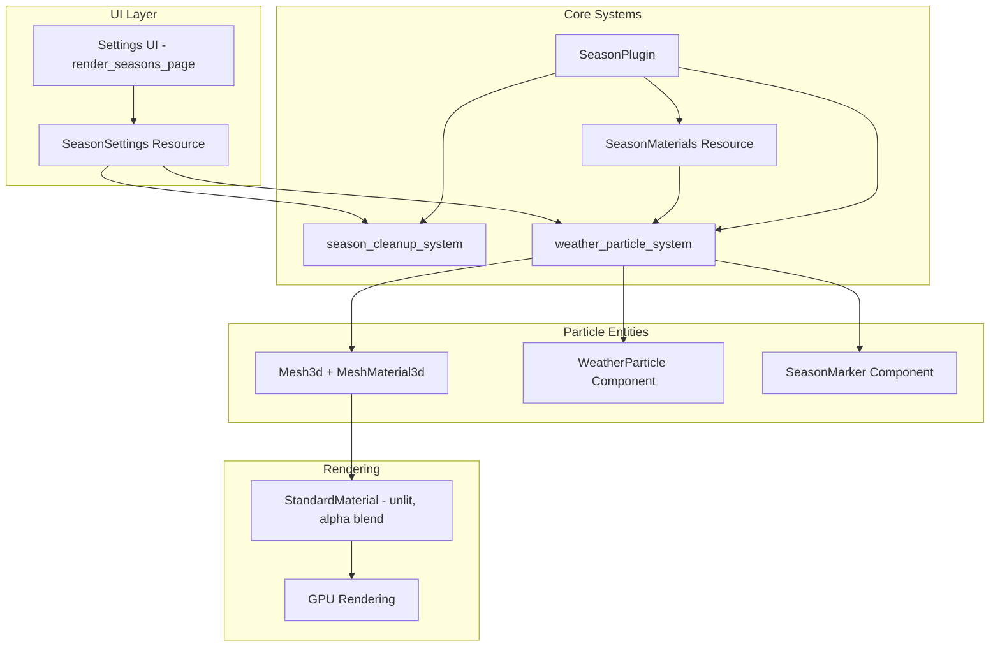
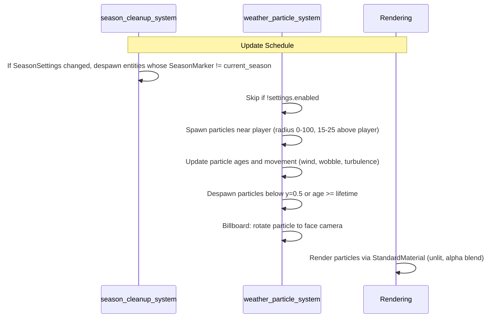
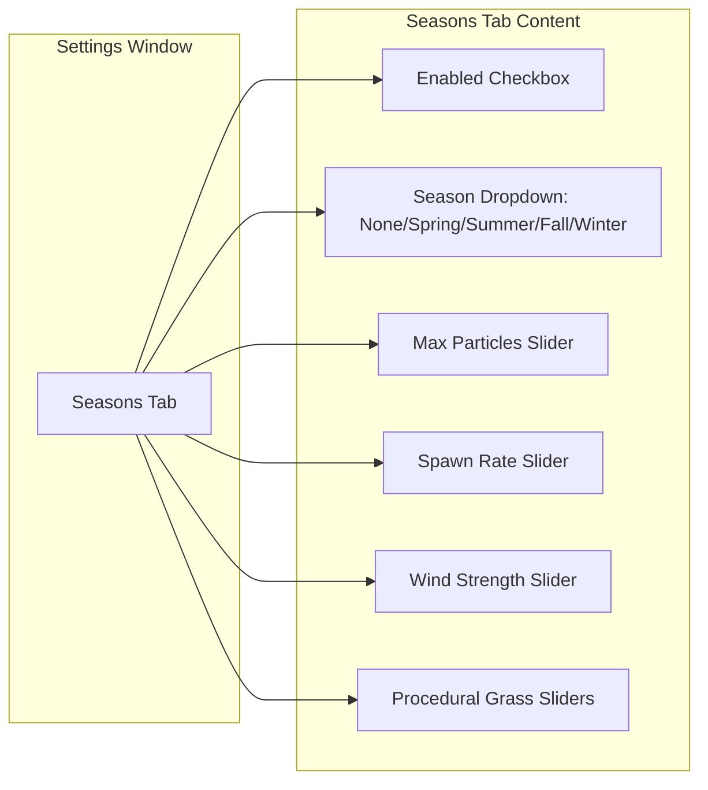

# Weather Season System Architecture

## Overview

This document describes the architecture of the weather season system in the Bevy 0.18.1 game client (note: not 0.15.4). The system supports four seasons - Spring, Summer, Fall, and Winter - with particle effects for Fall (falling leaves), Spring (rain), and Winter (snow). Summer defines flower and procedural grass settings, but has no active weather effects (the `bevy_procedural_grass` plugin is disabled in `src/lib.rs` because it is not compatible with Bevy 0.18).

## Design Goals

1. **Modularity**: Each season has its own settings resource and particle configuration
2. **Performance**: Particle count capped by `max_particles`, particles despawned below ground
3. **UI Integration**: Easy switching between seasons via settings UI
4. **Extensibility**: Simple to add new seasons or modify existing ones

---

## Architecture Diagram



---

## Component Structures

### 1. Season Enum

Location: `src/components/season.rs`

```rust
/// Season types
#[derive(Debug, Clone, Copy, PartialEq, Eq, Default, Reflect)]
pub enum Season {
    #[default]
    None,
    Spring,
    Summer,
    Fall,
    Winter,
}
```

### 2. WeatherParticle Component

Location: `src/components/season.rs`

```rust
/// Component attached to weather particle entities
#[derive(Component, Debug, Clone, Reflect)]
pub struct WeatherParticle {
    pub age: f32,
    pub lifetime: f32,
    pub velocity: Vec3,
    pub base_size: f32,
    pub rotation: f32,
    pub rotation_speed: f32,
    pub wobble_phase: f32,
    pub wobble_amplitude: f32,
}
```

### 3. SeasonMarker Component

Location: `src/components/season.rs`

```rust
/// Marker component for season-specific entities (for cleanup)
#[derive(Component, Debug, Clone, Reflect)]
pub struct SeasonMarker(pub Season);
```

`src/components/season.rs` also defines `SpringFlower`, `SummerFlower`, the deprecated `GrassBlade` (old CPU-based grass; replaced by GPU-based `bevy_procedural_grass`), and the `TerrainMeshForGrass` marker.

---

## Resource Structures

### 1. SeasonSettings Resource

Location: `src/resources/season_settings.rs`

```rust
/// Global season settings
#[derive(Resource, Debug, Clone, Reflect)]
pub struct SeasonSettings {
    pub enabled: bool,
    pub current_season: Season,
    pub max_particles: usize,
    pub spawn_rate: f32, // particles per second
    pub wind_strength: f32,
    pub wind_direction: Vec2,
}
```

Default values: `enabled: true`, `current_season: Season::None`, `max_particles: 2000`, `spawn_rate: 100.0`, `wind_strength: 1.0`, `wind_direction: Vec2::X`.

Note: there are no `spawn_radius` / `spawn_height` settings; the spawn radius (100.0 units) and spawn height (15-25 units above the player) are hardcoded in `weather_system.rs`.

### 2. FallSettings Resource

Location: `src/resources/season_settings.rs`

```rust
/// Fall-specific settings
#[derive(Resource, Debug, Clone, Reflect)]
pub struct FallSettings {
    pub leaf_colors: Vec<Color>,
    pub fall_speed: f32,
    pub drift_factor: f32,
    pub wobble_frequency: f32,
    pub leaf_size_range: (f32, f32),
    pub lifetime_range: (f32, f32),
}
```

Default values: `leaf_colors` orange-red/orange/gold/brown, `fall_speed: 2.0`, `drift_factor: 1.5`, `wobble_frequency: 2.0`, `leaf_size_range: (0.5, 1.5)`, `lifetime_range: (8.0, 15.0)`.

### 3. SpringSettings Resource

Location: `src/resources/season_settings.rs`

```rust
/// Spring-specific settings
#[derive(Resource, Debug, Clone, Reflect)]
pub struct SpringSettings {
    pub rain_drop_size: f32,
    pub rain_speed: f32,
    pub rain_color: Color,
    pub flower_spawn_chance: f32,
    pub flower_lifetime: f32,
    pub flower_colors: Vec<Color>,
}
```

Default values: `rain_drop_size: 0.5`, `rain_speed: 15.0`, `rain_color: srgba(0.6, 0.75, 0.9, 0.8)`, `flower_spawn_chance: 0.01`, `flower_lifetime: 30.0`, pink/purple/yellow/white `flower_colors`.

### 4. WinterSettings Resource

Location: `src/resources/season_settings.rs`

```rust
/// Winter-specific settings
#[derive(Resource, Debug, Clone, Reflect)]
pub struct WinterSettings {
    pub snowflake_size_range: (f32, f32),
    pub fall_speed: f32,
    pub turbulence: f32,
    pub snow_color: Color,
    pub lifetime_range: (f32, f32),
}
```

Default values: `snowflake_size_range: (0.2, 0.6)`, `fall_speed: 1.0`, `turbulence: 0.5`, `snow_color: srgba(1.0, 1.0, 1.0, 0.9)`, `lifetime_range: (10.0, 20.0)`.

### 5. SummerSettings Resource

Location: `src/resources/season_settings.rs`

```rust
/// Summer-specific settings
#[derive(Resource, Debug, Clone, Reflect)]
pub struct SummerSettings {
    pub max_flowers: usize,
    pub spawn_radius: f32,
    pub flower_spawn_chance: f32,
    pub flower_colors: Vec<Color>,
    pub flower_stem_height_range: (f32, f32),
    pub flower_head_size: f32,
    pub wind_intensity: f32,
    // Procedural grass settings (GPU-based)
    pub grass_density: u32,
    pub blade_length: f32,
    pub blade_width: f32,
    pub blade_tilt: f32,
    pub blade_tilt_variance: f32,
    pub blade_p1_flexibility: f32,
    pub blade_p2_flexibility: f32,
    pub blade_curve: f32,
}
```

Default values: `max_flowers: 1000`, `spawn_radius: 50.0`, `flower_spawn_chance: 0.02`, `flower_stem_height_range: (4.0, 7.0)`, `flower_head_size: 1.5`, `wind_intensity: 1.0`, `grass_density: 25`, `blade_length: 1.5`, `blade_width: 0.05`, `blade_tilt: 0.5`, `blade_tilt_variance: 0.2`, flexibilities 0.5, `blade_curve: 15.0`.

### 6. SeasonMaterials Resource

Location: `src/resources/season_materials.rs`

Pre-created meshes and materials for season particles, created once at startup by `setup_season_materials` (registered in `PreUpdate`) to avoid `ResMut` conflicts:

- Leaf mesh (`Rhombus(0.4, 0.8)`) and leaf materials (orange-red/orange/gold/brown, alpha blend, unlit)
- Rain mesh (`Rectangle(0.1, 0.6)`) and rain material (srgba(0.7, 0.8, 0.9, 0.7))
- Flower mesh (`Circle(0.15)`) and flower materials (pink/purple/yellow/white)
- Snow mesh (`RegularPolygon(0.25, 6)` hexagon) and snow material (white, alpha 0.9)
- Grass mesh (`Rectangle(0.1, 0.6)`) and grass materials (green shades, opaque)
- Summer flower mesh (`Circle(0.15)`) and summer flower materials (bright warm colors, opaque)

---

## System Scheduling and Ordering

The `SeasonPlugin` (`src/systems/season/mod.rs`) does not define custom `SystemSet`s. It registers:

```rust
impl Plugin for SeasonPlugin {
    fn build(&self, app: &mut App) {
        app.init_resource::<crate::resources::SeasonSettings>()
            .init_resource::<crate::resources::FallSettings>()
            .init_resource::<crate::resources::SpringSettings>()
            .init_resource::<crate::resources::SummerSettings>()
            .init_resource::<crate::resources::WinterSettings>()
            .add_systems(PreUpdate, crate::resources::setup_season_materials)
            .add_systems(
                Update,
                (
                    season_manager::season_cleanup_system,
                    weather_system::weather_particle_system,
                ),
            );
    }
}
```

`SeasonPlugin` is registered in `src/lib.rs` with the comment `// Weather season system`.

### System Flow



---

## UI Integration

### Settings Page

Location: `src/ui/ui_settings_system.rs`

The `SettingsPage` enum already contains a `Seasons` variant:

```rust
#[derive(Copy, Clone, PartialEq, Debug)]
enum SettingsPage {
    Sound,
    Blood,
    Sky,
    Stars,
    Clouds,
    StarrySkyRender,
    DepthOfField,
    VolumetricFog,
    Water,
    Fish,
    Birds,
    Seasons,
    DirtDash,
    WindSway,
    PostProcessing,
    Graphics,
    Terrain,
}
```

### UI Layout



### UI Implementation

The seasons page is rendered by `render_seasons_page(ui, &mut season_settings, &mut summer_settings)` in `src/ui/ui_settings_system.rs`:

```rust
fn render_seasons_page(
    ui: &mut egui::Ui,
    season_settings: &mut SeasonSettings,
    summer_settings: &mut SummerSettings,
) {
    egui::Grid::new("season_settings")
        .num_columns(2)
        .show(ui, |ui| {
            settings_checkbox(ui, "Weather Effects:", &mut season_settings.enabled, "Enabled");

            let season_text = match season_settings.current_season {
                Season::None => "None",
                Season::Spring => "Spring",
                Season::Summer => "Summer",
                Season::Fall => "Fall",
                Season::Winter => "Winter",
            };
            settings_combo(
                ui,
                "season",
                "Season:",
                season_text,
                &mut season_settings.current_season,
                &[
                    (Season::None, "None"),
                    (Season::Spring, "Spring"),
                    (Season::Summer, "Summer"),
                    (Season::Fall, "Fall"),
                    (Season::Winter, "Winter"),
                ],
            );

            settings_slider(ui, "Max Particles:", &mut season_settings.max_particles, 1000..=20000, None);
            settings_slider(ui, "Spawn Rate:", &mut season_settings.spawn_rate, 100.0..=5000.0, Some("/s"));
            settings_slider(ui, "Wind Strength:", &mut season_settings.wind_strength, 0.0..=5.0, None);
        });
    // ... procedural grass sliders (grass_density, blade_length, ...)
    // ... tip: "Season changes apply immediately. Disable to turn off all weather effects."
}
```

There is no wind-direction slider; `wind_direction` is a fixed `Vec2` (default `Vec2::X`).

---

## Particle Effect Specifications

Particles are spawned as ordinary mesh entities (`Mesh3d` + `MeshMaterial3d<StandardMaterial>`) with the `WeatherParticle` component; billboarding (facing the camera) is applied per-frame in `weather_particle_system`.

### Fall - Falling Leaves

**Visual Characteristics:**
- Rhombus (diamond) shaped particles with warm autumn colors
- Gentle swaying motion with wobble
- Slow descent with horizontal drift
- Rotation around the z-axis while billboarded

**Particle Parameters (from `FallSettings` defaults):**

| Parameter | Value | Description |
|-----------|-------|-------------|
| Size | 0.5 - 1.5 units | Leaf size variation |
| Lifetime | 8 - 15 seconds | Time before despawn |
| Fall Speed | 2.0 units/sec | Vertical descent rate |
| Drift | 1.5 units/sec | Horizontal drift factor |
| Wobble Freq | 2.0 Hz | Swaying frequency |
| Wobble Amp | 0.5 - 1.0 units | Swaying amplitude |
| Rotation | -1.0 - 1.0 rad/sec | Spinning speed |

**Colors (from `FallSettings` defaults):**
```rust
vec![
    Color::srgb(0.8, 0.3, 0.1), // Orange-red
    Color::srgb(0.9, 0.5, 0.0), // Orange
    Color::srgb(0.8, 0.6, 0.1), // Gold
    Color::srgb(0.6, 0.2, 0.0), // Brown
]
```

### Spring - Rain

**Rain Visual Characteristics:**
- Elongated rectangle droplets
- Fast vertical descent
- Slight horizontal velocity based on wind direction
- No splash effect (a `splash_probability` setting does not exist)

**Rain Parameters (from `SpringSettings` defaults):**

| Parameter | Value | Description |
|-----------|-------|-------------|
| Size | 0.5 x 1.0 units | Drop width and length (scaled 0.5, 1.0, 0.5) |
| Lifetime | 2.0 - 3.0 seconds | Time before despawn |
| Fall Speed | 15.0 units/sec | Fast vertical descent |
| Color | srgba(0.6, 0.75, 0.9, 0.8) | Semi-transparent blue-grey |

Note: `SpringSettings` also defines `flower_spawn_chance`, `flower_lifetime`, and `flower_colors`, and a `SpringFlower` component exists, but no flower spawning logic is currently implemented in the season systems.

### Winter - Snow

**Visual Characteristics:**
- Soft hexagon snowflakes
- Slow, gentle descent
- Turbulent swirling motion

**Snow Parameters (from `WinterSettings` defaults):**

| Parameter | Value | Description |
|-----------|-------|-------------|
| Size | 0.2 - 0.6 units | Snowflake size |
| Lifetime | 10 - 20 seconds | Time before despawn |
| Fall Speed | 1.0 units/sec | Slow descent |
| Turbulence | 0.5 units | Swirling amplitude |

**Color:**
```rust
Color::srgba(1.0, 1.0, 1.0, 0.9)  // White, slightly transparent
```

### Summer

`Season::Summer` currently has no weather particles: `particle_spawn` in `weather_system.rs` returns `None` for summer (`_ => None`), and the GPU-based procedural grass plugin is disabled (`src/lib.rs`). `SummerSettings` and the summer materials (grass, flowers) exist and are exposed in the settings UI, but have no active effect.

---

## File Organization

### Implemented Files

```
src/
├── components/
│   └── season.rs              # Season enum, WeatherParticle, SeasonMarker, SpringFlower, SummerFlower, GrassBlade (deprecated), TerrainMeshForGrass
│
├── resources/
│   ├── season_settings.rs     # SeasonSettings, FallSettings, SpringSettings, WinterSettings, SummerSettings
│   └── season_materials.rs    # SeasonMaterials + setup_season_materials
│
├── systems/
│   └── season/
│       ├── mod.rs             # SeasonPlugin definition and registration
│       ├── season_manager.rs  # season_cleanup_system (despawn on season change)
│       └── weather_system.rs  # weather_particle_system, particle_spawn, update_particle_movement
│
└── ui/
    └── ui_settings_system.rs  # Seasons settings page (render_seasons_page)
```

There is no custom WGSL shader (`render/shaders/weather_particle.wgsl` does not exist); particles use the built-in `StandardMaterial` pipeline.

### Wired-Up Modules

1. **`src/components/mod.rs`** - `pub use season::{GrassBlade, Season, SeasonMarker, SpringFlower, SummerFlower, TerrainMeshForGrass, WeatherParticle};`
2. **`src/resources/mod.rs`** - exports `season_settings` types and `season_materials::{setup_season_materials, SeasonMaterials}`
3. **`src/ui/ui_settings_system.rs`** - Seasons settings page
4. **`src/lib.rs`** - registers `systems::season::SeasonPlugin`

---

## Integration with Existing Systems

### Rendering Integration

The weather system does **not** use `ParticleMaterial` / `ParticleRenderData` (the storage-buffer-based rose effect particle pipeline in `src/render/particle_material.rs` and `src/render/particle_render_data.rs`, which is used for in-game rose effect files). Instead, weather particles are:

1. **Mesh entities**: spawned with `Mesh3d` + `MeshMaterial3d<StandardMaterial>` (unlit, `AlphaMode::Blend`)
2. **CPU billboards**: each frame the system builds a camera-facing rotation matrix (`Quat::from_mat3`) and applies it to the particle transform; `Season::Winter | Season::Fall` additionally apply their own z-rotation on top

### Player and Camera Tracking

Weather particles spawn around the **player** position (not the camera), using `PlayerCharacter`:

```rust
// Spawn in a circle around player using radius
let spawn_radius = 100.0; // Distance from player
let angle = rand::random::<f32>() * std::f32::consts::TAU;
let radius_offset = rand::random::<f32>() * spawn_radius;
let offset_x = angle.cos() * radius_offset;
let offset_z = angle.sin() * radius_offset;
// Spawn 15-25 units above player
let spawn_y = player_pos.y + 15.0 + rand::random::<f32>() * 10.0;

let position = Vec3::new(player_pos.x + offset_x, spawn_y, player_pos.z + offset_z);
```

The main `Camera3d` (excluding `WaterReflectionCamera`) transform is queried only for billboard orientation.

---

## Performance Considerations

### Particle Cap

Spawning is gated by `max_particles`:

```rust
let current_count = query.iter().len();
if current_count < settings.max_particles {
    let particles_this_frame = ((settings.spawn_rate * dt) as usize).max(10);
    // ...
}
```

### Despawn Rules

Particles are despawned when `age >= lifetime` or when `transform.translation.y < 0.5` (ground level). There is no object pooling, no FPS-based LOD (`FrameDiagnostics` does not exist in the codebase), and no explicit view-distance culling - particles are always spawned in a fixed 100-unit radius around the player.

---

## Implementation Status

### Completed
- [x] `src/components/season.rs` with Season enum, WeatherParticle, SeasonMarker
- [x] `src/resources/season_settings.rs` with all season settings resources
- [x] `src/resources/season_materials.rs` with pre-created meshes/materials
- [x] `src/systems/season/mod.rs` with SeasonPlugin
- [x] Weather systems: `season_cleanup_system`, `weather_particle_system` (rain/snow/leaves)
- [x] Seasons page in `ui_settings_system.rs`
- [x] SeasonPlugin and resources registered in `lib.rs`

### Not Implemented
- [ ] Particle pooling
- [ ] FPS-based LOD system
- [ ] Spring flower spawning (`SpringFlower` component unused)
- [ ] Summer weather/grass (procedural grass plugin disabled - not compatible with Bevy 0.18)

---

## Testing Strategy

The season modules contain no automated `#[cfg(test)]` tests. Verification is done manually through the settings UI (season switching, particle limits, immediate application of settings changes).

---

## Future Extensions

### Potential Enhancements

1. **Dynamic Weather**: Blend between seasons based on game time
2. **Zone-Specific Weather**: Different seasons per zone
3. **Sound Integration**: Rain sounds, wind sounds per season
4. **Ground Effects**: Snow accumulation, wet ground shaders
5. **NPC Reactions**: NPCs react to weather changes
6. **Summer effects**: flower spawning and GPU grass once the plugin is updated for Bevy 0.18
7. **Spring splash effects** on ground contact

### Configuration File Support (not implemented)

```toml
# seasons.toml (proposed, not yet implemented)
[seasons.default]
enabled = true
max_particles = 1000

[seasons.fall]
leaf_colors = ["#CC3311", "#EE7733", "#EEBB44"]
fall_speed = { min = 1.0, max = 3.0 }

[seasons.spring]
rain_intensity = 0.8
flower_density = 0.5

[seasons.winter]
snow_intensity = 1.0
ground_tint = "#EEF0FF"
```

---

## Summary

The implemented weather season system:

1. **Follows existing patterns** established by Bird and Fish systems (settings resources + UI page)
2. **Renders weather particles** as simple unlit alpha-blended mesh entities with per-frame CPU billboarding (no custom shader or storage-buffer pipeline required)
3. **Provides UI controls** consistent with other settings pages (checkbox, dropdown, sliders)
4. **Supports easy extension** for new seasons or effects (a `Season::Summer` variant and summer settings/materials already exist)
5. **Maintains performance** through `max_particles` capping and ground/lifetime despawn rules
